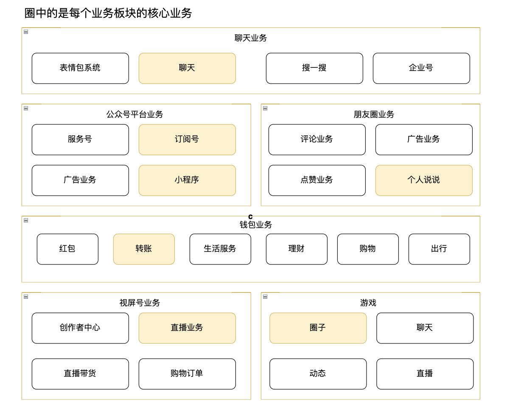
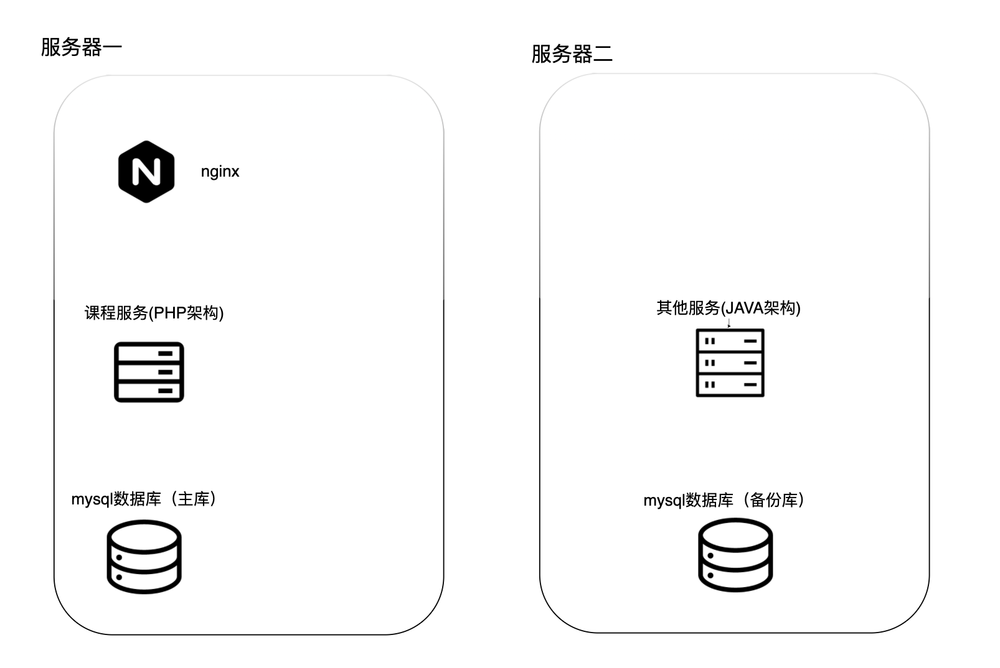
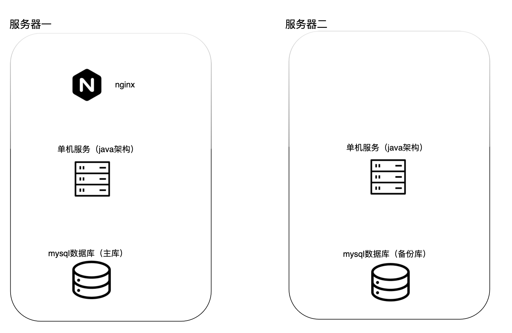

[TOC]

## 模块一作业

### 1. 画出微信的架构图

### 2. 学生管理系统的毕设

学生管理系统

要求：

- 公网域名访问
- 3个人合作完成
- 支撑1000个学员
- 不推荐太简单，太复杂的架构

团队情况

- 都会java，但是有一个PHP高手
- 经济条件一般

#### 架构一

架构介绍：

优点：

因为经济一般，所以采取了两台服务器--->合适原则

拆分了两个服务，没有大规模拆分服务--->简单原则

现有架构已经能够满足1000个学生使用，先开发出来，后期如果学生暴增，考虑服务粒度拆分更大--->演进原则

由于团队的组成，有一个PHP高手，所以课程复杂的部分拆分成PHP架构的服务，这样会降低整体开发的复杂度--->复杂度架构分析

缺点：

由于使用了异构架构，所以后期业务量增大的时候，需要寻找合适的开发难度增大（即懂PHP又懂java）

使用的是简单的微服务，导致部署运维成本增高

#### 架构二

架构介绍：

优点：

由于项目只有三个人，考虑到开发成本，摒弃微服务，使用单体，使开发效率增大--->合适原则   简单原则

因为使用单体，所以部署运维 一键copy，运维成本降低  --->简单原则

后期可以考虑用微服务拆分 --->演进原则

项目中有3个人，3个人都会java，所以采用java的主体技术架构 ，一定程度减少沟通成本---> 复杂度分析

缺点：

单体架构，后期业务增大，代码不易扩展维护

拆分微服务的成本比较大

#### 最终选择

我的最终选择是架构二

理由：

因为目前是给一个学校做定制的，团队人手又少，后期扩展的可能性小，所以我更看重开发速度与运维部署成本。

项目一因为是异构架构与微服务拆分 所以导致开发成本与部署成本较大，所以不考虑。

项目二虽然是单体架构，但是整体满足我们当下的需求，这个项目目测后期扩展性较小，所以项目二的缺点我们能够接受。