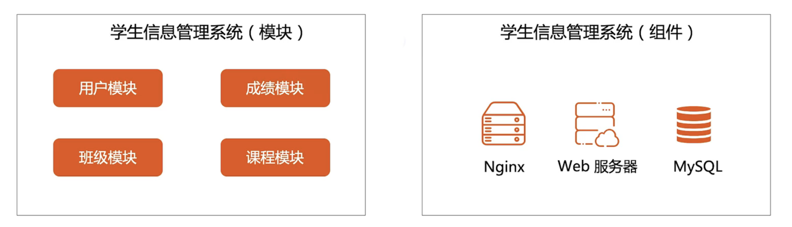
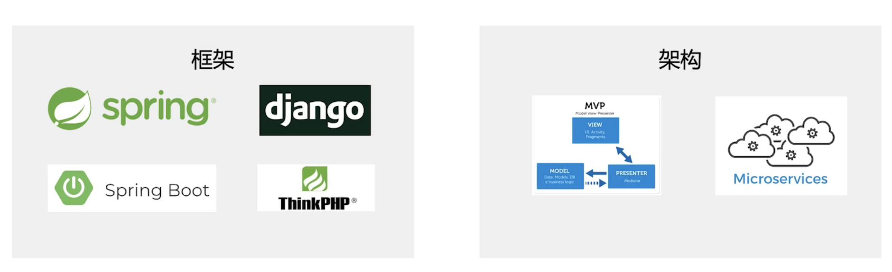
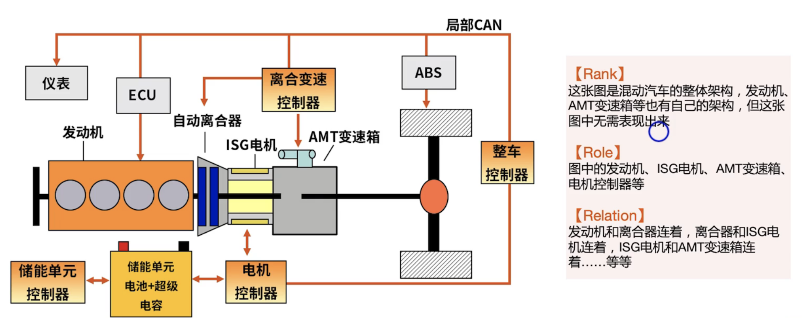
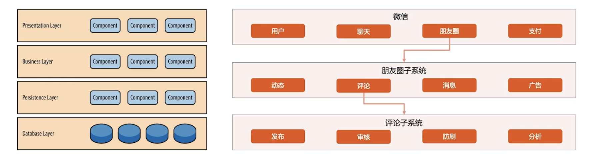
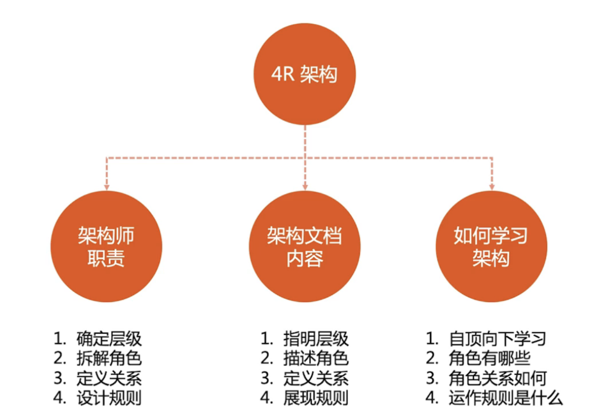

### 架构

架构中有哪些容易混淆的点，什么是系统、子系统、模块、组件、软件、框架、架构，他们之间的关系又是如何。

接下来讲述这些。

#### 系统

系统是一群有关联的个体，根据某种规则运作，能完成个别元件不能单独完成的工作的群体。

#### 子系统

由一群有关联的个体组成的系统，多半会是更大系统的一部分

可以总结如下

- 关联--->一群有关联的个体
- 规则--->个体之间按照规则运作
- 能力--->系统能力超越个体能力
- 分层--->自定向下逐层划分

#### 模块与组件

系统逻辑拆分出来的是模块，模块的功能是职责分离（eg：微服务）

系统物理拆分出来的是组件，组件的功能是单元复用（eg：nginx，web服务器，mysql）

#### 模块与组件样例

#### 框架与架构

框架：为了实现某个业界标准或完成特定基本任务的软件组件规范，也值为了实现某个软件组件规范时，提供规范所要求的软件产品

架构：软件系统的基础结构，创造这些基础结构的准则，以及对这些结构的描述

可以总结如下

- 软件框架--->组件规范（MVC）+ 组件产品（Spring MVC）
- 软件架构--->结构+准则+描述

#### 软件与架构样例

## 4R架构

软件架构是指软件系统的顶层结构（Rank），它定义了系统由哪些角色（Role）组成，角色之间的关系（Relation）和运作规则（Rule）

- Rank  顶层结构--->架构是分层的，自顶向下，逐步细化。（做当前层不需要关注其他层的架构，不同的人负责不同的层级，进行不同的架构设计）
- Role   组成角色--->系统包含哪些角色，对应系统概念中的个体。
- Relation 角色关系 ---> 角色之间的关系，对应系统个体之间的关系。
- Rule  运作规则 ---> 角色如何协作完成系统功能。

#### 4R架构的案例

#### 分层架构与架构分层

分层架构：**端到端的架构或者单个系统的内部架构，按照某种规则划分为不同层级**    可扩展的架构模式

架构分层：架构本身是自顶向下，逐步细化

#### 4R架构的应用

