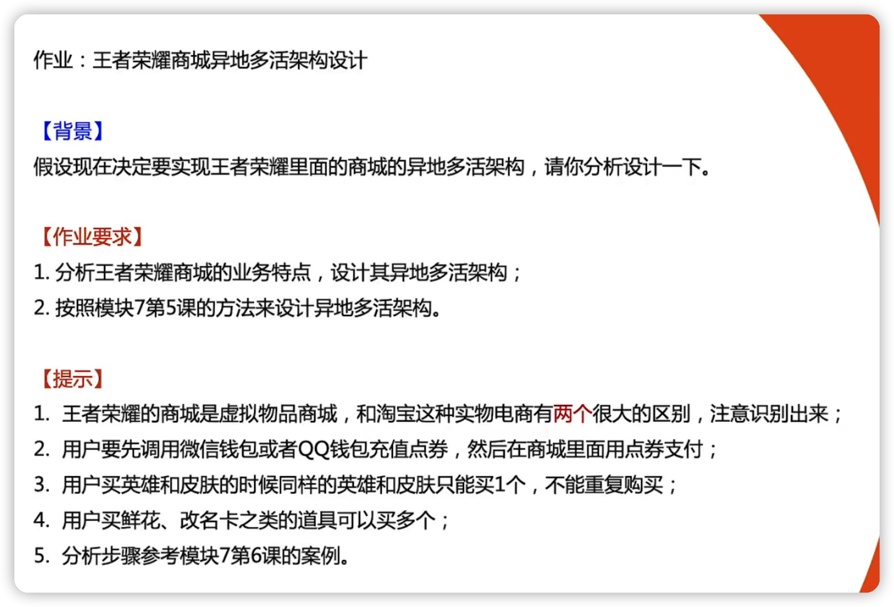
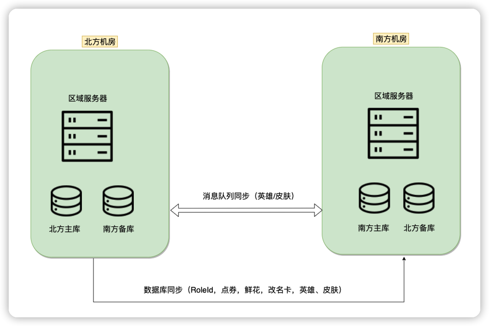

## 作业

## 业务约束

只能通过调用 微信钱包或者qq钱包进行充值，所以充值这块的业务数据不用考虑，只需要考虑游戏里面的点券数据

### 设计步骤1-->业务分级

已经挑选了，王者荣耀的商城进行异地多活架构，所以业务分级已经做好

### 设计步骤2-->数据分类

RoleId：依赖qq和微信账号，不会改变，唯一的，不会重复

点券：游戏内部的金钱，需要强一致性

英雄与皮肤：同样的英雄与皮肤只能买一个，虚拟物品，与淘宝实体不一样，可一定程度上丢失，并且可以人工修复补偿，全局唯一，不可重复

鲜花，改名卡之类：虚拟物品，与淘宝实体不一样，可一定程度上丢失，并且可以人工修复补偿。可以购买多个，

充值相关：依赖于微信与qq钱包，调用接口皆可，所以这块不考虑

### 设计步骤3-->数据同步

RoleId：依赖qq与微信，不会修改，数据库同步即可

点券：游戏内部的金钱，需要一致性，但是又不是现实中的金币，一定程度可以丢失。 数据库同步即可，如果发现充值了，但是没到账，可以后台补偿点券

英雄与皮肤：全局唯一，不可重复，并且这块要保证同步的质量，因为这块是游戏主要的体验。数据库+消息队列同步，做幂等

鲜花，改名卡之类：可以购买多个，数据重要程度不高，可丢失，数据库同步即可

充值相关：依赖于qq与微信钱包，调用接口即可，不需要考虑

### 设计步骤4-->异常处理

1. 充值点券的时候，如果发生诸如网络或者其他问题，导致没充值上，怎么办？
   - 因为依赖于微信或qq钱包，所以那边有充值记录，根据充值记录来进行数据恢复
   - 如果当时没发现，由用户拨打客户电话反馈，然后相关人员后台根据记录恢复即可
2. 如果改名卡或者鲜花之类的因为故障丢失
   - 直接给员工补偿砖石或者发放相关道具
3. 如果充值的英雄未同步到异地机房，怎么办
   - 等恢复了再看

## 整体架构

