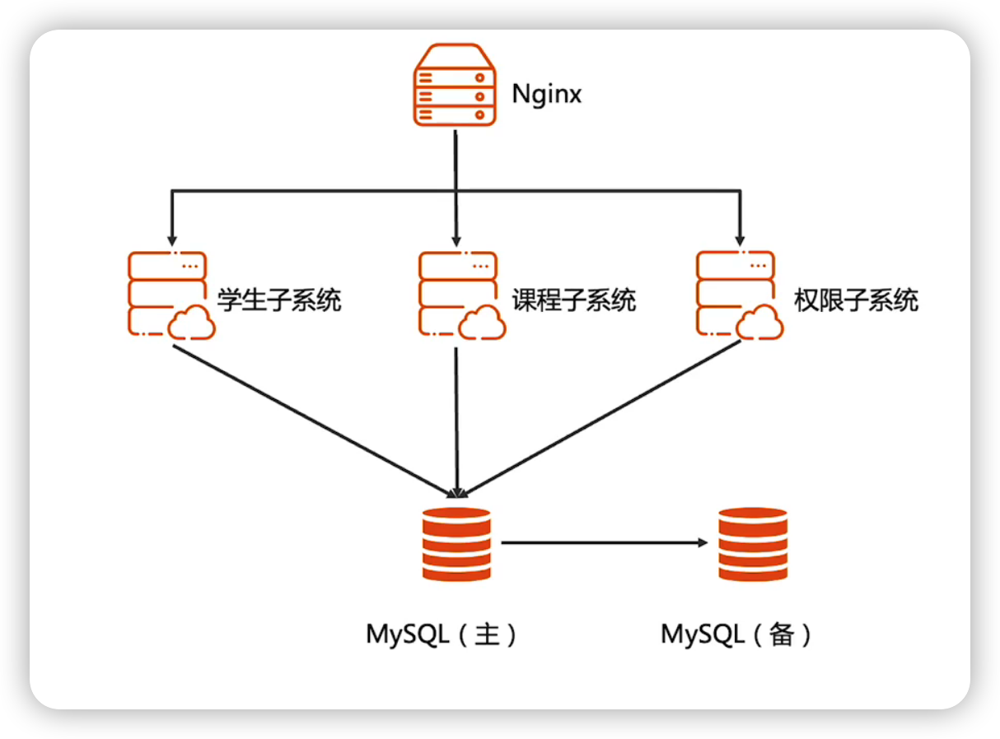
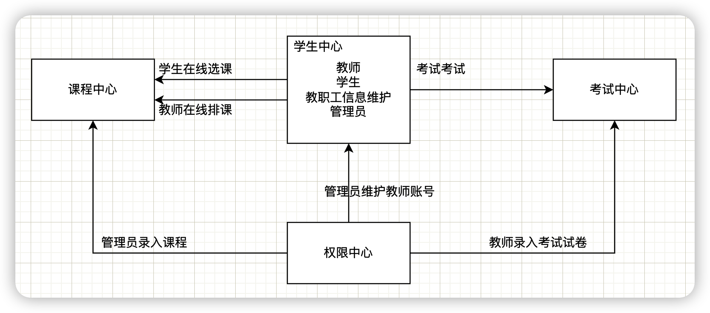

## 模块三作业

外包学生管理系统的架构文档

基于以下备选架构，写出完整的架构文档

注意：不是备选架构文档，而是最终落地的文档

无须考虑数据库表设计，因为表设计是方案阶段做的，不是架构阶段做的

注意：

1. 架构设计文档不是ppt 

## 前言

本文是外包学生管理系统的落地架构设计文档，用来指导后续的开发与、测试与运维

## 词汇表

nginx：负载均衡组件

server：服务器

DB：数据库

## 1. 业务背景

随着学校的规模的不断扩大，学生数量的增加，需要处理的信息也日趋增大。不仅话费大量的教室资源，处理效率也十分低下。

为了提高学生管理的管理水平，优化资源，尽可能降低管理成本，所以需要开发一套学生管理系统来实现先有需求

## 2. 约束与限制

- 负载均衡组件使用nginx
- 数据库使用mysql

## 3. 总体架构

- Rank  顶层结构--->架构是分层的，自顶向下，逐步细化。（做当前层不需要关注其他层的架构，不同的人负责不同的层级，进行不同的架构设计）
- Role   组成角色--->系统包含哪些角色，对应系统概念中的个体。
- Relation 角色关系 ---> 角色之间的关系，对应系统个体之间的关系。
- Rule  运作规则 ---> 角色如何协作完成系统功能。

系统架构图

系统边界白盒图

由于该系统与其他外界系统无交互，估没有系统边界白盒图

### 3.1 架构分析

高性能

综合学生管理系统的功能点来看，其系统的复杂度就在于学生抢课，学生抢课的场景是一个高并发高性能的场景，而这类系统对高可用的要求并不高，后续也没扩展的可能性。

综合来看，该系统需要高性能，学生抢课场景存在一定的高并发。

### 3.2 总体架构

- DB采用mysql主备来实现，主库写，备库读
- 系统拆分成学生子系统、课程子系统、权限子系统三个模块
- 通过nginx做反向代理，并且根据应用做了微服务拆分，实现了高性能架构中的任务分配

## 4. 核心设计

该系统的核心场景就是学生抢课。

### 4.1 核心功能

学生抢课的功能设计到并发场景，可以考虑在拆分微服务的时候，就将这个服务的线程连接数，以及数据库连接数，以及服务的内存等都优化好，可以通过将课程数据放入redis里面，利用redis 的list数据结构去实现

### 4.2 关键设计

数据库的主备。

由于单个数据库容易因访问量过大，造成访问异常，所以采用mysql主备，让写操作走主库，读操作走从库。

然后主备能进行切换，能一定程度的保证数据的安全性

### 4.3 设计规范

- mysql采用innodb引擎
- 开发语言采用java
- 开发框架采用微服务框架springcloud+springboot

## 5. 质量设计

- 可测试性：开发写好单元测试
- 可维护性：定时进行代码检查，保证代码质量
- 可观测性：部署好监控环境
- 成本：使用一台服务器搞定

## 6. 演进原则

- 后期可以增加服务器数量，将各个服务部署在不同的服务器上
- 随着学生的增加，对于系统的稳定性要求增大，可以考虑上高可用
- 后期可以考虑上redis集群

