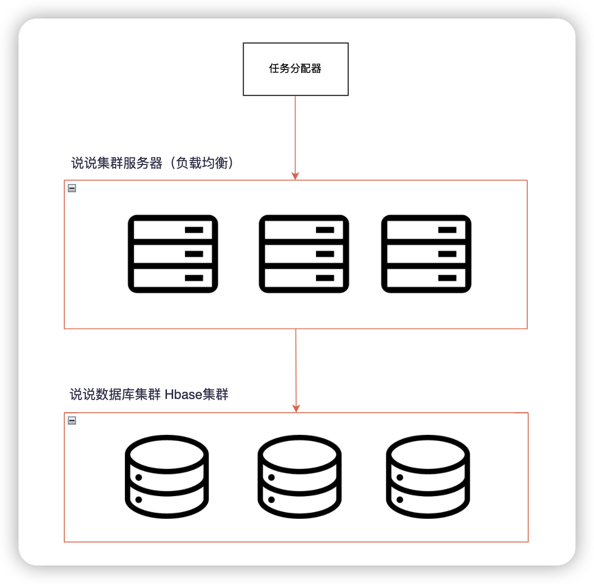

[TOC]

## 模块二作业

分析一下微信朋友圈的高性能复杂度

要求

- 对照复杂度分析方法，分析朋友圈的复杂度
- 针对各个复杂度，画出你的架构设计方案（最终方案）
- 给出你的架构方案中关键的设计理由
- 3-5页PPT，涵盖复杂度分析、架构设计、设计理由

### 朋友圈的复杂度整体分析

朋友圈的业务不是很复杂，但是朋友圈的数据量大，而且朋友圈的数据比较重要，不能丢失

综上考虑，朋友圈是一个质量复杂度较高，业务复杂度较低的架构

### 朋友圈高性能复杂度分析

朋友圈大体分为三个步骤：发说说，评论与点赞，说说展示

根据最新的微信披露数据，每天有 10.9 亿人打开微信，3.3 亿人进行视频通话，每天有 7.8 亿用户使用朋友圈，其中有 1.2 亿用户发表朋友圈，包括照片 6.7 亿张，短视频 1 亿条。

根据这条消息分析，提取有用信息--->每天有7.8亿用户使用朋友圈** 。基于这条消息，假设以下数据

- 发说说---->结论：每秒发说说 350万
  - 假设7.8亿中，有一半的人在发说说  。7.8* 0.5 = 3.5   。也就是每天有3.5亿用户发说说 ，
  - 假设3.5亿中，每秒中有3.5*0.01 = 0.035 的人发说说，也就是每秒的TPS是350万（假设数据，略有偏差）
- 评论与点赞---->结论：每秒有3500万次评论与点赞
  - 假设这350万说说，每条有10个人点赞或评论。0.035* 10 = 0.35 。也就是每秒有3500万次评论与点赞
- 说说展示----->结论：每秒有3.5亿的说说预览量
  - 假设350万说说中，每个说说有100个人看。0.35*100 = 3.5。每秒有3.5亿次预览说说

最终的结论就是：

### 朋友圈高性能方案->发说说

#### 发说说架构图

理由：由于说说中的数据有很多**视屏与图片**的数据，所以我不推荐用关系型数据库

而说说的庞大数据，我推荐用大数据中的Hbase，适合存储视屏/图片这种数据已经能快速的读写支持（Hbase没用过，能不能用在这块，我也只是猜想，请助教大大指教）

### 朋友圈高性能方案->评论/点赞

#### 评论/点赞架构图

由于评论点赞的数据量大，我推荐使用redis  cluster集群

注（我不太了解hbase，如果hbase真的可以支持我上面写的发说说架构，那么评论就可以重用上面的架构）

### 朋友圈高性能方案->看说说

#### 看说说架构图

理由：因为评论点赞的架构是用的redis  cluster做的，所以看说说架构一定程度上可以复用评论点赞架构

由于说说列表与评论点赞是两套架构，所以

- 看说说列表的架构是沿用发说说的架构

- 看说说评论点赞的架构沿用评论/点赞的架构

注（我不太了解hbase，如果hbase可以结局发说说与评论/点赞架构，那三个场景完全可以用一套架构）

### 朋友圈高性能最终架构

hbase我刚开始了解，有很多不对的地方，或许不适合这个架构的地方，请助教多多指教。谢谢大家