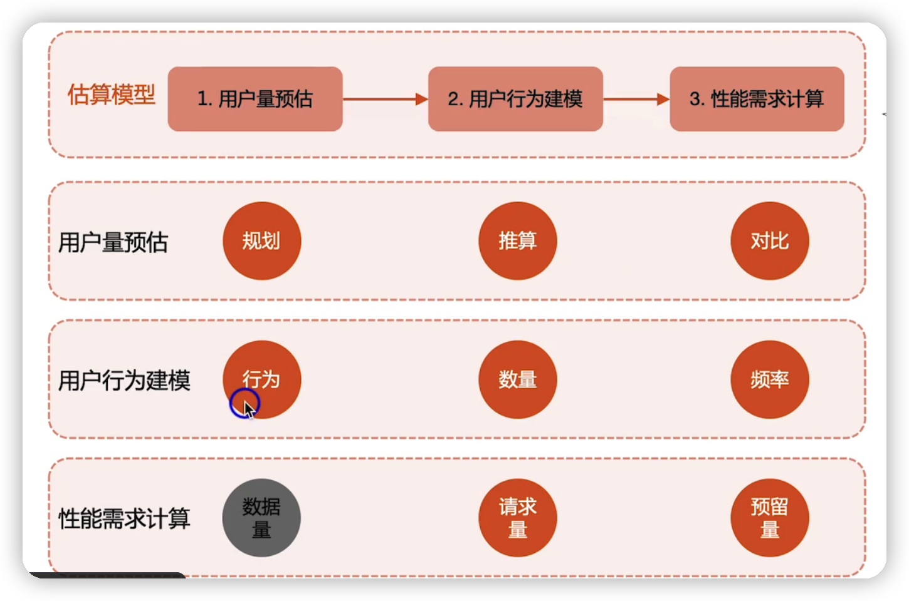
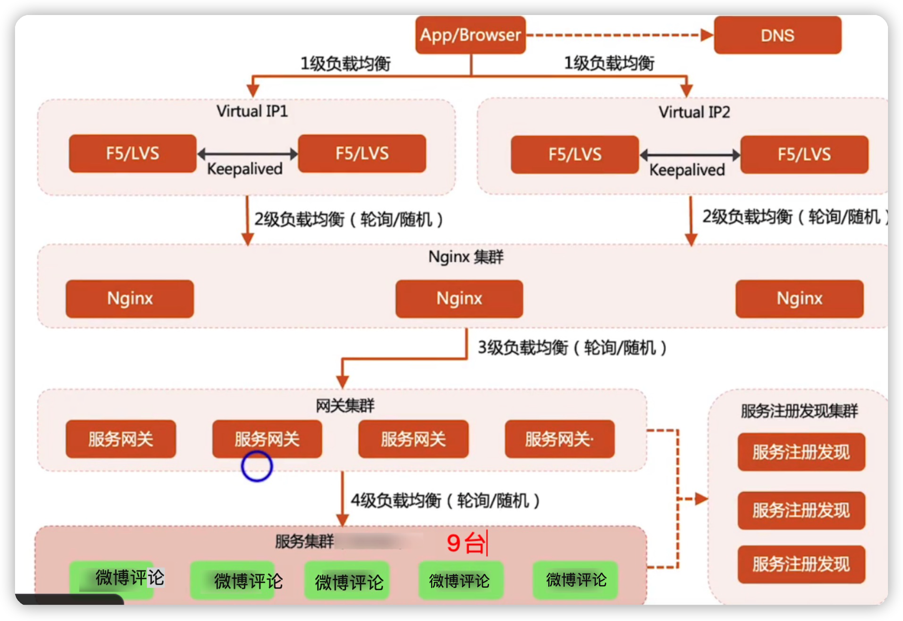
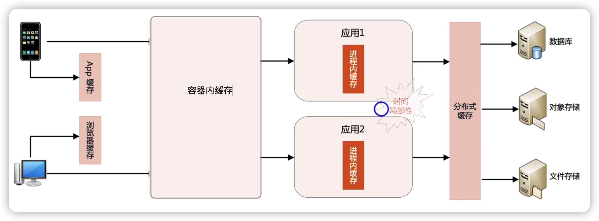
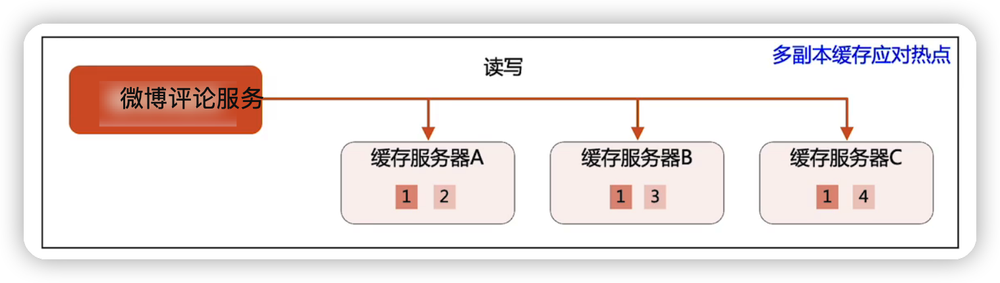

## 作业

设计微博系统中，微博评论的 高性能高可用计算架构

### 作业要求

基于模块五第六课的微博实战案例，分析 微博评论  这个核心场景的业务特性，然后设计其高性能高可用计算架构，包括但不限于如下内容：

1. 计算性能预估（不需要考虑存储性能）
2. 非热点时间时的高性能计算架构，需要考虑是否要拆分独立的服务
3. 热点事件时的高可用计算架构

[提示]

分析方法对照，看微博 和 发微博 的案例

### 1. 性能评估

#### 用户量预估

因微博每天发微博的数量是2.5亿

因此预测微博评论的人占发微博的70%  得出 每天评论微博的数据是 2.5 * 60% =  1.5亿

#### 用户行为建模

大部分人微博评论的时间是上午 8 - 9点，中午12-13点 ， 晚上20-22点。假设这几个时间点微博评论的总量占比为60%

#### 性能需求计算

则这四个小时平均微博评论的TPS计算如下

1.5亿*60%/(4* 3600)=9千万/  14400 =6250/s

$\textcolor{red}{那么微博评论最终的tps就是 6250/s}$

### 2.  非热点时间时的高性能计算架构，需要考虑是否要拆分独立的服务

微博评论是一个典型的写操作，并且不考虑非热点事件的话，因此不能用缓存，可以用负载均衡

架构分析

用户量过千万，应该用多级负载均衡架构，覆盖DNS-->F5-->Nginx-->网关，

而微博评论与 发微博 看微博 的业务时间跨度比较大。$\color{red}{所以需要拆分独立的服务}$

架构设计：

1. 负载均衡算法选择--》轮询/随机

2. 业务服务器估算：假设单台机器服务器处理能力是1000/s，则机器数量为7台，按照20%的预留量，则最终机器为9台

### 3. 热点事件的高可用架构

微博评论的热点事件-->热点事件发生后，绝大部分评论都落到了导致热点事件发生的那一条微博上面

架构核心思想：$\color{red}{没办法预估，那就做好预防}$

热点事件需要用到多级缓存架构，在上面的负载均衡架构的基础上，在加上四级缓存架构

热点事件都存储在缓存热点问题，可以用多副本缓存。

