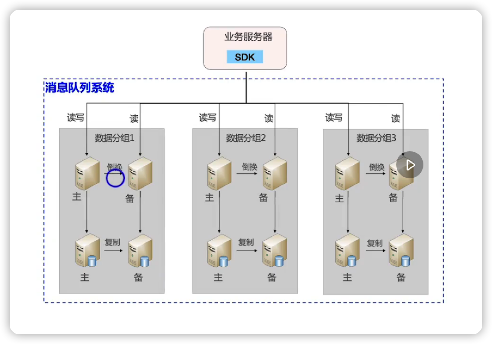

[TOC]

## 作业

![[image-20220612110030913]](static/images/image-20220612110030913.png)

### 架构图

设计为两张表，一个队列名称表，一个消息表。

- 因为不必要每个消息队列一张表，因为，消息队列的消息是消费完就打标识，隔一段时间会有清除job清除这些消费完的消息，所以数据不会太大，而每个消息队列都占一张表，浪费表空间

- 也没必要所有消息都在一张表，加队列名。因为，我觉得需要维护个队列表 以及消息表，用表关联的方式去查询，消息来了，先查队列表，再跟着队列id去查消息表，这样的话 要想看这个数据库里面有多少种队列 以及根据队列查消息要逻辑清晰点，而且单查队列种类也会快一点

### 队列名称表

| 字段名   | 字段类型 | 是否为索引 | 索引类型 | 理由                                            |
| -------- | -------- | ---------- | -------- | ----------------------------------------------- |
| id       | int      | 是         | 主键索引 | 默认主键索引                                    |
| 队列名称 | varchar  | 否         |          | 个人预测队列名称不会超过10000个，加索引意义不大 |

### 消息表

|  字段名  | 字段类型 | 是否为索引 | 索引类型                    | 理由                                                         |
| :------: | -------- | ---------- | --------------------------- | ------------------------------------------------------------ |
|    id    | int      | 是         | 主键索引                    | 默认主键索引                                                 |
| 消息名称 | varchar  | 是         | 联合索引（队列id,消息名称） | 因为平时查询消息名称查询的比较多，而且查询消息名称的时候一般都是先查队列再去根据**队列+消息名称**去查。所以建立联合索引 |
| 消息实体 | text     | 否         |                             | 消息实体无须索引                                             |
|  队列id  | int      | 是         | 联合索引(队列id,消息名称)   | 因为平时要么根据**队列**查当前队列下所有消息，要么根据**队列+消息名称**去查数据。所以建立联合索引 |

