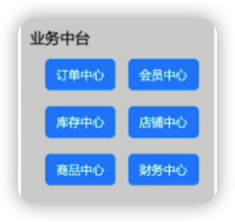
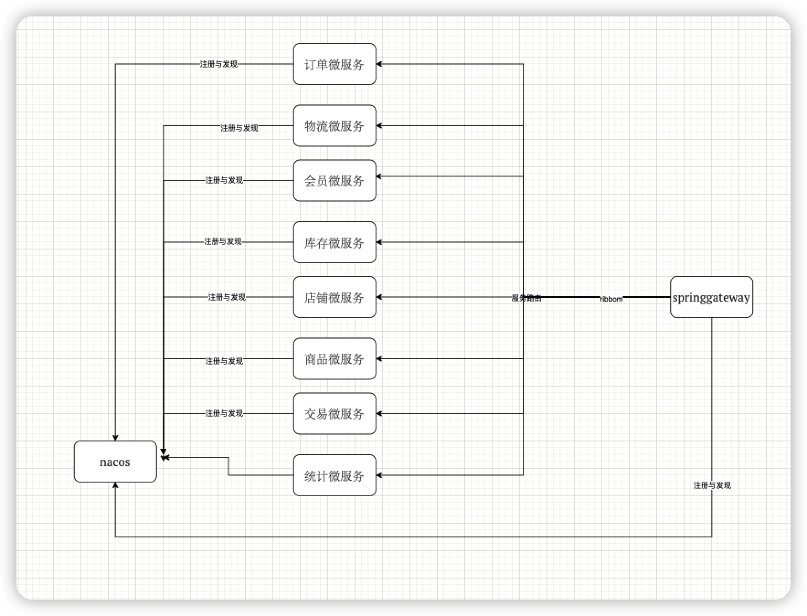

## 作业

拆分电商系统为微服务

背景：

假设你现在是一个创业公司的CTO，开发团队大约30人左右，包括5个前端和25个后端，后端开发人员全部是java，现在你们准备从0开始做一个小程序电商业务，请你设计微服务拆分架构以及微服务基础设施选型

作业要求：

1、 需要明确服务拆分思路，并且将拆分后的系统架构图画出来

2、需要明确微服务基础设施选型思路，并选择一个微服务框架

3、 用1~2页PPT即可、

提示：

1. 需要应用三个火枪手原则；
2. 需要选择拆分方式
3. 需要选择微服务架构的模式

微服务架构的模式：

因为后端人员全是java，技术栈比较统一，所以，微服务的模式选择SDK嵌入式的开发

因为是创业公司，所以选择更成熟稳定的springcloud微服务架构

拆分思路：

因为业务背景为电商，而业界电商的边界划分的案例很多，直接照搬即可，所以采用业务的拆分方式

而对照业界的拆分技巧，可以将业务拆分成如下

拆分粒度：

因为有25个后端，而按照三个火枪手原则，25/3 约等于8 ，所以可以拆分为8个微服务，每三个人负责一个微服务

而上面业务拆分成6个，所以采用多对一的方式建微服务，最终结果如下

订单微服务（订单中心拆分而来）

物流微服务（订单中心拆分而来）

会员微服务（会员微服务）

库存微服务（库存微服务）

店铺微服务（店铺微服务）

商品微服务（商品微服务）

交易微服务（财务微服务拆分而来）

统计微服务（财务微服务拆分而来）

基础服务设施选型

springcloud + nacos+springgateway+hystrix+ribbon

目前先选型最基础的，其他可以等到项目稳定之后再来选型

架构图

