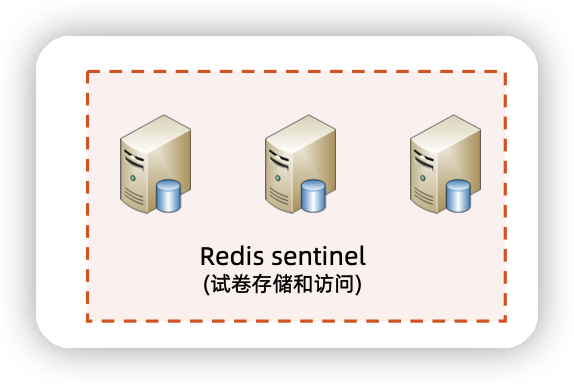

## 作业

设计千万级学生管理系统的考试试卷存储方案

[作业要求]

基于模块4第6课的估算结果和Redis sentinel的初步方案设计，完善考试试卷存储方案，具体包括：

- 完善Redis的数据结构设计，明确具体使用那种Redis数据结构
- 设计具体的读写流程（可以文字描述也可以序列图描述，序列图要有文字辅助说明）
- 对照模块4第六课的性能估算结果，计算Redis sentinel集群的服务器数量和性能

[提示]

1. 性能可以有一定的冗余，不需要算的非常精确
2. 如果对Redis sentinel不熟悉，请参考官方文档：http://redis.io/topics/sentinel

## 试卷的存储与访问

### 数据结构设计

key：课程id

value： 选择hash数据结构， 试卷id为key   试卷json数据为value

### 读写分析

- 试卷的存储直接按照课程id作为key查找课程value
  -  然后将试卷id作为 hash的key ，试卷的信息作为json字段作为hash值 存进课程key的value中

- 试卷的读取是通过课程id作为key查找对应的value。
  - 然后通过试卷id  通过hash操作 得到试卷的json对象

## 计算Redis sentinel集群的服务器数量和性能

由于单个Redis的tps约5-10万

而考试的tps与qps的性能分析结果如下

【考试】

1. 试卷请求 QPS:5万/s;

2. 提交试卷 TPS:1700/s

而考试的时候读取试卷的qps的5万每秒，所以单台redis不适合，需要做集群

所以只需要2台从redis ，1台主redis，即可

读取数据都从从redis读取，每台redis读取的qps为2.5万/s，这样对于redis毫无压力

