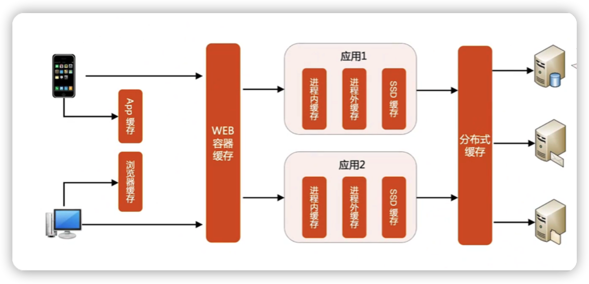

## 毕业项目

[业务背景]

作为一个电商创业公司的架构师，负责设计6.18大促秒杀系统的设计，业务模式如下

1. 你们挑选选品各大电商平台上畅销和好评的商品进行销售，**每个品类不超过20个商品，目前做了10个品类**
2. 本次6.18秒杀选择了1000个充电宝，10台iphone12作为==秒杀商品==
3. 正常的==日活==大约100万用户
4. 老板要求万无一失

[技术背景]

1. 技术团队以java为主，已经落地了微服务架构
2. 主要渠道是自有的APP（包括IOS和Android）和微信小程序，为了促进用户转化为App用户，只有下载App才能参加秒杀活动
3. 目前只有==单机房==

[毕设要求]

1. 设计完整的架构，例如存储、负载均衡、缓存、高可用、可扩展等
2. 大约10页业内的PPT，每页PPT说明一项设计，包括架构设计和设计理由，无需详细解释备选方案

[提示]

1. 分析考虑要全面，但并不意味着架构设计要面面俱到，如果分析后认为某些设计点可以不做，就在作业最后统一说明原因即可
2. 如果没有思路，请对照模块9的IM案例
3. 如果有的信息觉得不够全或者不够细，可以做出一定的假设，但不能天马星空，需要对照已有的业务背景和技术背景进行合理推断

### 基础分析

- 由于该系统日活是100万用户，虽然秒杀的时候，人数比平时多一点，但我预测量级也不会超过千万级别，所以推测这个系统最终的设计规模还是在**百万用户规模的架构**
- 目前项目是单机房部署的，而上面说了百万用户的架构单机房无法支撑，所以可以推测这个系统最终的架构部署是**同城双中心**

用户量预测：由于日活用户大约是100万，假设618的时候，活跃的用户比平时多300% 得出 **100万+100万*3 =400万。**

商品种类总数：10个品类，每个品类不超过20  得出商品种类总数  **10*20 = 200种**

假设**不同种类的商品生成不同的订单**

### 1. 存储架构

#### 1.1 存储性能估算

登录

- 登录用户等于用户量，也就是**4o0万/天**

购物车

- 400万用户，每人618的时候给购物车放商品种类的10%的商品 也就是  400万* （200*0.1） =  **8000万数据/天**

下单

- 前面购物车算出 每人购物车的商品有200*0.05 = 10  个商品，假设这10个商品分为 3类，也就是每个人需要下3单，但是400万用户也不是每个人都会下单，假设有70%的人会下单。也就是 400万*0.7 *3 = **840万订单数据/天**

结算

- 结算是调用支付宝与微信，这块生成的数据与下单一样  **840万/天**

秒杀

- 秒杀是一个高并发TPS，QPS高的动作，其涉及的存储方面的很少，固在存储架构中不考虑

#### 1.2 存储架构设计

关系数据库：订单-》840万关系数据，以及登录-》400万登录请求，采用mysql 主备足以应对

缓存数据库：购物车-》8000万数据   ，所以单台redis已经无法应付，所以采用 redis  cluster分区架构，而且采用分区架构还可以应对之后用户量继续增长的情况，只需要继续加redis分区结点即可

### 2. 计算架构

#### 2.1 计算性能估算

假设618用户活跃时间都在晚上6-10点

登录

- 登录用户等于用户量，也就是4o0万/天。而登录的TPS为 400万/ 14400秒= **277/s**

购物车

- 与登录类似。400万用户，添加购物车的TPS为 400万/ 14400秒= **277/s**

下单

- 400万用户也不是每个人都会下单，假设有70%的人会下单，那么下单的TPS为 400万*0/7 / 14400=194/s

结算

- 结算是调用支付宝与微信，这块TPS与下单一直为 194/s

秒杀

- 1000个充电宝，10台iphone12作为==秒杀商品==，商品种类是2个
- 假设秒杀活动持续1小时

- 400万用户有60%的人参加了秒杀活动，假设这60%的人在同一时间去秒杀商品
- 秒杀的峰值在第一分钟，所以第一分钟的秒杀的TPS为 400万*0.6/2/60 = 20000QPS
- 而在这一个小时秒杀内的平均TPS为400万*0.6/2/3600 = 333QPS

#### 2.2 计算架构设计

由于TPS+QPS 在3万左右，所以用nginx则满足需求，多部署几台nginx形成集群

### 3. 负载均衡架构

负载均衡架构与计算架构保持一致，因为平时的用户也就百万左右，只有618用户的访问量以及TPS量才会激增，所以没必要切换nginx，618过后，流量又会降下来，所以暂时业务没有那么快的发展的话，还是nginx为主

### 4. 缓存架构

缓存架构使用4级缓存架构

原因是：

APP缓存：用户手机本地缓存商品的图片信息，加速商品的加载

WEB容器缓存：会缓存商品的某些信息，加速读取

应用缓存：因为商品的信息，会被百万级别的人读取，所以采用应用缓存

分布式缓存：主要存储购物车的信息，能够让用户更快的加载到自己的购物车信息

未用到CDN的原因：因为目前的用户级别还是百万级别，等上了千万或者亿级别时，才会考虑使用CDN缓存

### 5. 可扩展架构

微服务拆分

假设团队中已经有26个人 后端15个，前端4个，安卓3个和ios4个

按照3个火枪手原则，由于后端有18个，所以得出拆分微服务拆分为5个

如果用户继续增大， 在增加后端的情况下，可以考虑拆分更多的服务。这块是以15个后端来做架构设计

### 6. 高可用架构

由于是之前是单机房，而用户量已经达到百万级别的，所以单机房已经不满足需求了。

又因为直接从单机房进化到双活机房，产生的复杂度偏高，所以我这边设计的是先进行双机房做灾备机房，如果机房1故障了，那么手动切换到机房2。

后续如果业务持续增大可以考虑从同城双中心的灾备架构演进为双活架构

### 7. 大数据架构设计

由于目前用户级别还是刚到百万级别，即便是618大促，用户量也只达到400万左右，等618之后降温了，用户可能会跌回之前的100万，所以这块可以采用clickhouse，它兼容sql，对开发友好，能够很容易的搭建

而后续业务达到千万级甚至亿级别的时候，才去考虑上hadoop+spark

