>  要想做好架构，必须要掌握架构师的几种架构图

## 架构的划分

一个系统，按业务划分，有业务架构，以领域划分是领域架构

领域架构又分客户端、后端、前端架构，具体的划分如下图所示：

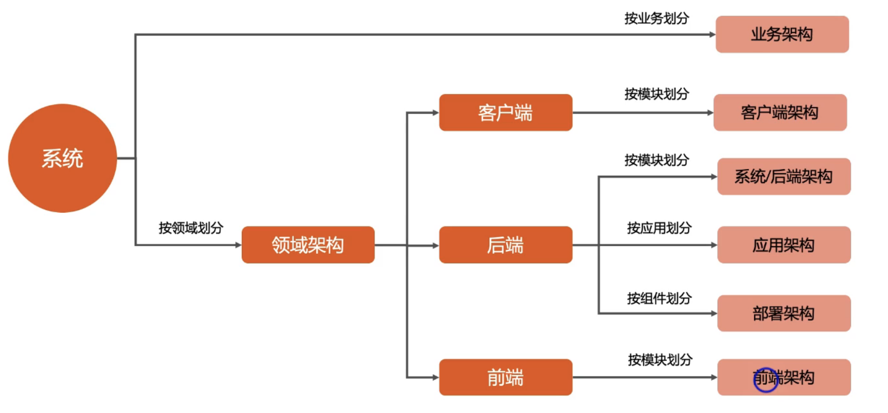

接下来讲解各个架构图的定义与使用场景，与画图技巧

## 架构图

### 业务架构

定义：业务架构是指系统从业务的角度划分，描述系统对用户提供了什么业务功能。类似于4+1视图的场景视图

场景：产品人员规划业务、给新员工培训业务

示例：以下是业务架构的场景

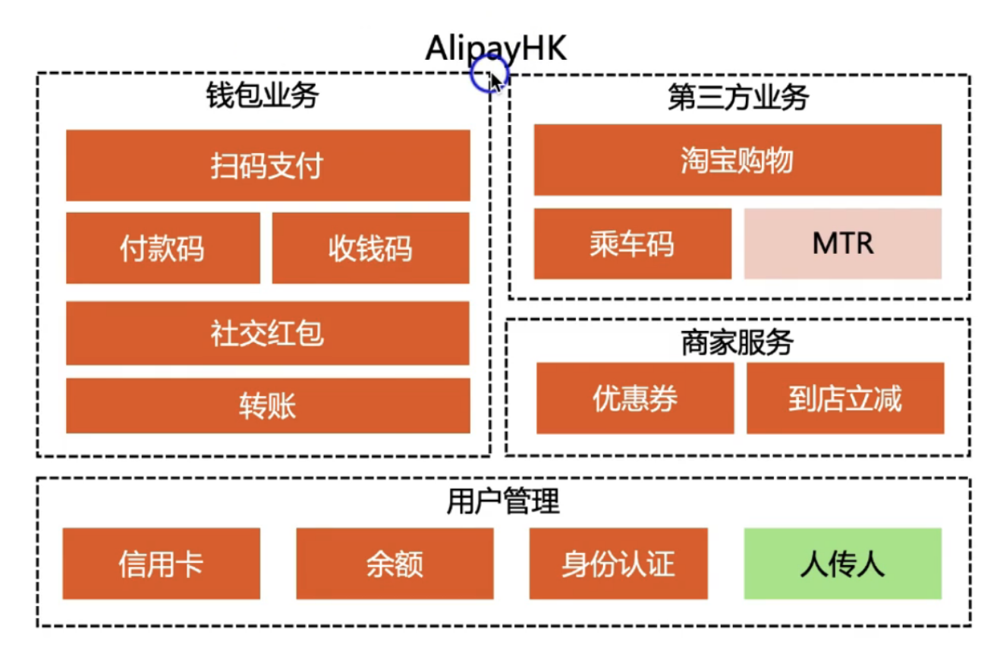

### 客户端/前端架构

定义：客户端和前端的领域逻辑架构，类似于4+1视图的逻辑视图

场景：架构设计、架构培训

示例：以下是客户端架构、前端架构的使用示例

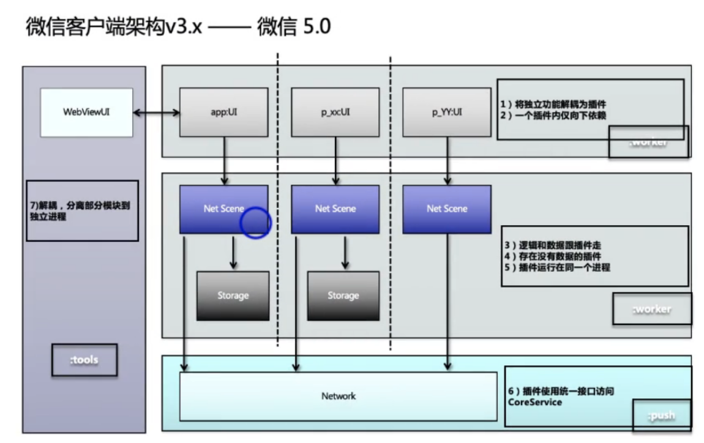

### 系统架构

定义：后端的**逻辑架构**，又叫后端架构、技术架构

场景：整体架构设计，架构培训

示例：以下是mongodb的系统架构

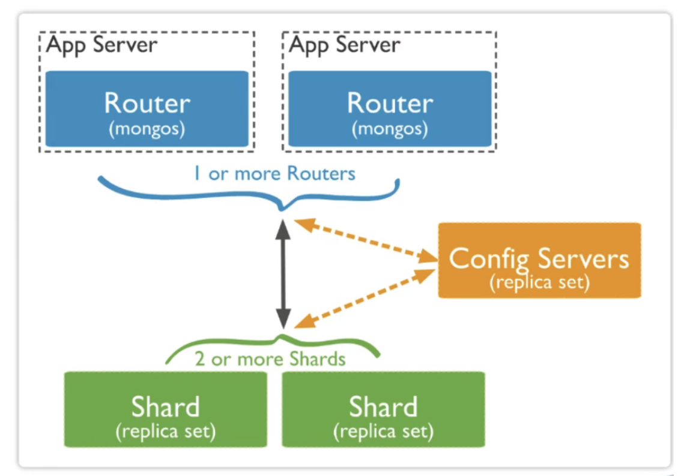

**为什么后端逻辑架构就叫系统架构？**

因为系统核心部分就在后端架构，所以说后端架构就是系统架构。

系统架构比较复杂的话可以画两张图，  功能图与交互图

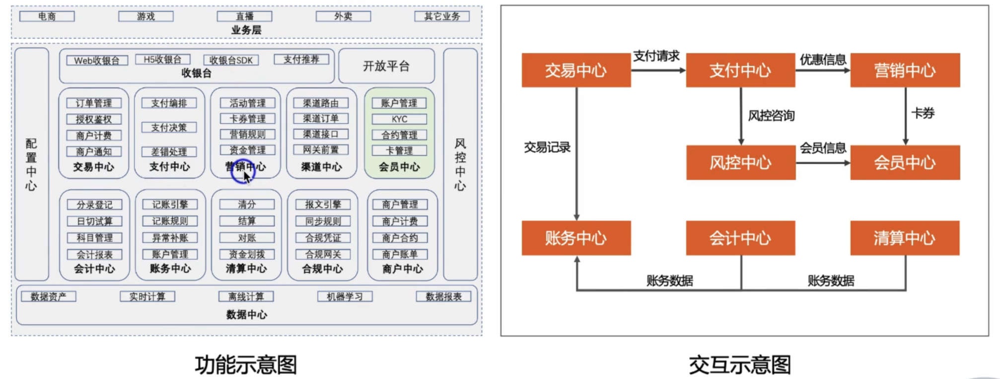

### 应用架构

定义：描述后端系统由那些应用组成

场景：项目开发、测试，部署发布，子领架构设计

示例：以下是应用架构的示例

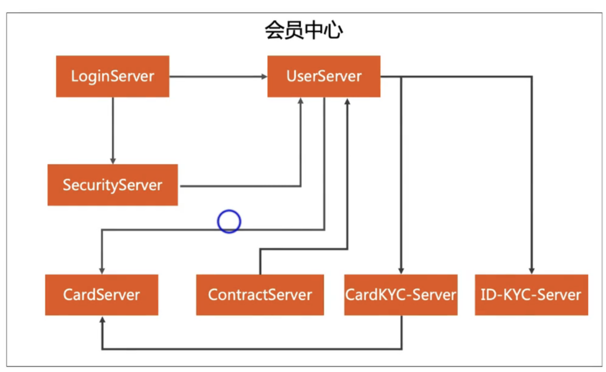

应用架构与系统架构的区别

有时候可以等价，有时候不一定等级，下面是等价的案例

一般看系统的复杂度，一般像mongodb这种中间件，应用架构就是系统架构。

像复杂度较大的，比如支付中台，电商中台，应用架构就不是系统架构

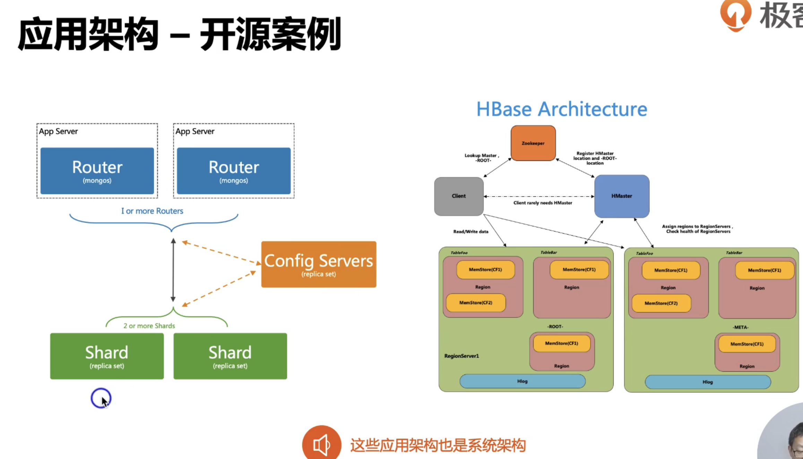

### 部署架构

定义：描述后端系统具体如何部署的，对应4+1视图的物理视图

场景：总体架构设计，运维规划和优化

示例：以下是部署架构的示例

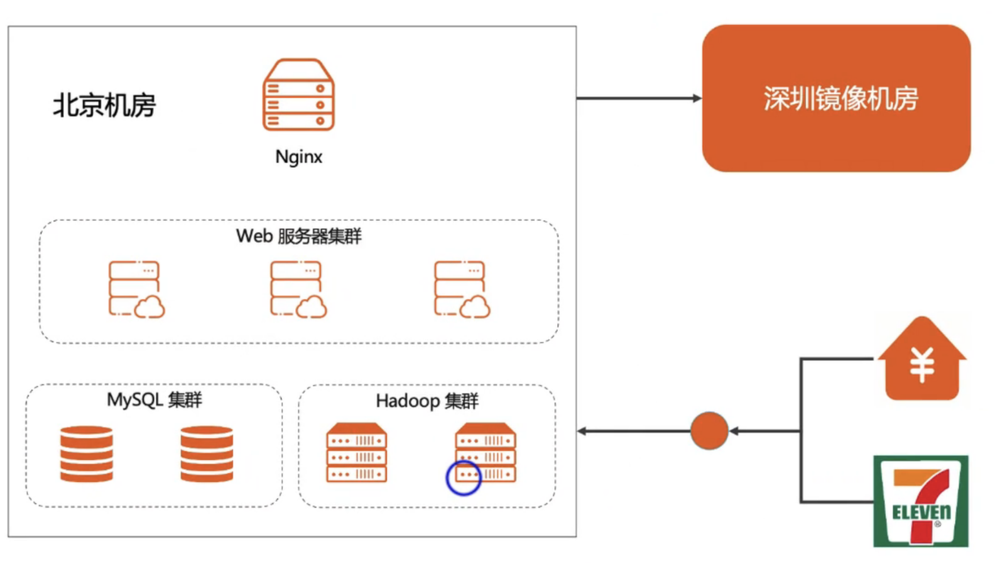

## 系统序列图

架构图只能描述Role与Relation，称为静态架构图，它没法描述系统的运作规则。描述运作规则是动态架构图来实现。

也就是需要用系统序列图来实现

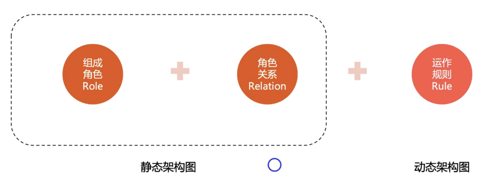

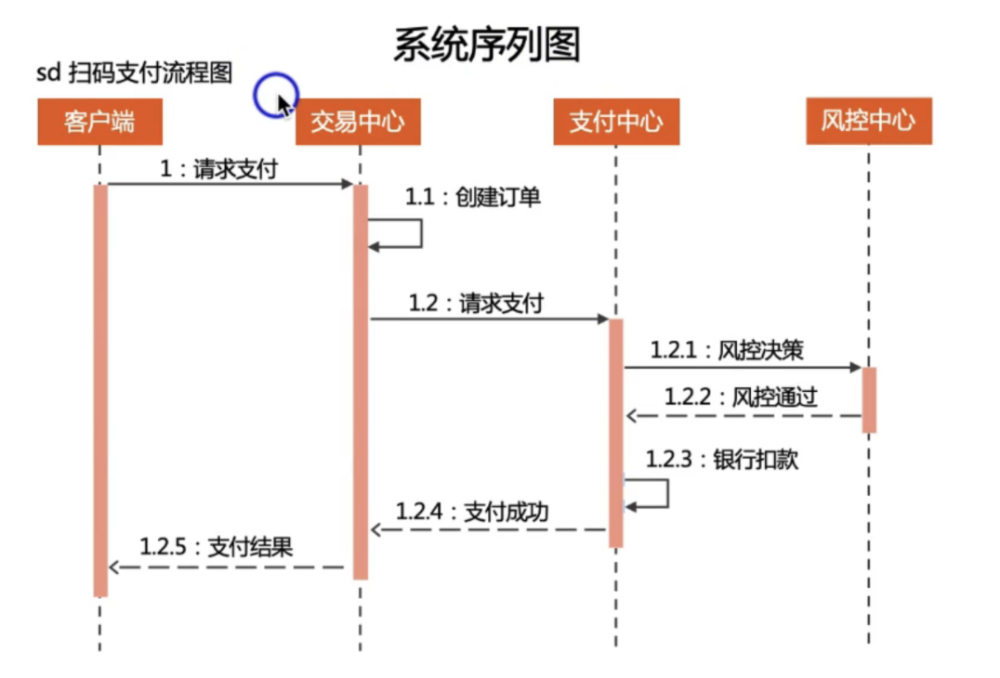

在做架构设计的时候，并不是每个业务功能都要做系统序列图，只有核心功能需要。因为在架构设计阶段把所有业务的序列图画出来，本身不现实。

## 总结

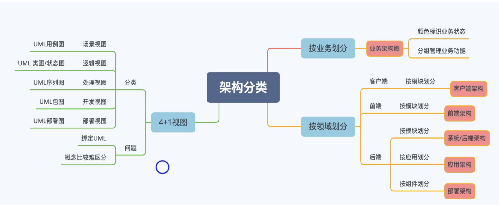

