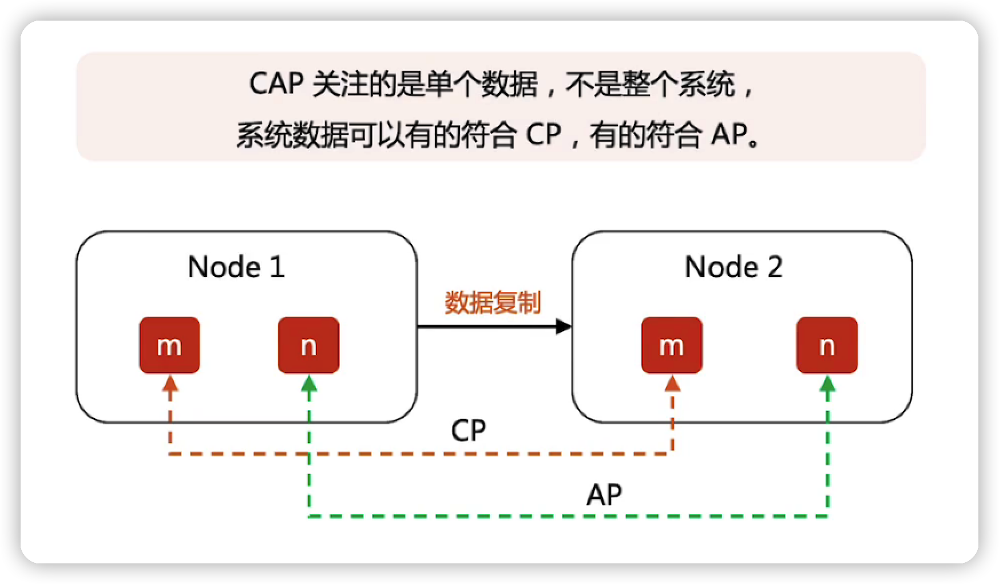

## FLP

限定条件：网络是全部正常的

FLP只是说没有确定性协议，而不是 没有任何协议

确定性协议：意味着不能有随机的算法在里面

同步通信网络：只要在超时的时间范围内没有收到你的应答，就认为你挂了

异步通信网络：就算是没有收到其他结点的消息，也不能判断节点是否是挂掉了，还是网络有问题，还是处理慢

### FPL的不可能三角

### Paxos违背了FLP了没

并没有违背，但是为了工程落地，实际上是突破了FLP的一些约束和限制

  Paxos主要满足SF，某种情况不满足LF

FLP没太懂

## CAP

- C 一致性
- A 可用性
- P 分区容忍性

### CP与AP的简单示意

### CAP的三大限定条件

- 分布式：发生在分布式环境中
- 数据存储：通过复制来实现数据共享的**存储系统**
- 同时满足：不能同时满足CAP

### CAP细节--复制延迟

### CAP细节--描述粒度

根据数据的特性来决定那些数据可以是CP，哪些可以是AP

## BASE

最终一致性，与强一致性的区别

### BASE与CAP的关系

理论上，系统设计是复合AP，但是真正落地的时候是复合BASE理论去落地

## BASE/CAP/FLP落地

## 总结

