## FMEA原理

Failure mode and effects  analysis   故障模式与影响分析。是一套分析与思考的方法，可以应用在各行各业

### FMEA详解

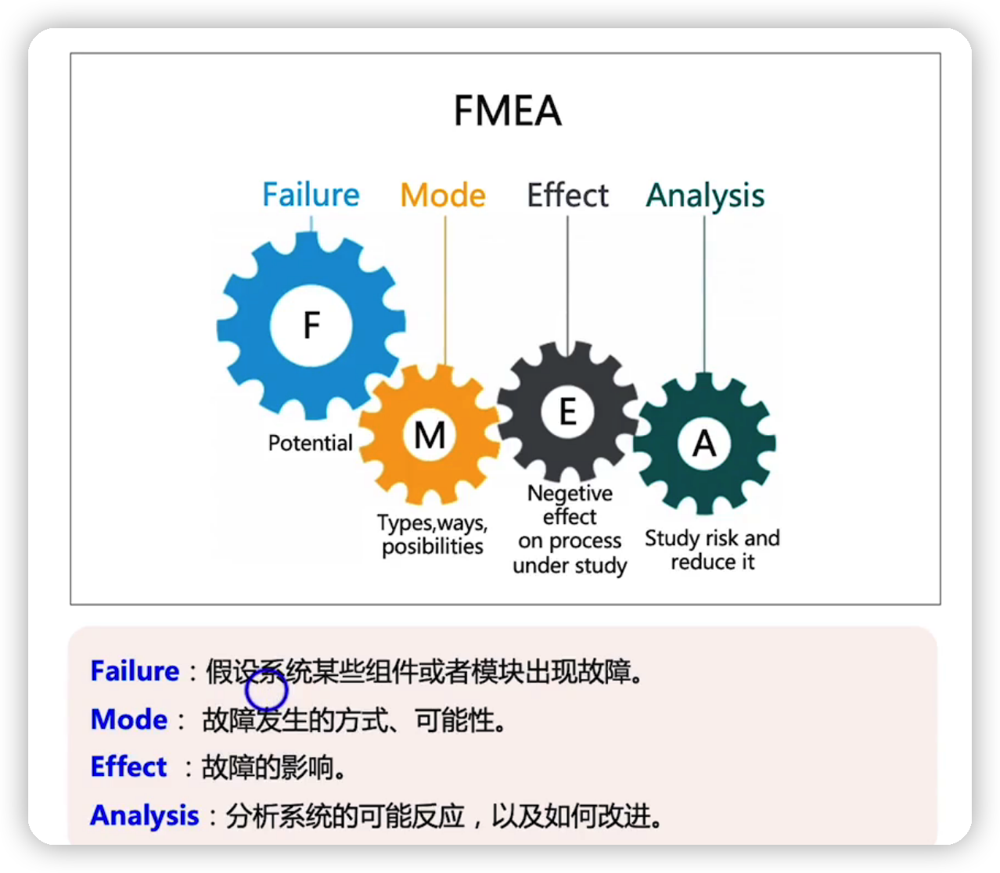

### FMEA在哪个阶段应用

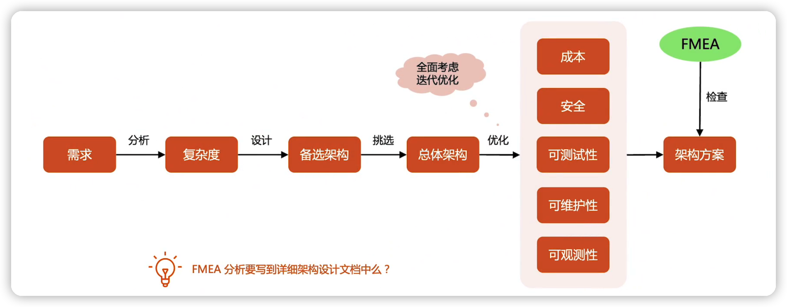

### FMEA案例

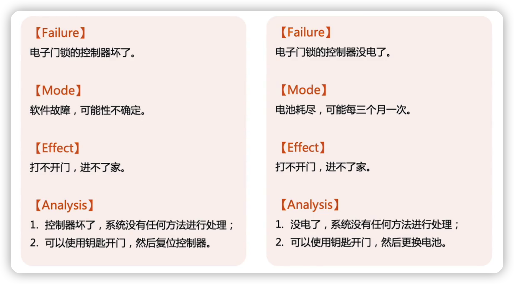

### FMEA应用步骤

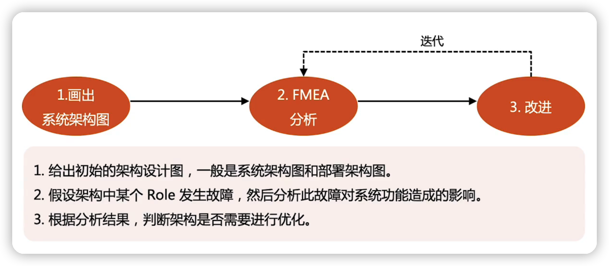

### FMEA分析维度

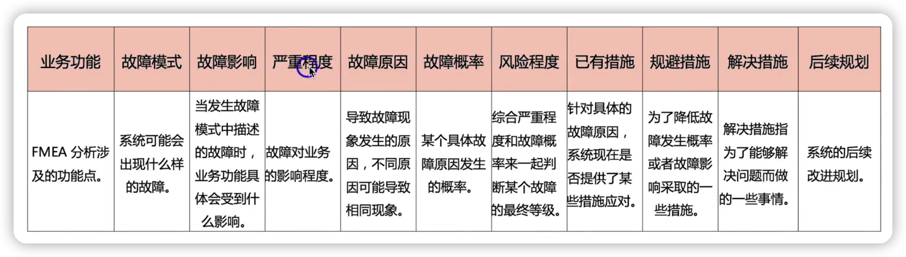

### FMEA分析技巧

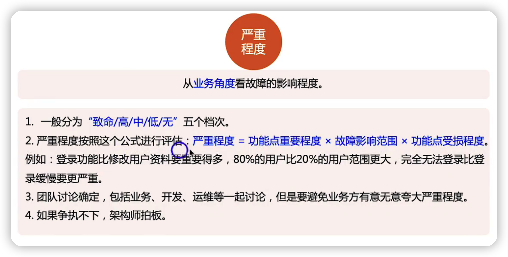

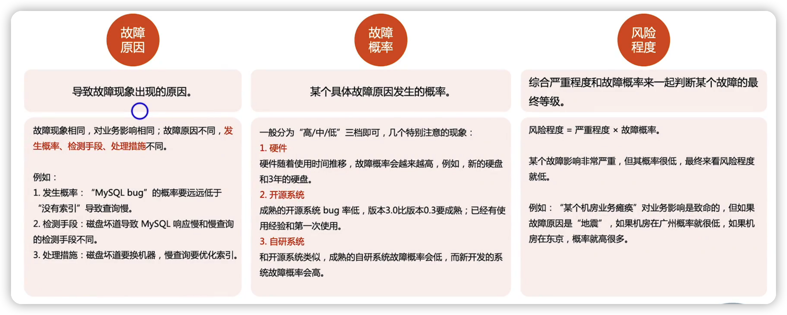

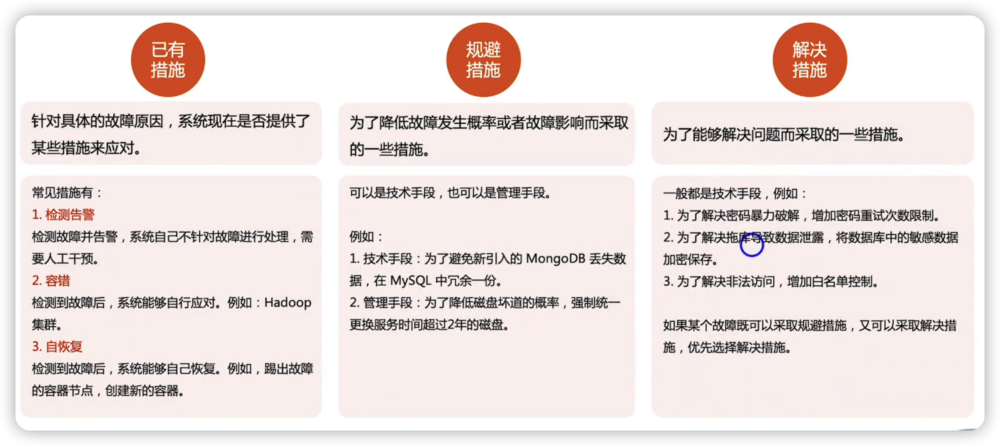

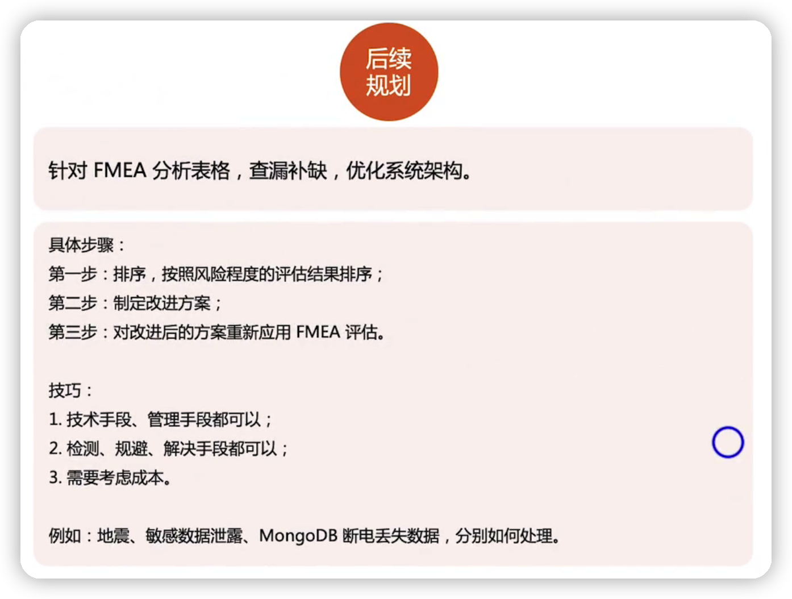

### FMEA落地技巧

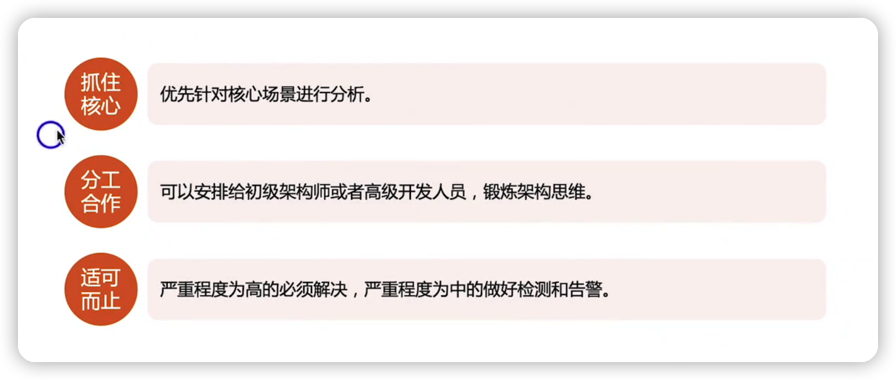

### FMEA案例

以学生管理系统的登录注册来分析

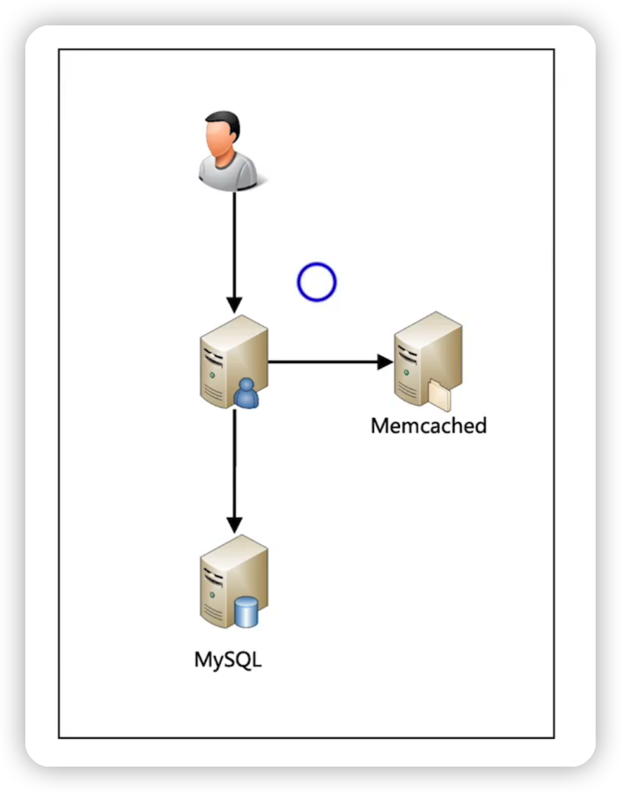

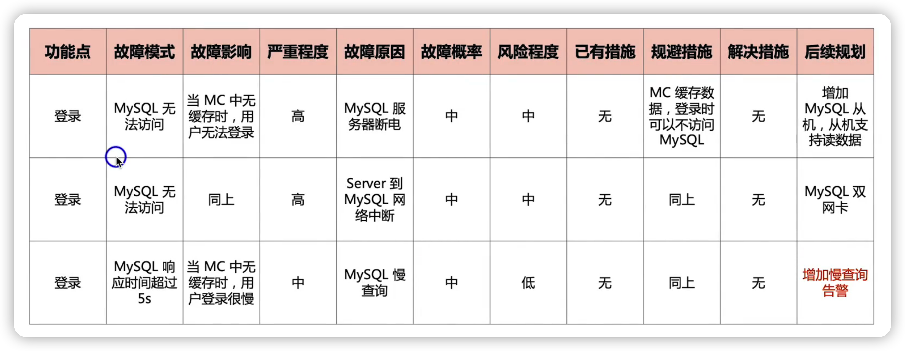

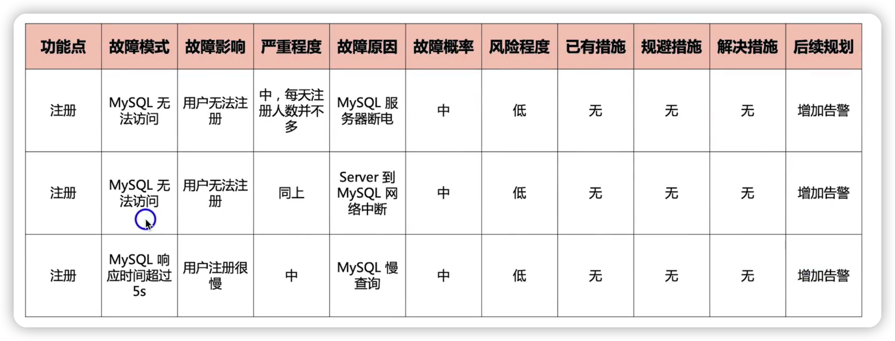

优化后的架构

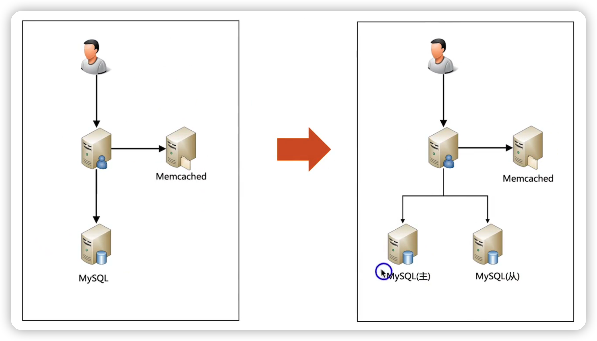

## 总结

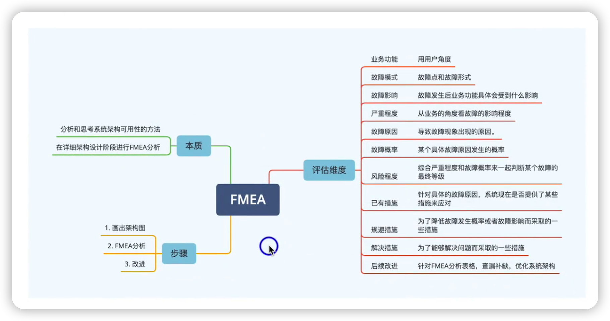