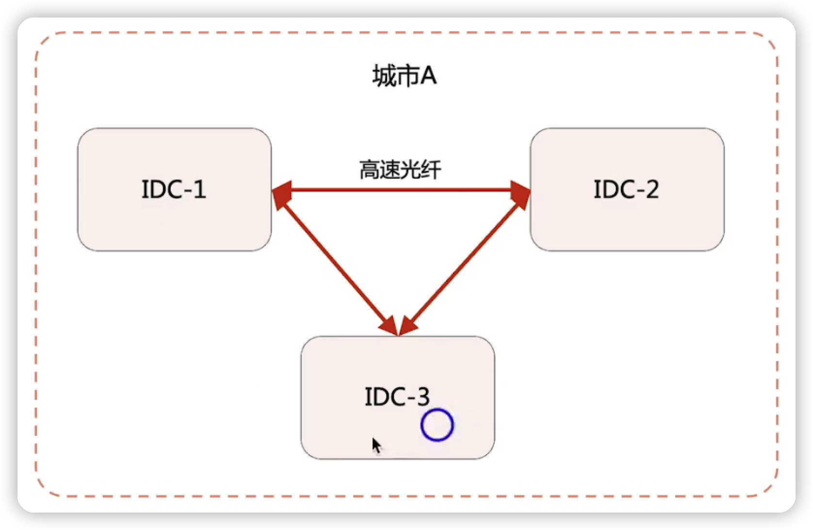
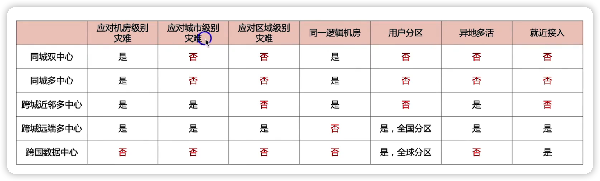

## 同城架构

### 同城双中心基本架构

 

#### 架构本质

可以当做同一个逻辑机房，也就是在设计与部署的时候，当做一个机房去做，设计会变得简单

用多光纤线路保证网络，一旦网络断掉，就会出现脑裂的情况

### 同城三中心

 

 

一般很少有人用这种架构，因为成本比较高，而且高可用并没有提高，因为在一个城市，发生城市级别的故障这种架构也应付不了。

比如做个同城双中心，然后把第三个中心部署到另外一个城市

 

## 跨城架构

### 跨城双中心基本架构

### 跨城双中心落地方案1--->近邻城市

### 跨城双中心落地方案2--->远端城市

### 跨城多中心

### 示例

OceanBase官方推荐架构

 

## 跨国架构

## 业务灾备架构对比

 

## 总结

