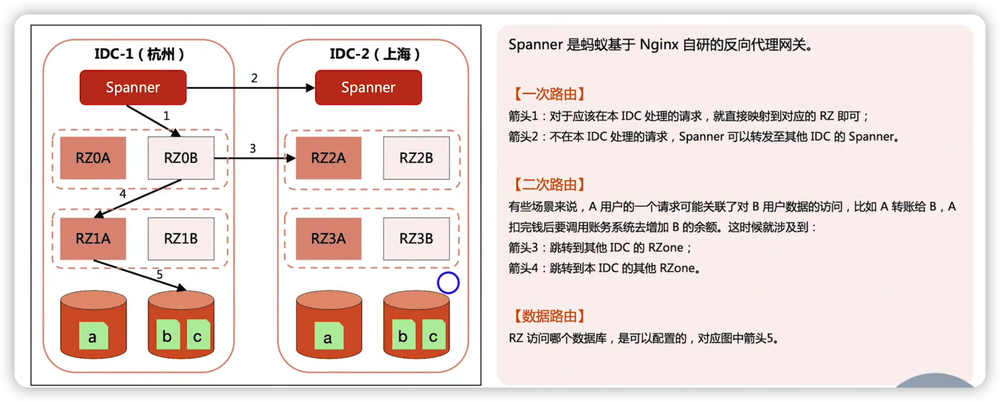

## 异地多活

跨城多中心，只是异地多活的基础，并不是只要部署了跨城多中心，就一定支持异地多活

### 业务定制型异地多活架构

#### 案例：阿里游戏异地多活设计

最终架构设计（左边是老架构，右边是最新设计的架构）

设计核心---》算法生成roleId

### 业务通用性异地多活架构设计

#### 案例：淘宝的单元化架构

#### 案例：蚂蚁的LDC架构

##### LDC路由

##### LDC容灾

##### LDC蓝绿发布

#### 单元化架构的核心---》配套服务

### 存储通用性异地多活架构

#### 案例：oceanBase

## 异地多活架构模式对比

## 总结

