## 异地多活的核心原理---》CAP

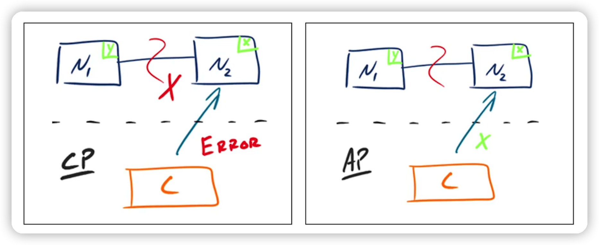

异地多活架构本质上是AP架构

因为做异地多活是要有分区，而且其中一个分区机房故障，这个时候，你的另外一个机房需要对外提供服务，否则有故障另外一个机房不提供服务了，就不是异地多活的目标了

## 大道至简- CAP

深入CAP  

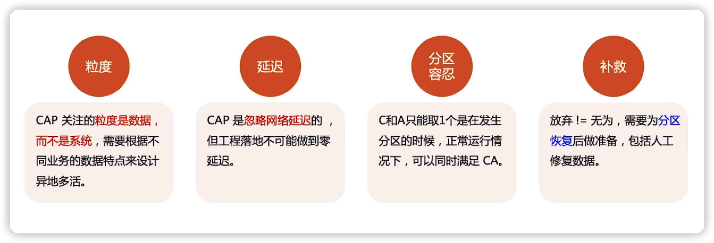

## 异地多活核心原则

### 原则1-》只保证核心业务

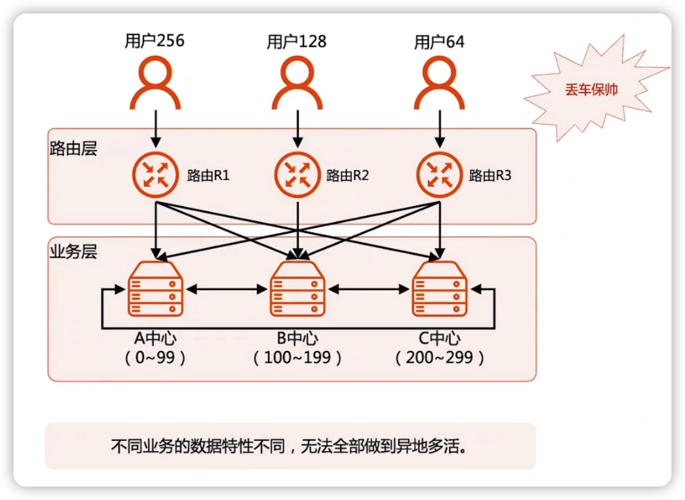

### 原则2-》只能做到最终一致性

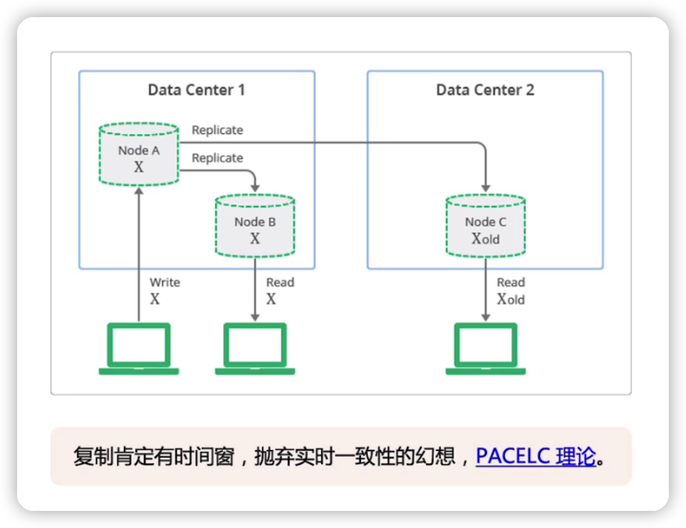

### 原则3-》只能保证绝大部分用户

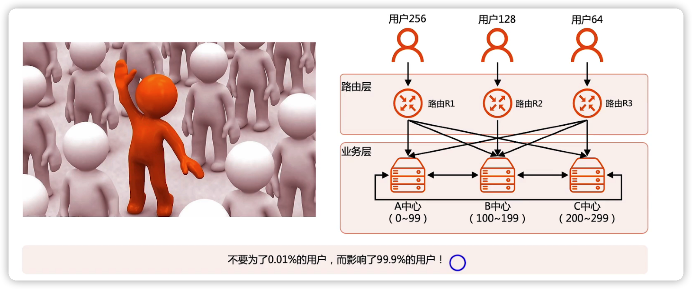

## 异地多活设计步骤

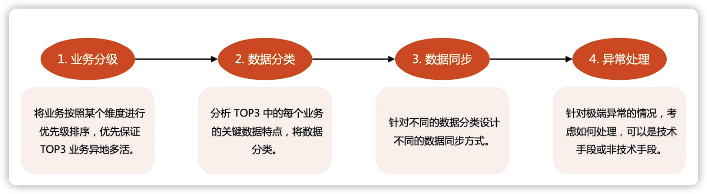

### 步骤一：业务分级

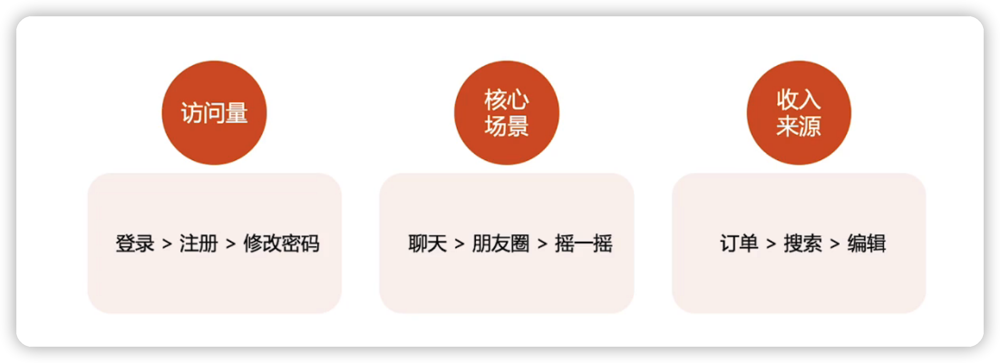

### 步骤二：数据分类

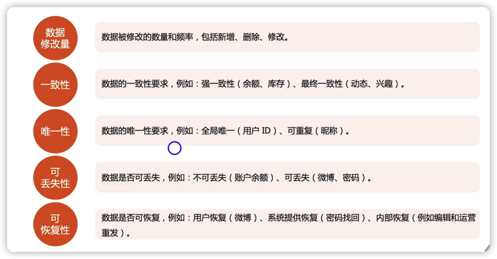

### 步骤三：数据同步

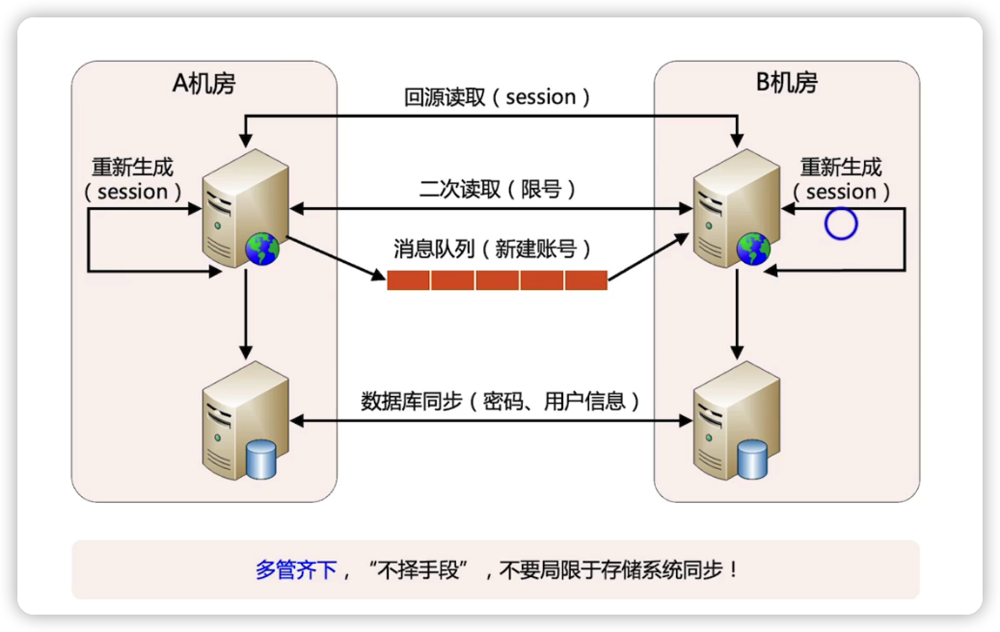

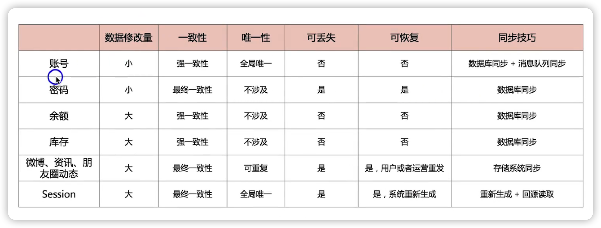

### 步骤四：异常处理

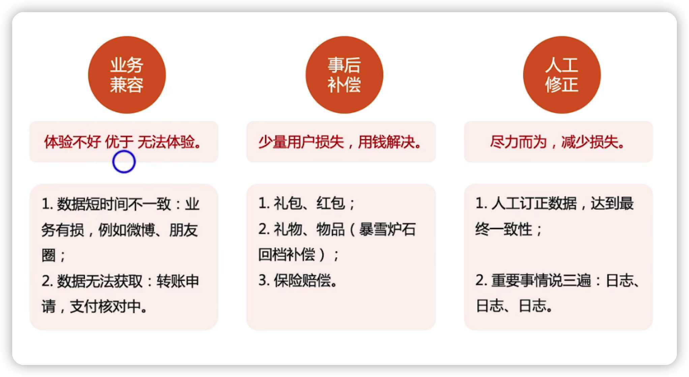

## 异地多活设计技巧

### 1. 消息队列同步

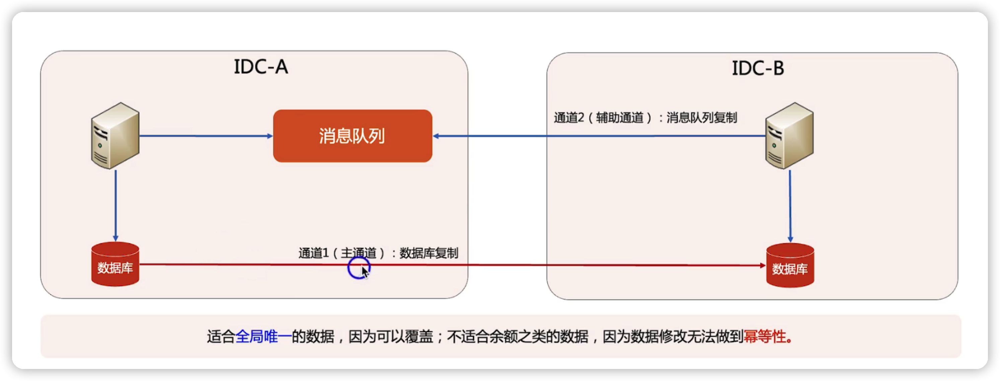

### 2. 库存拆分

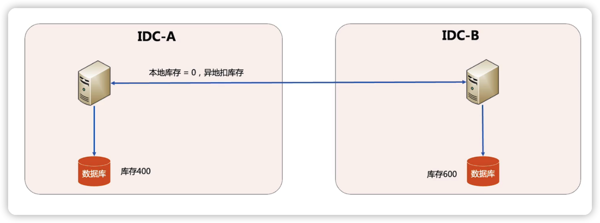

### 3. 事务合并

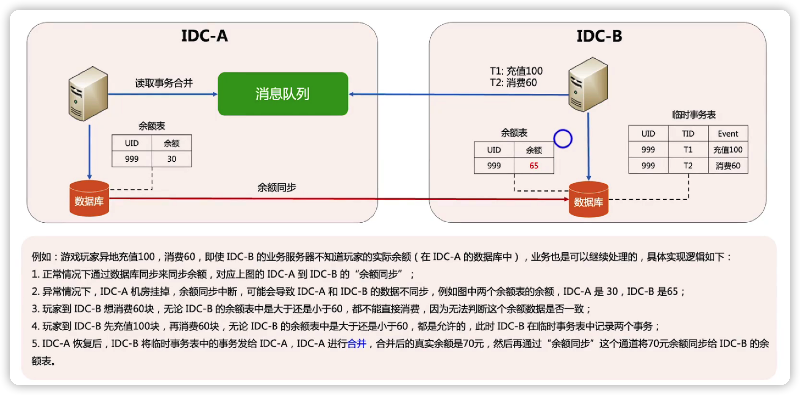

### 4. 实时改异步

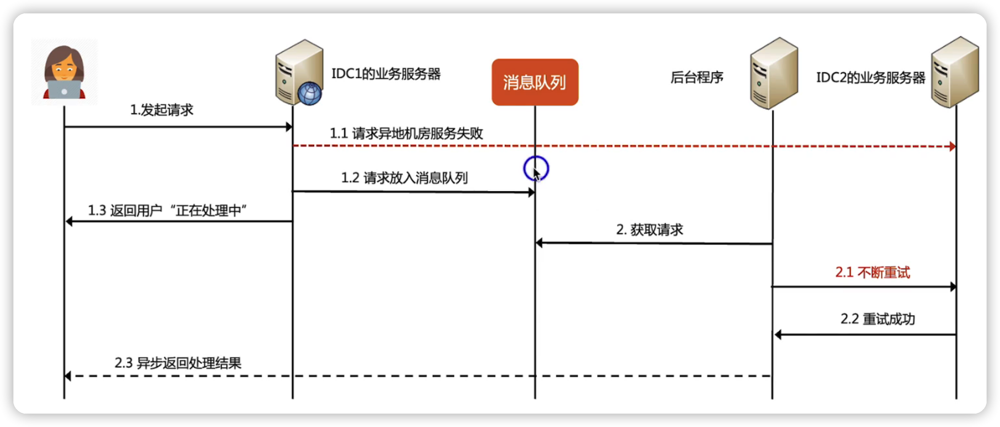

### 5. 适当容忍

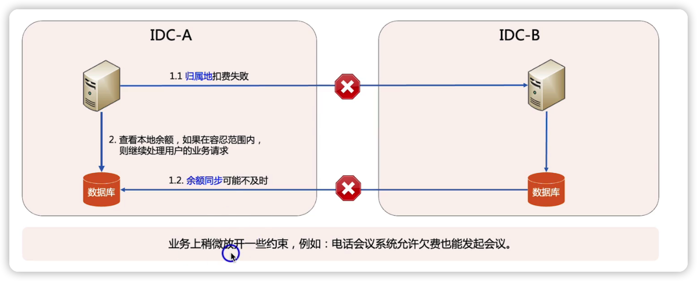

## 总结

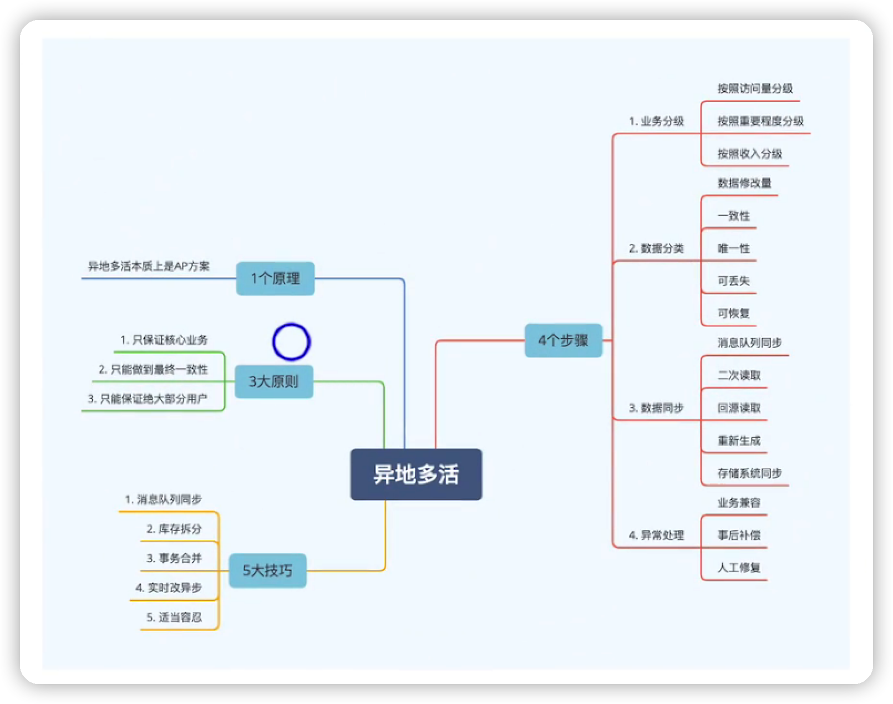