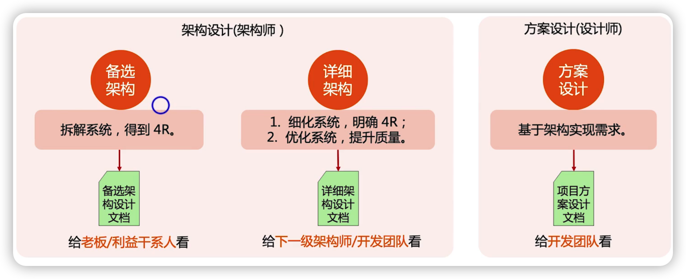
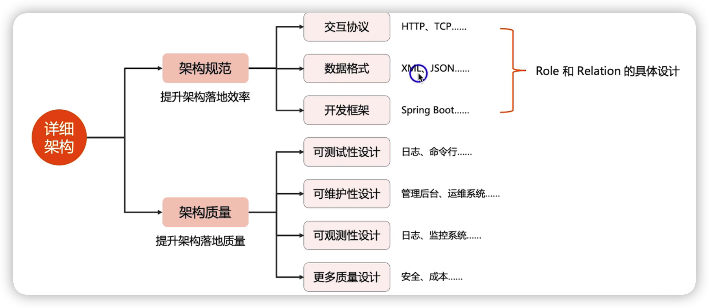
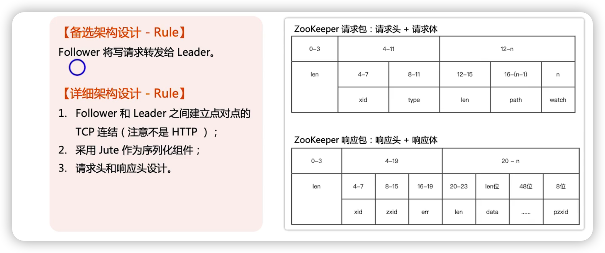
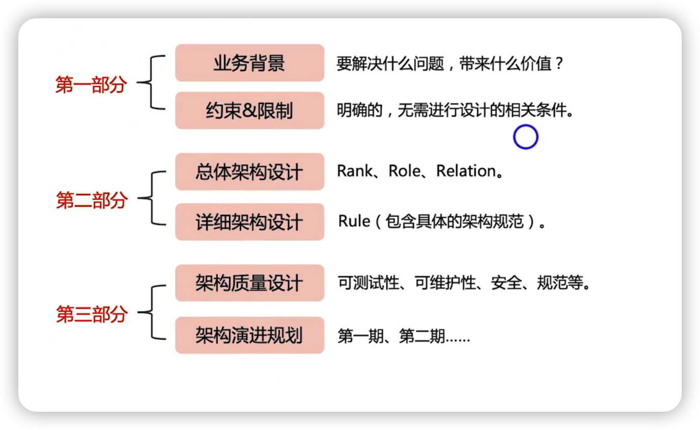
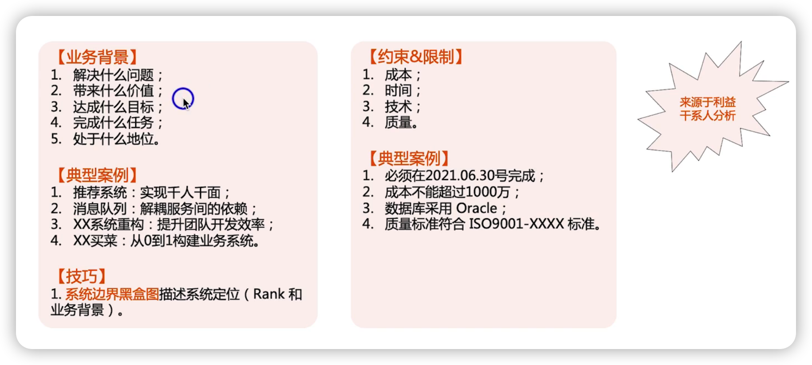
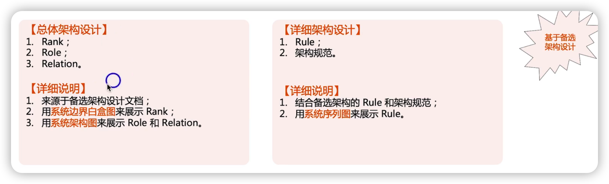
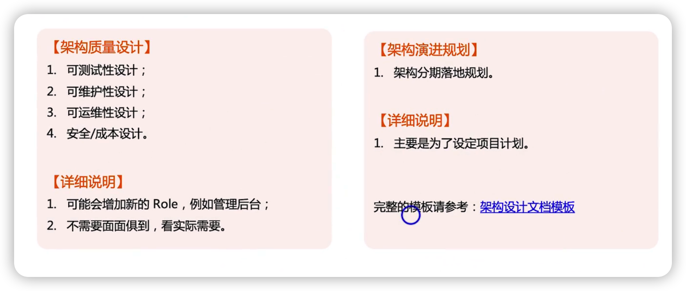
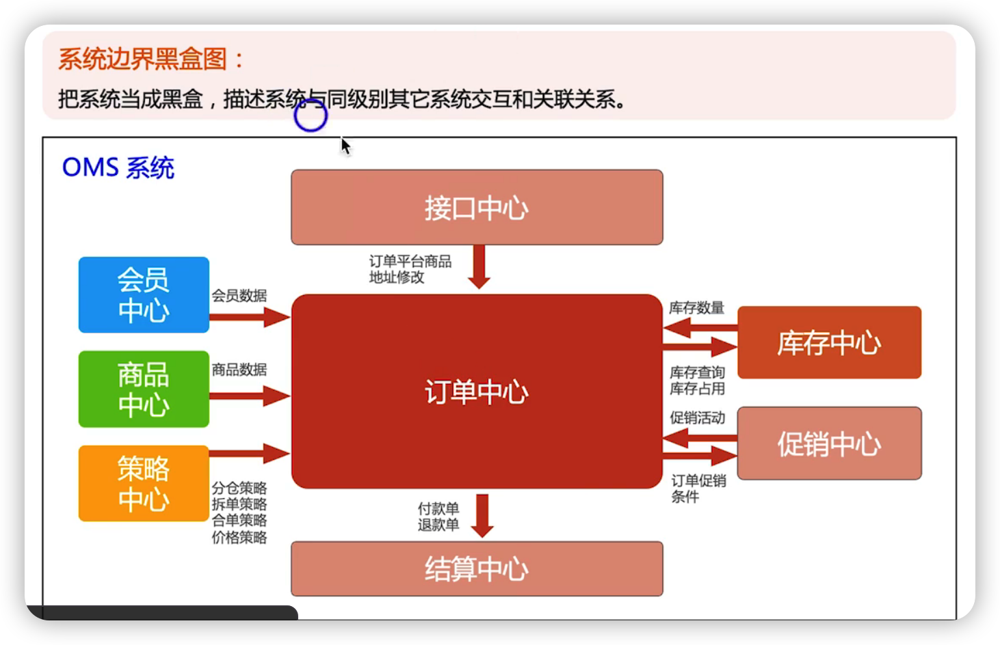
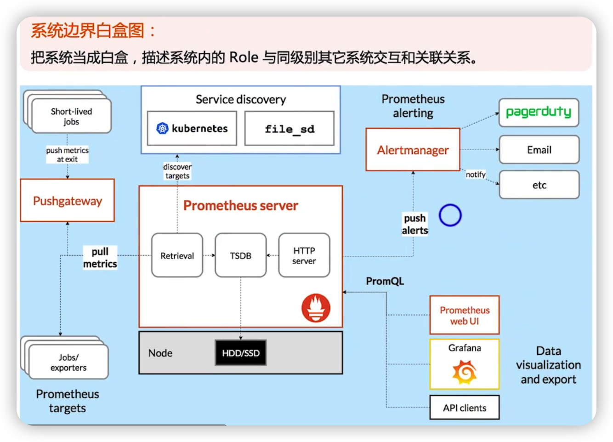
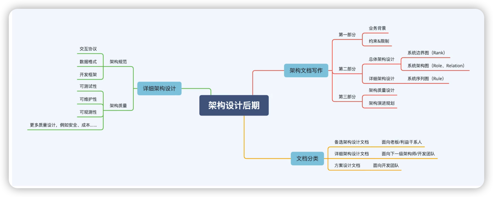

## 备选架构、详细架构、方案设计区别

## 详细架构内容

### 详细架构的样例

zookeeper的案例

微服务的案例

## 架构设计文档

### 第一部分

### 第二部分

### 第三部分

## 系统边界图

系统边界图描述的是**外部结构**

系统架构图描述的是**内部结构**（描述自己内部各个角色的一个一个结构）

### 系统边界黑盒图

**系统边界黑盒图**：描述系统的定位，包括当前系统与周边系统的关系与交互

### 

### 系统边界白盒图

系统边界白盒图：把系统当成白盒，描述系统内Role与同级别其他系统交互和关联关系

## 总结

