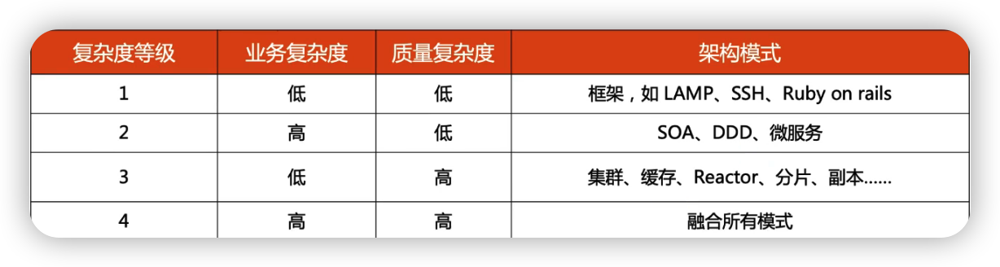

架构设计的常见的复杂度

- 可扩展复杂度
- 高性能复杂度
- 高可用复杂度
- 低成本/安全复杂度

[TOC]

## 架构设计的复杂度模型

### 业务复杂度

业务复杂度主要体现为**难以理解、难以扩展**。 例如业务数量多（微信），业务流程长（支付宝），业务之间的关系复杂（ERP）

### 质量复杂度

高性能、高可用、成本、安全、等质量性的要求

业务复杂度与质量复杂度是正交的（业务复杂度与质量复杂度之间互不影响 ）

### 架构复杂度应对之道

注意：**DDD不能降低质量复杂度**

### 架构设计自顶向下好还是自底向上好

看业务场景

如果在大公司，在已有的业务做新的业务，一般是自顶向下的，因为它已经有整体的架构了

如果在小公司，从0-1的话，采取自底向上