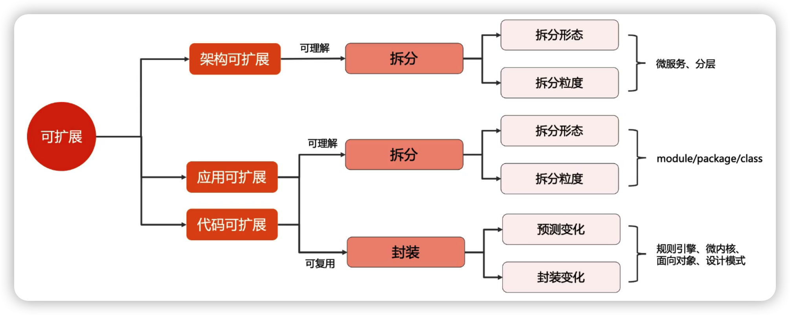
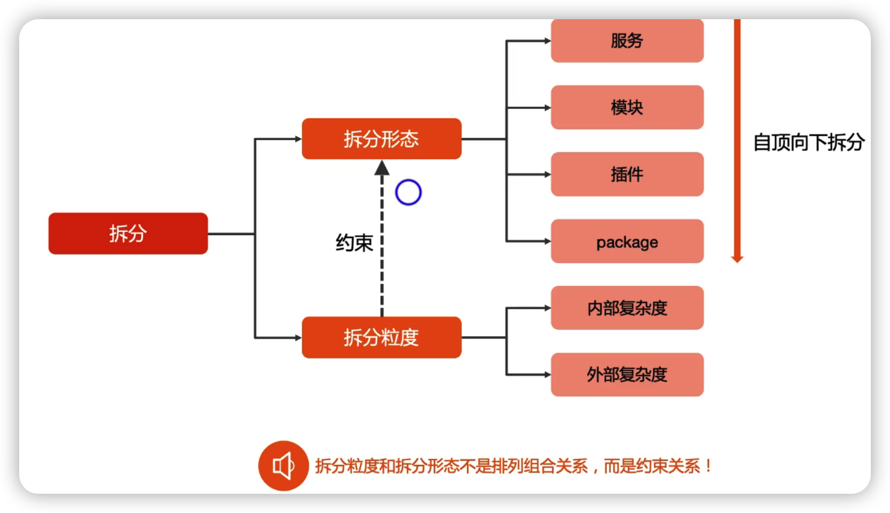
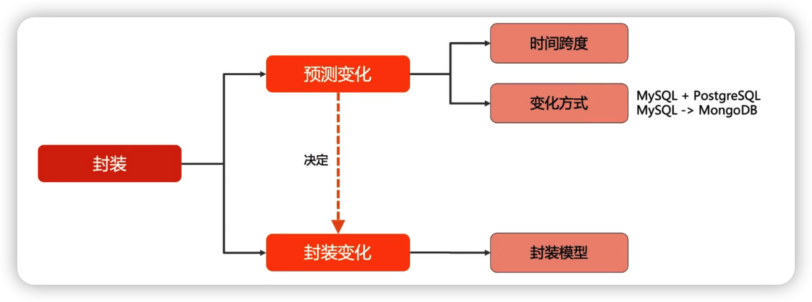
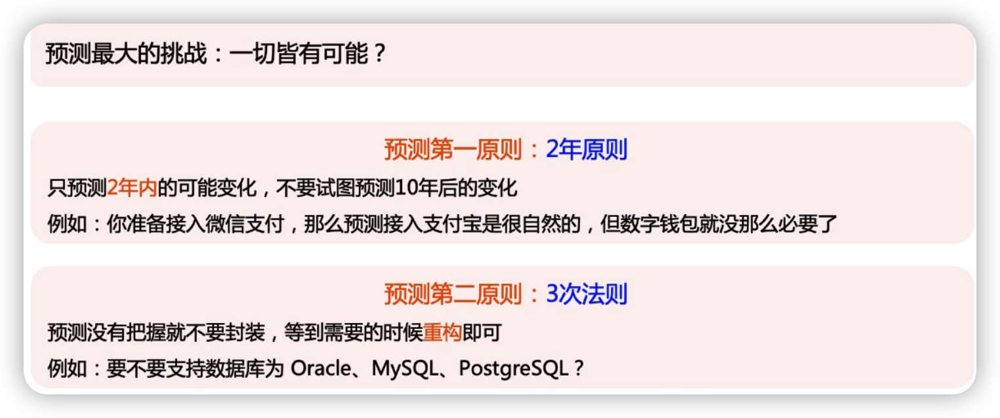
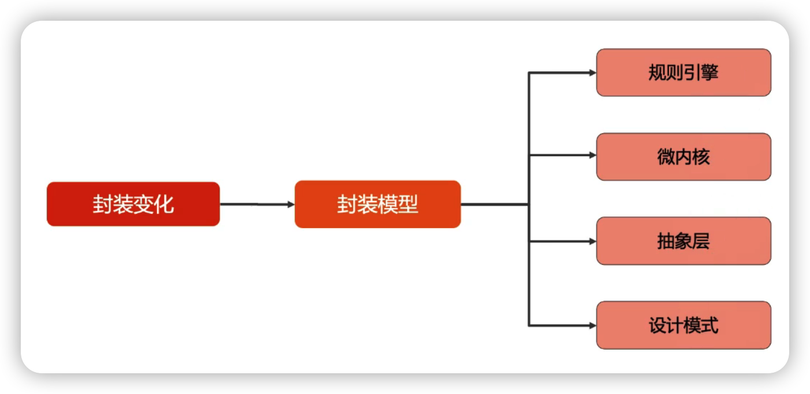
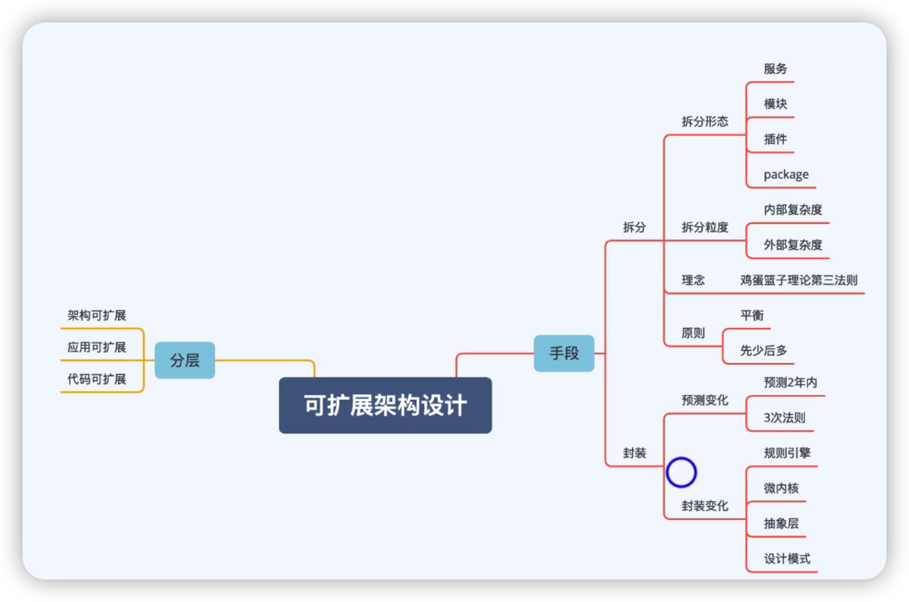

> 可扩展：系统适应变化的能力，包含**可理解**和**可复用**两个部分，它与可伸缩不是概念。
>
> 可伸缩：系统通过添加更多资源来提升性能的能力

> 鸡蛋篮子第一法则(拆分法则)：如果一个篮子数不清楚，那你就拆分成多个篮子

[TOC]

## 概念

可扩展是指系统适应变化的能力，包含**可理解**与**可复用**

可理解影响可扩展的原因：系统非常复杂，不知道改动会影响哪儿，所以不易扩展

可复用影响可扩展的原因：代码重复太多，如果需求变动需要改动的地方太多，影响可扩展的效率

## 可扩展复杂度模型

### 拆分复杂度模型

#### 拆分形态

- 服务-->拆分的微服务
- 模块-->拆分的maven模块
- 插件-->微内核的实现
- package-->代码的包层级

#### 拆分粒度

- 内部复杂度
- 外部复杂度

内部复杂度与外部复杂度是相互制衡的，内部复杂度降低，外部复杂度就会增加

##### 内部复杂度

含义：        又称单体复杂度，指单个对象内部的复杂度。传统的单体系统，所有业务都在一个系统里面

度量方式：可用来参与的**开发人员**来衡量单个拆分对象的复杂度

eg：3个人负责一个子系统比较合理，20个人在同一子系统开发，则内部复杂度过高

##### 外部复杂度

含义：        又称群体复杂度，指拆分的多个对象之间的关系复杂度

度量方式：可以用业务流程**涉及对象数量**来衡量外部复杂度

eg:  一次用户请求需要5个子系统参与是比较合理的， 如果需要20个子系统，则外部复杂度过高

#### 拆分的原则

拆分第一原则：内外平衡原则

内部和外部的复杂度是天平的两端，一端降低，一端必然升高，关键在于平衡

拆分第二原则：先粗后细原则

如果把我不准，就少拆一点，后面有问题再继续拆分

### 封装的复杂度模型

#### 如何预测

3次法则：1写2抄3封装

1--》第一次不考虑封装

2--》第二次有了类似的需求，直接抄过去

3--》第三次直接封装，重构

#### 封装的技巧

## 总结

