> ​	鸡蛋篮子第二法则：如果一个篮子装不下，用多个篮子！

[TOC]

## 高性能复杂度模型

### 单机高性能复杂度分析

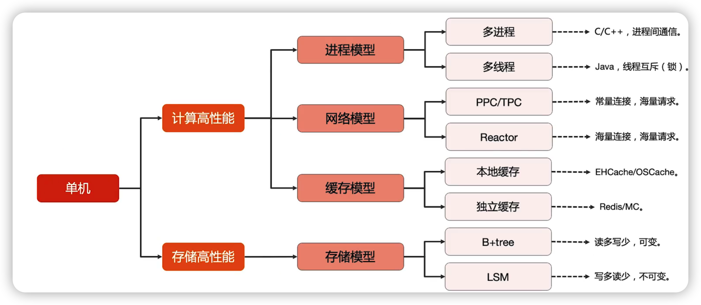

单机的高性能更多的是一些编程技巧，而不是架构设计的技巧

### 集群高性能复杂度分析

#### 鸡蛋篮子第二法则，叠加法则

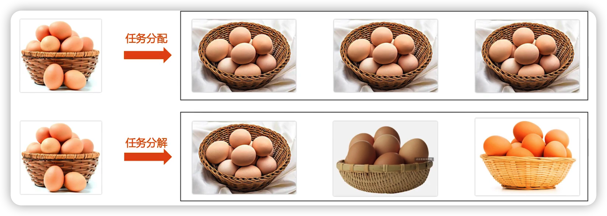

分任务分配与任务分解

#### 集群高性能 - 任务分配

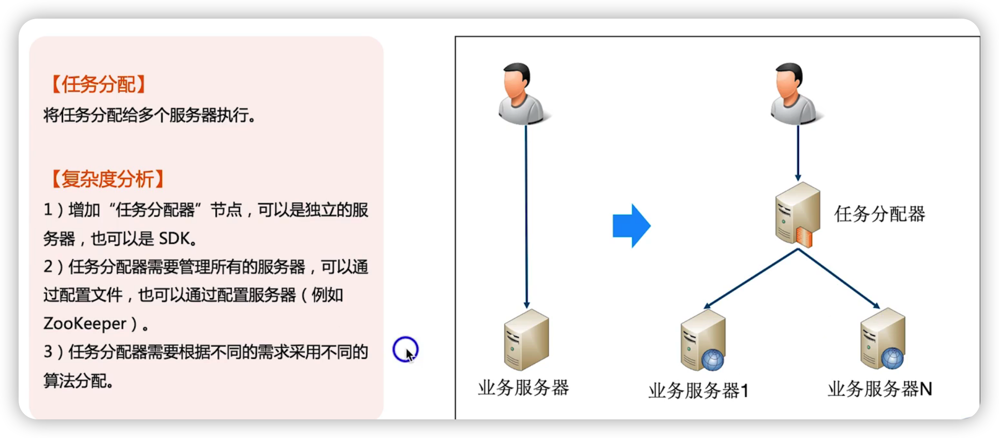

##### 任务分配器集群

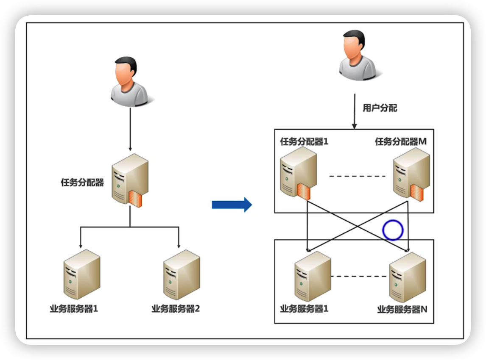

复杂度分析：任务分配器是一个集群，需要上一级的分配器

集群高性能任务分配架构设计关键点

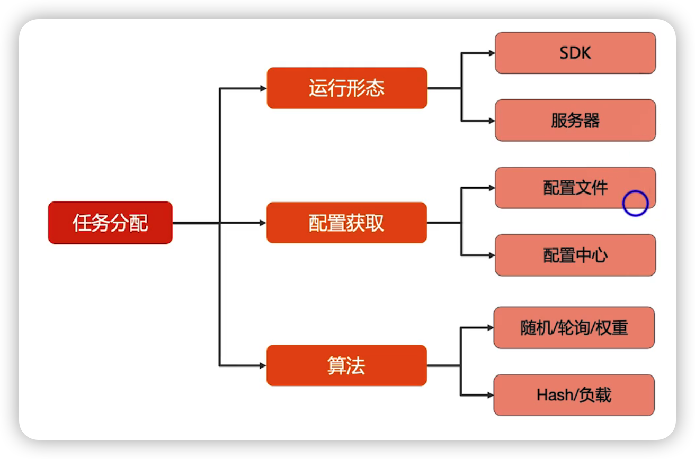

##### 任务分配的案例

DNS

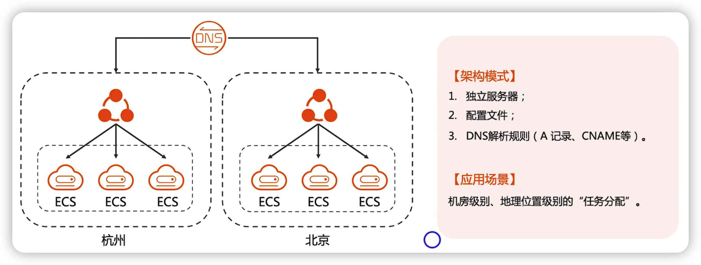

nginx

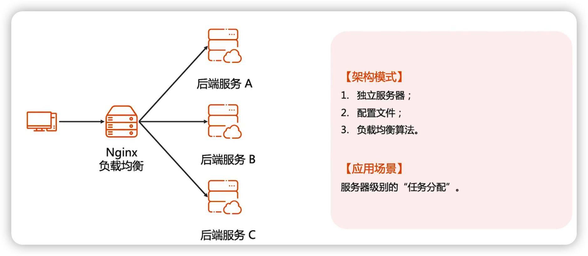

Memcached

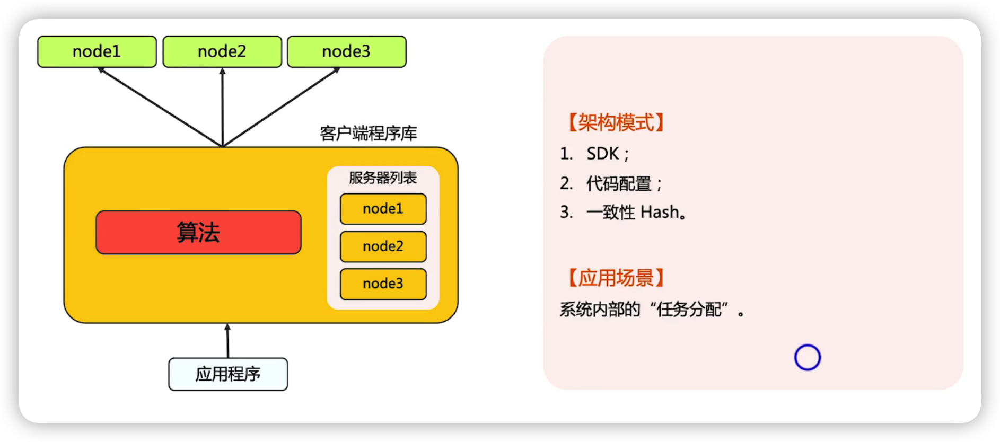

#### 集群高性能-任务分解

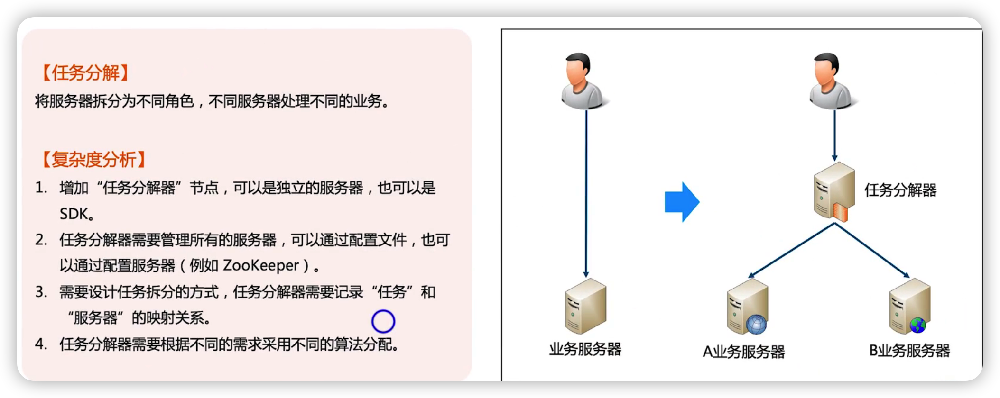

集群高性能任务分解架构设计关键点

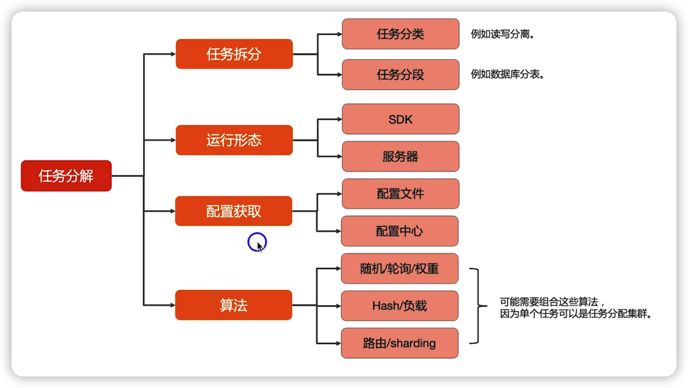

##### 任务分解的案例

微信服务的拆分

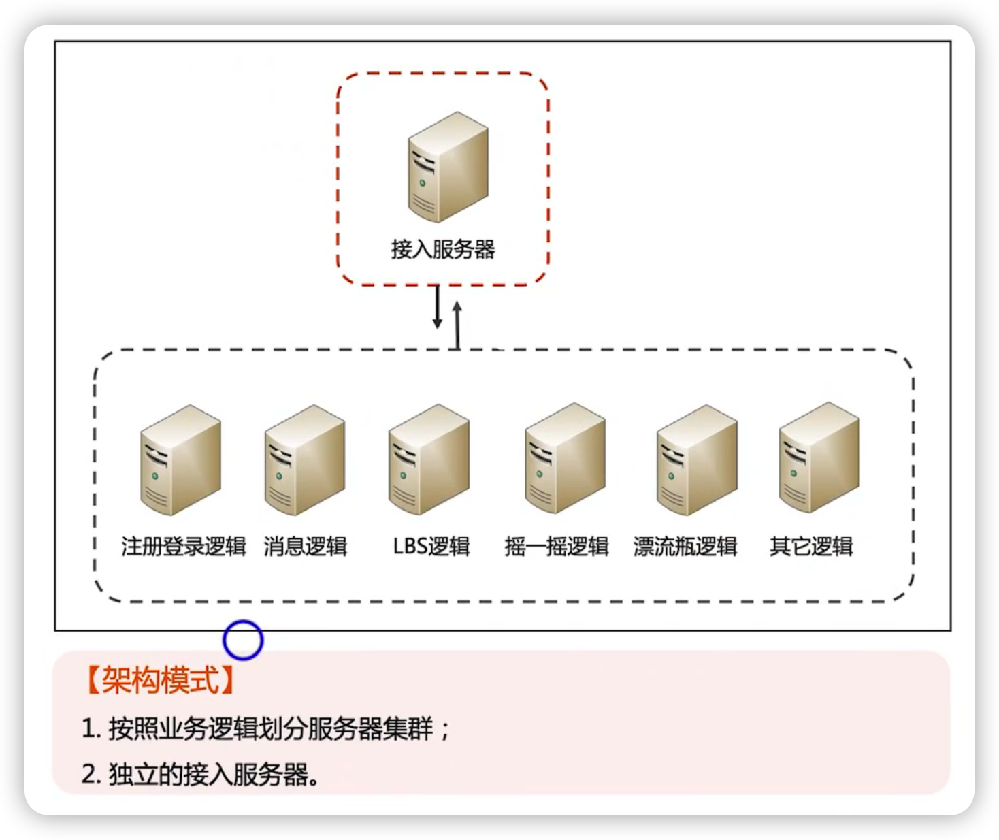

数据库读写分离

zuul

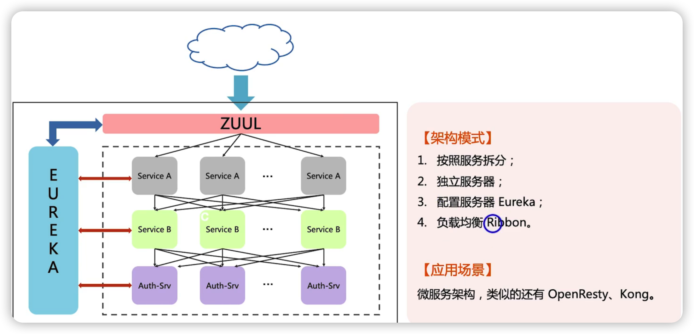

## 总结

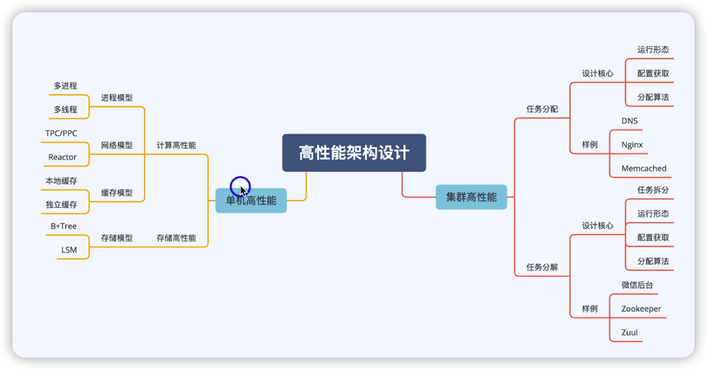

> 不管计算还是存储，分配都是指不同服务器处理相同“类型”的任务，分解就是处理不同类型的任务
>
> 判断是分配还是分解一个最简单的方法：分配是一个请求是随便发给谁都可以处理，分解是只能发给特定的服务器