> 鸡蛋篮子第三理论（冗余法则）：不要将所有鸡蛋放在一个篮子里，放在多个篮子里

[TOC]

## 高可用来源

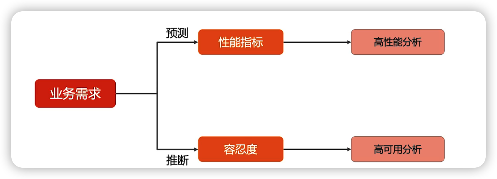

## 什么是容忍度

定义：用户能够接受的业务不可用程度，包括时长和影响

## 高可用复杂度模型

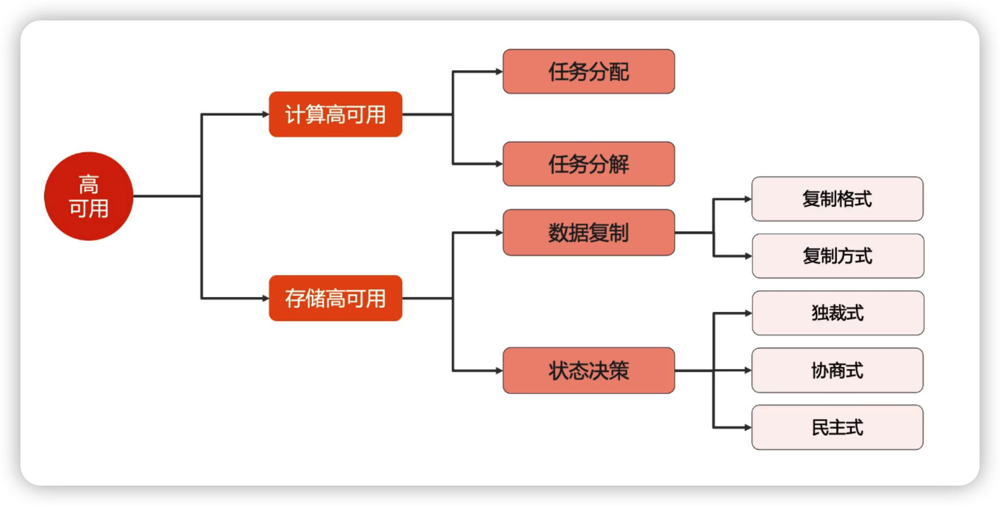

### 计算高可用-->任务分配

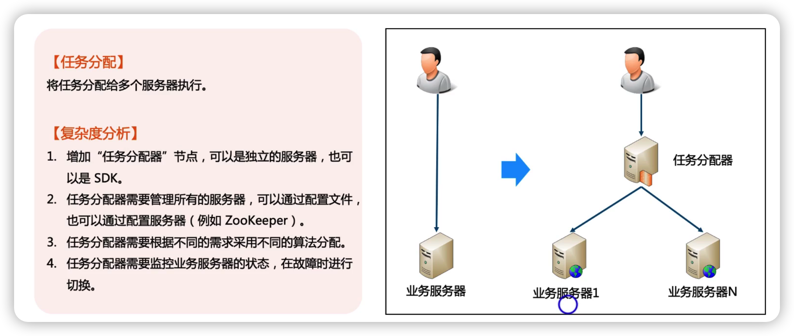

高性能任务分配考虑的是正常处理，高可用任务分配考虑的是异常处理

#### 任务分配架构设计关键点

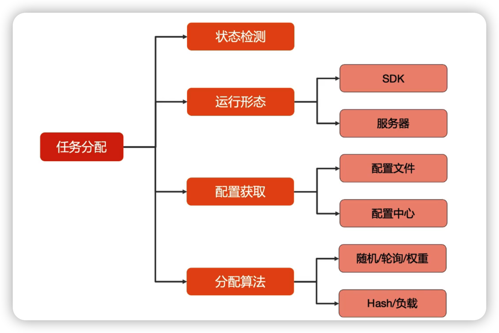

#### 任务分配案例

nginx

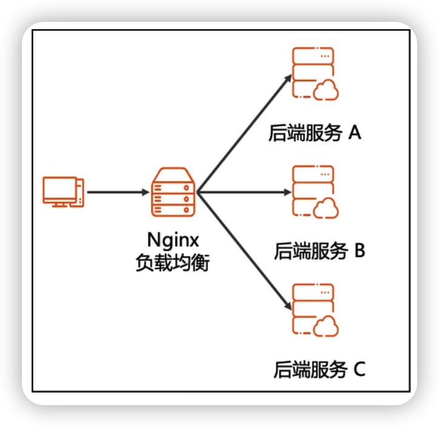

计算高性能架构不一定是计算高可用架构。

### 计算搞可用--->任务分解

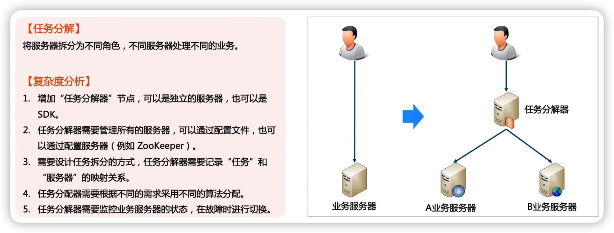

任务分解可以降低故障发生之后的影响程度

#### 任务分解架构设计关键点

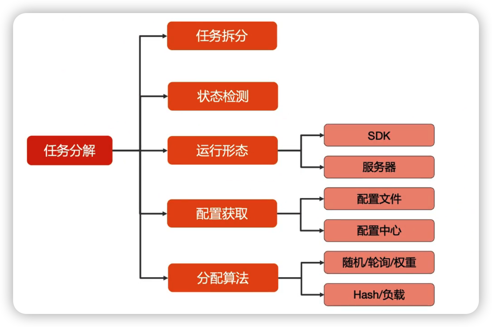

#### 任务分解案例

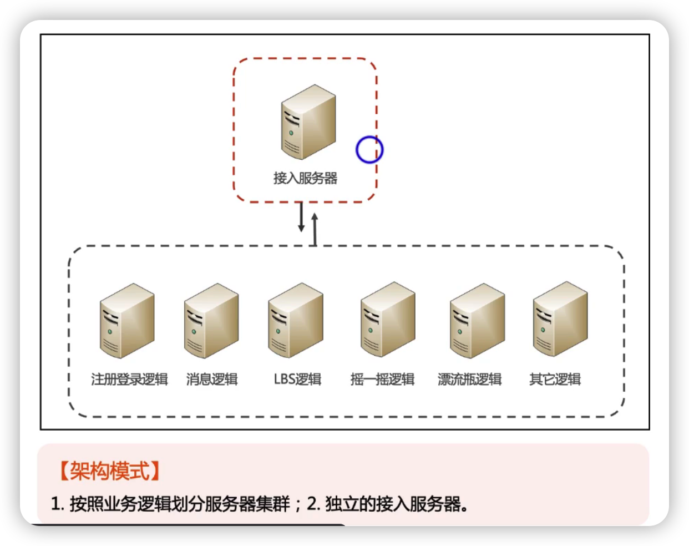

### 存储高可用复杂度模型

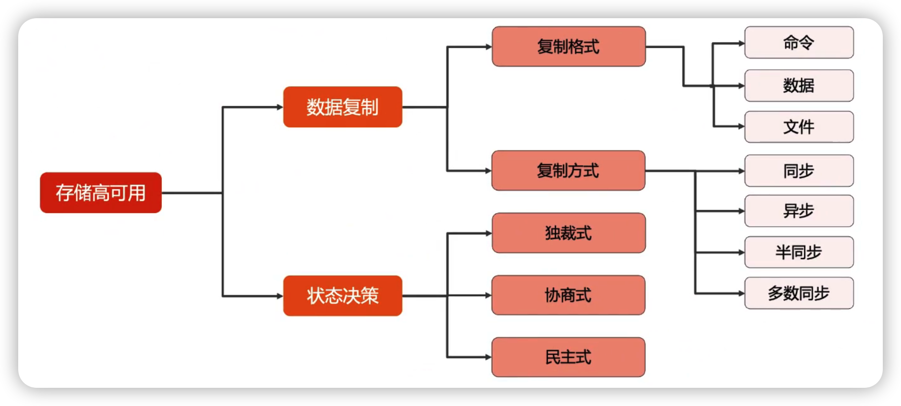

#### 存储高可用--->数据复制格式

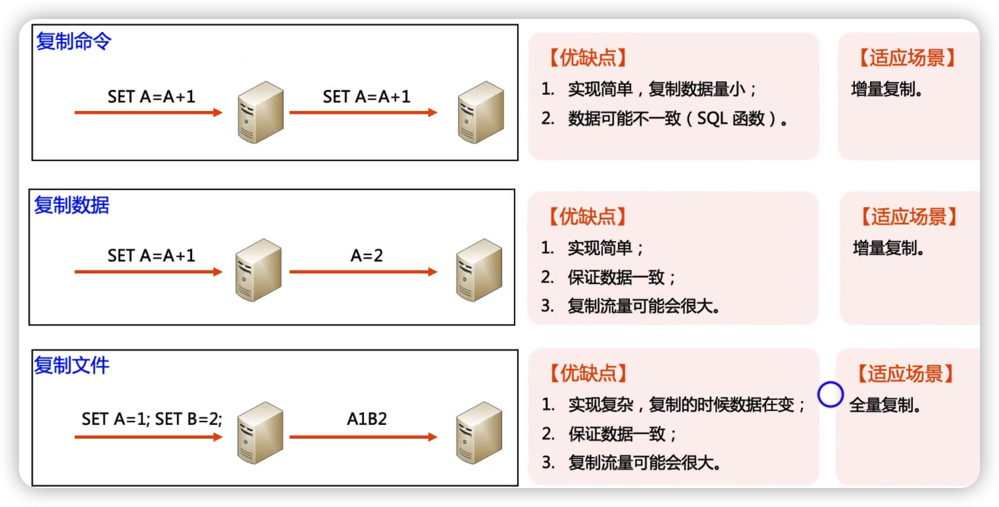

#### 存储高可用--->复制方式

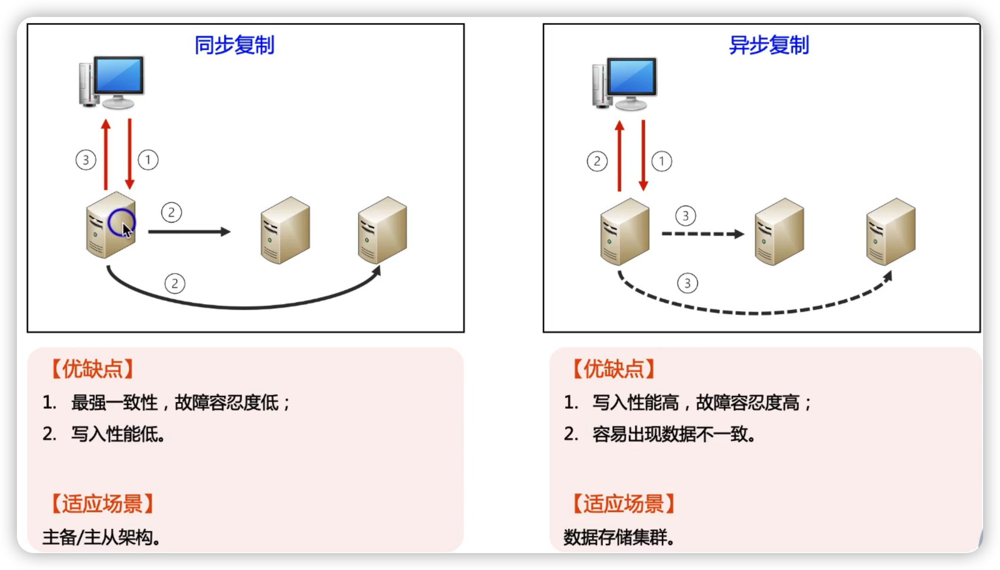

* 同步复制

  * 客户端发送一个写请求，收到这个请求的服务器先执行完，然后要同步给所有备份服务器去执行，**全部执行成功之后**，收到请求的服务器才会返回结果给客户端
  * 故障容忍度低：因为它要保证所有结点复制成功才行，如果一个结点挂了 ，那同步复制就不能运行了
  * 写入性能低：一个服务器写入变成多个服务器写入

* 异步赋值

  * 客户端发送一个写请求，收到这个请求的服务器先执行完，然后直接返回给客户端，最后才去异步的去同步给所有备份服务器。
  * 故障容忍度高：有一个备份服务器写失败了，不影响整体
  * 数据不一致：有的服务器写成功了，有的服务器写失败了

  同步复制是指要么全部成功

  异步复制是值要么全部不成功	

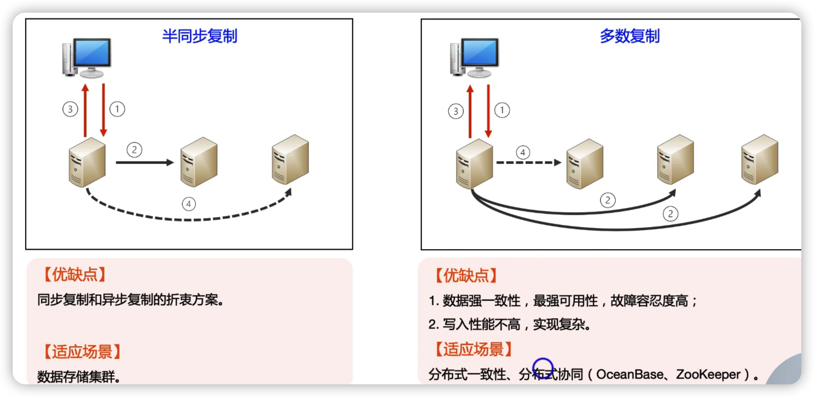

- 半同步复制
  - 服务器收到请求之后，它先挑选其中一个服务器进行复制，只要这个服务器成功了，它就给客户端返回成功，然后它再把这个数据通过异步的方式复制给其他服务器
- 多数复制
  - 服务器收到请求之后，它需要把数据复制到多数的服务器，只要这些多数服务器复制成功之后，它才认为这个写请求是成功的，剩下的服务器通过异步的方式复制过去

#### 存储高可用案例

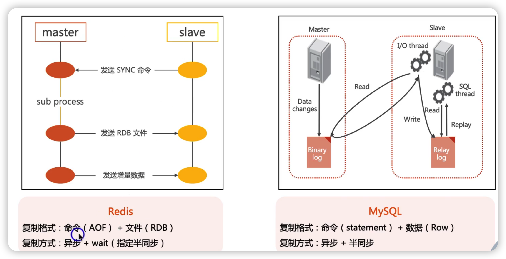

#### 存储高可用--->状态决策

独裁式

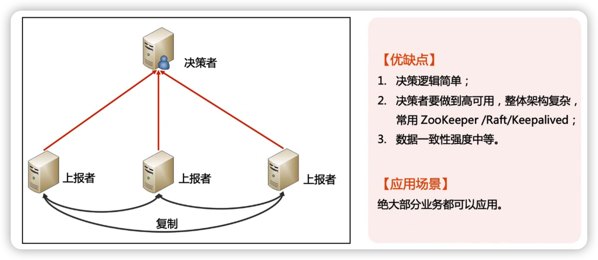

数据一致性强度中等，因为上报者之间的数据复制没有很强的一致性算法来保证数据一致性

协商式

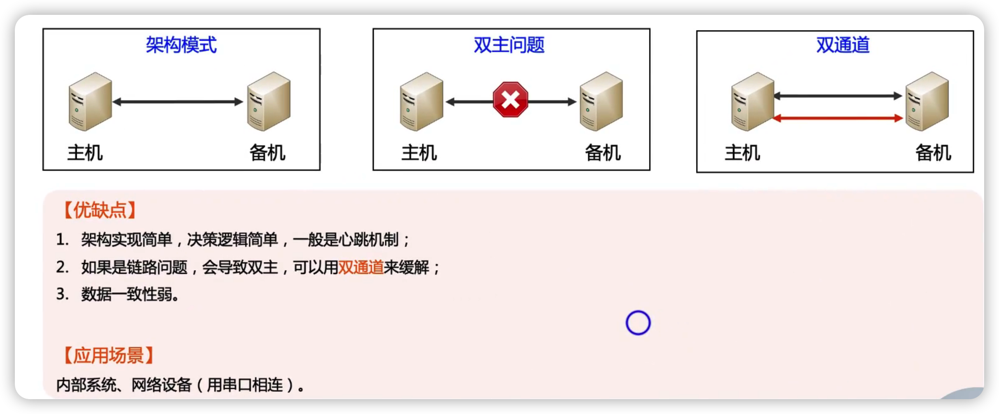

数据一致性弱：因为互相复制的时候有可能导致数据复制失败或者数据覆盖

民主式

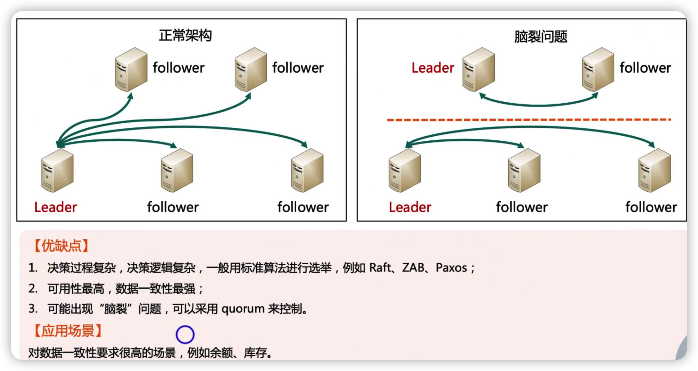

#### 存储高可用状态决策案例

独裁式

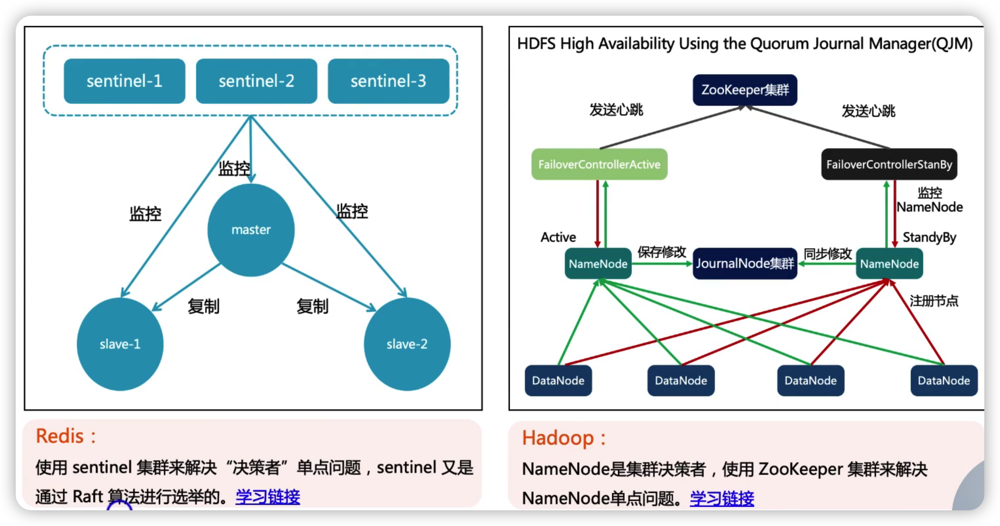

民主式集群

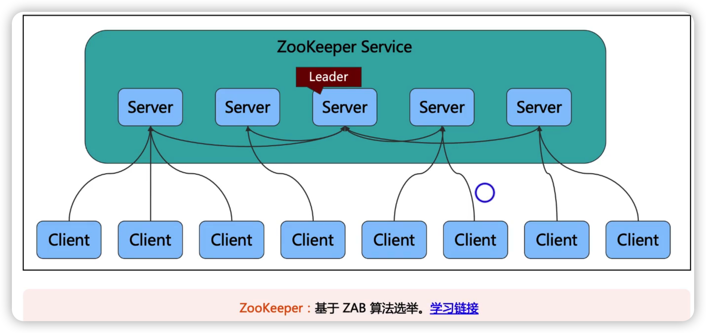

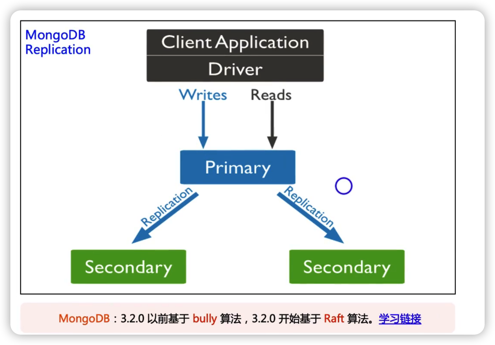

## 总结

