[TOC]

> 加机器是综合成本最低的架构设计方式
>
> 宁愿花费机器的一分钟，也不愿花费程序员的一秒钟

## 低成本

### 本质

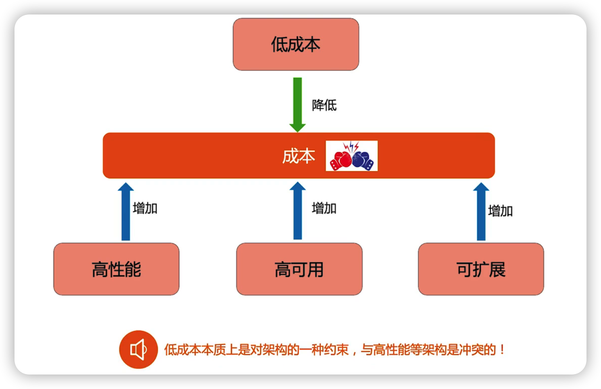

### 手段/应用

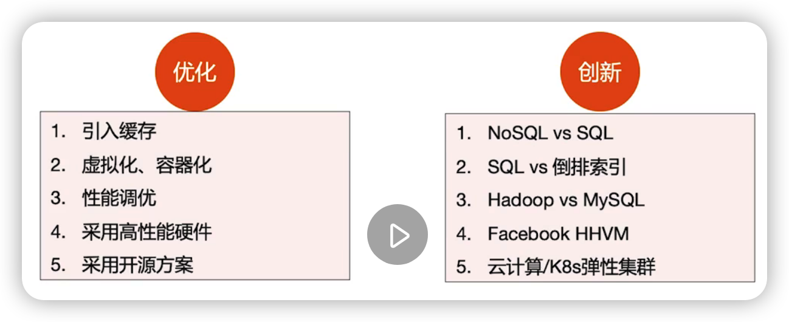

### 应用场景

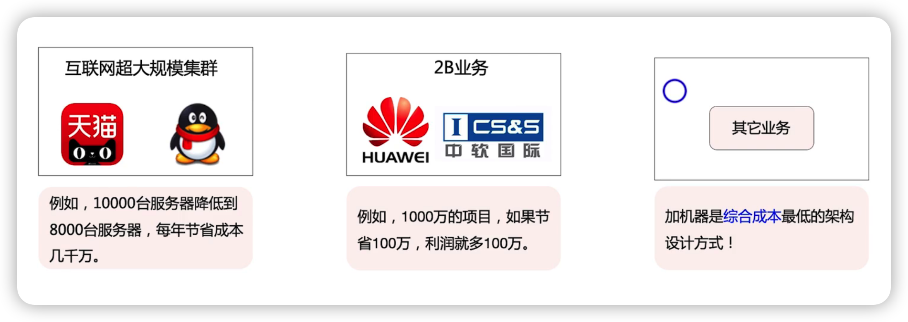

## 安全性

### 本质

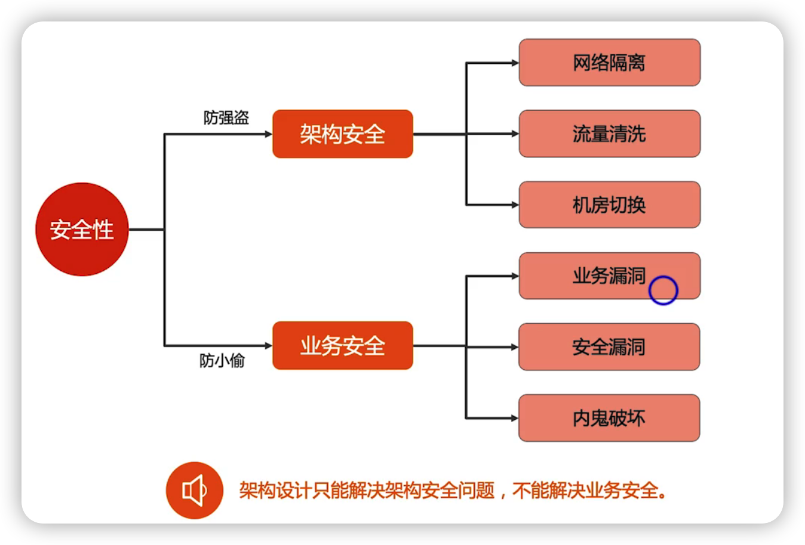

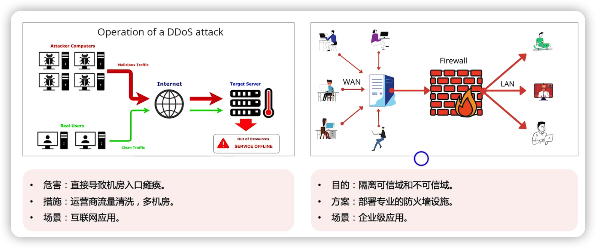

为什么你的架构对ddos攻击无能为力

因为ddos攻击最大的危害不是将你的服务器搞宕机，而是它将你的的流量带宽占满了，它的流量都没有到你的服务器来，所以架构做不了太多的事

### 业务安全

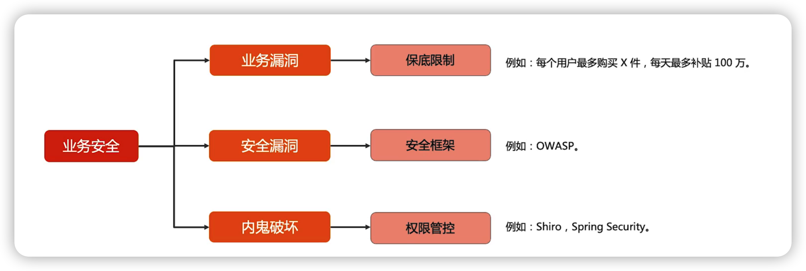

## 质量属性复杂度

### 可观测性/可维护性/可测试性

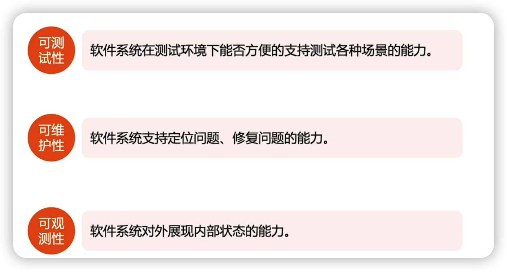

可观测性是可测试性/可维护性的基础

#### 可测试性

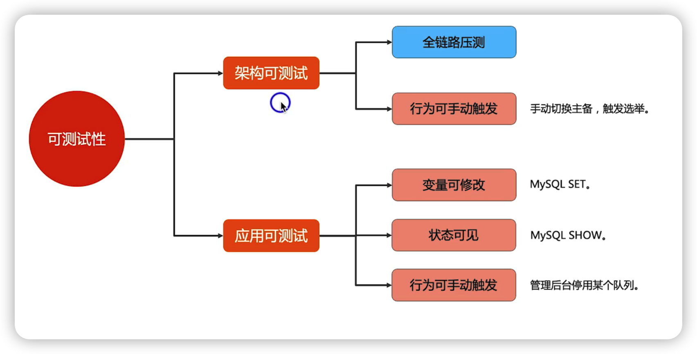

#### 可维护性

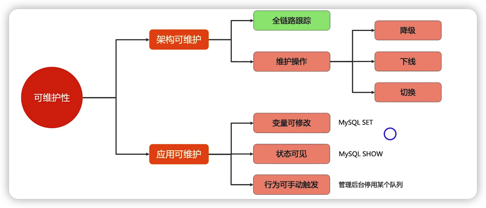

#### 可观察性

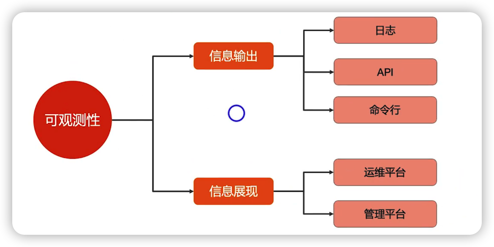

## 如何设计更好的架构

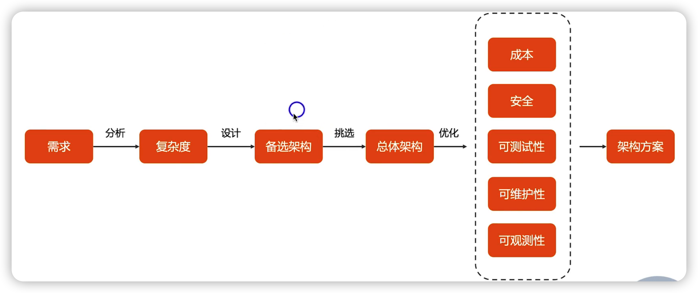

## 总结

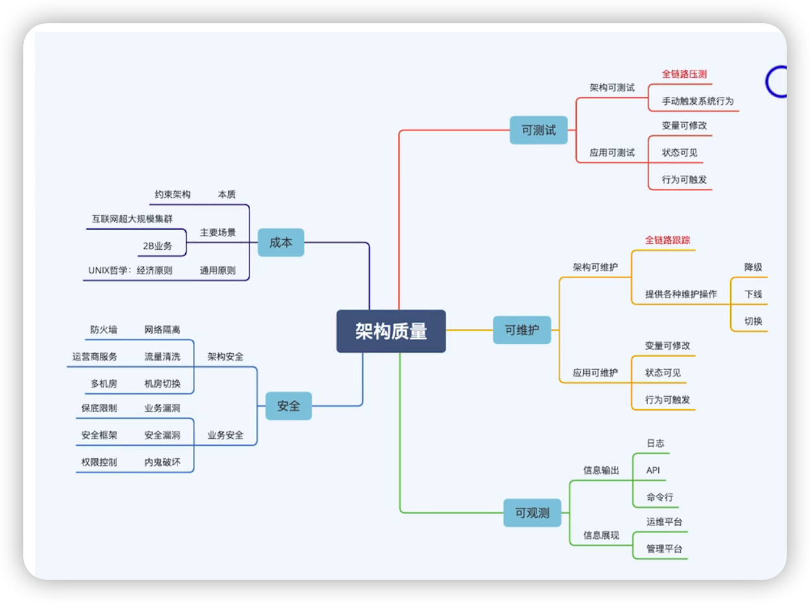

