[TOC]

## 缓存与缓冲

### 缓存

缓存指位于速度相差较大的两种硬件之间，用于协调两者数据传输速度差异的结构，均可称之为Cache

### 缓冲

缓冲指临时存储区域，保存将要从一个设备(或者系统)传输到另一个设备(或系统)的数据

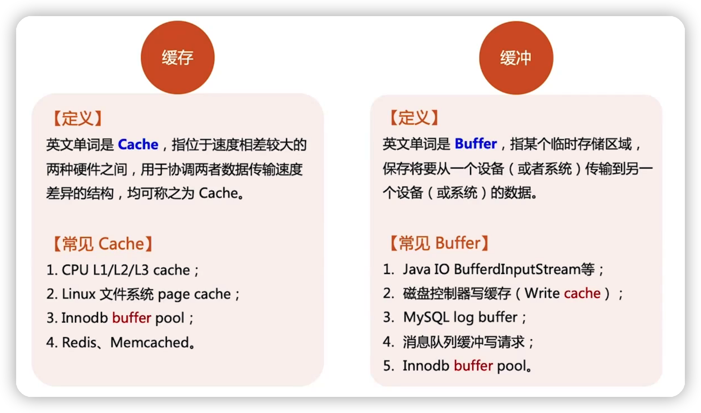

## 缓存的技术本质

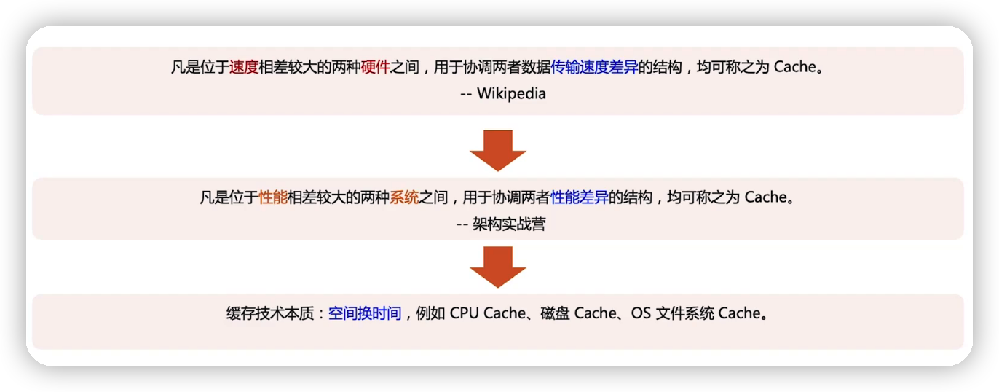

缓存是高性能的计算架构

## 缓存的设计框架--3W1H

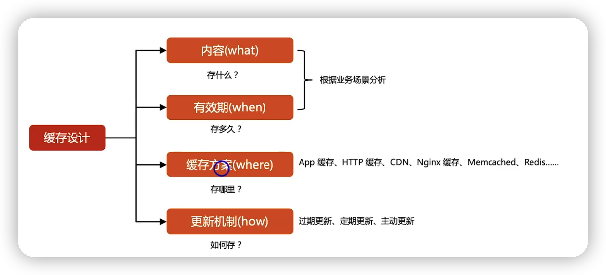

#### 更新机制

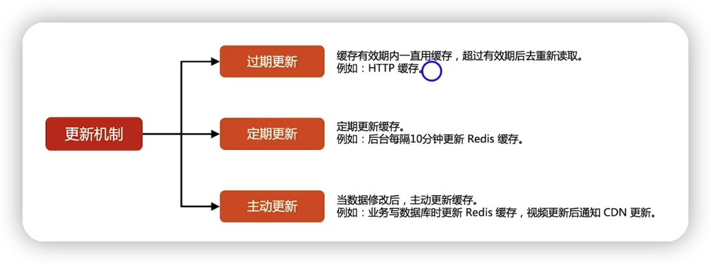

 ## 多级缓存架构模式

### 五级缓存架构

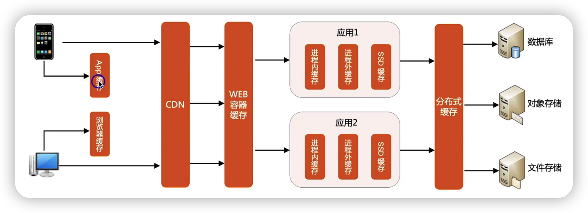

### 四级缓存架构

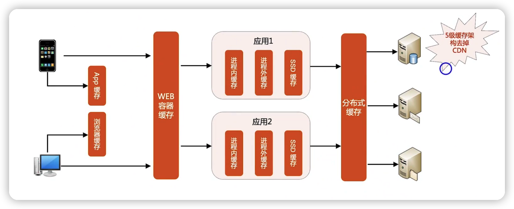

### 三级缓存架构

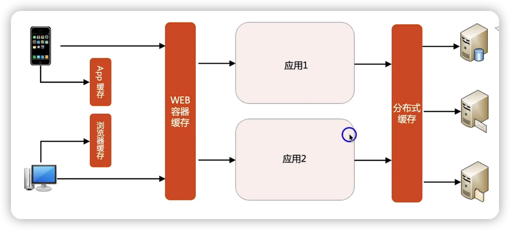

## 缓存的分类

### 本地缓存

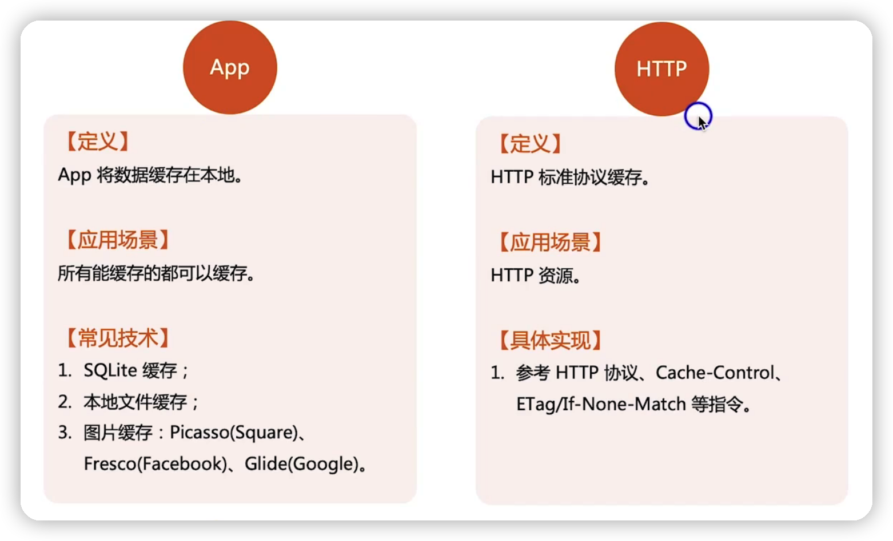

### CDN缓存

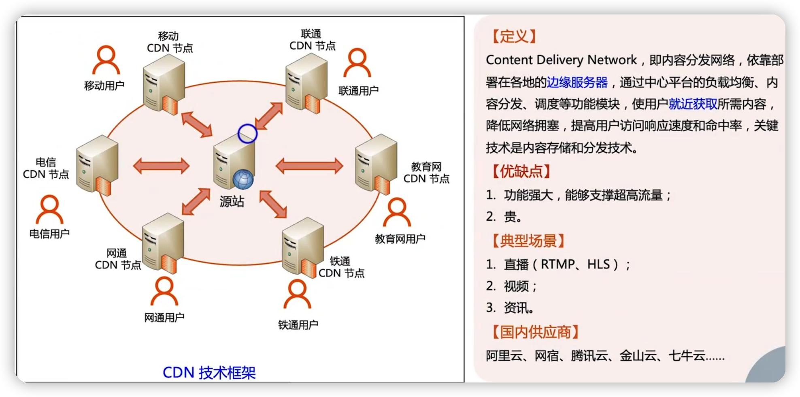

### web容器缓存

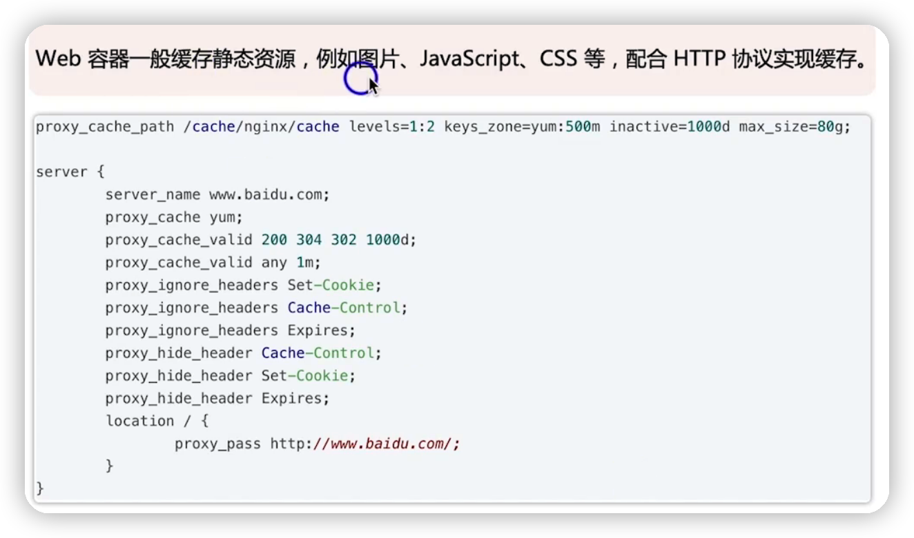

### 应用缓存/分布式缓存

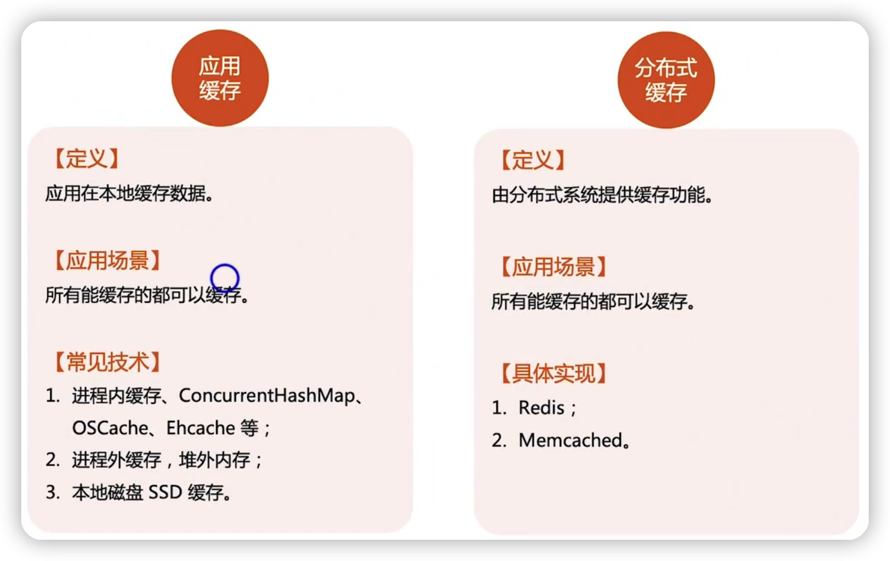

## redis VS memcached

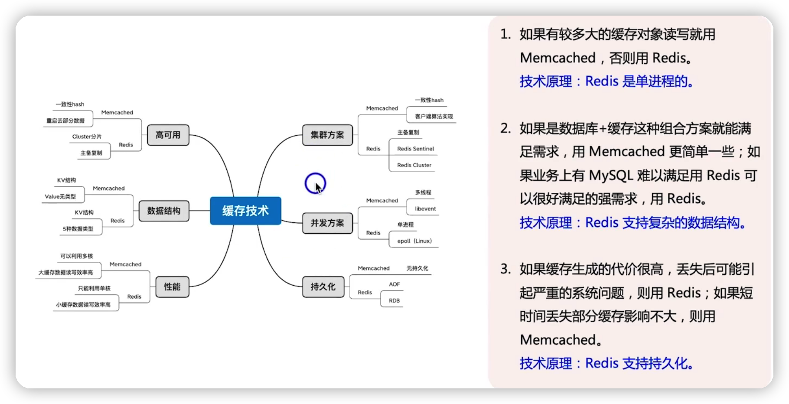

## 总结

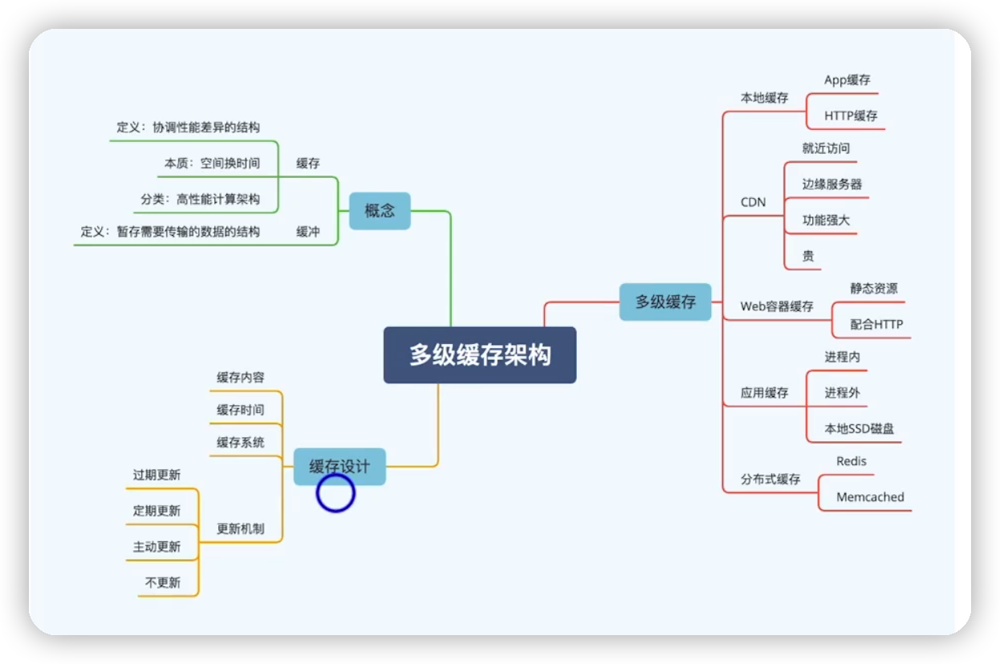