## 分布式缓存架构模式

### 数据缓存

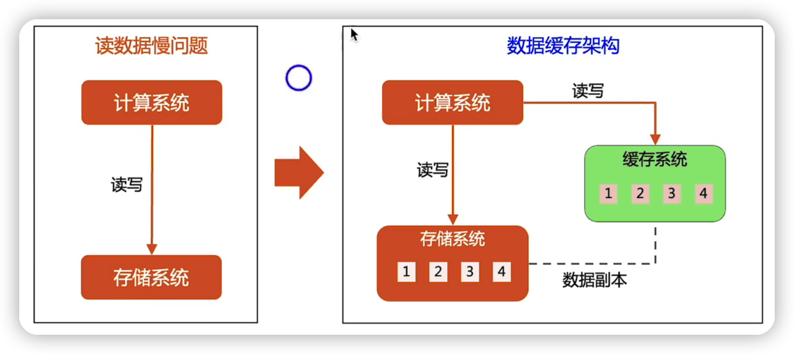

设计核心：用什么缓存系统、如何应对数据一致性挑战

应用场景：实时性要求较高的业务，读多写少的场景，例如，微博浏览

redis做缓存用持久化，带来了什么风险：

如果redis持久化了数据，然后当redis挂了，这好这部分数据在业务数据库做了更新，因为redis挂了，没办法更新redis。

而当redis重新启动之后，它是没办法更新这些数据的，就会造成数据不一致的问题。

### 结果缓存

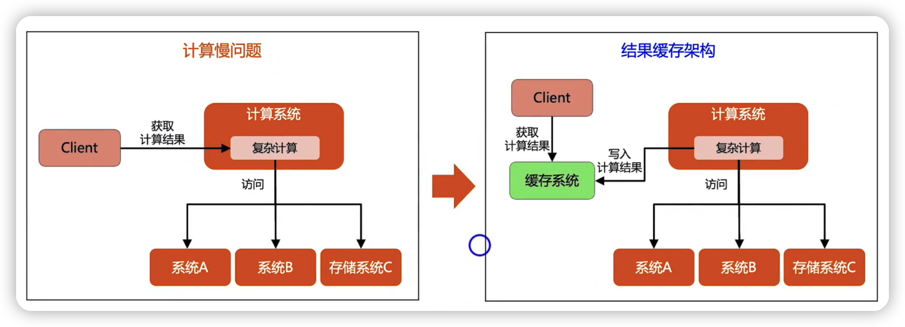

设计核心：用什么缓存系统、缓存有效期与结果新鲜度的平衡

应用场景：计算量大但实时性要求不高的业务场景，例如 推荐、热榜、排行榜、分页

## 分布式缓存架构设计思路

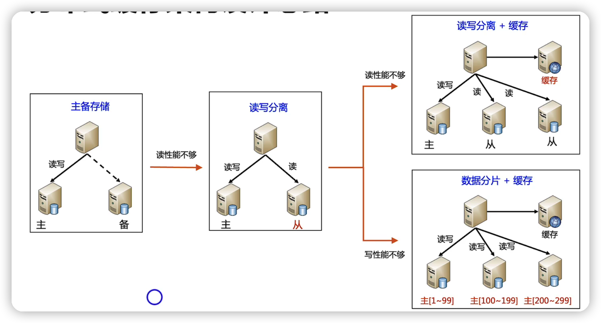

## 数据缓存架构的一致性复杂度

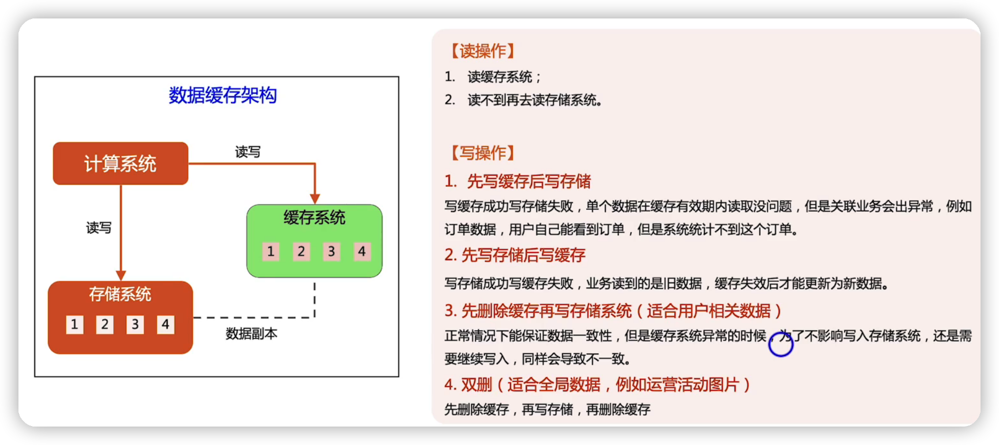

### 数据缓存一致性复杂度解决方案

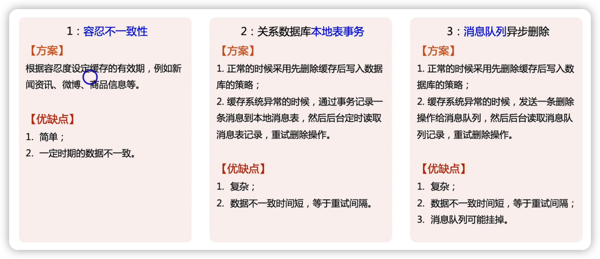

## 缓存架构的三类问题

- 缓存穿透--->缓存里面没有数据
- 缓存雪崩--->缓存失效引起的雪崩效应
- 缓存热点--->部分缓存访问超高

### 缓存穿透

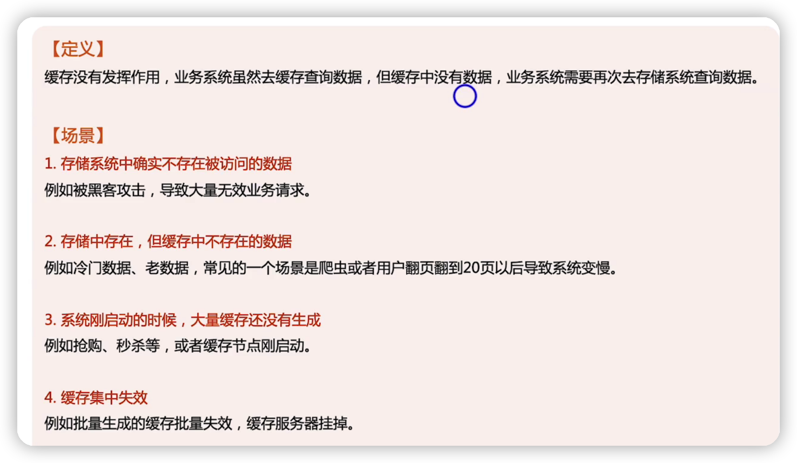

#### 缓存穿透的应对方法

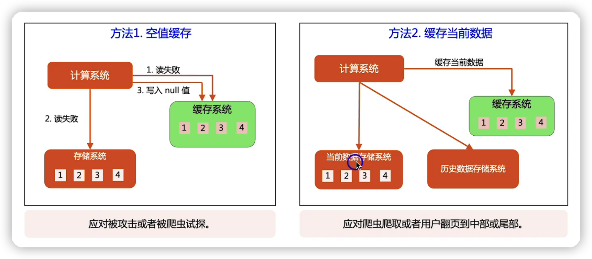

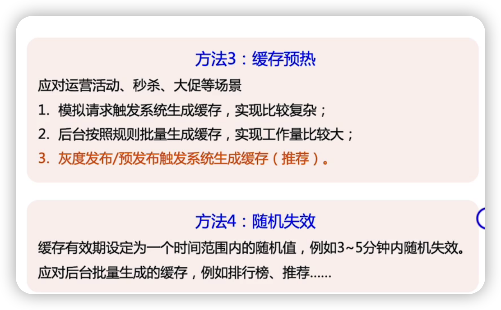

### 缓存雪崩

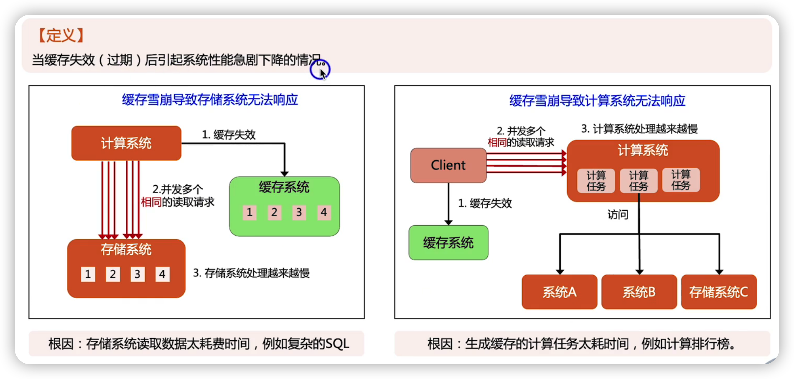

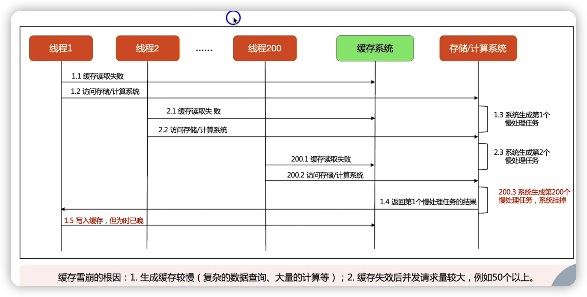

#### 缓存雪崩的应对方法

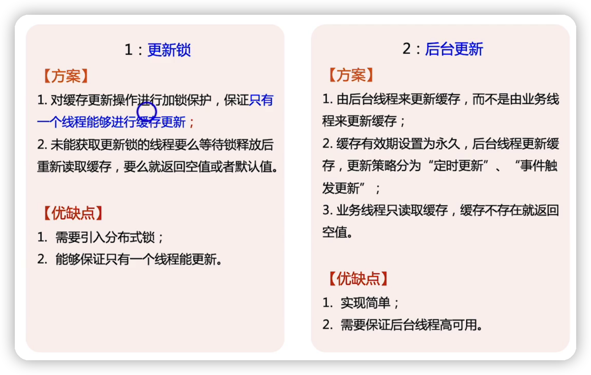

#### 缓存穿透与雪崩区别

缓存穿透是大量缓存失效，引起系统的性能相关的问题

缓存雪崩并不是大量缓存失效，可能是一两个缓存失效，就可以把存储系统拖垮 

### 缓存热点

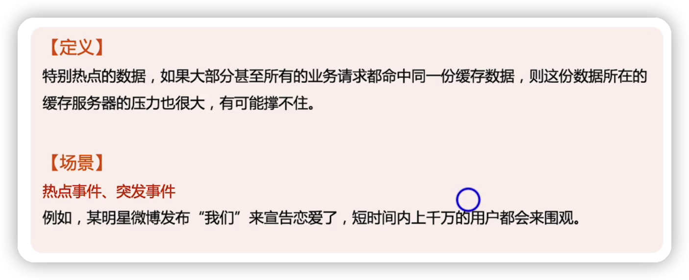

#### 缓存热点的应对方法

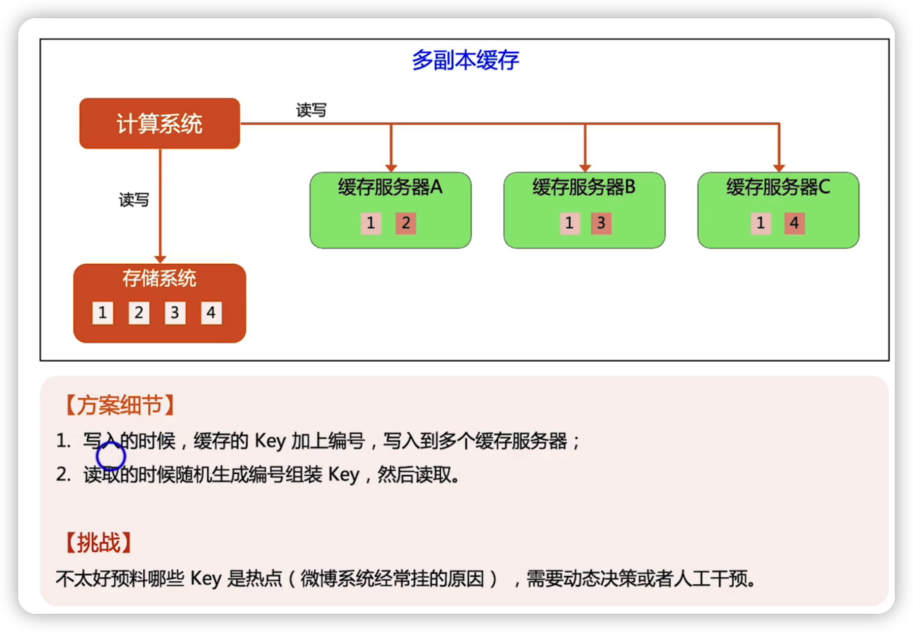

## 总结

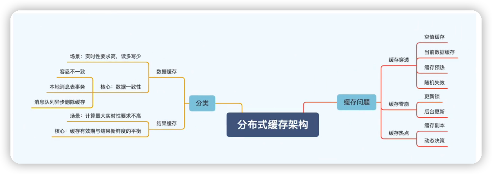