## 多级负载架构-->4级负载架构

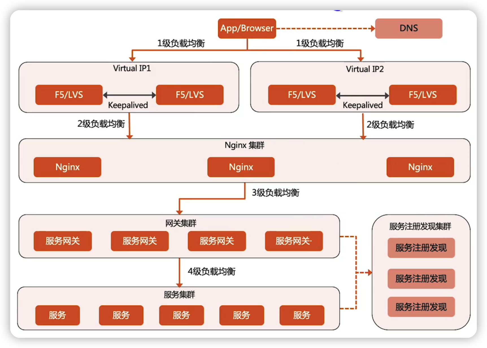

## 3级负载均衡架构

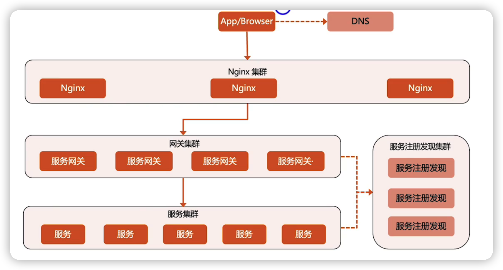

## 2级负载均衡架构

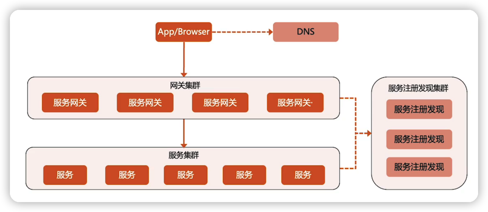

### DNS

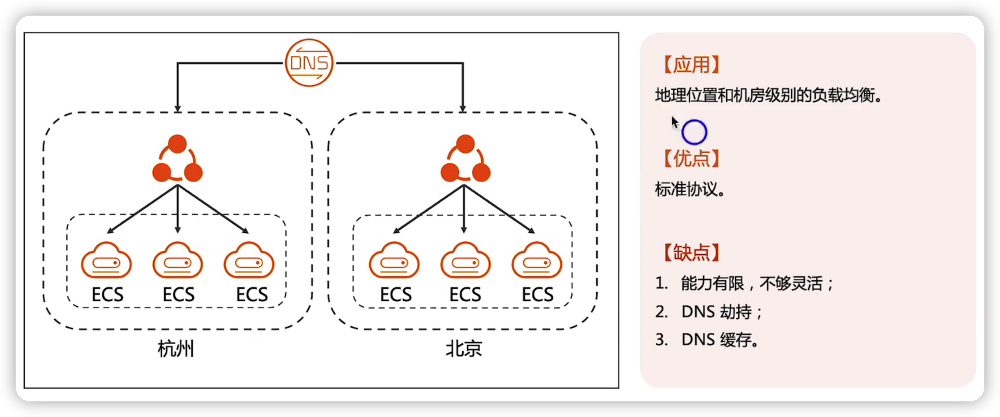

### HTTP-DNS

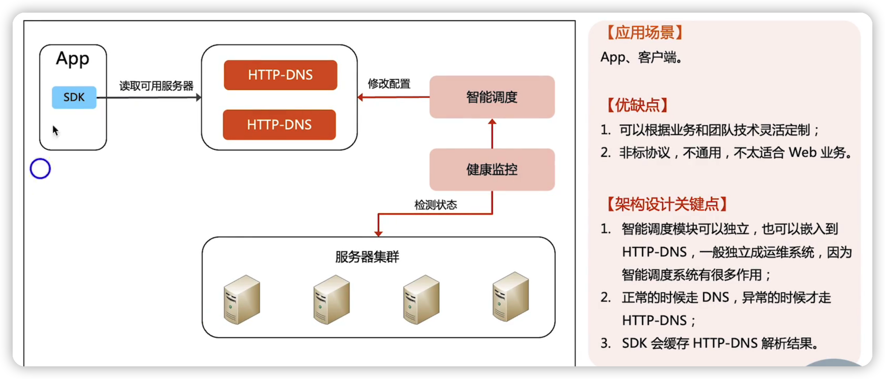

## GSLB

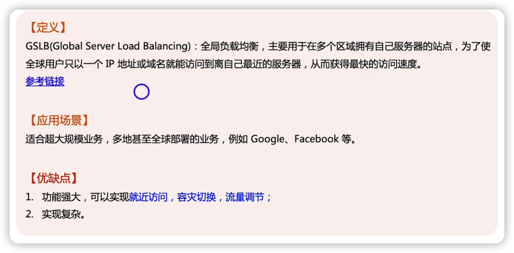

#### 基于DNS的GSLB

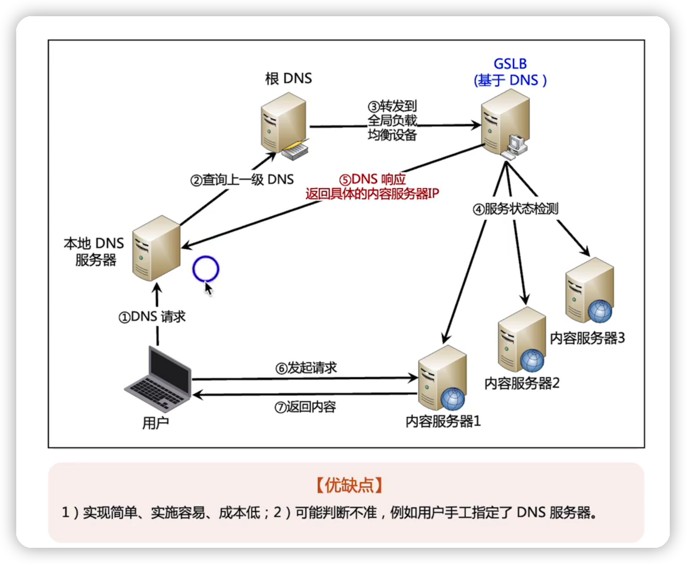

#### 基于HTTP redirect的GSLB

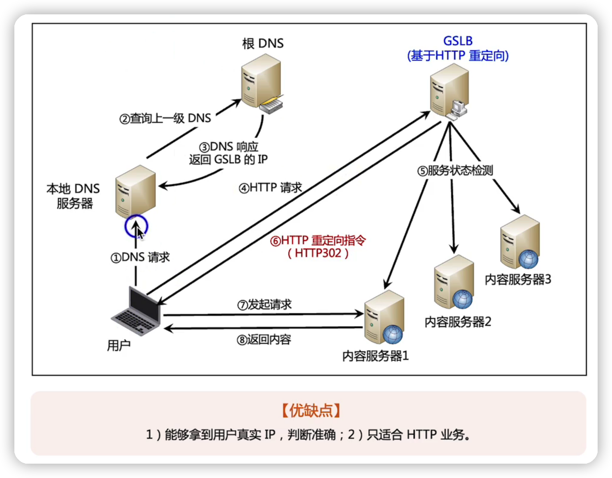

#### 基于IP欺骗的GSLB

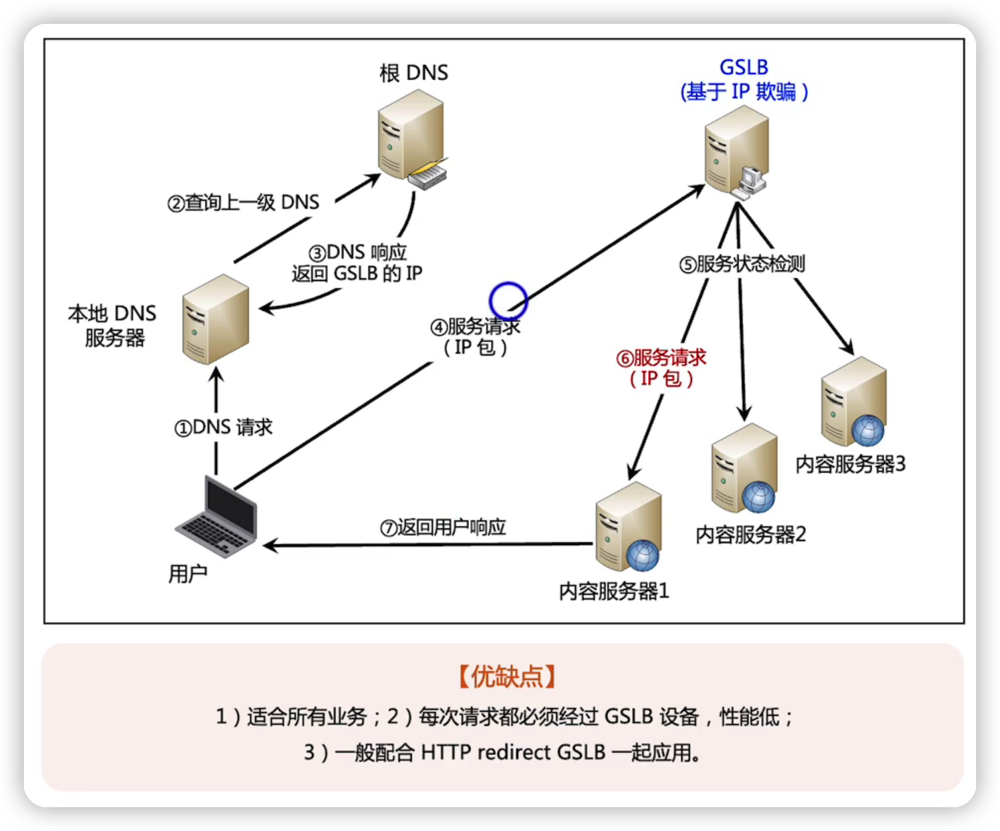

## F5

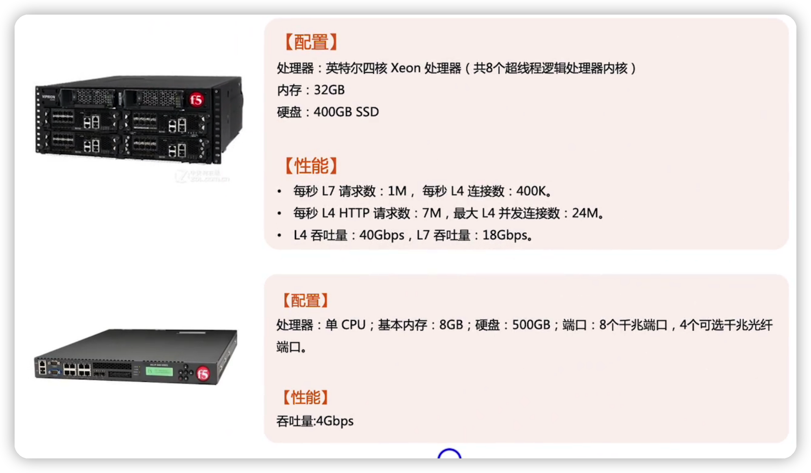

## LVS

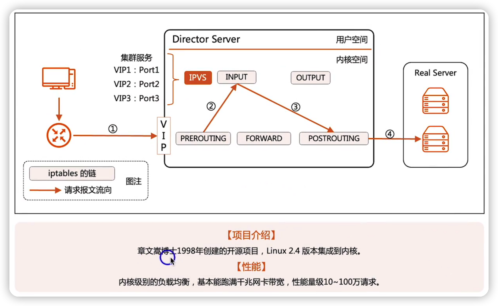

#### LVS-NAT

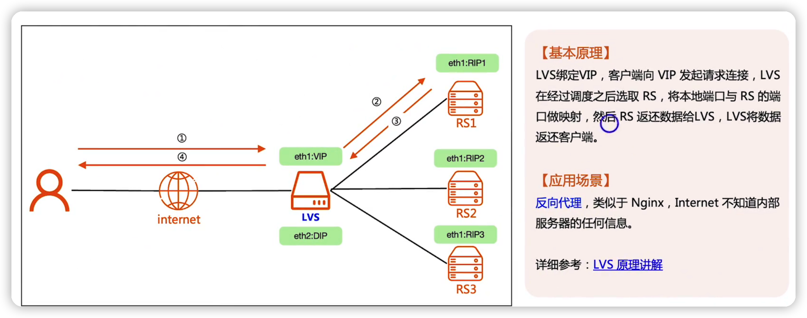

#### LVS-DR

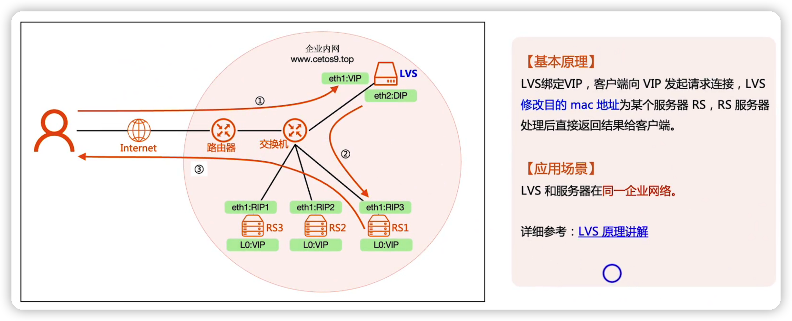

#### LVS-TUN

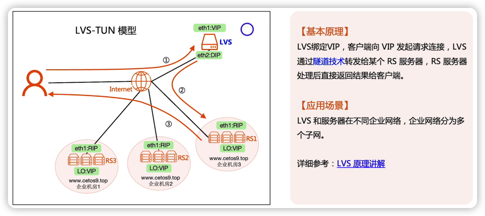

## F5/LVS/NGINX性能对比

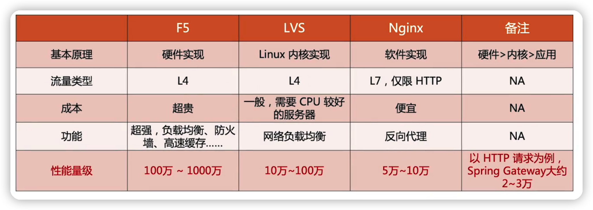

## 总结

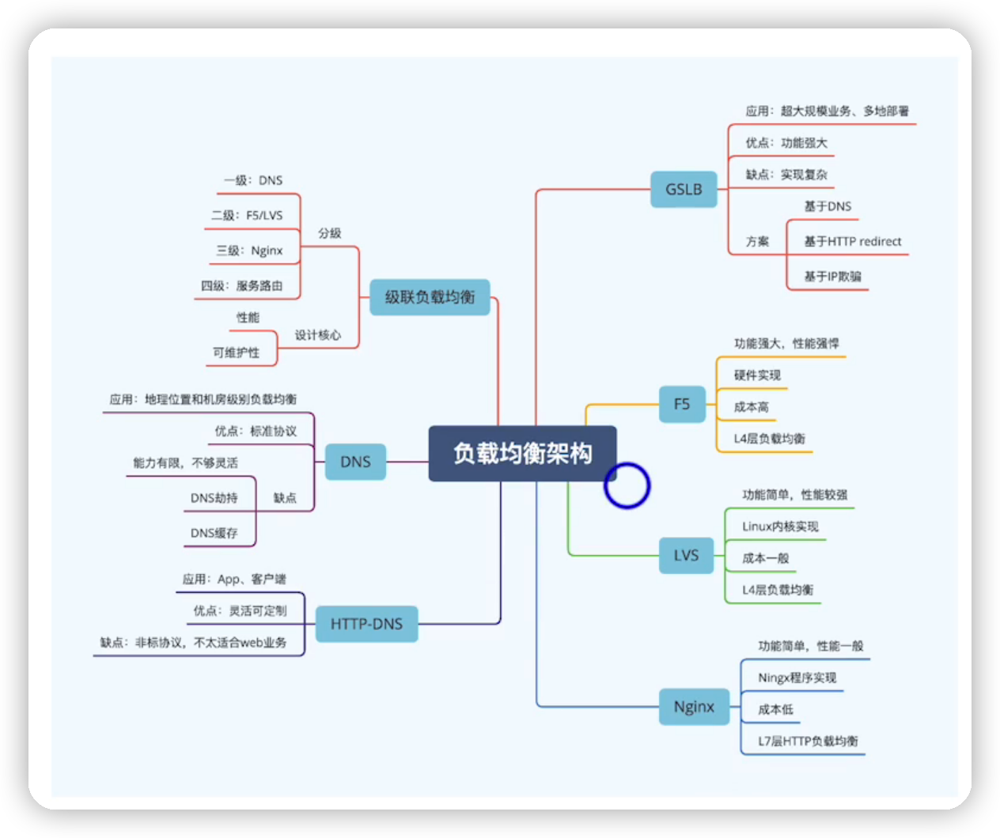