## 轮询& 随机

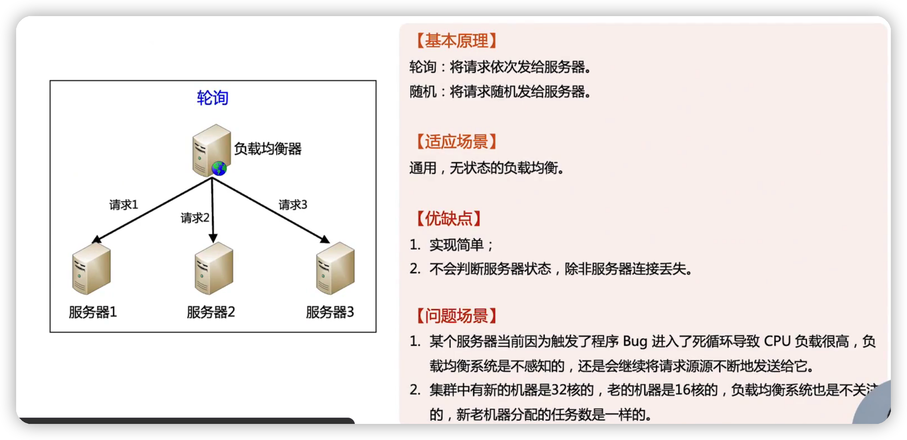

## 加权轮询

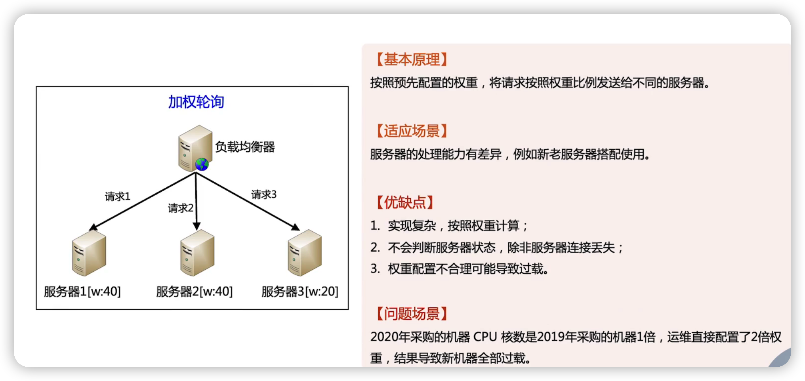

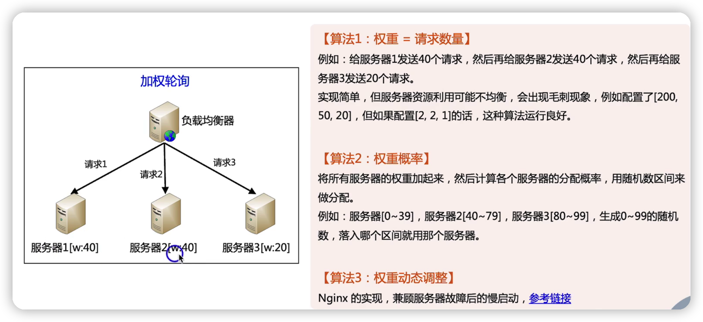

## 负载优先

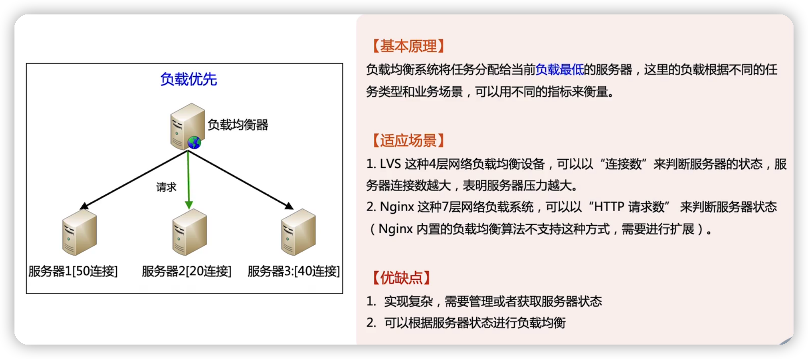

## 性能优先

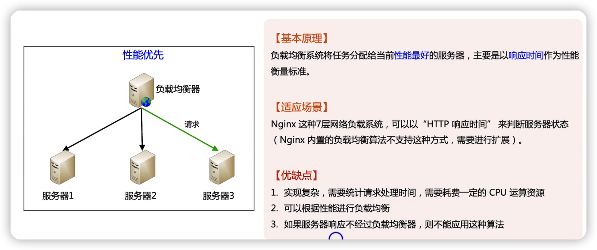

## hash

## nginx

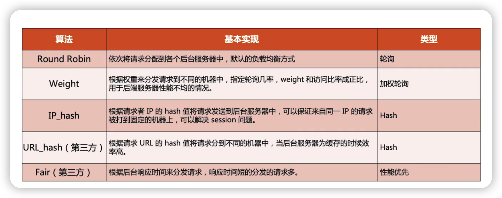

## LVS

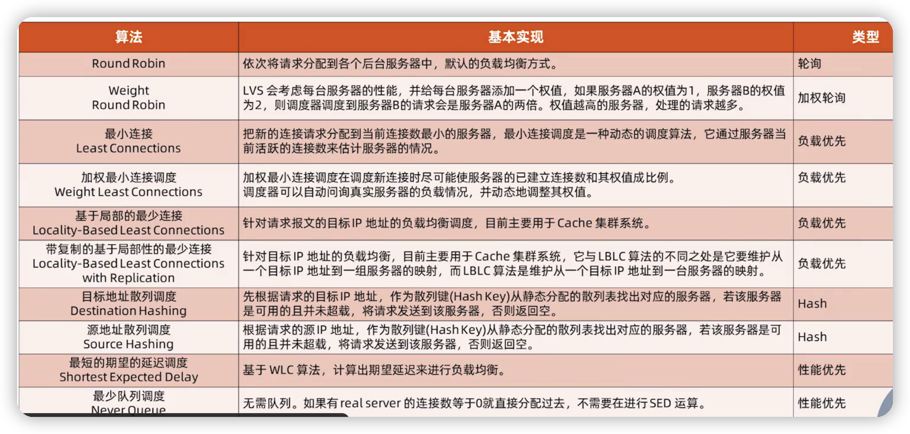

## 业务级别的负载均衡算法

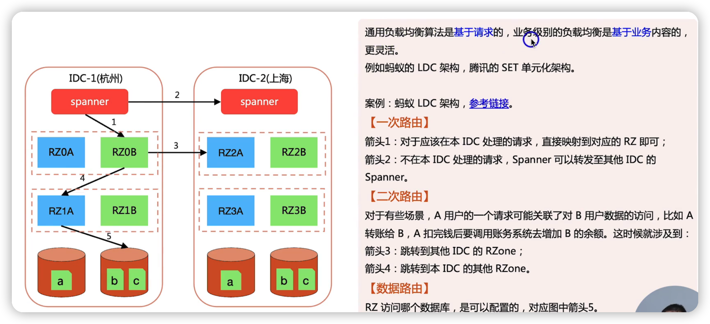

### 业务级别负载均衡技巧--cooke

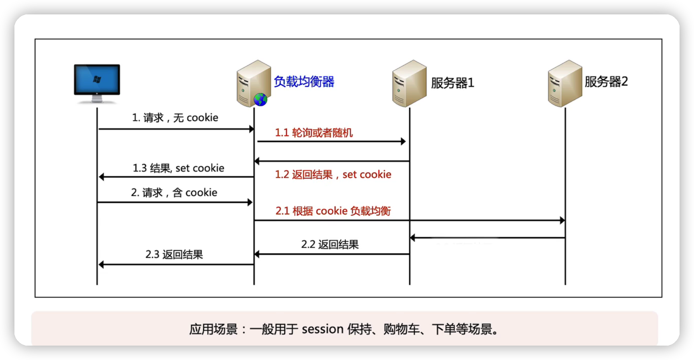

### 业务级别负载均衡技巧--自定义http header

### 业务级别负载均衡技巧--自定义http query string

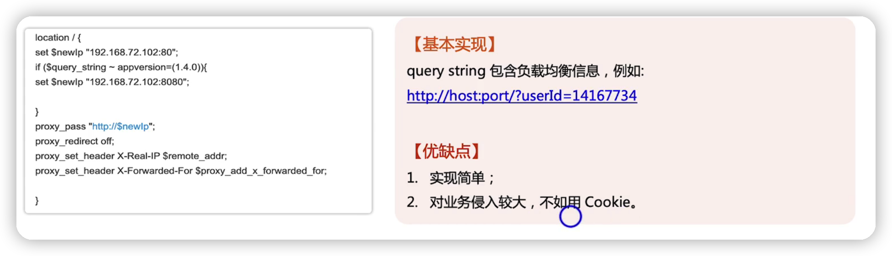

### 业务级别负载均衡技巧--评估服务器性能

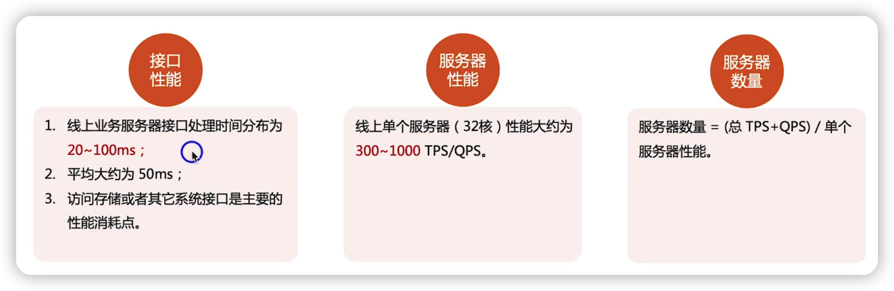

## 总结

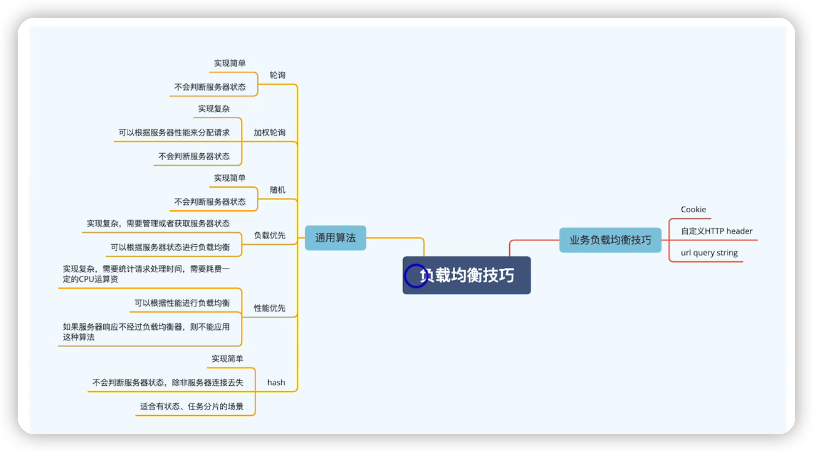