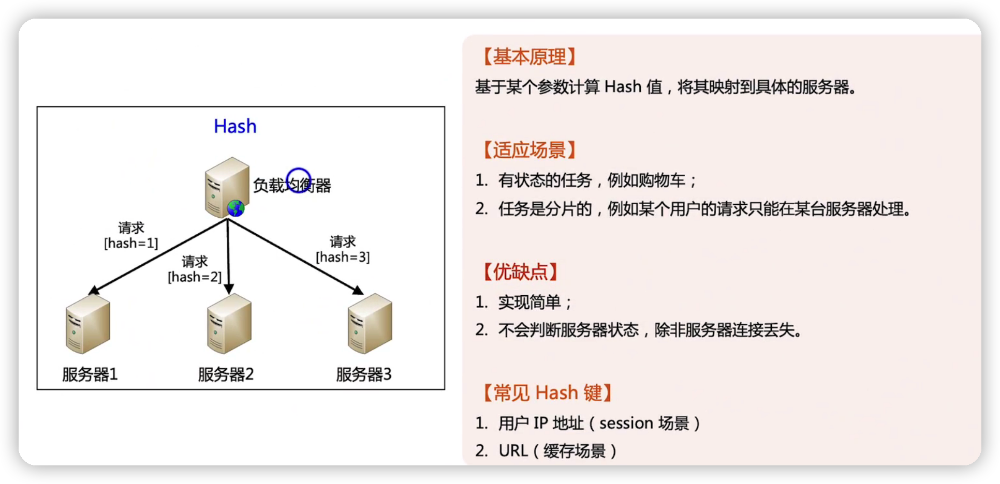
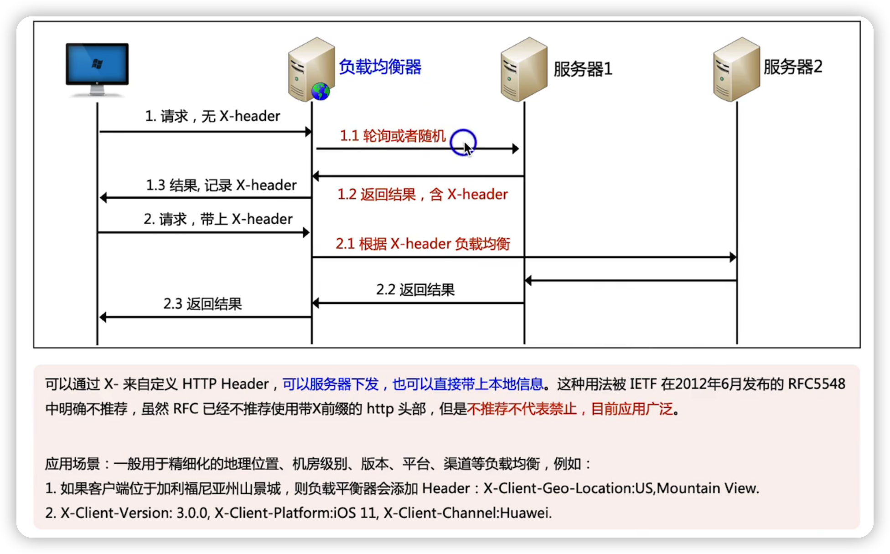

## 轮询& 随机

## 加权轮询

## 负载优先

## 性能优先

## hash

## nginx

## LVS

## 业务级别的负载均衡算法

### 业务级别负载均衡技巧--cooke

### 业务级别负载均衡技巧--自定义http header

### 业务级别负载均衡技巧--自定义http query string

### 业务级别负载均衡技巧--评估服务器性能

## 总结

