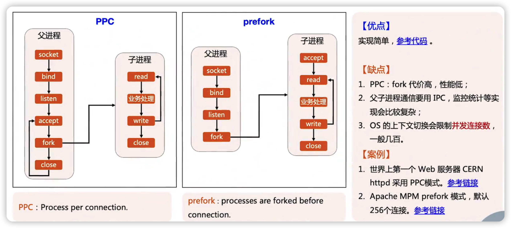
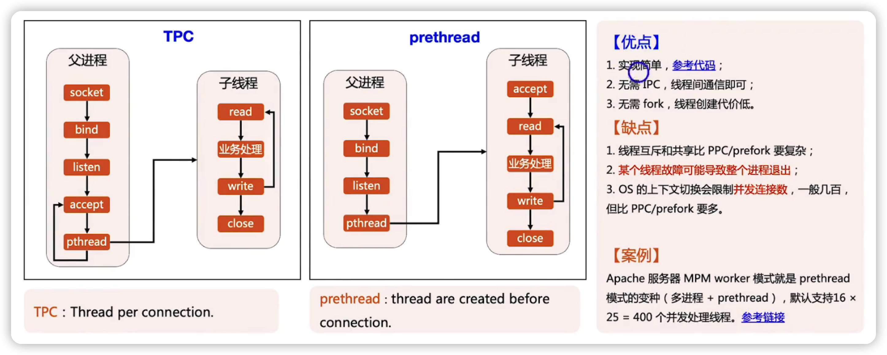
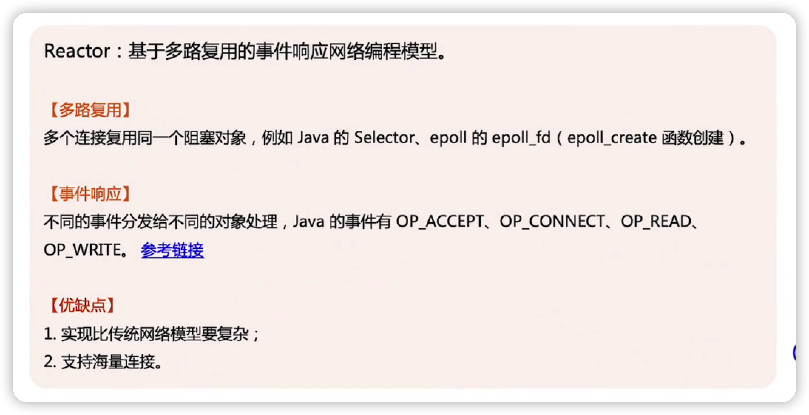
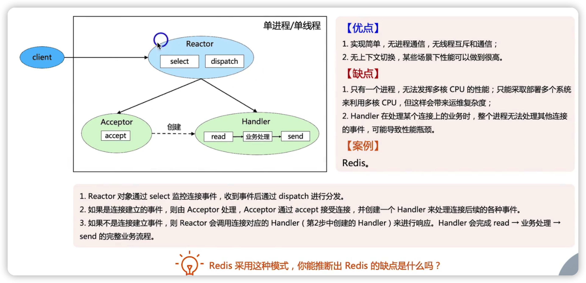
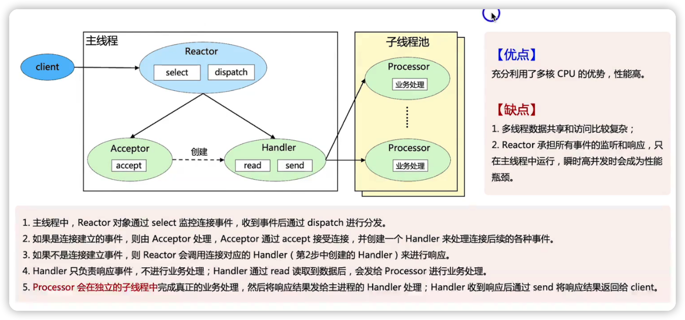
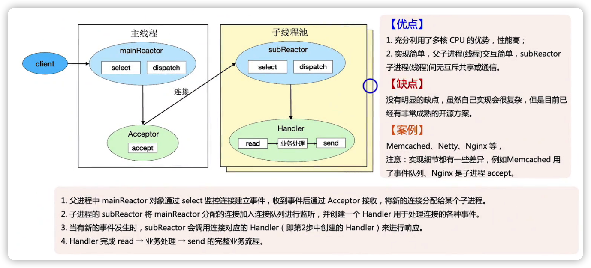
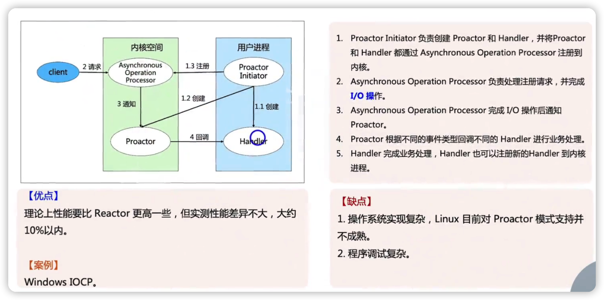
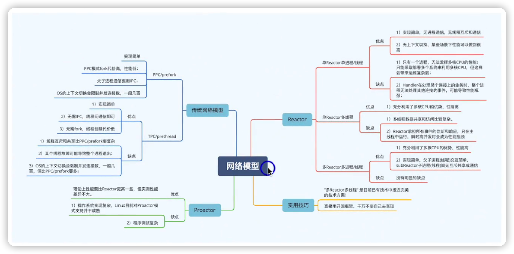

## 背景

模块四与模块七的课程中，绝大部分的架构设计、架构模式都是基于以有的开源系统 或者是说一些成熟的商用系统来进行架构设计的。

理想情况下，用好这些开源系统或者购买商用系统来完成架构设计，这样是最好的。

但是我们知道不管什么样的系统，总是有些优缺点的，与适用场景，有种可能是我们实际应用过程中，这些系统并不能完全契合我们的业务场景，**这个时候需要我们自己去开发适合自己业务或者团队的系统**。

单机高性能计算的网络模型。

## 网络模型

### 传统网络模型

#### PPC与prefork

- PPC：每次来一条连接，比如说一个accept之后，我就fork一个进程，由子进程来完成io的处理业务的处理然后响应，直到连接关闭

- prefork：实在PPC的基础上进行一个改性，预先创建好一些进程，然后由子进程来完成io，处理业务

#### TPC和prethread

- TPC：每次来一个连接，我都创建一个子线程，由子线程来完成io处理，业务处理
- prethread：先创建一堆线程池，然后来一个连接由子线程池的单个线程来完成io处理，业务处理

### Reactor

#### Reactor 模式1 - 单Reactor单进程/单线程

#### Reactor模式2 - 单Reactor多线程

#### Reactor模式3 - 多Reactor/线程

### Proactor

## 三类网络模型对比

同步模型：要有用户进程去完成IO的读写操作

异步模型：IO的读写操作都是由操作系统去完成的

## 三类网络模型实战技巧

## 总结

