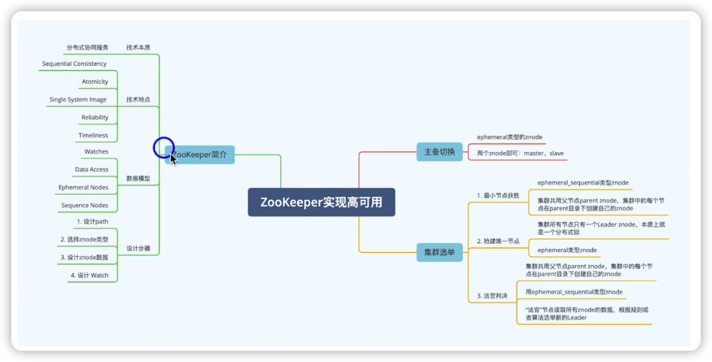

## zookeeper

zookeeper本身就是一个分布式系统，它自己就是高可用的， 有一个Leader结点，其他结点从Leader结点中复制数据

 ## 技术本质

是基于ZAB协议来实现的一个分布式一致性的一个系统，核心就是atomic Broadcast（原子广播），通过原子广播来实现分布式一致性。

ZAB不是Paxos，ZAB在设计的时候，是为了实现primary-backup system这种架构模式

而Paxos实际上是实现 state  machine replication这种架构模式

- primary-backup system： 由Leader节点来接收读写请求，然后将写的结果写入到本地之后，再通过原子协议或者其他的把写的结果复制到其他的系统
- state  machine replication：没有一个明显的Leader节点，每次在写的时候将收到的命令记录下来，然后把命令再复制给各个节点，然后各个节点再去执行命令应用到自己的状态机里面

## 应用

## 数据模型

- watches   在每个znodes设置一个监视器，一旦这个znode发生状态变化，这个监视器就会被触发，然后发这个事件通知给设置监视器的应用程序
- Data Access  每个znode里面是可以存储一些数据，可以根据自己的业务需要写入相关的数据，然后基于这些数据进行一些逻辑上的判断跟处理
- Ephemeral Nodes 临时节点，这个节点的生命周期跟创建节点的应用程序或者跟系统的连接的生命周期是相关的，一旦创建这个节点所对应的系统跟zookeeper的连接断了以后 ，那这个节点自动就会被删除了
- Sequence Nodes 顺序节点，多个系统或者是client去zookeeper请求创建Sequence节点的时候，它能够保证这个序号是原子递增的

## Zookeeper设计步骤

### 主备切换基本架构

### 集群选举

#### 方案1. 最小节点获胜

#### 方案2. 抢建唯一节点

#### 方案3. 法官判决

### zookeeper集群模式对比

为什么计算集群不用法官判决，而存储集群用法官判决

计算集群和存储集群应用场景不同

- 计算集群是无状态的，不存在说存储集群里面所有的数据覆盖这些问题，计算集群只要选举出一个新的leader即可，所以可以用最小节点和抢建唯一节点

- 存储节点，需要考虑数据的一致性，考虑数据尽量不要丢失不要冲突等等，所以它需要实现一个复杂的选举逻辑  

## 总结

