## ES的基本架构

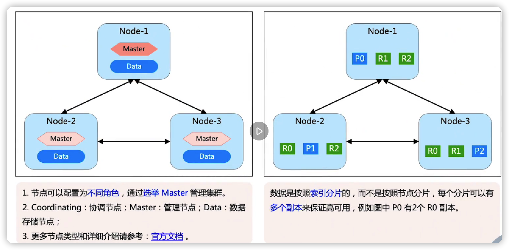

### ES的选举

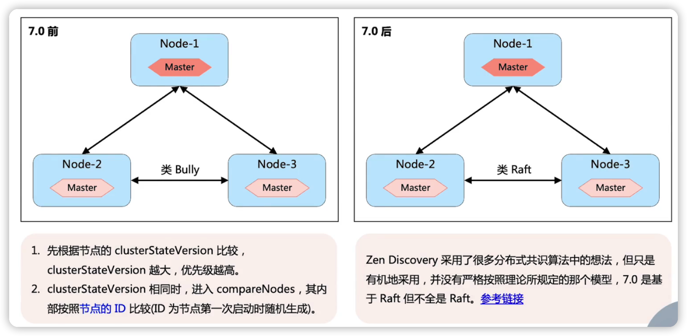

### ES部署架构模式1-master和data混合部署

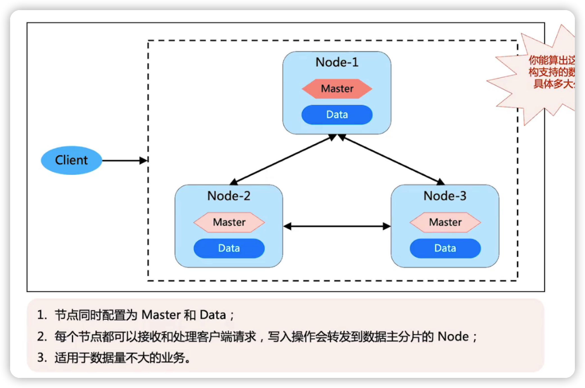

### ES部署架构模式2-master和data分离部署

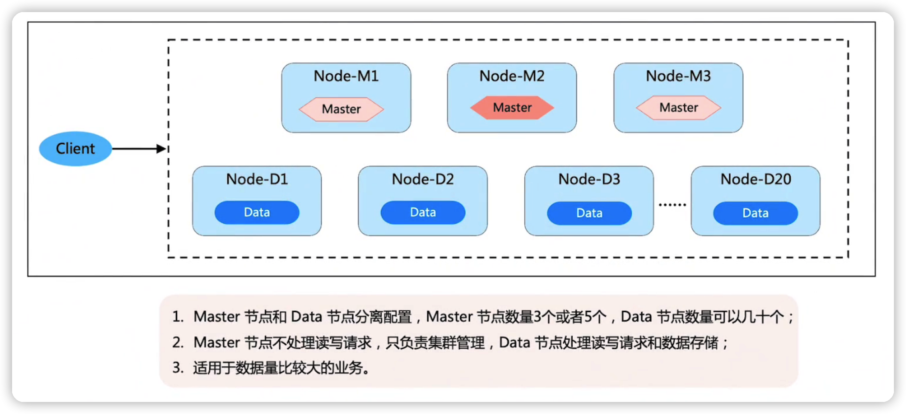

### ES部署架构模式3-Coordinating分离部署

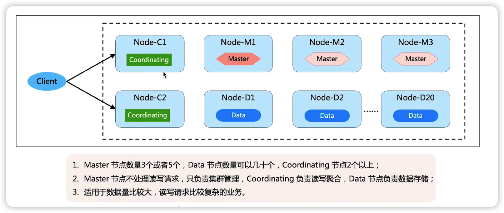

### ES部署架构模式4- cross cluster replication

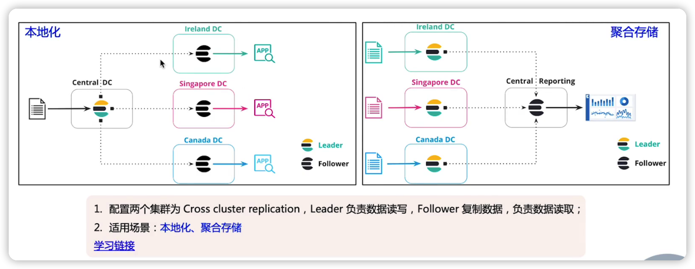

## redis  cluster

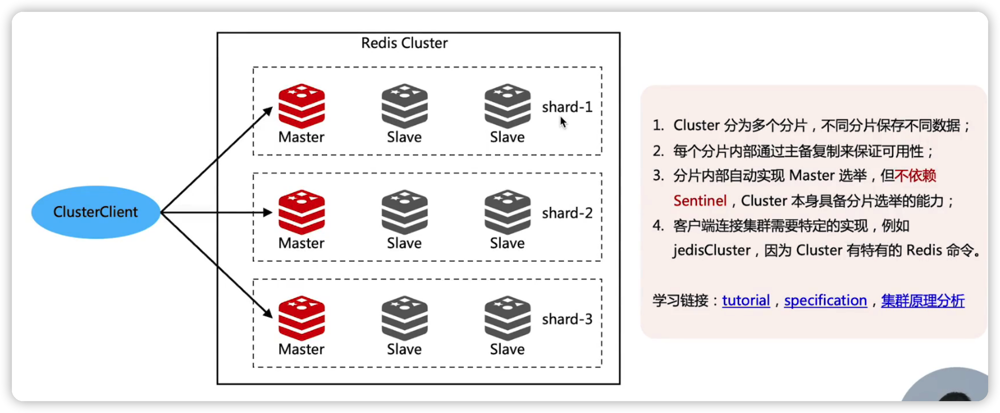

### Redis数据分部和路由

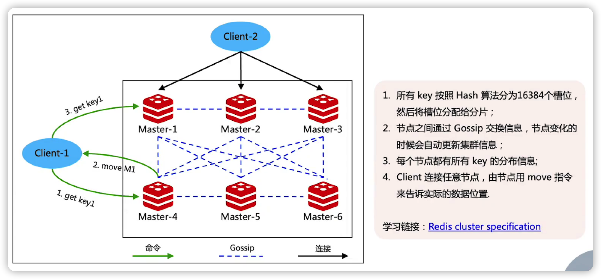

## Mongodb sharing架构

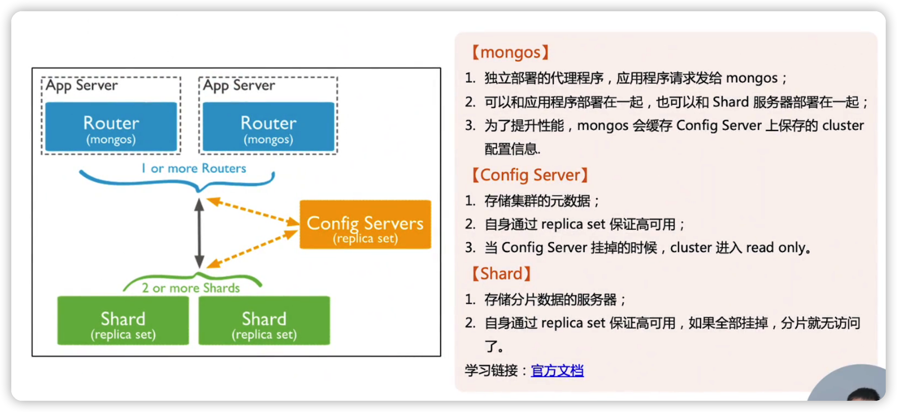

 ## HDFS架构

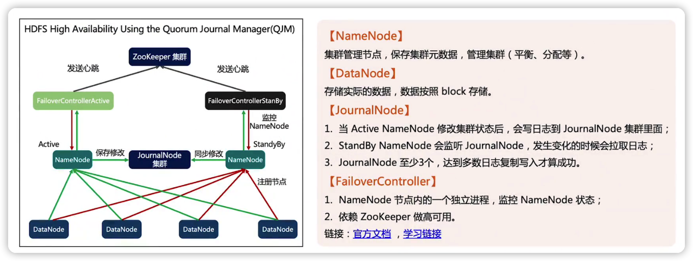

## 各个架构的简单分析对比

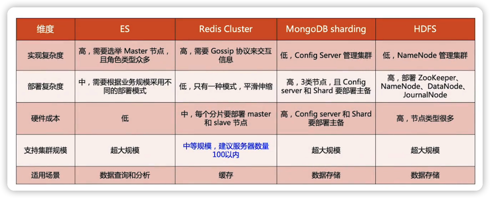

## 总结

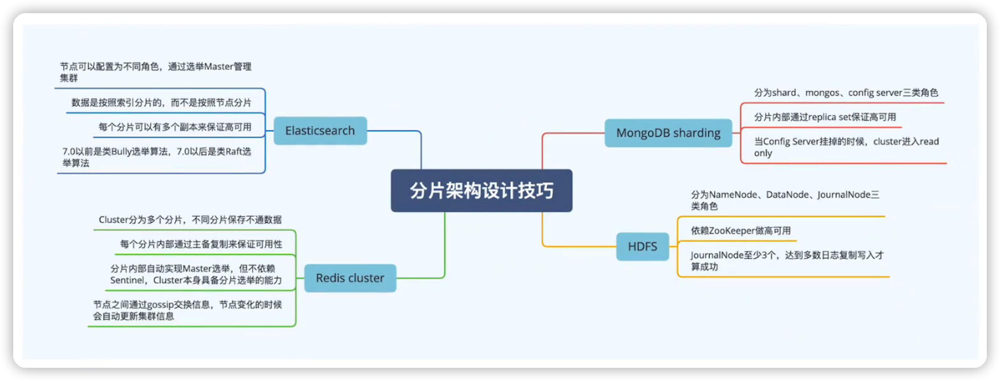

