## Gossip协议

应用在分布式集群里面节点互相通知消息

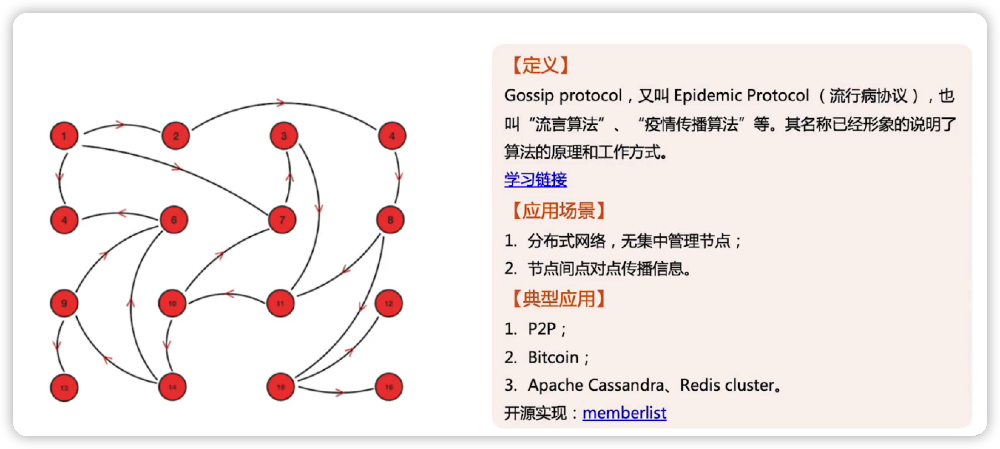

### 优缺点

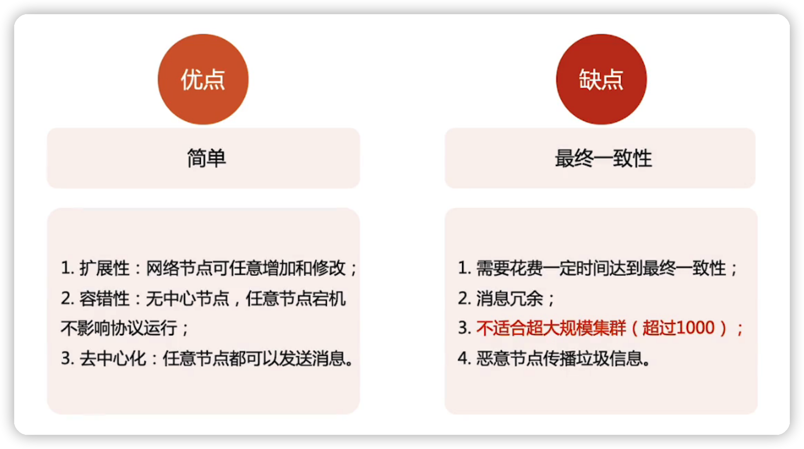

### 模式1.  Direct mail

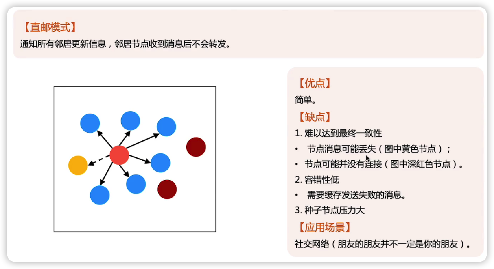

### 模式2. Anti-Entropy

### 模式3. Rumor mongering

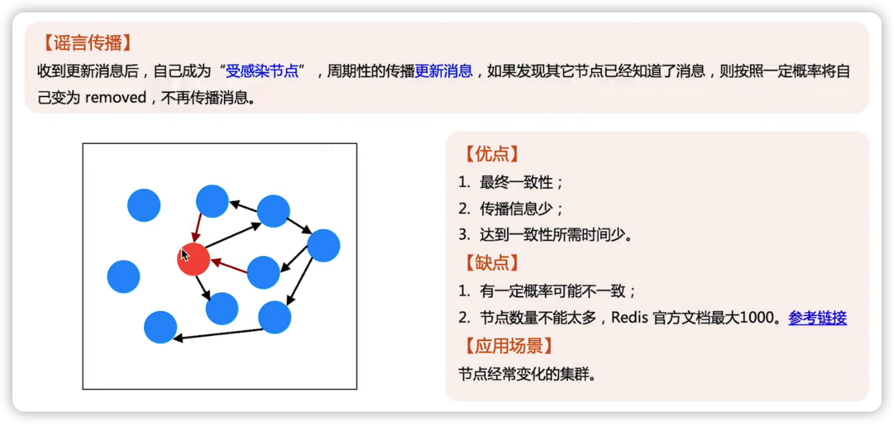

## Bully算法

主要是用来进行选举

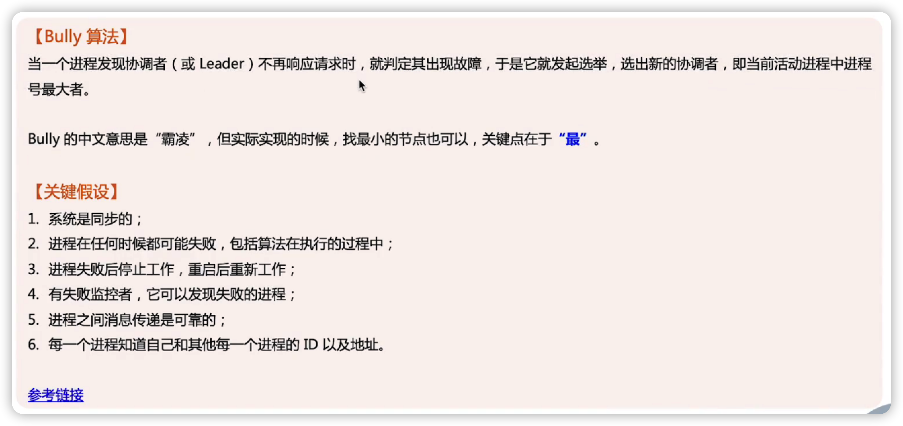

### 选举过程

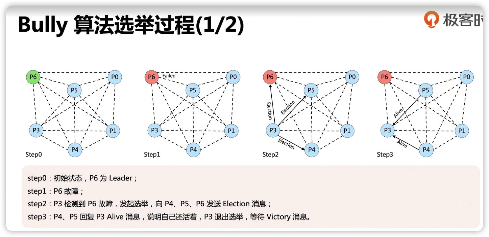

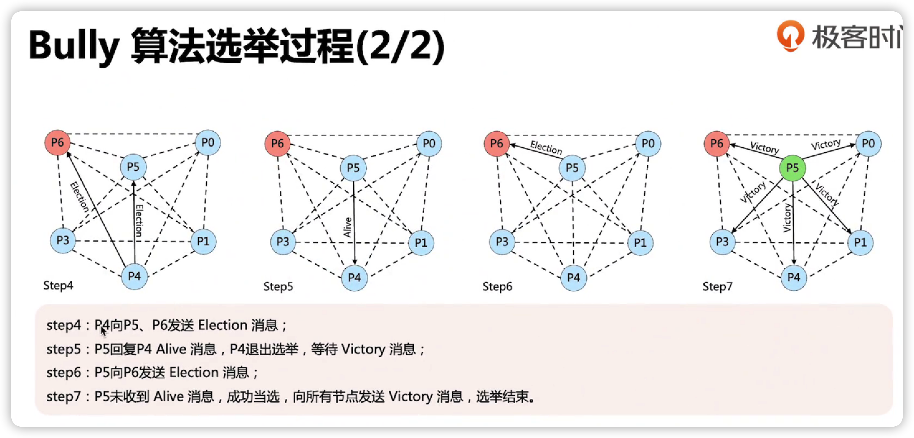

## Raft算法

Raft是一个分布式一致性算法。

分布式一致性算法有ZAB、Raft、Paxos

因为Paxos太复杂了，所以发明了Raft算法。

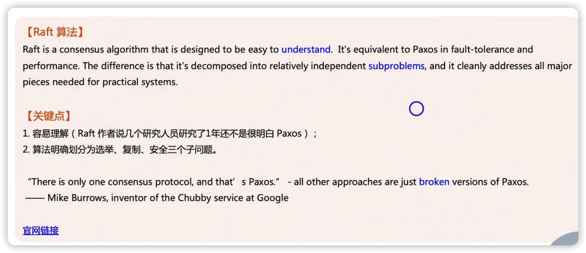

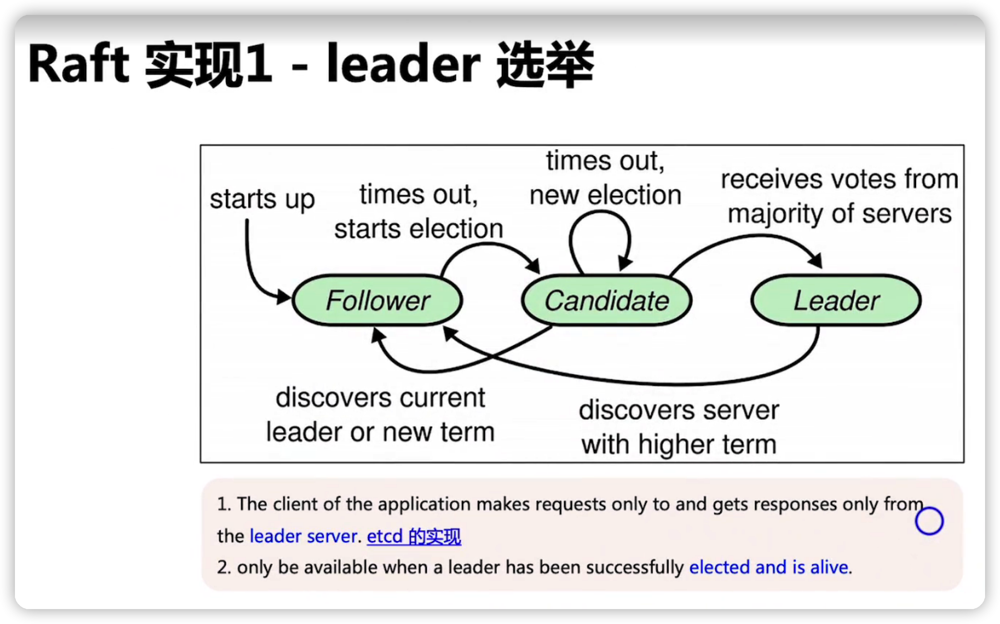

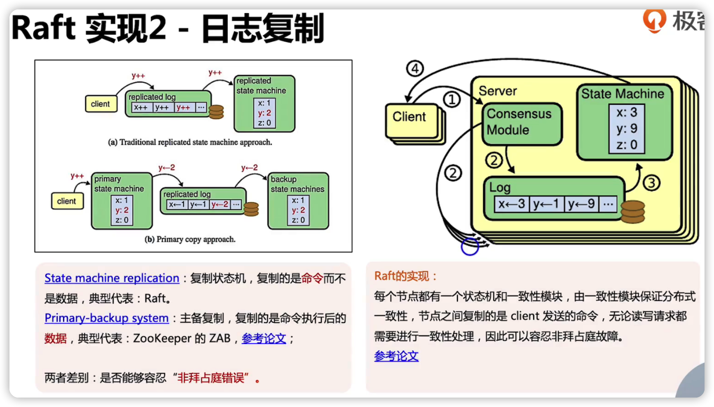

非拜占庭错误：假设有一个节点内部有bug，或者有故障，导致它的数据出了问题，这个时候，整个系统的其他节点是不是能够识别这个问题。

如果能够识别，就叫做能够应对非拜占庭错误。

如果不能识别，就叫做不能应对非拜占庭错误

state machine replication：是能够容忍非拜占庭错误，因为它的读写请求都需要进行投票，多数票达成一致，才能认为这个结果是ok的，其中一个节点出现故障与bug数据被破坏了，只要其他节点的数据没有被破坏，那就能识别出异常节点的数据

Primary-backup system ：不能容忍非拜占庭错误，因为Leader节点出bug或者数据被破坏了，那么他复制出去的其他节点是不知道的。相当于数据被破坏了

### Raft vs  ZAB  vs Paxos

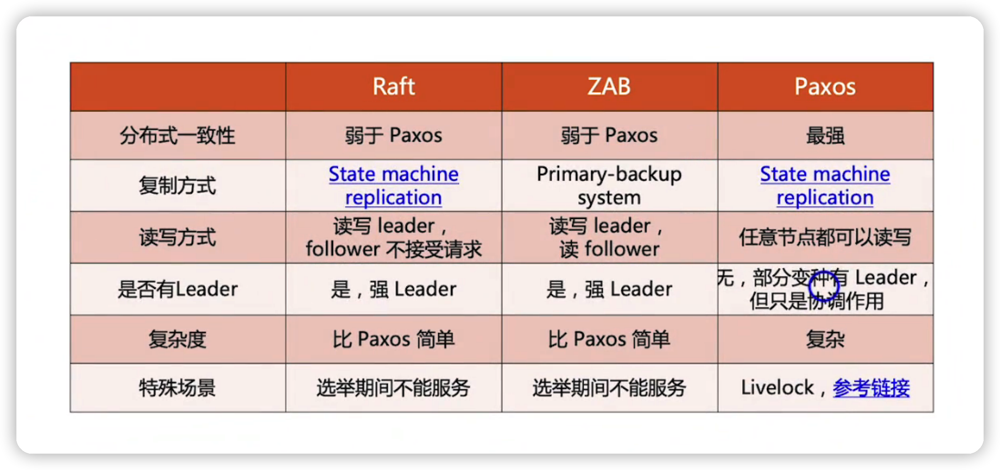

### Raft vs  ZooKeeper

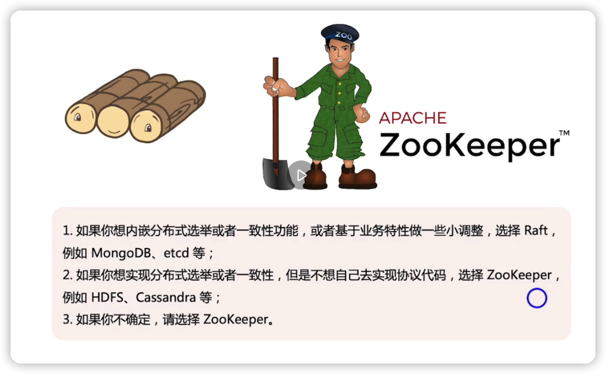

## 总结

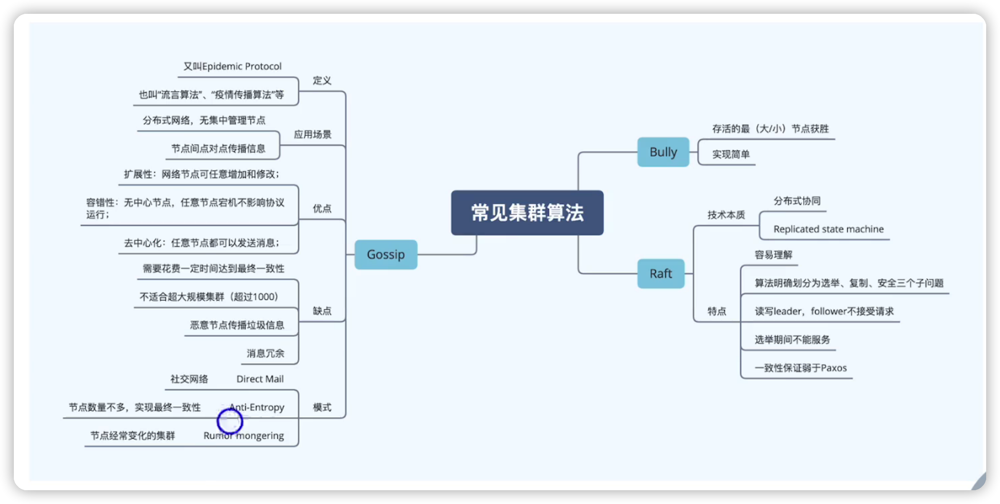