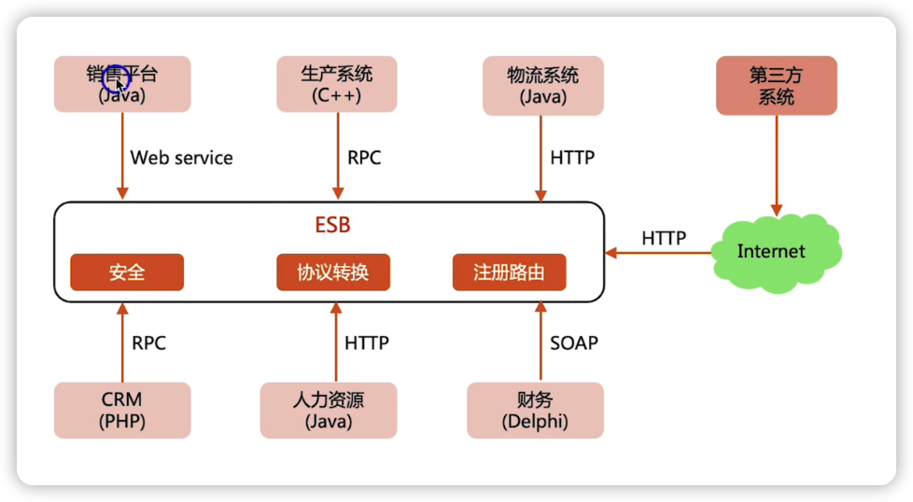
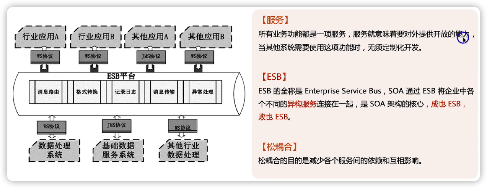
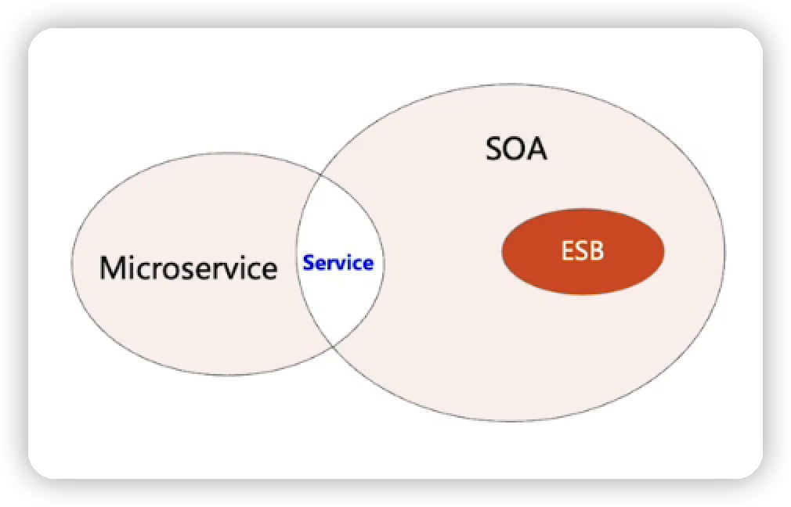
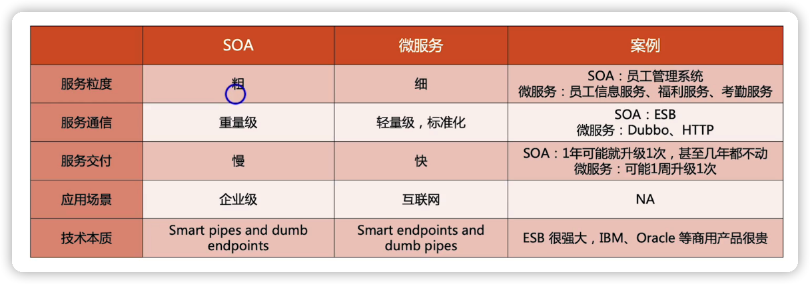
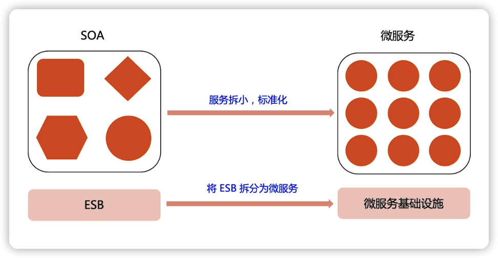
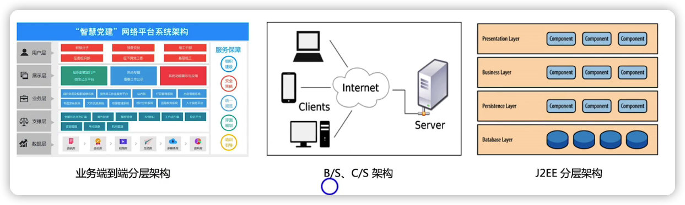
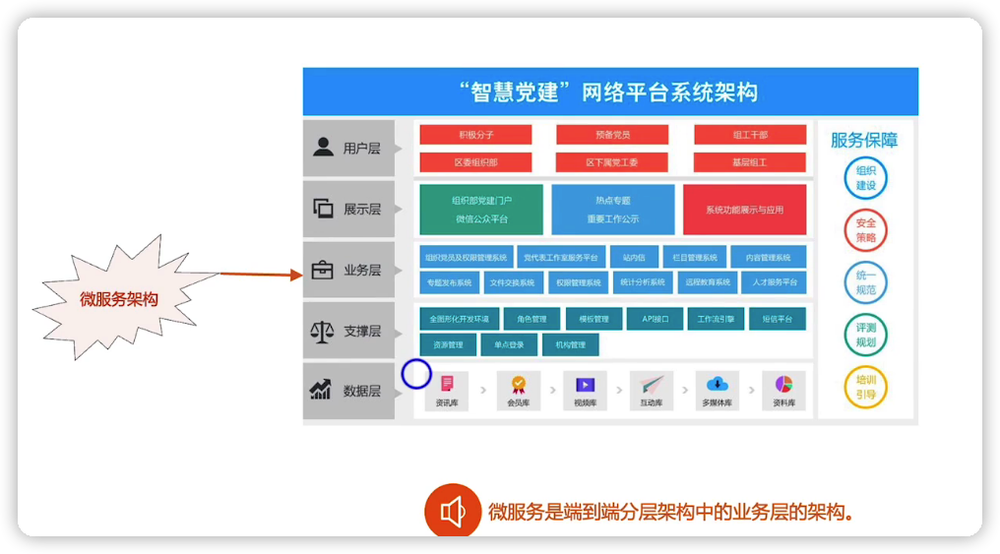
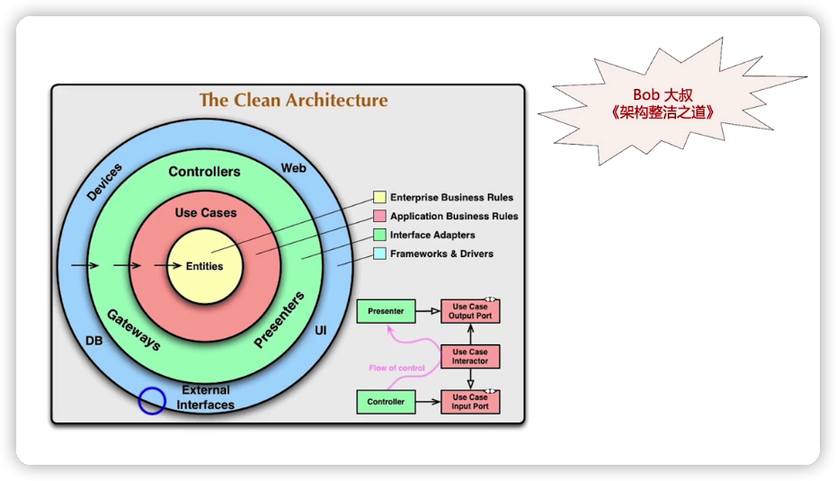
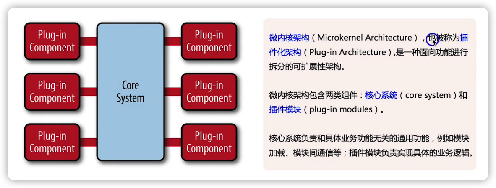
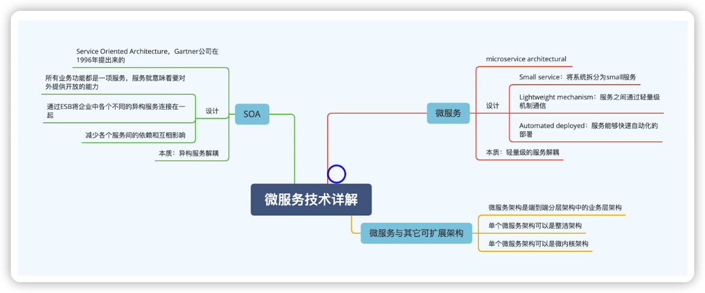

[TOC]

 

## soa架构

soa全称是 Service Oriented Architecture ，中文翻译为：面向服务的架构

提出SOA的背景是：

企业内部的IT系统重复建设且效率低下

- 企业各部门有独立的IT系统
- 随着业务的发展，复杂度越来越高

示例

有了SOA，企业之间不同系统，不同语言开发的系统就可以进行交互了，SOA有个中间件ESB解决了各个系统中的协议转换，注册路由，安全等问题。

### SOA架构解析

### SOA的缺陷

随着业务发展，ESB会越来越臃肿，性能底下，扩展困难

## 微服务

微服务的技术本质就是

- Small service                              将系统拆分为Samll服务
- Lightwerght mechanism       服务之间通过轻量级机制通信
- Automated deployed               服务能够快速自动化部署

## 微服务与其他架构的关系

### 与SOA的关系

微服务与SOA是两种不同的架构模式，他们的联系在于，都会划分出服务

### 与分层架构的关系

#### 分层架构的概念

端到端的架构或者单个系统的内部架构，按照某种规则划分为不同层级

#### 关系

微服务架构是分层架构中业务层相关的架构

### 与整洁架构的关系

#### 整洁架构

#### 关系

单个微服务可以是整洁架构

### 与微内核架构的关系

#### 微内核架构

#### 关系

单个微服务的架构可以是微内核架构，例如风控、营销、工作流这这类微服务

## 总结

