[TOC]

## 微服务的陷阱

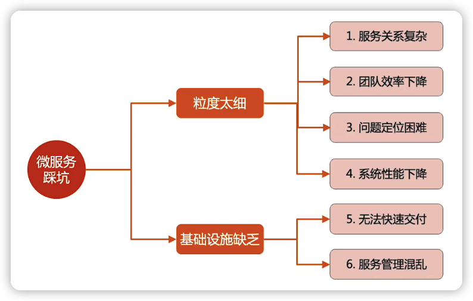

### 拆分粒度太细，导致的问题

#### 服务关系复杂

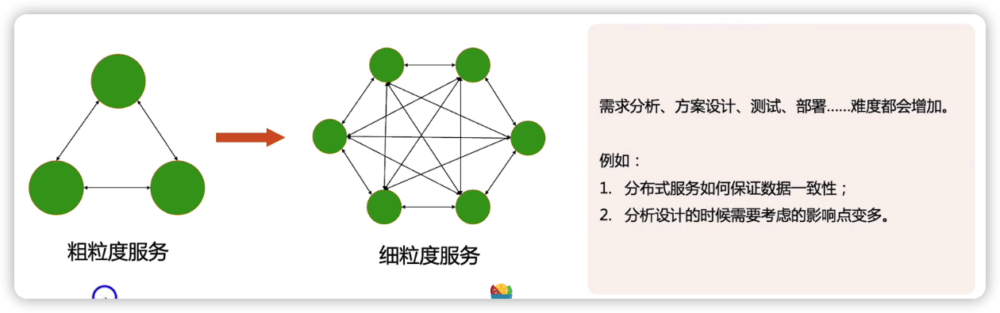

服务拆分的太细，降低了服务内部的复杂度，但是会增加外部复杂度

#### 团队效率下降

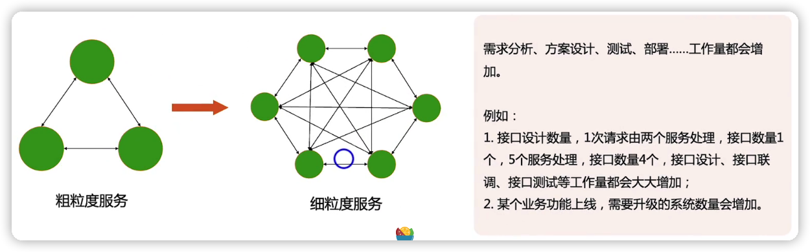

#### 问题定位困难

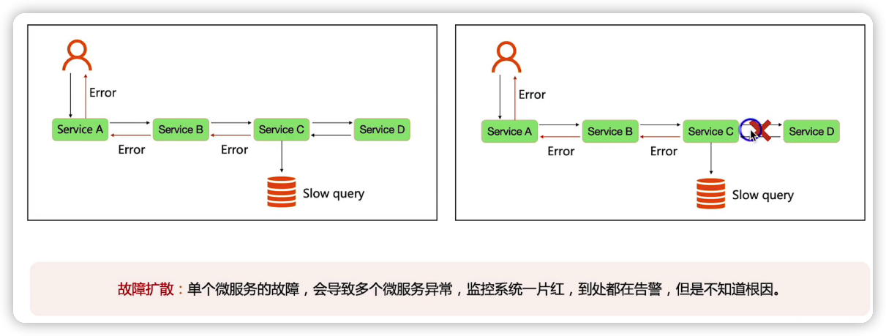

#### 系统性能下降

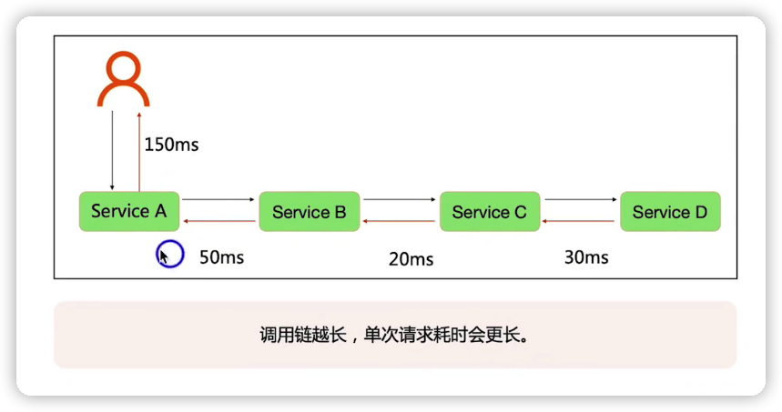

拆分后单个服务的处理性能提升，是否可以弥补调用链带来的消耗？

理论上，拆分后单个服务的性能确实会提升。

因为接口的处理消耗最多的是在存储系统的访问这种逻辑处理上，就算把粗粒度服务拆分成细粒度的服务，整个系统的逻辑接口性能不会下降太多。所以单个细粒度的性能可能会提升，但是不会提升太多。而调用链消耗的性能，会超过拆分带来的性能的提升。

### 缺乏基础设施

#### 无法快速交付

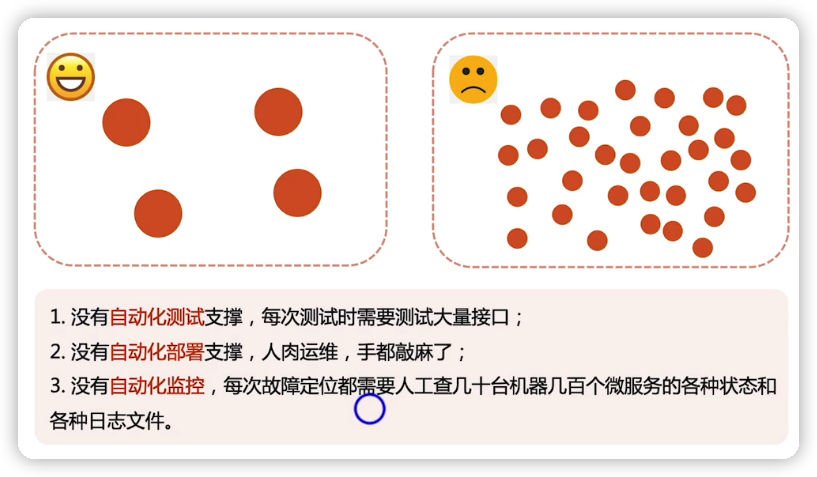

#### 服务管理混乱

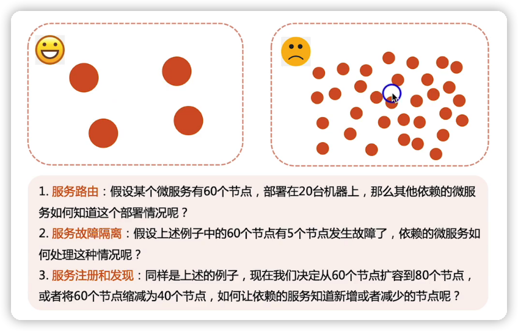

## 如何应对

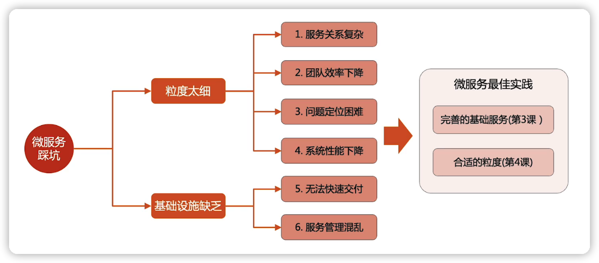

## 微服务的挑战

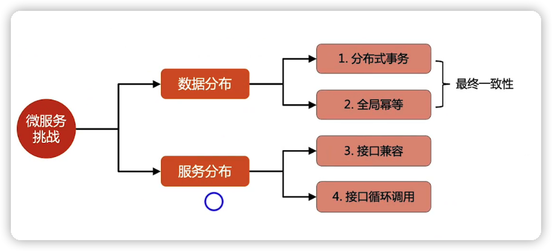

只拆分代码，不拆分数据库，就不算微服务

### 数据分部一致性的解决方法

最终一致性

#### BASE理论

是指在微服务系统中，事务同步需要一定的时间间隔，也就是这个是间隔内，你们系统是基本可用，可能有些场景会有问题，但是你的系统能容忍这种情况，不过最终数据是一致性的。

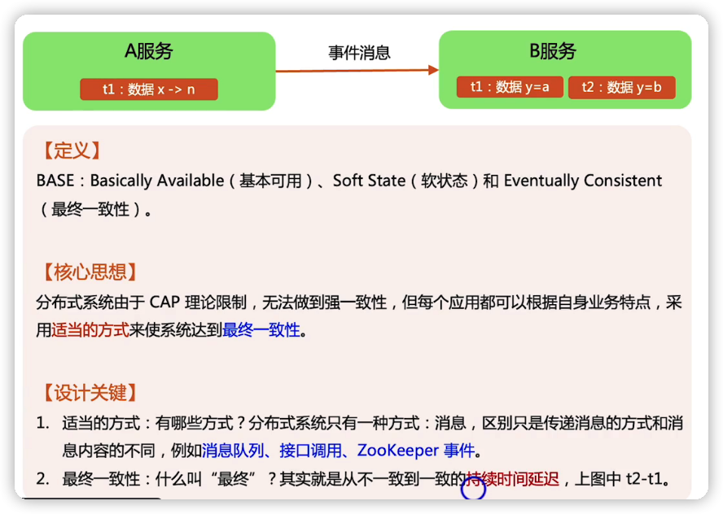

#### 分布式事务

##### 分布式事务--->本地事务消息

A服务某个业务要改自己的数据，同时要改B服务的数据，但是A服务不能直接修改B服务的数据。

A服务在执行当前事务的时候，除了写自己的业务数据，还将消息数据写到数据库中（这个消息就是记录事务相关的信息）

然后A服务会有一个后台的线程，然后不断的读取这个消息发给B服务， 让B服务修改它的数据。

然后B服务收到这个消息，它同时也执行写业务数据跟写消息数据（这个消息数据就是写B服务执行事务消息的一个结果），写完之后再把这个事务消息的处理响应发给A服务

一旦A服务收到这个消息，它就知道这个数据已经达到一致性了，那么它就不会重发这个事务消息

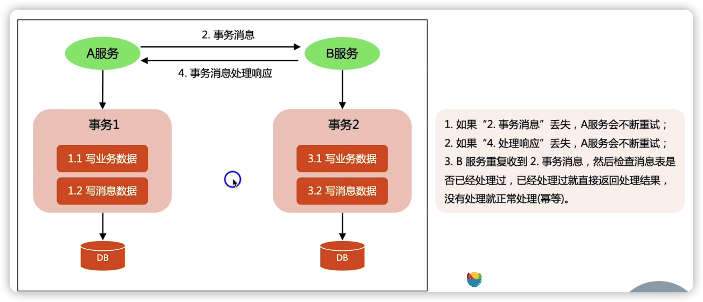

##### 分布式事务--->消息队列消息

与本地事务消息实现原理类似，区别就是将消息存放到消息队列了

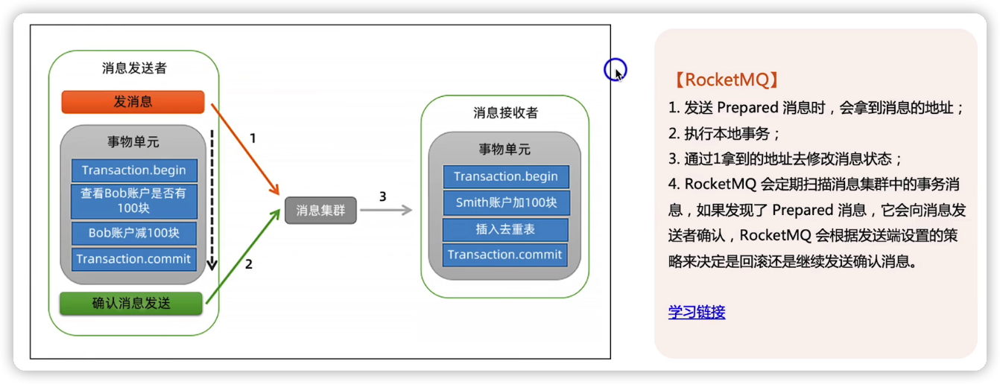

##### 业务级分布式事务--->TCC

TCC的含义就是每个服务向外提供三个接口：Try，confirm，Cancel，在业务层面实现分布式事务

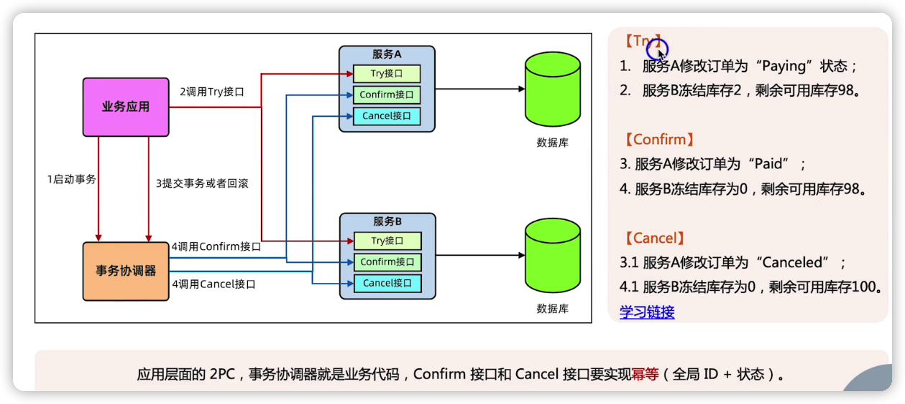

TCC实现关键点：涉及接口调用，有可能失败，所以会不断的重试，所以confirm与cancel接口需要实现幂等（全局ID+状态）

#### 全局幂等

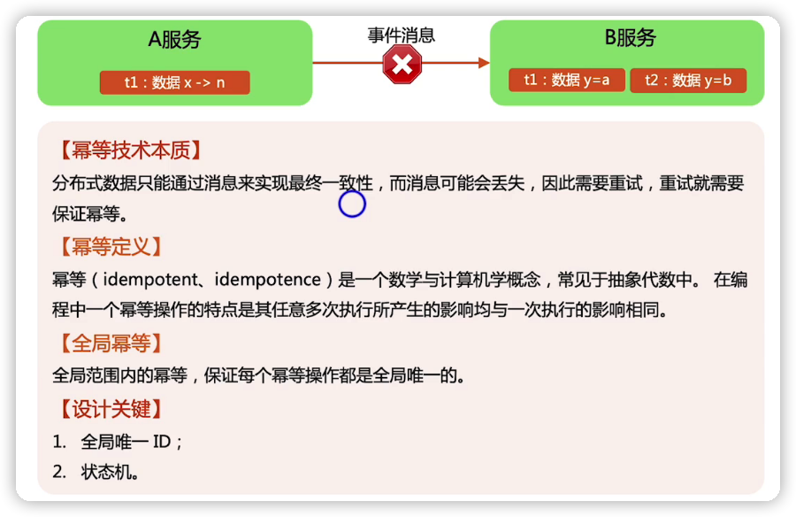

##### 全局幂等设计实例1

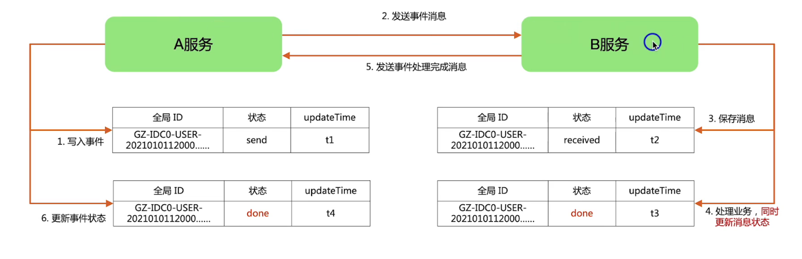

##### 全局幂等设计实例2

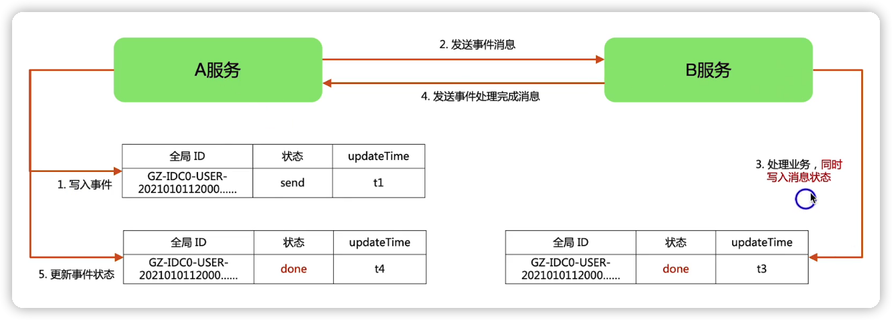

幂等判断

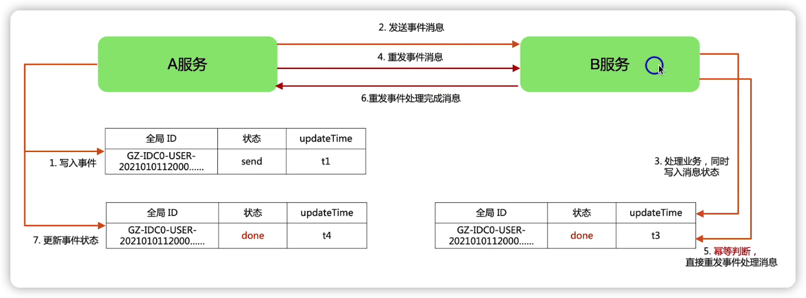

### 接口兼容 和 接口循环调用

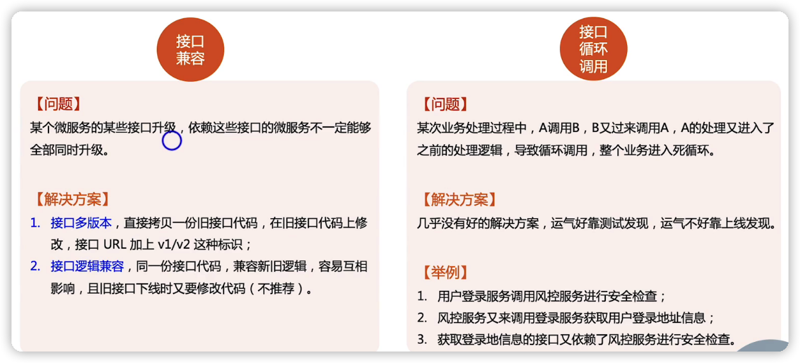

## 总结

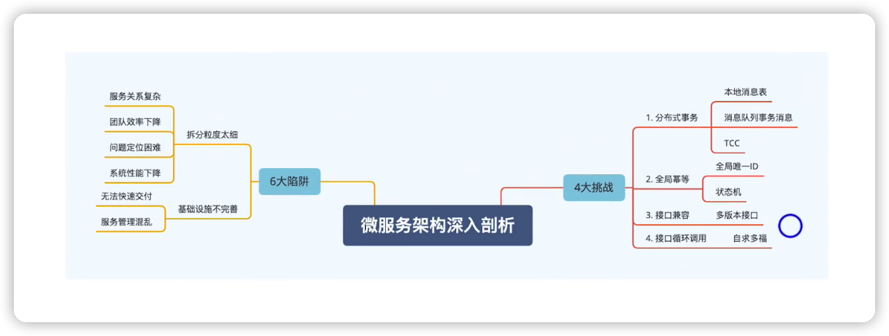