[TOC]

## 微服务基础设施架构全貌

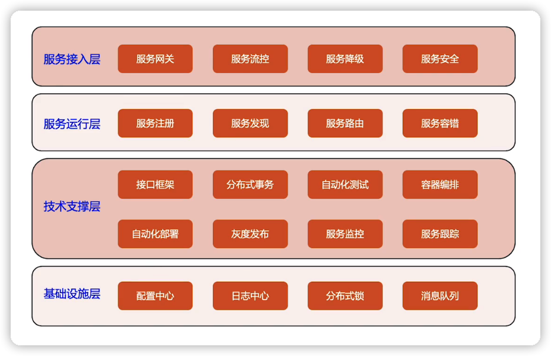

## 优先级

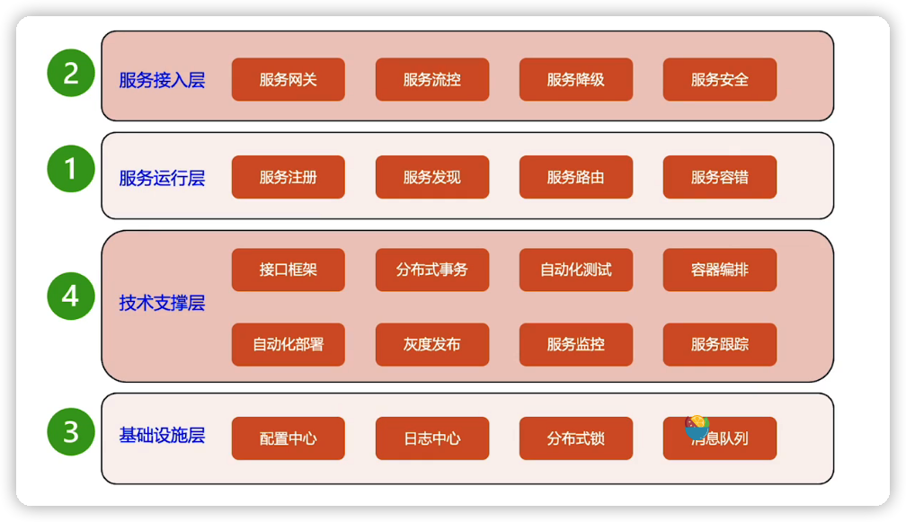

## 核心

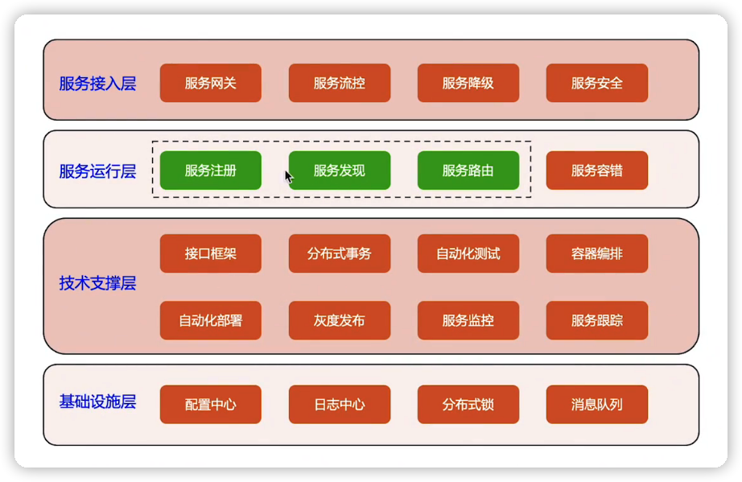

## 模式

### 1. 嵌入SDK

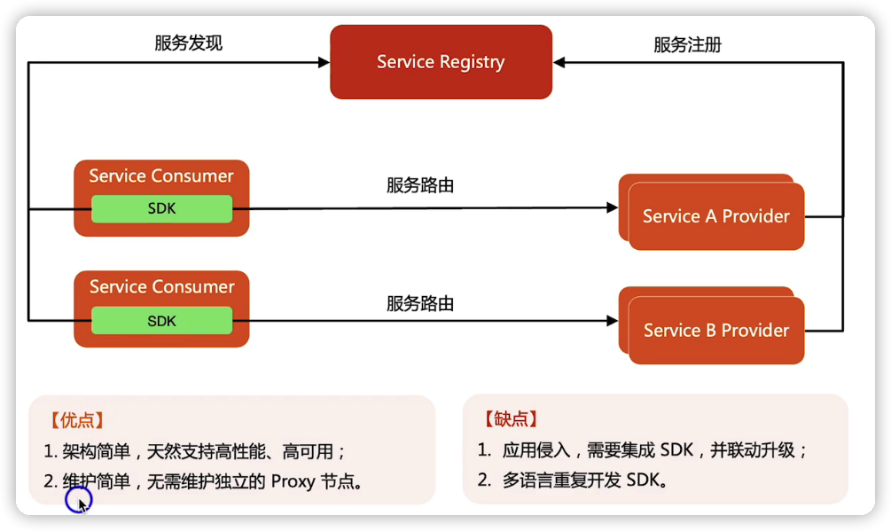

### 2. 反向代理式

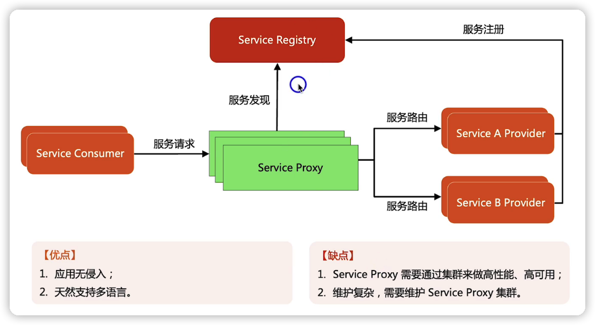

### 3. 网络代理式（Service Mesh）

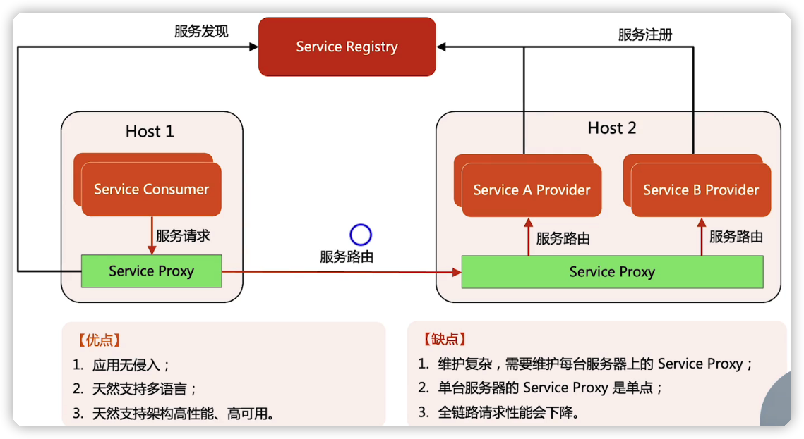

## 微服务框架模式对比

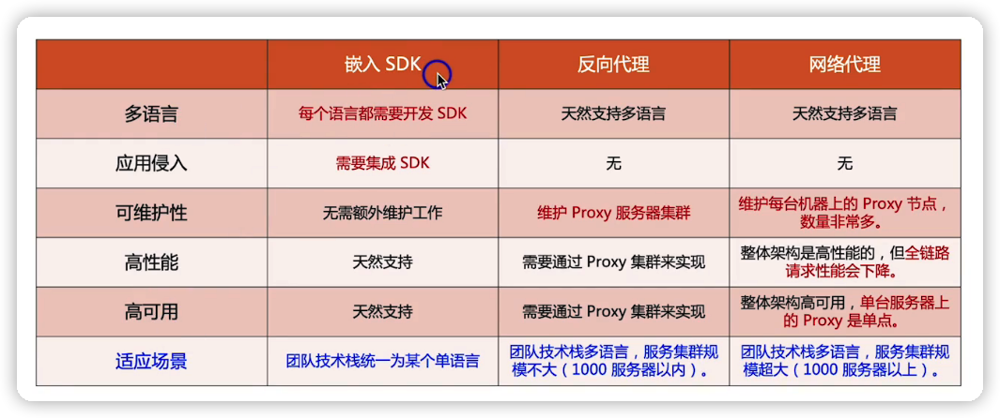

## 样例

### 1. 嵌入SDK

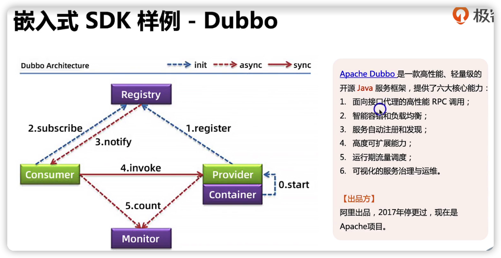

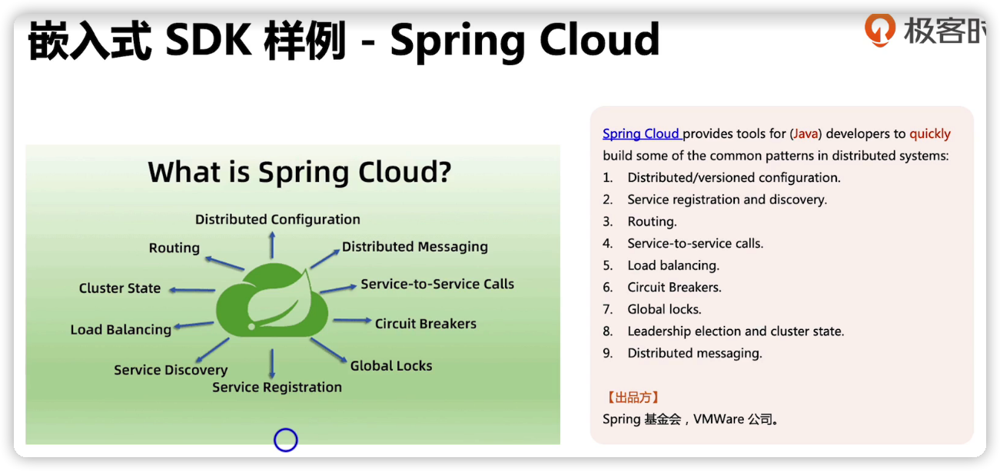

### 2. 反向代理式

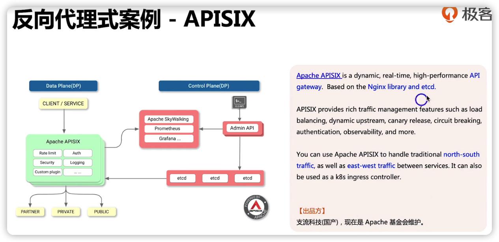

### 3. 网络代理式

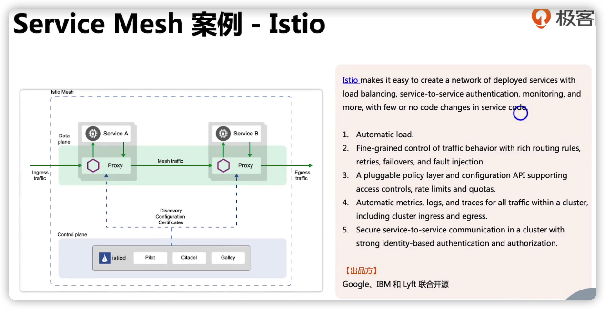

## 如何选择开源微服务框架

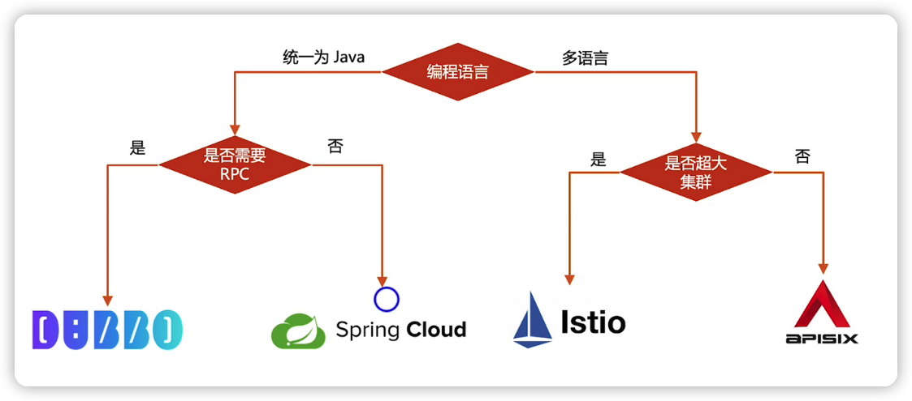

> 遇事不决spring，选择太多Apache

## 总结

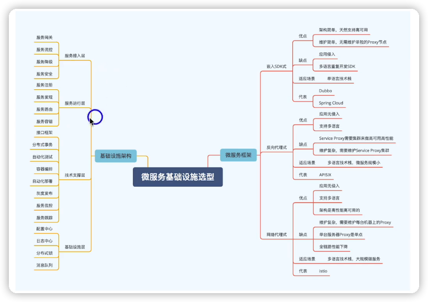