[TOC]

## 微服务架构整体思路

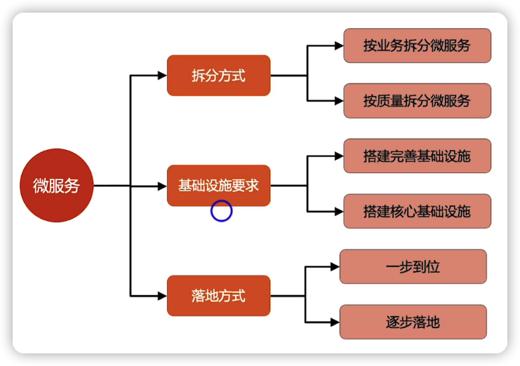

## 常见场景实施建议

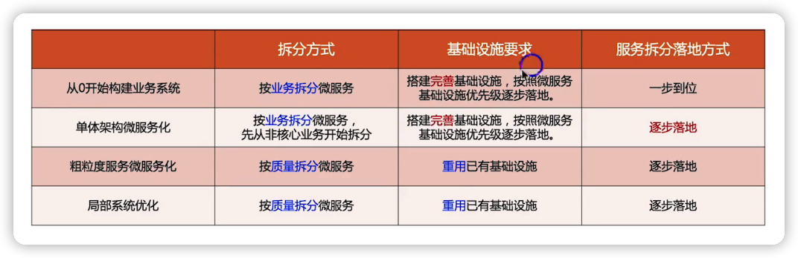

## DDD

### 概要介绍

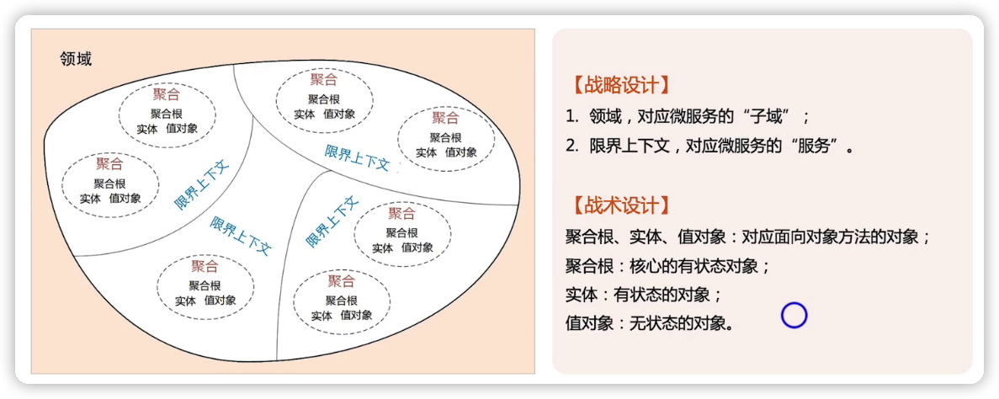

### 落地的核心问题

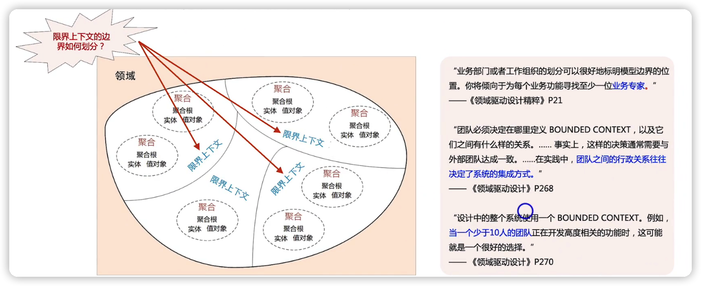

DDD并不能指导微服务的划分

DDD告诉你限定上下文是什么，却没有说如何划分

### 实际项目中业务的边界划分

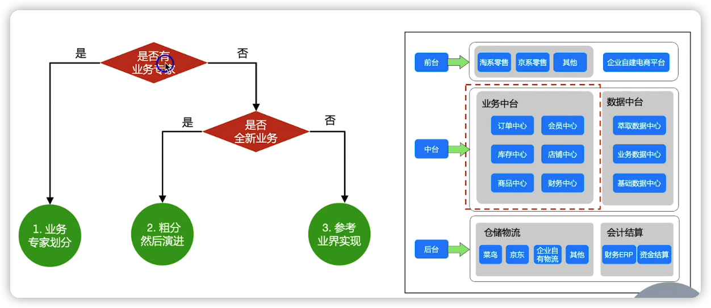

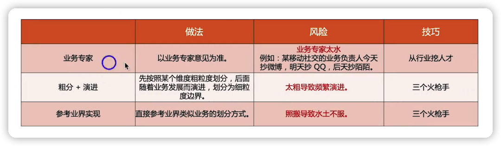

为什么不先细后合并

1. 因为拆分很细，工作量很大（拆分的工作量，为了应对拆分之后带来的性能问题、可用性问题、维护问题等等），需要搭建完善的基础设施，比拆粗工作量大很多
2. 合并的难度，比拆分的难度大很多
3. 微服务合并涉及数据的迁移与合并转换，比较复杂

## 实际项目中的服务拆分

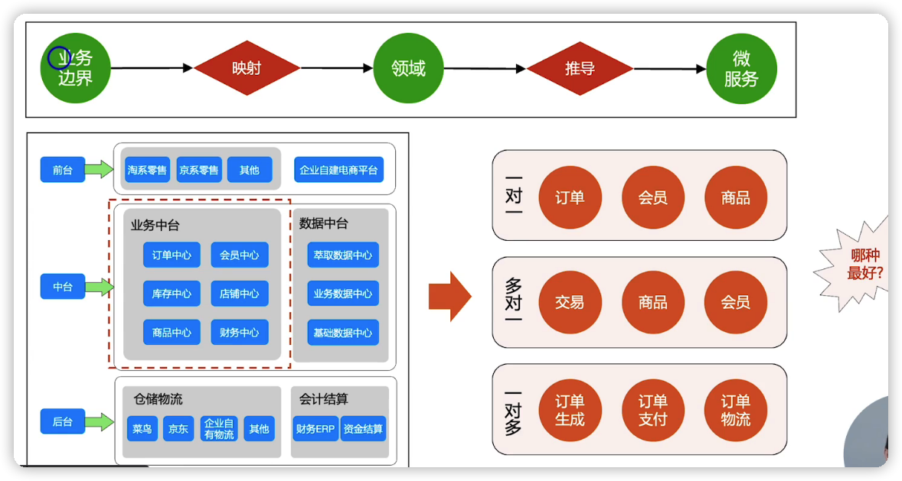

## 服务拆分技巧--->按业务拆分

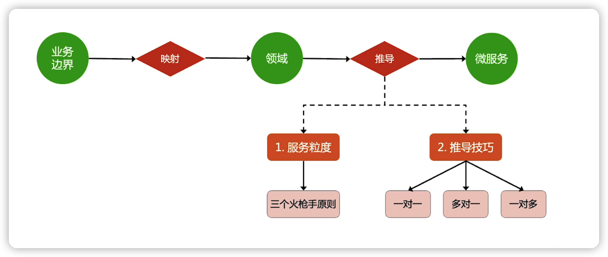

服务粒度优先，还是推导技巧优先？--->服务粒度优先

### 服务拆分技巧--->三个火枪手原则

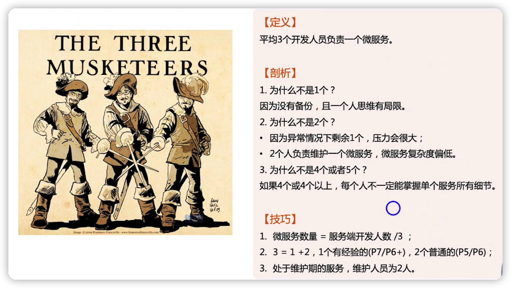

### 三个火枪手案例

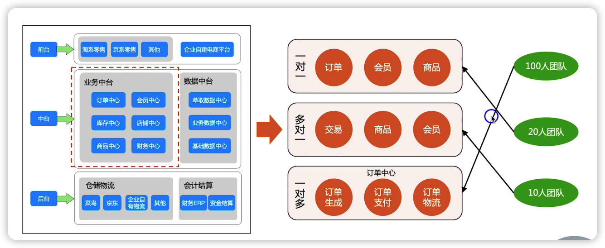

####  一对一服务映射

一个业务领域对应一个微服务

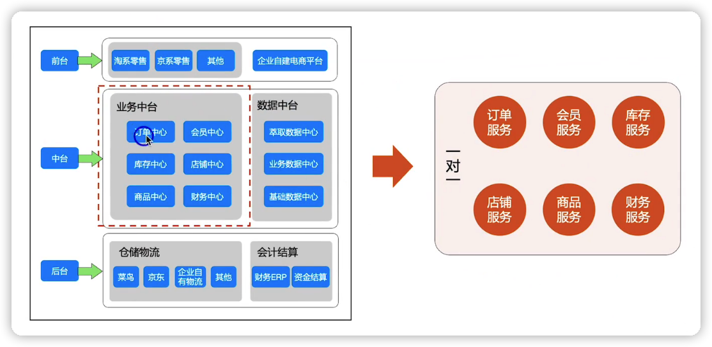

#### 多对一服务映射

多个业务域关联比较大，关系比较紧密的，可以放到同一个微服务里面

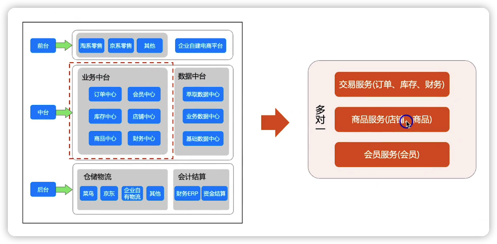

#### 一对多服务映射

拆分技巧就是按照业务流程进行拆分

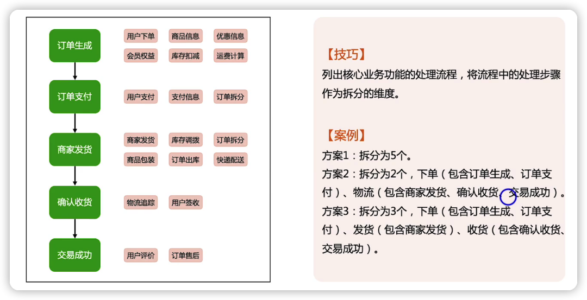

## 服务拆分技巧--->按质量拆分

### 按性能拆分

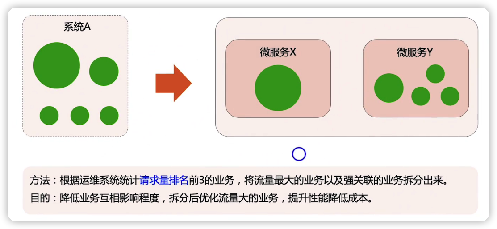

### 按业务的重要程度拆分

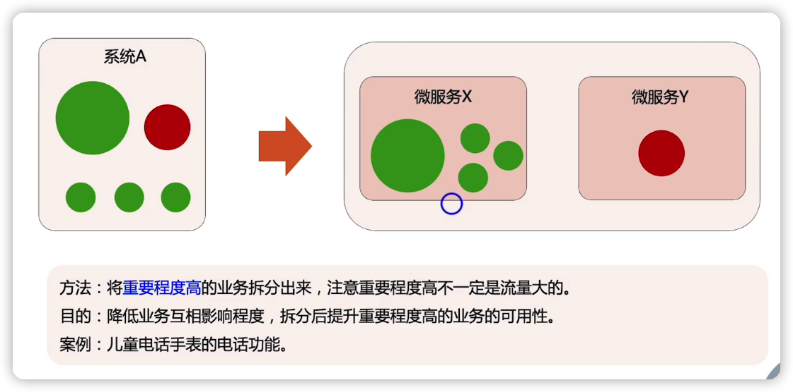

### 按可用性拆分

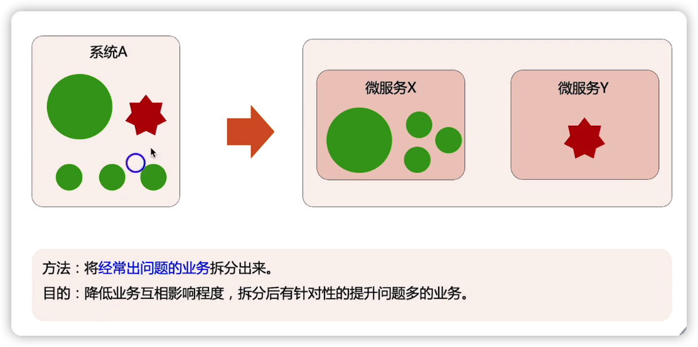

### 按稳定性拆分

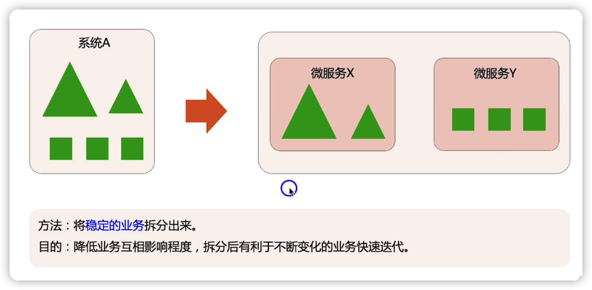

## 总结

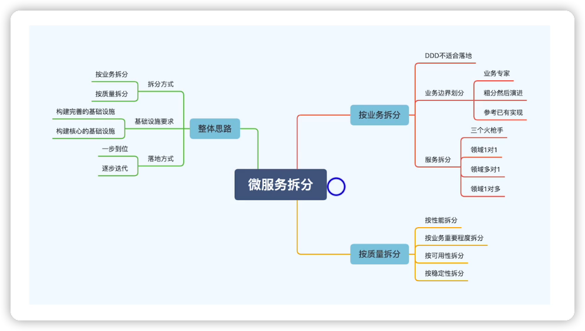

