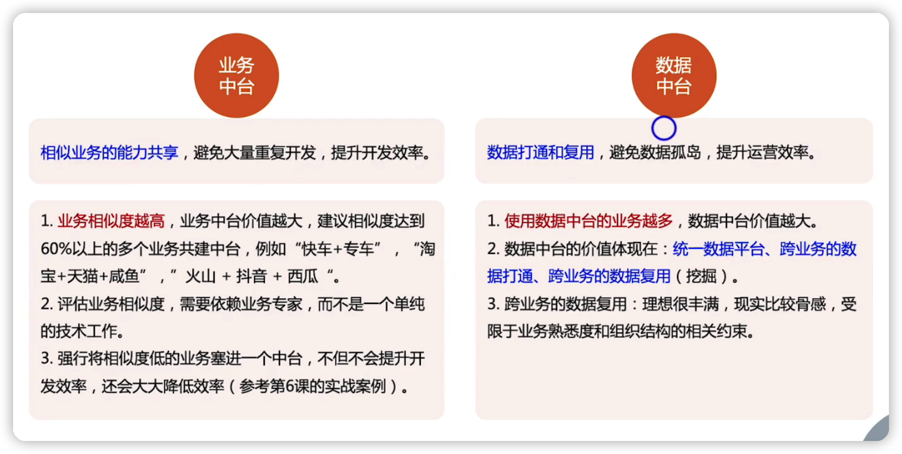

 

[TOC]

## 无共享架构->大烟囱架构

 

### 共享架构模式1->IaaS架构

Infrastructure  as a Service

特点：将OS，虚拟化、服务器、存储、网络等抽样成一个服务，来供各个业务共享使用

可以买云厂家的服务，也可以在自己系统搭建IasS的平台

### 共享架构模式2->PaaS架构

特点：基于IaaS的搭建的，增加了共享Runtime、中间件、DB

### 共享架构模式3->SaaS架构

特点：SaaS架构的复用程度比前两个更高，他将应用与数据也进行了共享。

典型的SaaS架构有：石墨文档、腾讯会议、企业微信等

### 共享架构模式4->中台架构

特点：共享的是多个业务中类似的业务，跟IaaS/PaaS与SaaS有本质的区别

下面业务ABC，中台会把共享业务与共享数据抽象出来，然后业务ABC在根据这个共享业务，来做自己比较特殊的一些特性业务

## 中台

中台的概念，要区分两类中台，一类是业务中台，一类叫数据中台

两类中台的概念有区别，不能混在一起定义

### 业务中台

业务中台支持$\color{red}{相似}$业务

### 数据中台

数据中台支持$\color{red}{所有}$业务，这是数据中台与业务中台本质的区别

数据中台需要将不同的业务进行复用，并且能够在跨多个业务的数据上面有一些洞见

### 中台的价值

### 中台的一些说法澄清

 

1. 技术中台是假冒的中台
2. 光搭建平台不是中台，数据中台的关键是业务的数据要打通，并且能够在跨业务的数据上面有一些洞见
3. 因为SaaS的业务是通用的
4. 不合理，对中台概念理解不清晰，蹭热度

### 中台的问题

#### 小业务饱中台大腿，中台饱大业务大腿  

#### 中台与业务的边界难以明确

> 中台最难的不是领域划分，而是中台和业务的边界划分

#### 中台的全流程效率并不高

## 微服务搭建业务中台

> 微服务不一定是中台，中台一定是微服务

## 中台落地的技巧

### 用Pipeline封装不同业务流程

### 用SPI封装不同的业务

### Pipeline和SPI方案对比

 

虽然看起来SPI优势更多，但是实际应用中，Pipeline用的更多一点，因为开发难度的影响是非常关键的

因为中台的业务和中台里面的共享业务跟业务的特性之间的边界是不明确的，每个业务都有不同的边界，业务开发团队需要熟悉各种各样的设计跟原理，开发效率很低，而且容易引起各种问题

## 总结

