[TOC]

数据库的架构是一个系统中核心的架构设计

下面介绍数据库的几种架构模式

## 一、读写分离架构

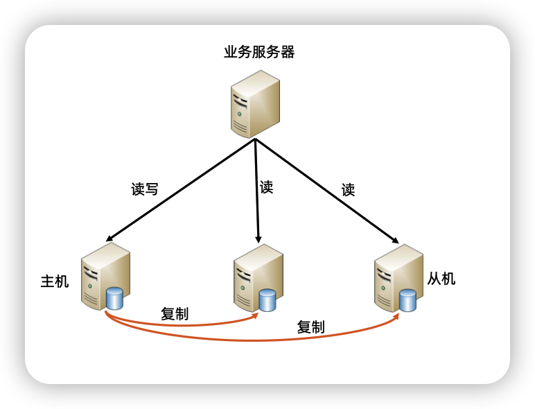

### 实现原理

1. 数据库服务器搭建主从集群，一主一从，一主多从都可
2. 主机负责读写操作，从机只负责读操作
3. 主机通过复制将数据同步到从机，每台数据库服务器都存储了所有的业务数据
4. 业务服务器将读写请求发给数据库主机，将读请求发给数据从机

### 如何判断是否要用读写分离

- 业务量增大，导致读请求大量增加，读请求比写请求多
- 先优化系统（索引，缓存）。如果这些不行的话，再考虑主从顶替

### 复杂度分析

- 复制延迟
- 任务分解

#### 复制延迟应对方法

- 读写绑定--->写操作后的读操作指定发给数据库主服务器
  - 缺点：业务侵入大，容易留坑
- 二次读取--->读从机失败后，再读一次主机
  - 缺点：多次二次读取，将大大增大主机的读操作压力
- 业务分级--->关键业务读写操作全部指向主机，非关键业务采用读写分离
  - 缺点：编码人员容易全部采用读写主机

业务分级，是在综合落地的时候是比较好的一个方案

#### 任务分解应对方法

- 程序代码封装
  - 实现简单，基于JDBC封装
  - 维护简单，无部署，无须考虑高性能，高可用（因为是嵌入到业务服务，而业务服务本身实现了高性能高可用）
  - 每个语言都要实现一遍
- 中间件封装模式
  - 实现复杂，独立服务器，需要实现连接管理
  - 维护复杂，需要独立部署，并且要考虑集群部署支持高性能，高可用
  - 跨语言

### 主从架构的瓶颈

- 主机写入性能瓶颈
- 每台数据库存储的都是全量数据 ，单个数据库的存储容量也有瓶颈

所以主从架构不能支持数据量多的存储

## 二、分库分表

分库分表就是一个分片的架构

为了应对主从架构的缺点，将主机节点拆分成更多的点，这个架构方案就是分库分表

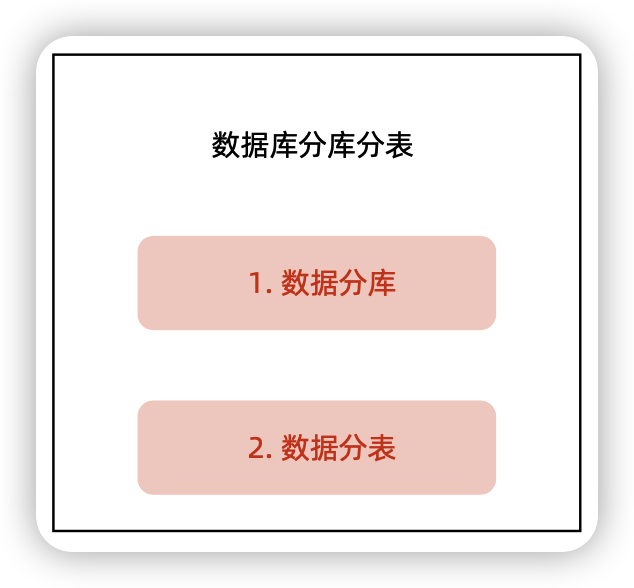

数据库分库分表不是一种架构模式，它属于两种架构模式

### 数据库分库

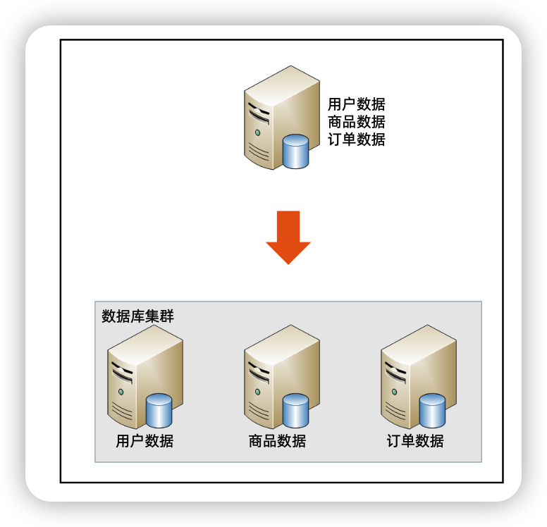

#### 产生的问题

- join问题--->原本在一个数据库中的表分散到不同的数据库中，导致无法使用SQL的join查询
  - 解法1   小表冗余--->将一些小表在每个库中冗余一份，例如字典表
  - 解法2  代码join--->代码去处理
  - 解法3  字段冗余--->将不会改变的字段冗余
- 事务问题--->表分散到不同的数据库中，无法通过事务统一修改
  - 解法：分布式事务

### 数据分表

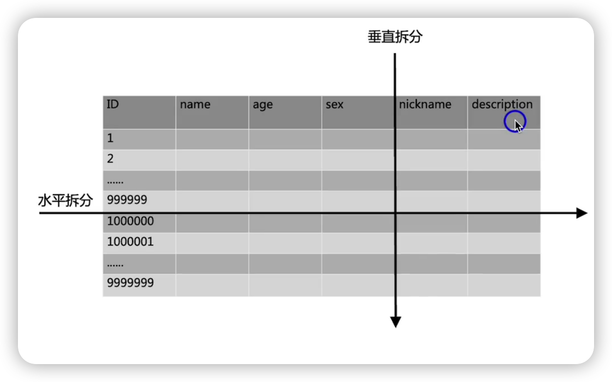

水平拆分

按列拆分，优化单机处理性能，常见于2B领域超多列拆分

垂直拆分

按行拆分，提升系统处理性能，常见于2C领域超多行的表拆分

垂直拆分与水平拆分都是针对单个表来拆分的

#### 多大的表需要拆分

- B+tree的层数：3层大概是2000万条，超过2000万就考虑拆表
- Innobd buffer pool：超过这个配置，也可能考虑拆表，因为一旦超过这个配置，mysql性能会急剧下降
- 数据量持续增长的表

#### 水平分表的复杂度

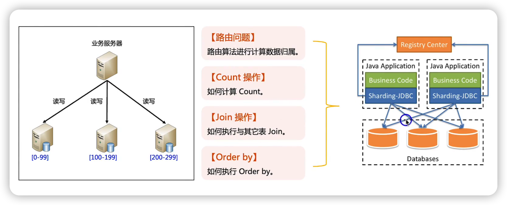

一般建议用第三方库或者中间件来解决这些问题

水平分表不能通过增加服务器来不断提升性。

- 数据库可以增加服务器来提升性能，但是聚合的SDK无法增加下面的数据库来提升性能，所以当服务器一定数量的时候，数据库不再是瓶颈，而聚合的SDK成为了瓶颈。

- 数据库到一定数量，SDK处的连接数也会成为一个问题

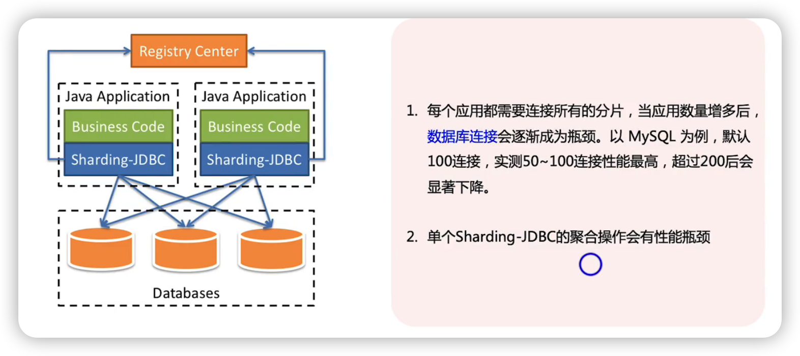

## 三、分布式事务

### 2PC

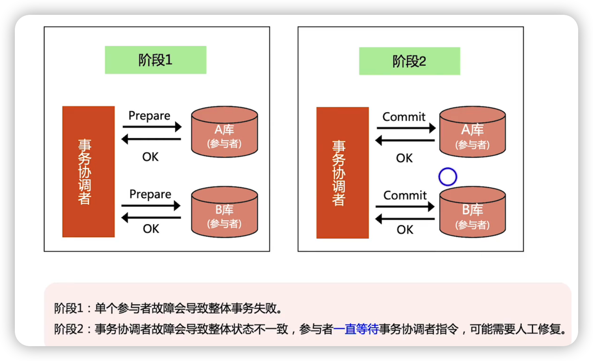

### 3PC

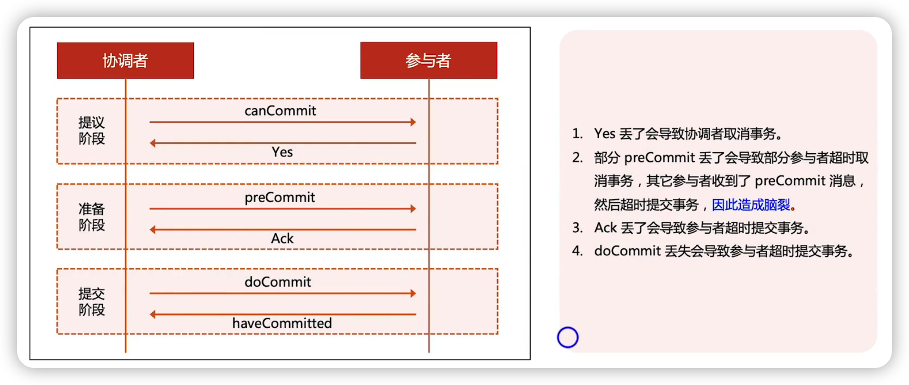

### XA

mysql的XA实际上是基于2PC实现的

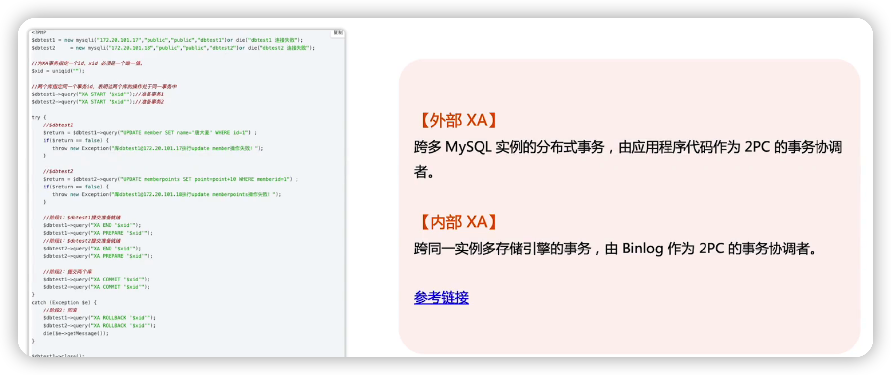

## 总结

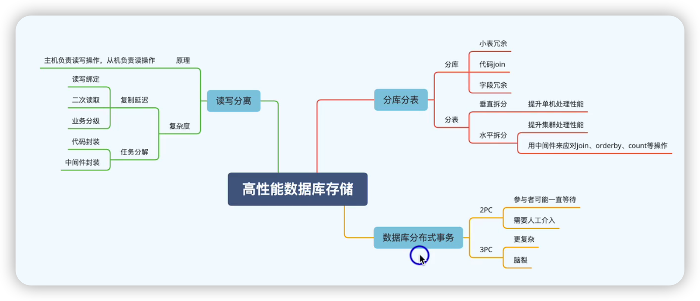

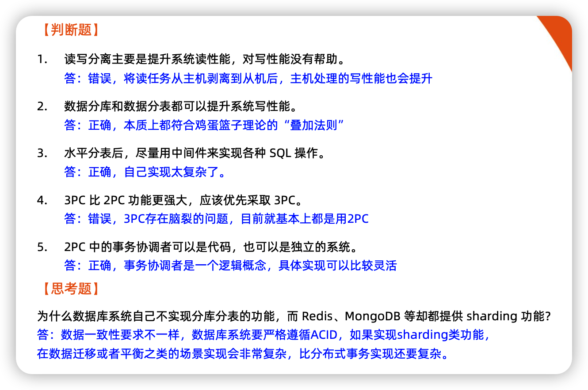