存储类问题处理框架图

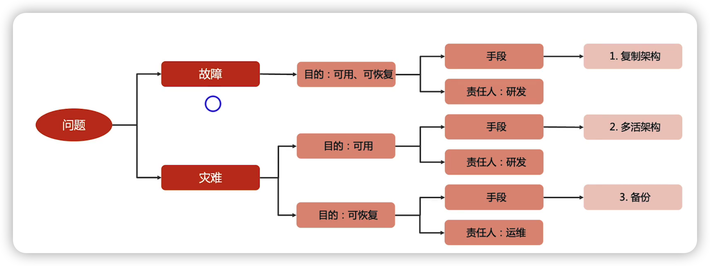

故障：小范围的故障，服务器宕机，bug之类的

灾难：地震，城市断网， 大范围的故障

## 高可用关键指标

- RPO

Recovery Point Objective 恢复点目标

指 最大可接受的数据损失，因为数据备份和复制都是有时间限制的，不可能做到绝对实时

- RTO

Recovery Time Objective 恢复时间目标

指  最大可接受的系统恢复所需的时间， 因为定位、处理、恢复需要时间

- WRT

Work Recovery Time 工作恢复时间

指 工作恢复时间，指 系统恢复正常后，恢复业务所需的时间，因为进行各种业务检查、校验，恢复

- MTD

Maximum Tolerable Downtime ， 最大可容忍宕机时间，等于RTO+WRT

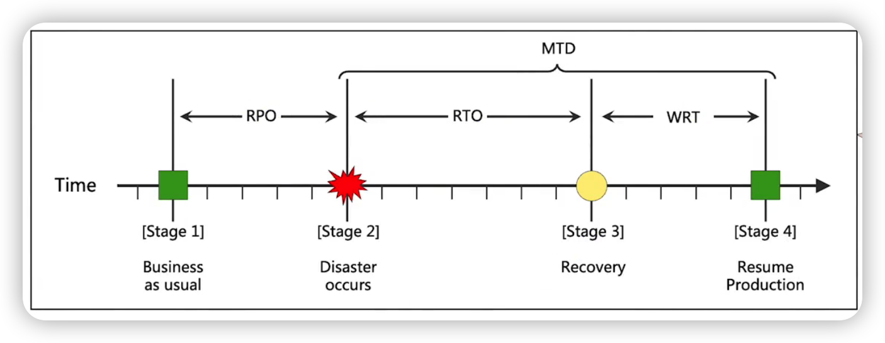

## 主备复制&主从复制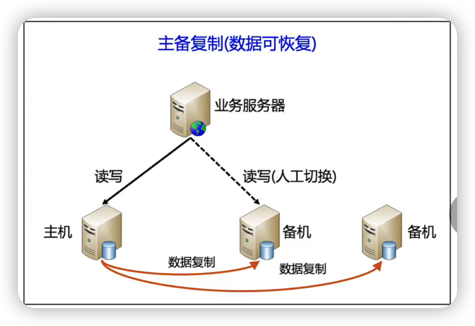

主备复制

原理--->通过冗余增加可用性

主机负责读写请求，备机在主机正常的时候，不接受任何读写请求，只做数据备份

如果主机发生故障，需要人工的去把备机切换成一台主机

核心目的：数据可恢复

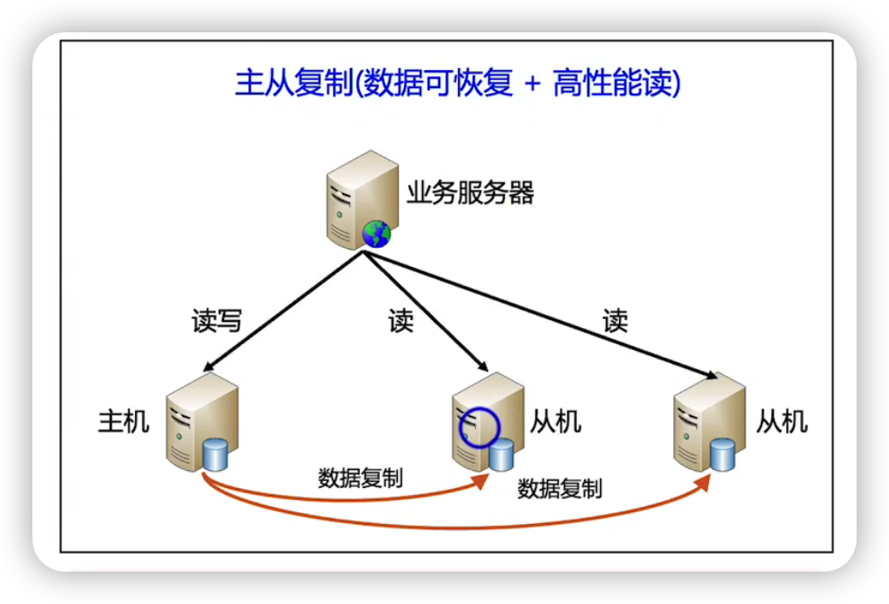

主从复制

原理--->通过叠加提升读性能

主机负责读写请求，从机负责读请求

如果主机发生故障，需要人工的去把从机切换成一台主机

核心目的：数据可恢复+高性能读

主从与主备的优缺点

优点：实现简单，只需要数据复制，无状态检测和角色切换

缺点：需要人工干预，RTO比较大

## 主备级联复制 

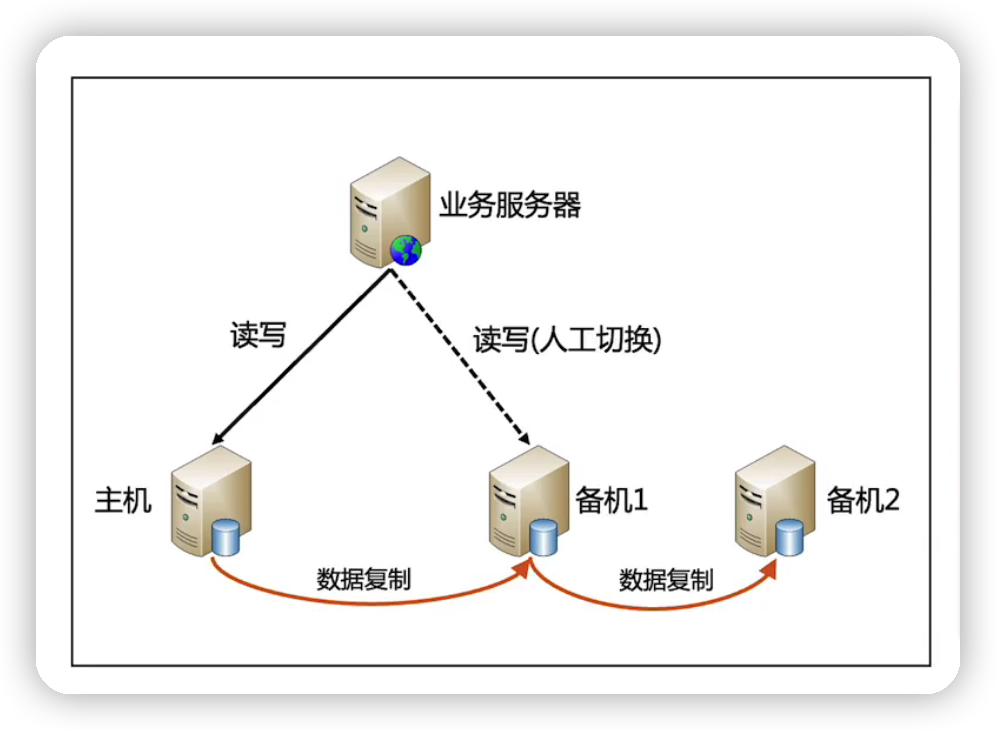

变化：备机作为复制源，例如图中备机1是备机2的复制源

优点：主机故障后，切换到备机1之后，方便快捷，只需修改配置即可（图中虚线部分），无需修改备机2的配置，无需判断备机1和备机2的数据覆盖问题

缺点：备机1对备份非常关键，备机1宕机会导致两台备机都备份失败

应用：mysql，redis支持这种模式

$\textcolor{red}{主从架构一般不采用这种级联复制}$

因为主从架构中，从机是要提供读请求的，这样的话 从机往备机2的复制延迟会很长

## 主备架构的灾备部署

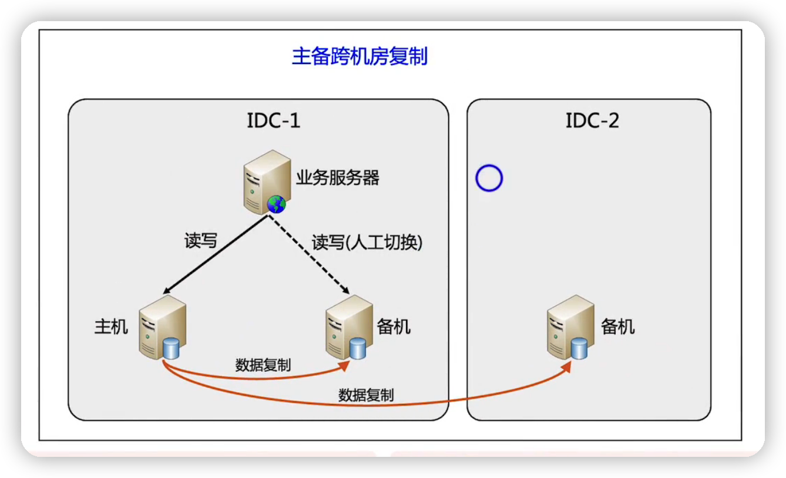

场景1

IDC-1与IDC-2在同一城市，可以用在机房级别的灾难

场景2

IDC-1与IDC-2不在同一城市，可以应对城市级别的灾难

## 主从架构的灾备部署

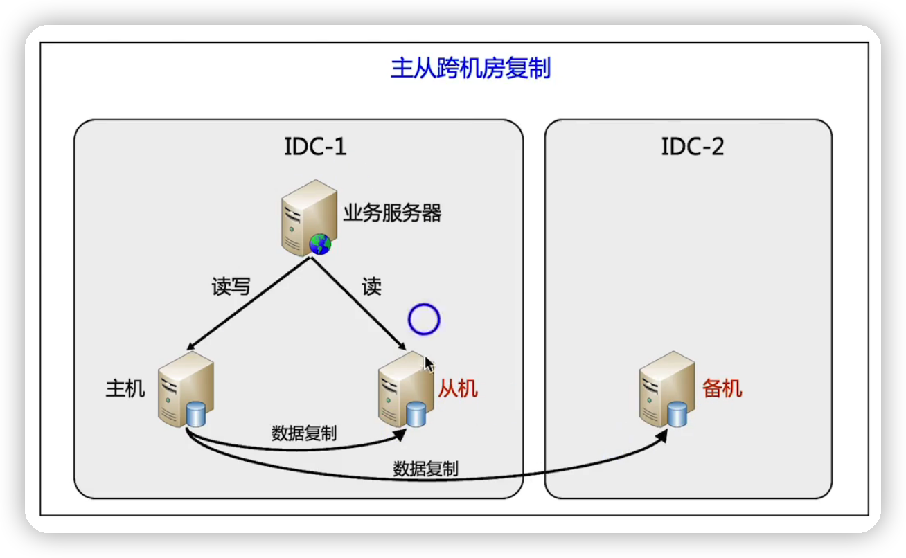场景1

IDC-1与IDC-2在同一城市，可以用在机房级别的灾难

场景2

IDC-1与IDC-2不在同一城市，可以应对城市级别的灾难

为什么不把IDC-2的备机改成从机提供读取服务

因为从机的复制延迟，因为IDC-1与IDC-2有可能分部在地里位置上相距较远的两个机房，所以复制延迟会比较高，业务服务器去跨机房读取从机的话，本身跨机房读取性能就低，加上主从延迟又长， 有可能带来业务上的各种问题。所以不合适

## 案例

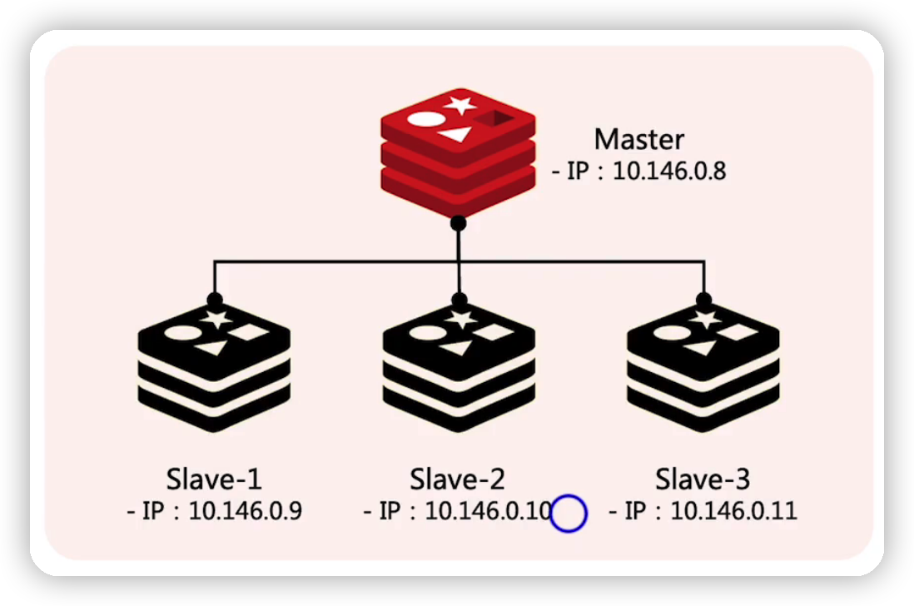

redis的 master Slave是属于主从架构的

## 双机切换-->主备切换

上面的主备与主从架构 ，系统是没办法自己去切换的，需要人工干预，比如需要改配置或者重启机器之类的来完成备机或者从机到主机的切换

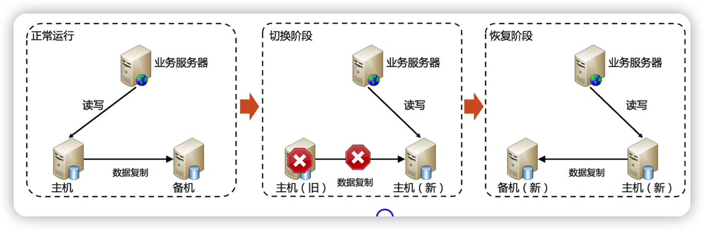

双机切换-->系统自己做了切换的功能，不需要人工干预，一点发现主机有问题，备机或者从机自动升级为主机

优点：可以自动实现故障恢复，RTO短

缺点：实现复杂，需要实现数据复制、状态检测、故障切换、数据冲突处理

应用：内部系统，管理系统（因为这两系统数据变更的频率不高，也就是数据出现冲突的概率不高）

如果应用到线上系统，如果写入速率比较高，一旦出现冲突，需要人工修复数据，需要人工的投入就比较多

## 双击切换-->主从切换

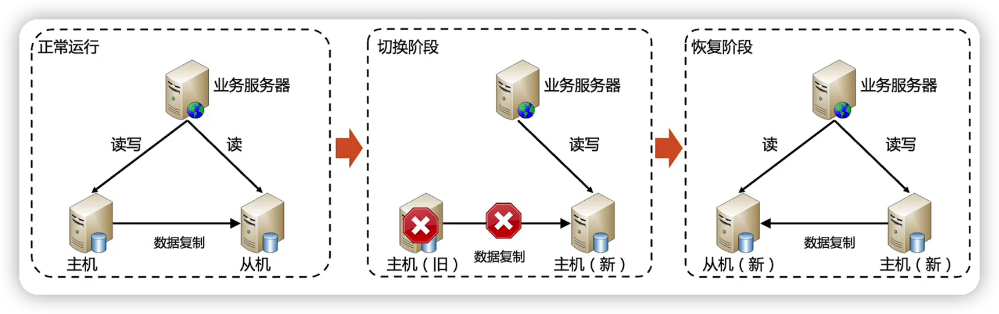

整体与主备切换类似，差异在于 切换阶段

风险：单台主机无法支撑所有的读写请求，有可能切换之后反而把新的主机又给压垮了

## 集群选举

与双机切换的主备主从架构的差异就是 从机或者备机可能有多台

所以需要从多台备机或者从机选举出一个主机

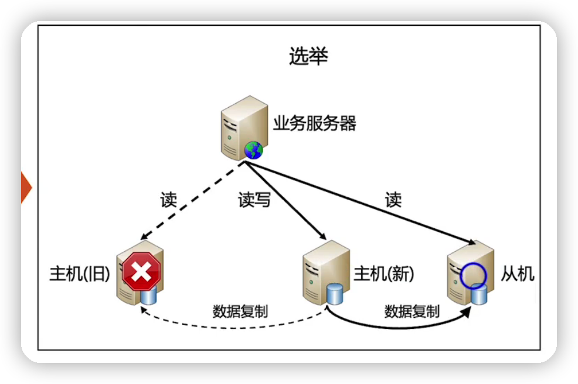

优点：可以自动实现故障恢复，RTO短，可用性更高

缺点：实现复杂，需要实现数据复制、状态检测、选举算法、故障切换、数据冲突处理

应用：通用，如redis，mongodb等

## 集群选择案例

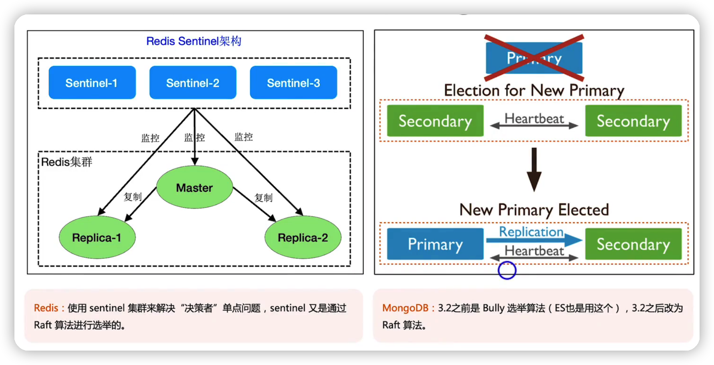

## 最佳实践-》基于zookeeper实现

如果自己实现集群选举，基于zookeeper比较好

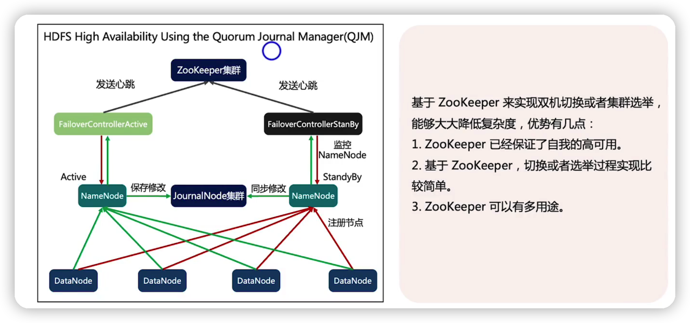

## 总结

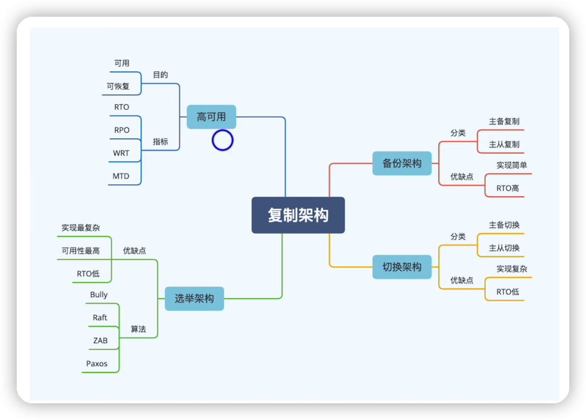

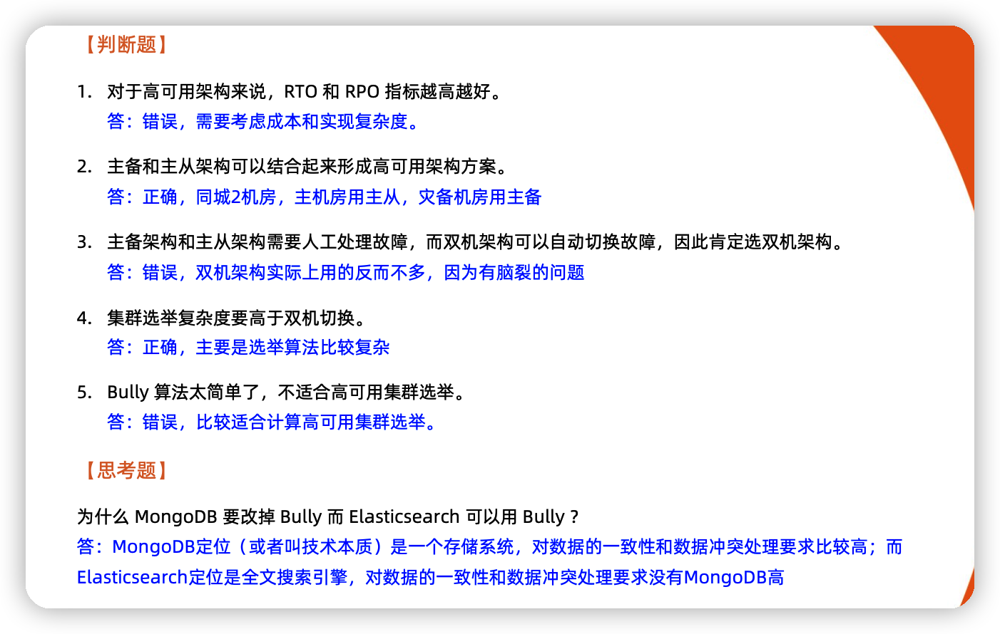