复制架构的特征

1. 主机承担所有的写请求
2. 所有的机器存储了同一份数据

如果业务增长越来越大，或者写入请求越来越多，数据存储量越来越大，自然会触达单机的写入瓶颈和存储瓶颈

解决方法：分片架构/分区架构

## 分片架构

复制架构向分片架构演进

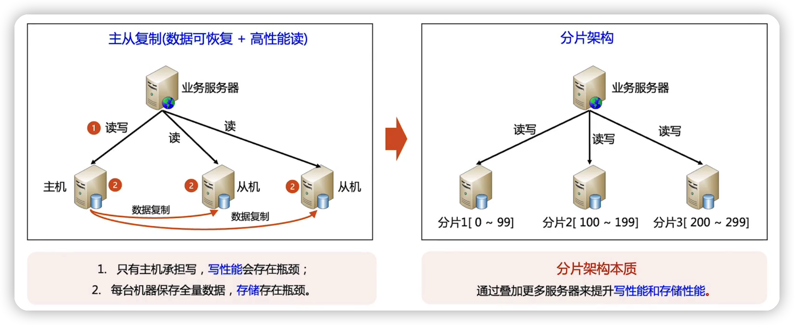

本质：叠加更多服务器，提升写性能与存储性能

将服务器或者数据分成很多的分片，每一个服务器存储一段范围。

通过不同的服务器存储不同的数据，就能解决复制架构的瓶颈

###  设计核心复杂度

分片规则：数据按照什么规则分片

路由规则：业务服务器如果找到数据

### 分片架构设计核心->分片规则

- 核心原则：选择**基数**比较大的某个数据键值，让数据**均匀**分布，避免热点分片
  - 基数：被选的数据维度取值范围（比如从数据库中挑选 订单这个维度的数据）
  - 均匀：数据在取值范围内是均匀分布的（比如订单这个维度的数据存储在分片上是均匀的）
- 分片数据-->如何去选取基于什么类型去分片，一般有两种方式
  - 主键：适合主业务数据，例如数据库分片常用的用户id，订单id，redis分片的key，mongodb的文档id
  - 时间：适合流水型业务，例如创建时间，Iot事件，动态
- 分片规则-->选取基于什么类型区分片之后，指定分片的规则，一般有两种
  - hash分片：sharding key = hash(原始键值)
    - 优点：分布均匀
    - 缺点：扩容服务麻烦，需要进行数据迁移（新增加服务器之后，需要很复杂的数据迁移，才能让数据均匀的分布在不同的分片之间），范围查询需要到每一个分片一个一个去查询，效率低
  - 范围分片：利用范围来进行分片。如果订单的数据，每三个月进行一个分片
    - 优点：方便扩容新服务器，无须迁移历史数据。支持范围查询，比较方便。
    - 缺点：分布可能不均匀。比如京东618的订单肯定比平时的订单数据量大

### 分片架构设计核心->路由规则

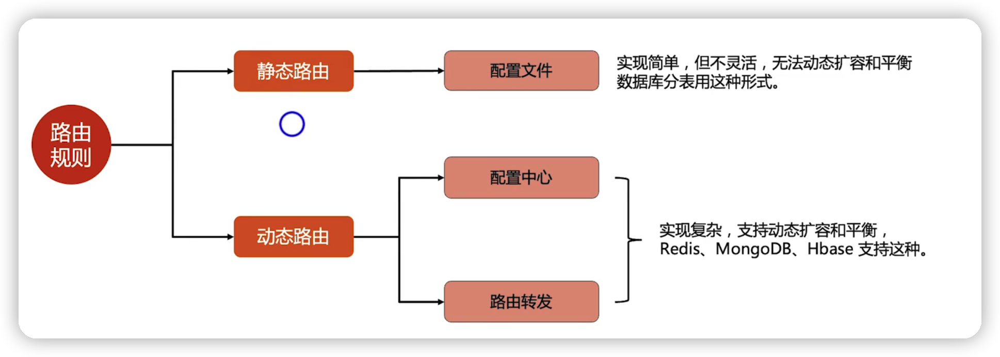

- 静态路由：通过配置文件告诉业务服务器A数据在哪个分片上，B数据在哪个分片上
  - 优点：实现简单但是不够灵活，没办法做到动态扩容与平衡。一般数据库分表会用到这种形式
- 动态路由：路由是在系统运行中是可以动态变化的，有两种实现方式
  - 配置中心--->有个地方来集中管理数据跟分片服务器的一个对应关系
  - 路由转发--->没有一个集中的地方来管理数据跟分片服务器的对应关系，但是分片服务器之间互相知道数据的一个分部情况。当某一个分片收到一个读写请求，发现这个数据不在自己分片上，它可以转发请求到对应的分片 
  - 优点：支持动态扩容和平衡，redis/mongodb/hbase支持这种
  - 缺点：实现比较复杂

为什么数据库不做动态路由

数据库的数据对一致性(ACID)的要求是非常高的，比redis mongodb hbase这种存储系统要求高很多

如果做动态路由，看起来能够实现动态扩容跟平衡，但是实现复杂度与难度 远远超过像redis mongodb这种对一致性要求不高的系统	

#### 分片动态路由->配置中心

mongodb的配置中心叫config servers来存储分片路由信息

hdfs的配置中心叫namenode来存储分片路由信息

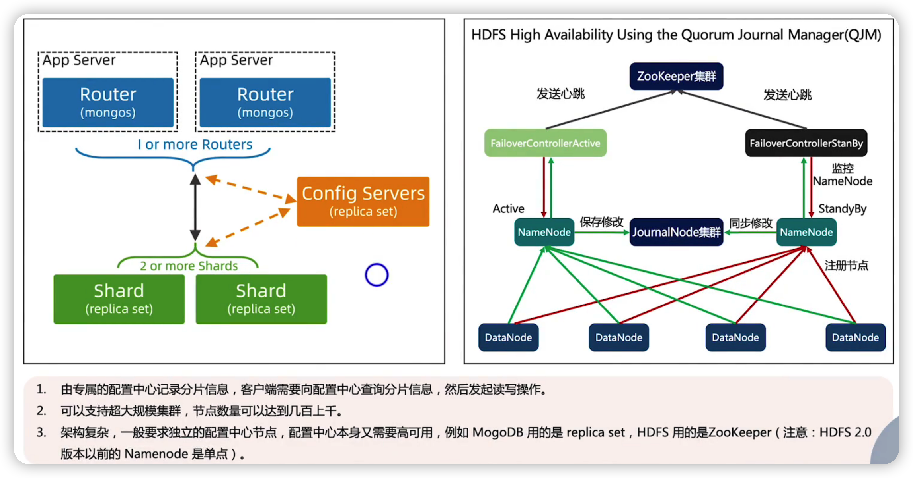

优点：支持超大规模集群，节点数量可以达到几百上千

缺点：架构复杂，要部署独立的配置中心节点，而配置中心本身又要高可用

#### 分片动态路由->路由转发

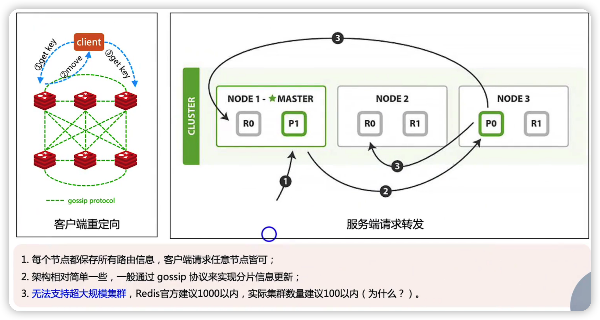

优点：架构简单，一般通过gossip协议来实现分片信息更新

缺点：无法支持超大规模集群(因为当集群数量增多时，集群之间同步数据会越来越多，对整个系统性能会有一定影响)

### 分片架构高可用

#### 独立备份

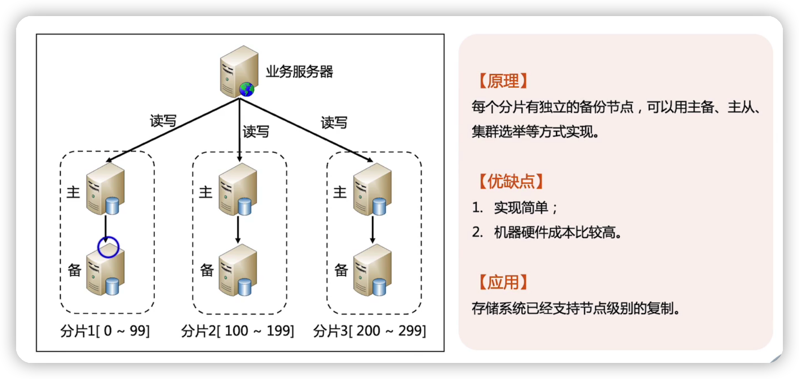

#### 互相备份

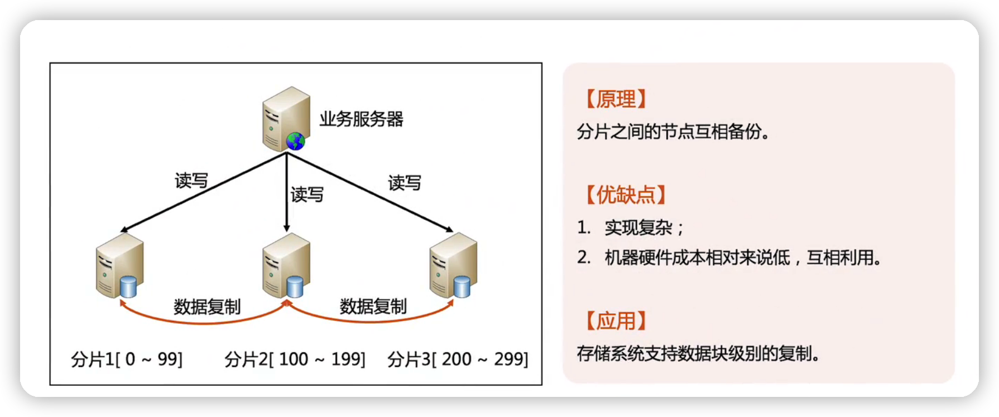

#### 案例

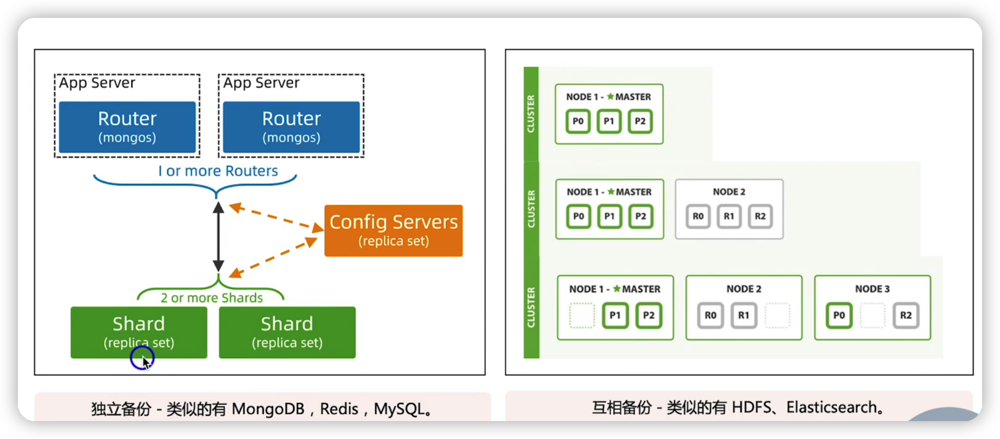

## 分区架构

使用分片架构后，当业务量再增长，分片架构也面临瓶颈

- 分片架构无法应对城市级别的故障

- 分片架构部署在一个地方，那么离这个地方很远的用户，他们访问的性能就会有问题。

这就是分区架构的目的

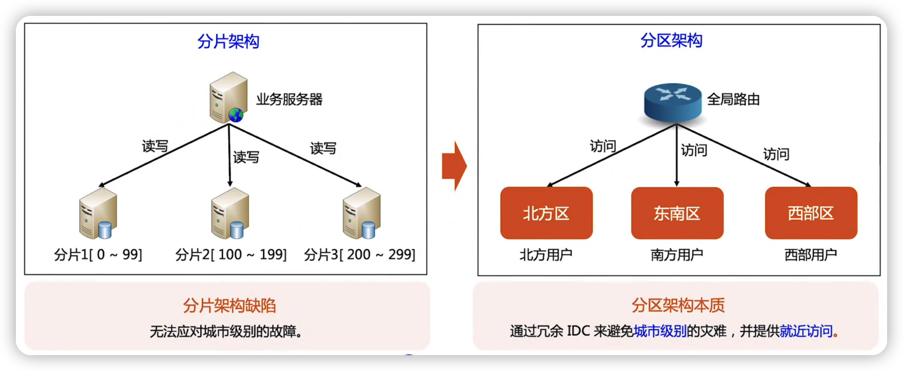

本质：通过冗余更多的机房与数据来避免$\textcolor{red}{城市级别}$的灾难，并且提供$\textcolor{red}{就近访问}$

分片架构可以跨城市部署吗

分片架构跨城市部署，城市离的很远，那么分片架构的性能会急剧下降，就达不到提升系统性能的目的了

所以分片架构不会跨非常远的机房去部署

### 分区架构路由

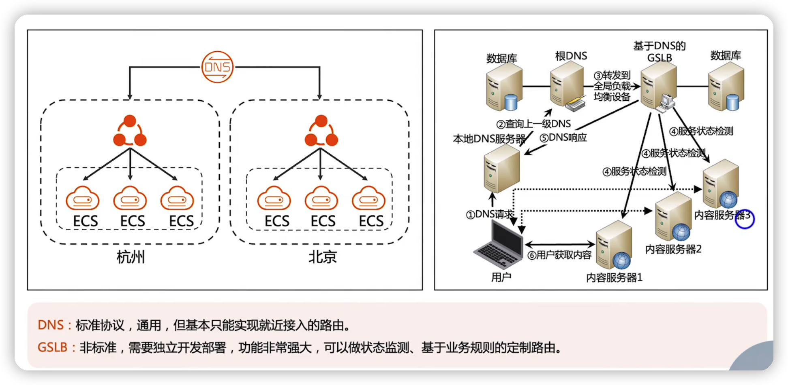

### 分区架构的备份策略

#### 集中式

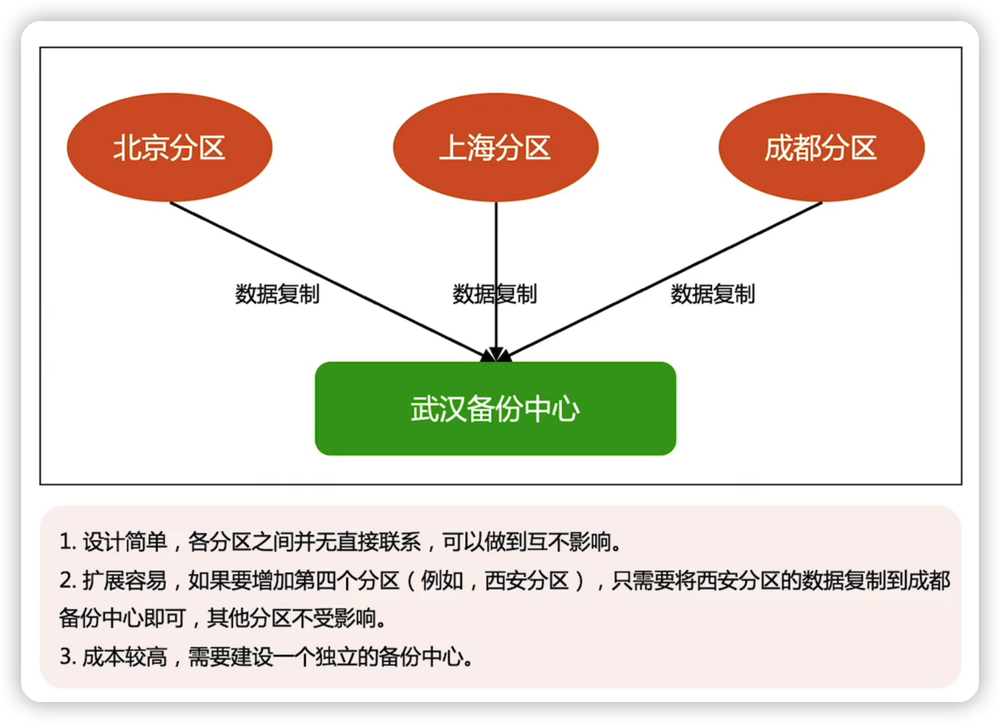

#### 互备式 	

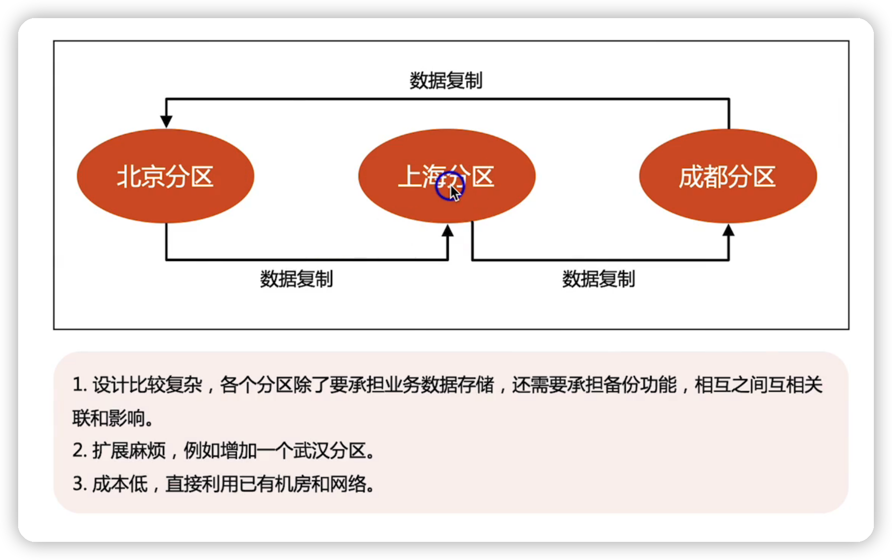

#### 独立式

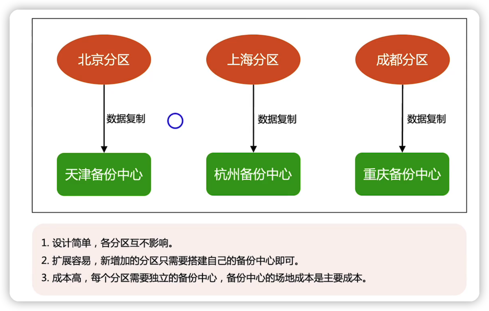

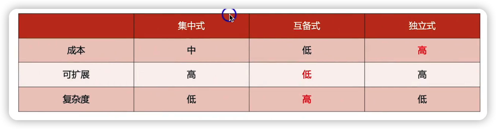

## 总结

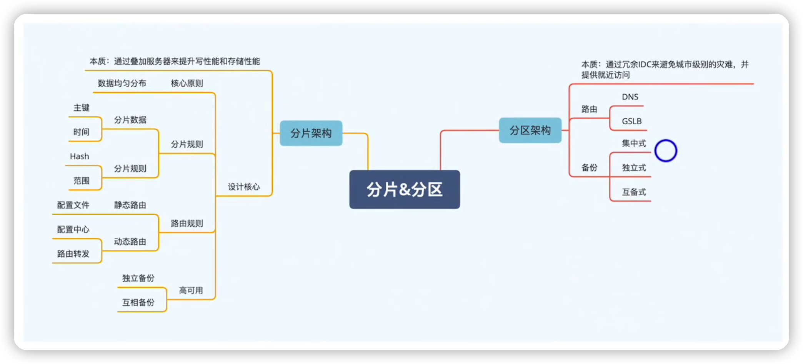

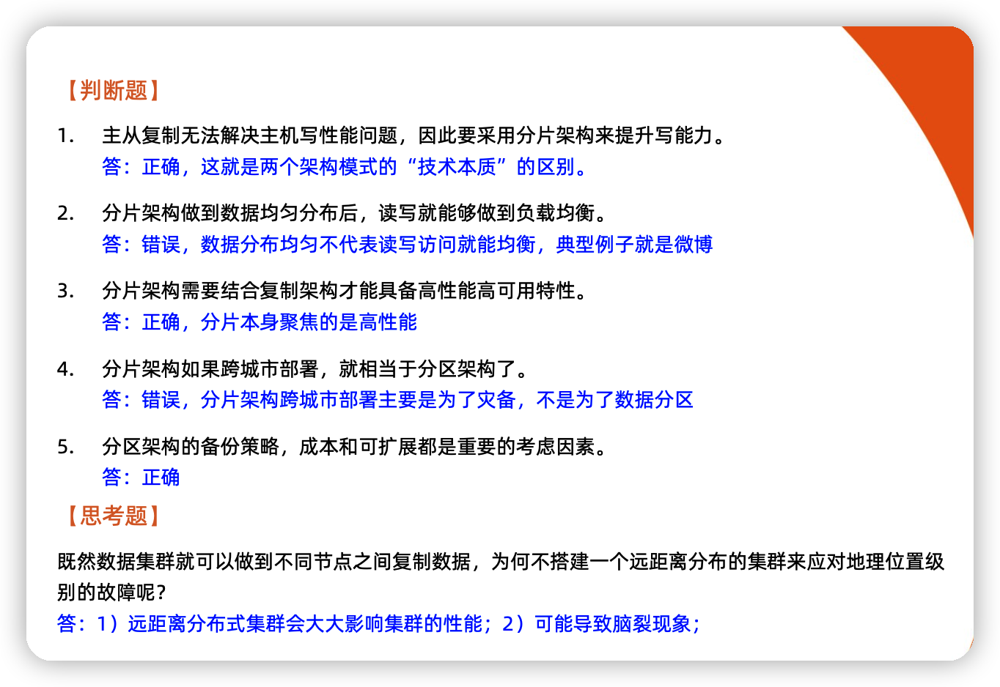