> 技术本质决定应用场景，技术细节决定具体方案

## 如何快速学习一个存储系统

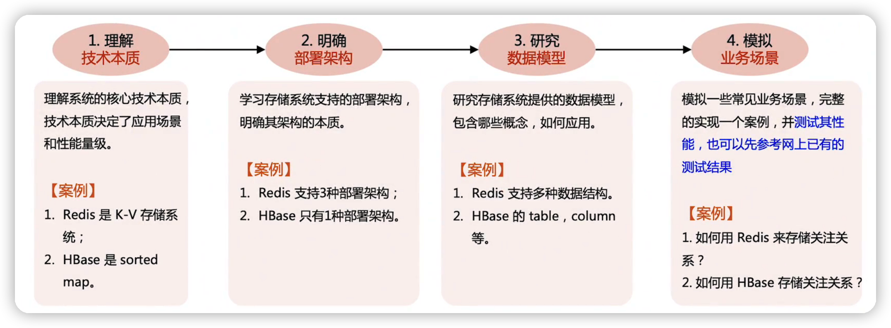

去官方文档学习

## redis

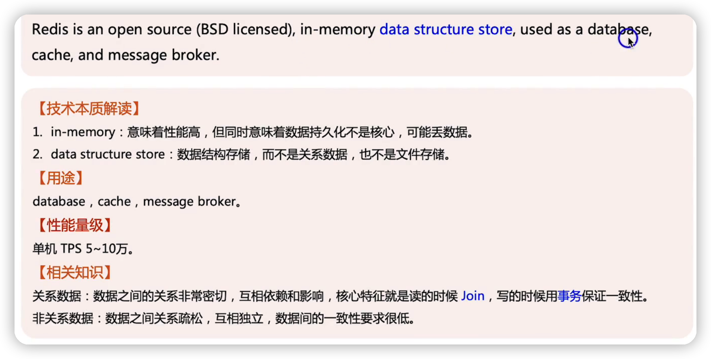

部署架构

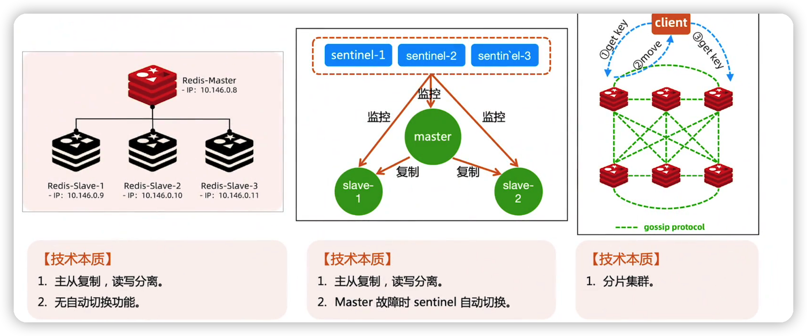

数据模型

### 模拟业务案例：关注列表

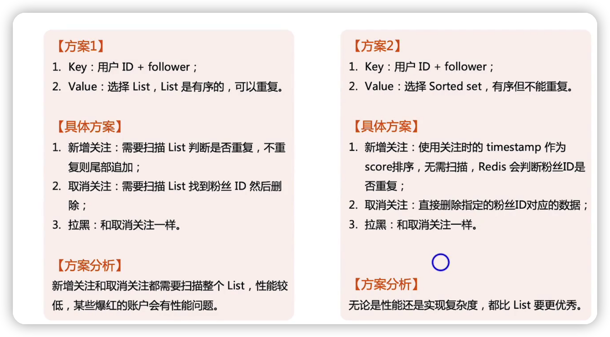

## hbase

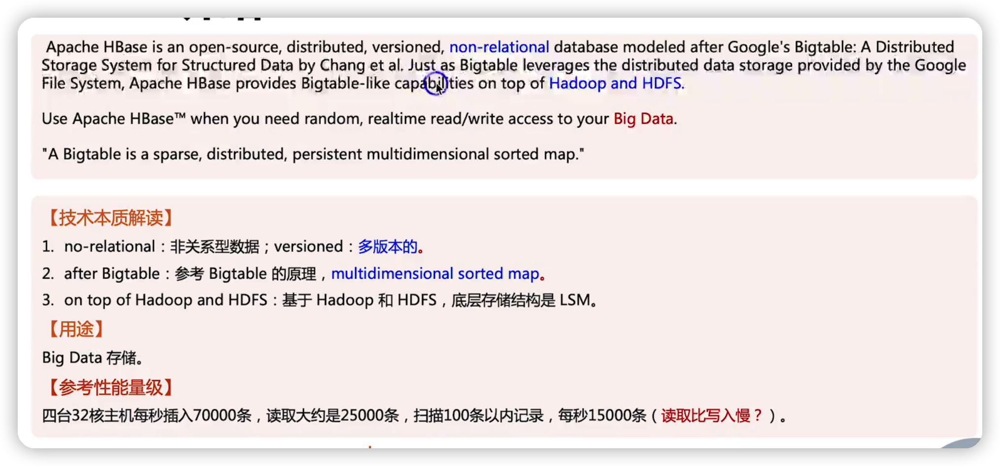

部署架构

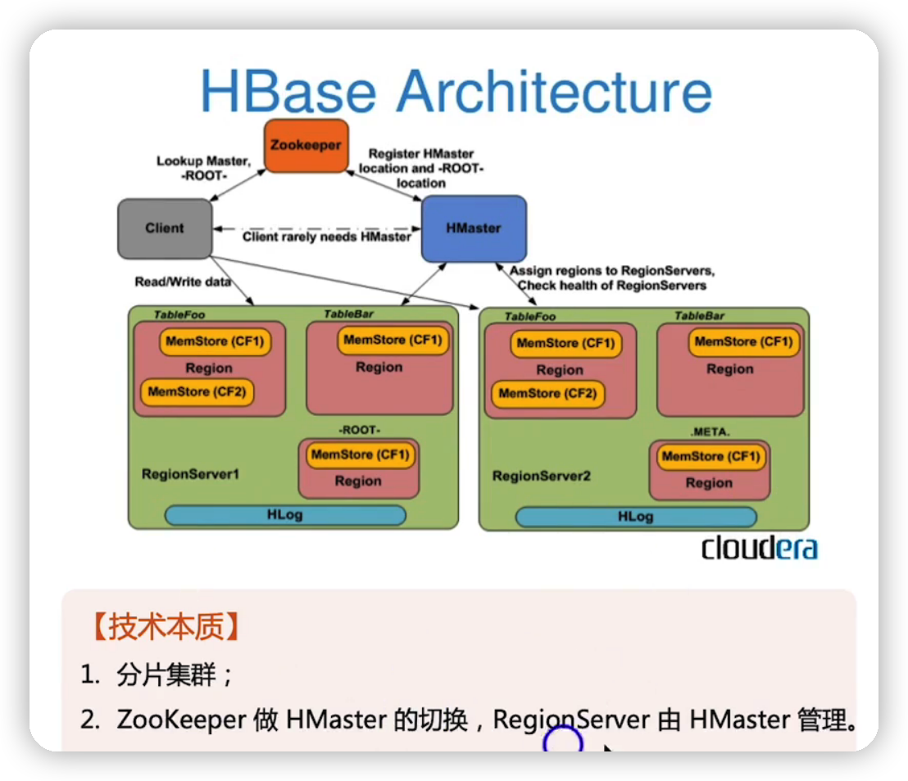

数据模型

### 模拟业务案例：关注列表

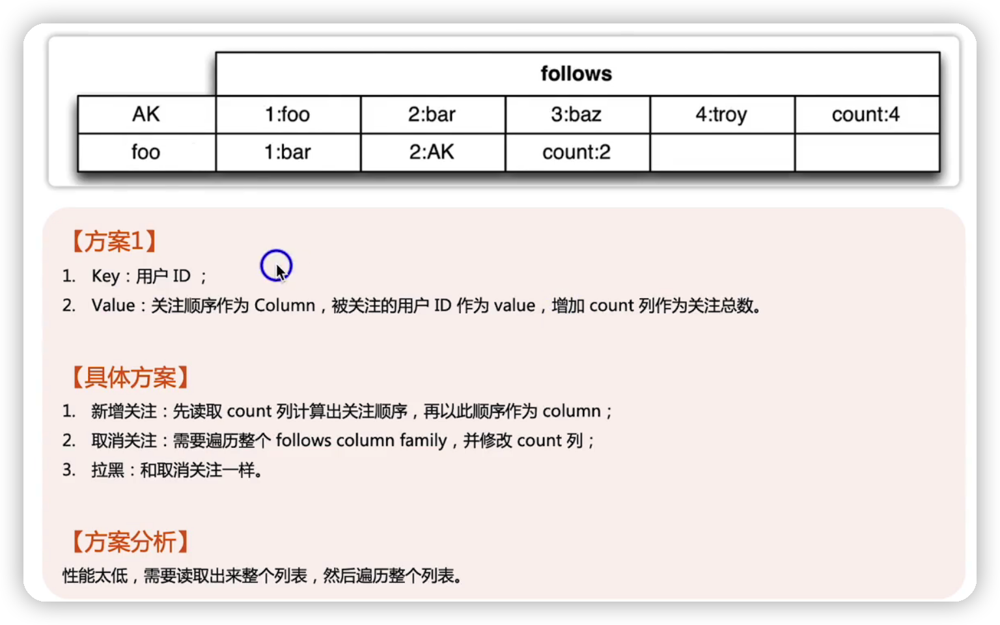

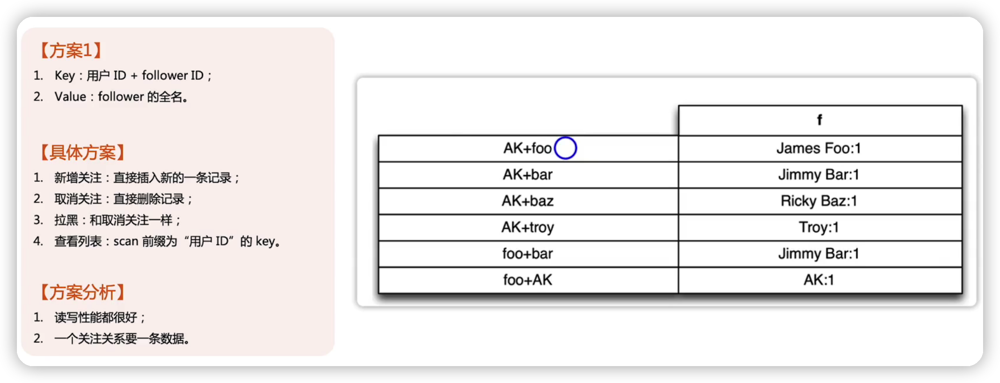

## HDFS

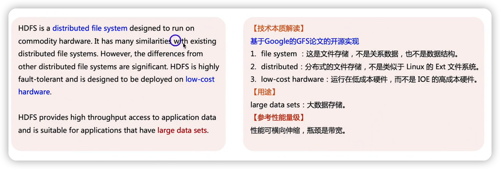

部署架构

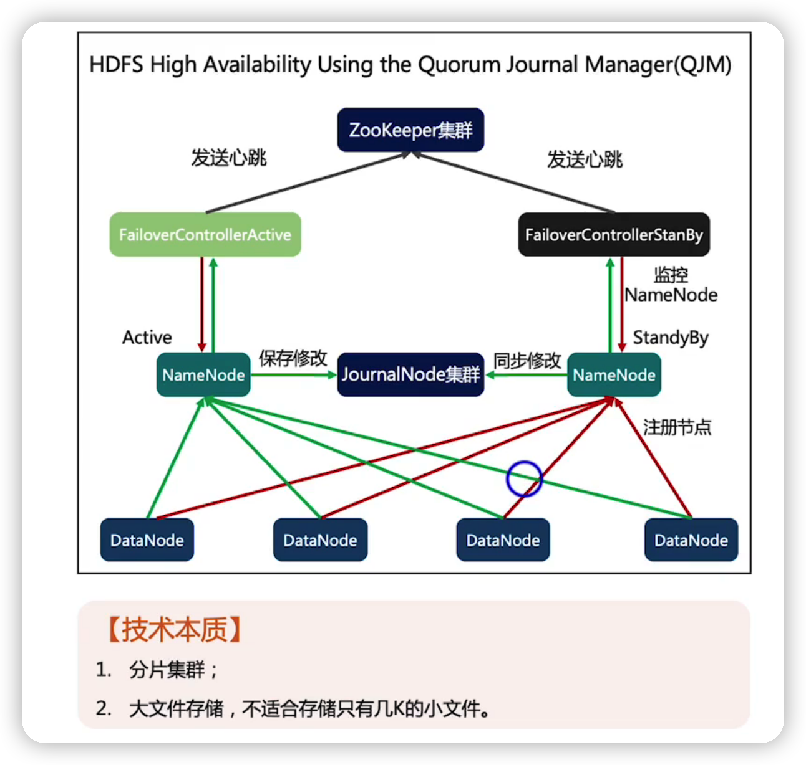

数据模型

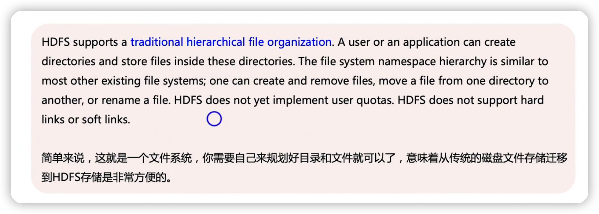

## clickHouse

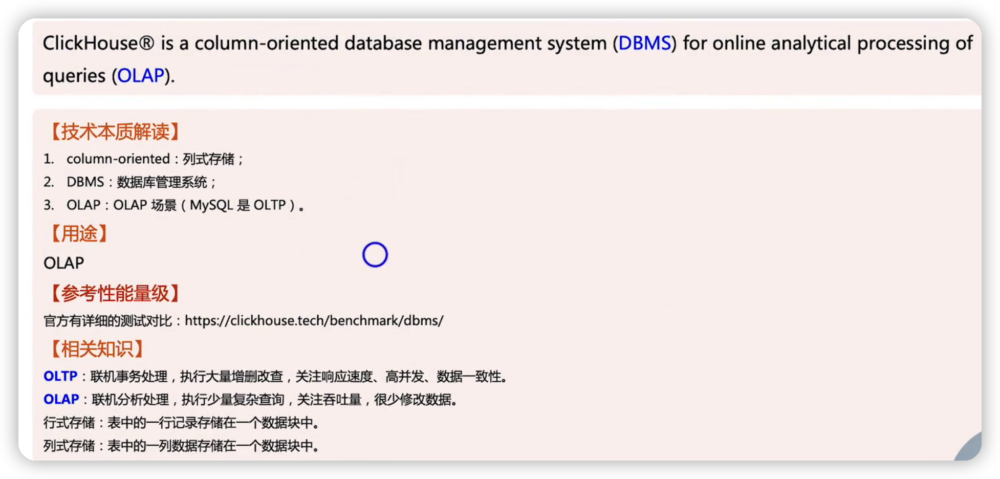

部署架构

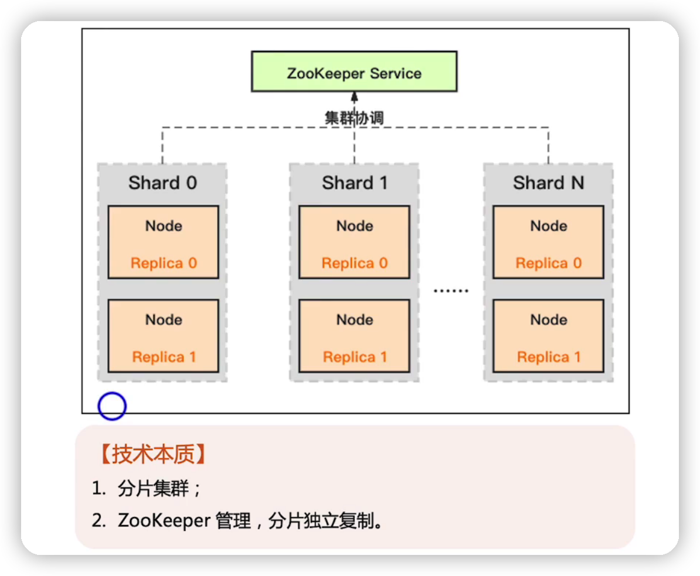

数据模型

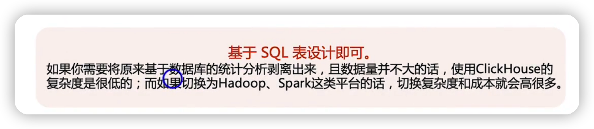

## 总结

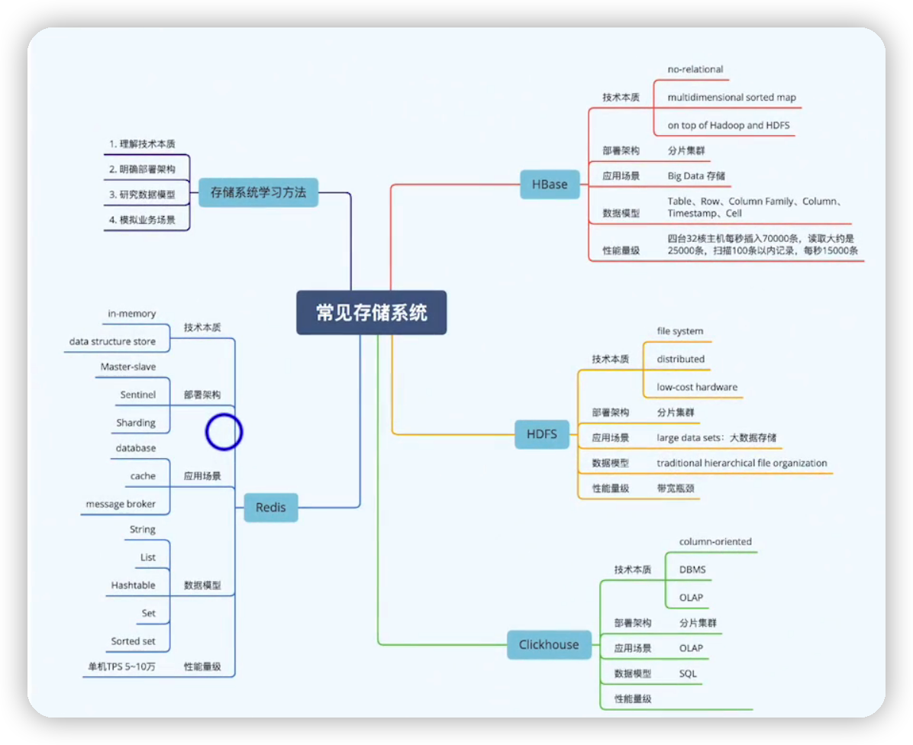

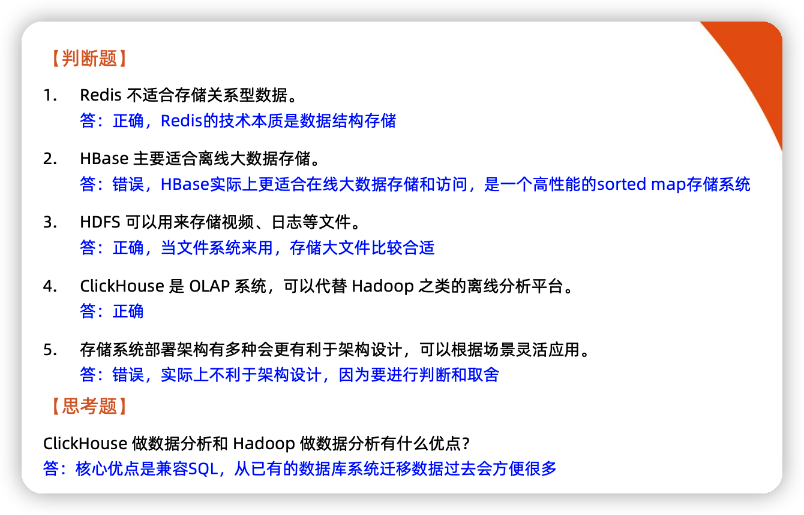