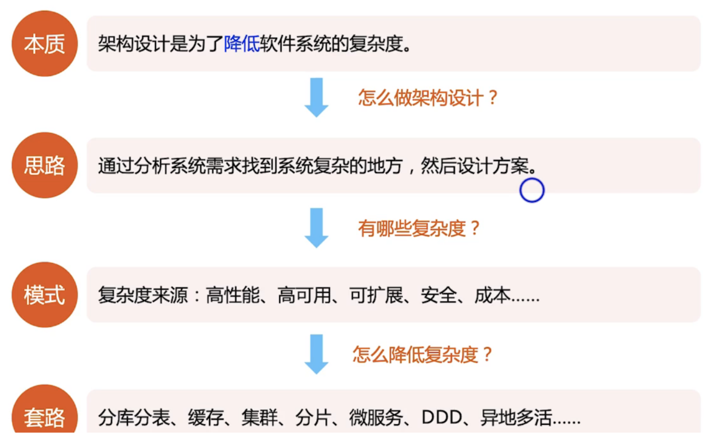
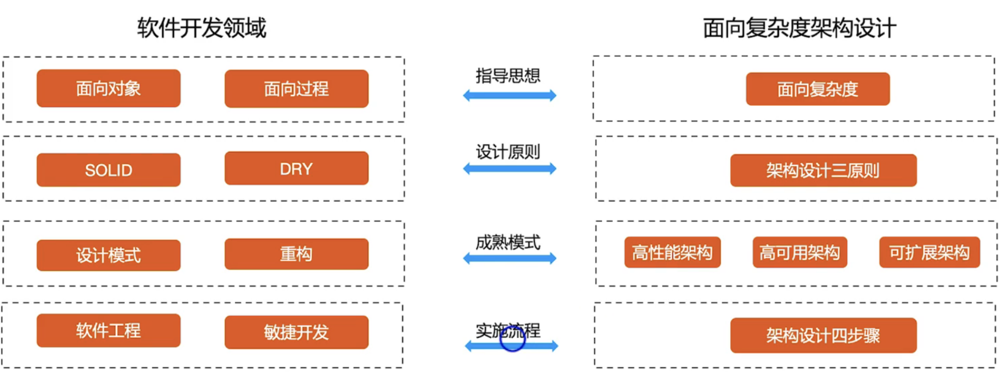
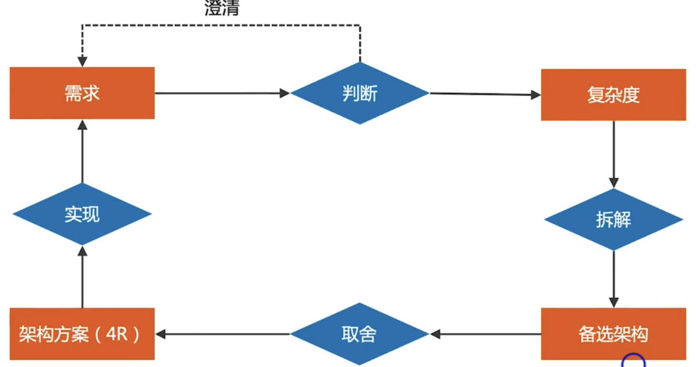

## 什么是面向复杂度架构

面向复杂度架构设计 是一种架构设计模式，它针对系统的复杂度，来对系统进行设计，以下是这种模式的具体解释

### 设计逻辑

### 设计体系

### 设计流程

## 架构设计三原则

- 合适原则
  - 宣言：合适优于业界领先
  - 原因：
    - 资源约束
    - 时间积累
    - 业务北京
- 简单原则
  - 宣言：简单优于复杂
  - 原因：
    - 越复杂越不可靠
    - 越复杂越难扩展
    - 越复杂越难处理问题
- 演进原则
  - 宣言：演化优于一步到位
  - 原因：
    - 软件可变性
    - 环境可变性

