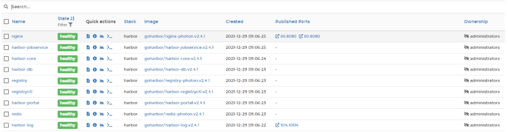
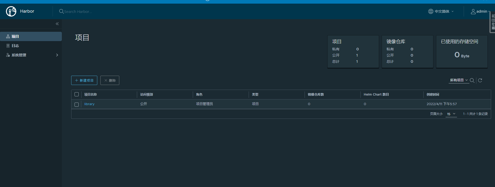

[TOC]

## 安装Docker Compose

安装docker compose 需要python 

如果已经安装python则直接安装docker compose文件即可

```shell
# 下载docker compose
$ curl -L https://github.com/docker/compose/releases/download/v2.4.1/docker-compose-linux-x86_64
# 将docker compose移动到/usr/local/bin
$ mv docker-compose  /usr/local/bin/
# 赋运行权限
$ chomd +x /usr/local/bin/docker-compose
# 查看是否安装成功
$ docker-compose  --version
```

## 安装harbor

```shell
$ wget https://github.com/goharbor/harbor/releases/download/v2.3.2/harbor-offline-installer-v2.3.2.tgz
# 解压
$ tar zxf harbor-offline-installer-v2.3.2.tgz
cd harbor
# 将配置文件模板copy出一份作为配置
cp harbor.yml.tmpl harbor.yml
# 修改配置文件
vim harbor.yml
  #修改 hostname: 192.168.102.201  # 主机ip
  #注释掉https模块
  #修改harbor_admin_password:
# 启动安装
./install.sh --with-trivy --with-chartmuseum
```

安装完成之后，可以去Portainer看一下运行起来的容器



可以看到容器都启动起来了，其实`install.sh`脚本会先根据配置文件生成config配置文件，然后生成`docker-compose.yml`

最后便是执行`docker-compose up -d`命令启动容器。


在`docker-compose.yml`中，我们可以看到整个Harbor的安装需要`harbor-log`、`registry-photon`、`harbor-registryctl`、`harbor-db(postgresql)`、 `harbor-core`、`harbor-portal`、`harbor-jobservice`、`redis-photon（redis）`、`nginx-photon(nginx)`这些组件。

## 访问harbor

http://139.24.236.89/

然后输入用户名与密码就可以启动




## 配置docker私有仓库ssh

编辑`daemon.json`文件配置`insecure-registries`

```shell
 $ vim /etc/docker/daemon.json
     {
      "insecure-registries":["192.168.102.201:80","192.168.102.202:80"]
     }
```

然后重启docker

```shell
$ systemctl restart docker
$ systemctl daemon-reload 
```

查看配置是否成功

```she
#查看docker info是否配置私服地址成功；
$ docker info 
```


## 操作harbor 

在harbor上建立一个仓库


登录harbor

```shell
$ docker login -u admin  -p Harbor12345 139.24.236.89:80
```

给镜像打tag

```shell
# 格式 docker tag 镜像名字:版本   ip:端口/仓库/镜像名:版本号   
$ docker tag grafana/grafana:1.0 192.168.0.105:80/test/grafana:1.0
```


推送镜像

```shell
# 格式 docker push  ip:端口/仓库/镜像名:版本号
$ docker push 192.168.0.105:80/test/grafana:1.0
```

拉取镜像

```shell
# 格式 docker pull ip:端口/仓库/镜像名:版本号
$ docker pull 192.168.0.105:80/test/grafana:1.0
```


## 其他问题

Harbor.core 一直在starting状态

解决方法：找到Harbor安装目录，执行./install  重新继续安装，它只会删除之前的镜像，数据不会丢失


harbor推送镜像一直报443

解决方法：因为push的时候 需要加端口号

## TODO


> 参考链接：
>
> https://baijiahao.baidu.com/s?id=1722166923830932108&wfr=spider&for=pc
>
> https://www.cnblogs.com/marathoner/p/15768023.html
>
> https://blog.csdn.net/kwame211/article/details/104547224/