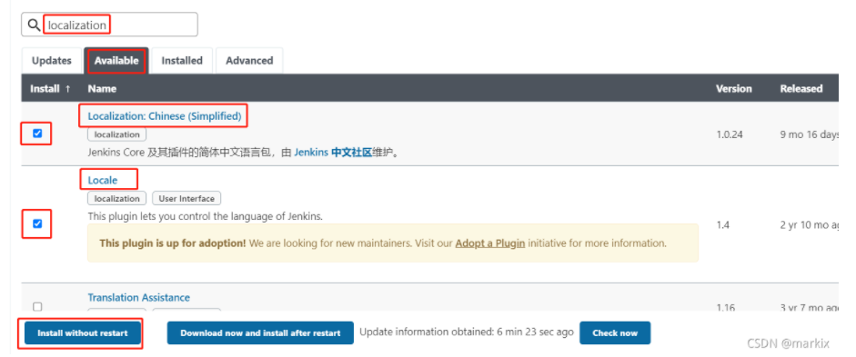
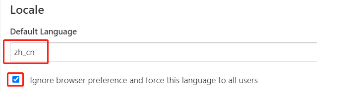
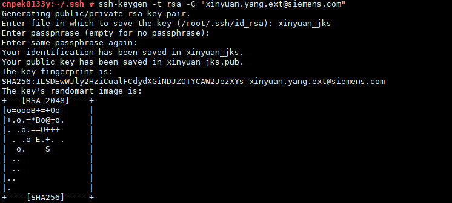
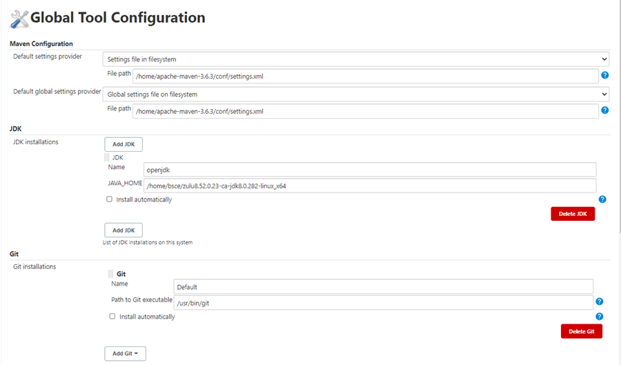
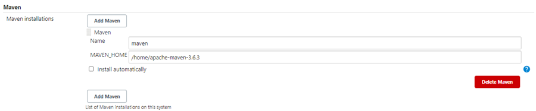
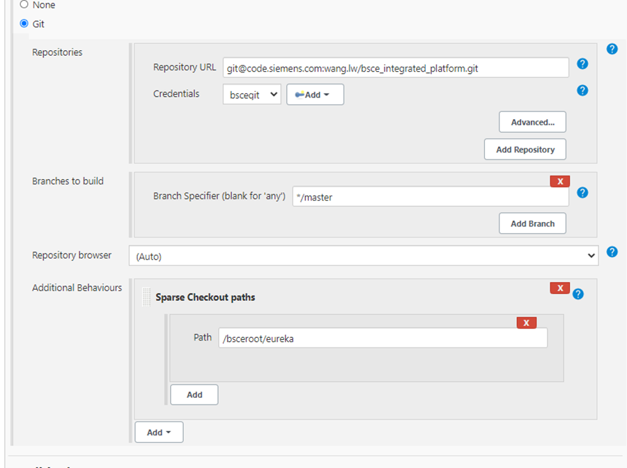
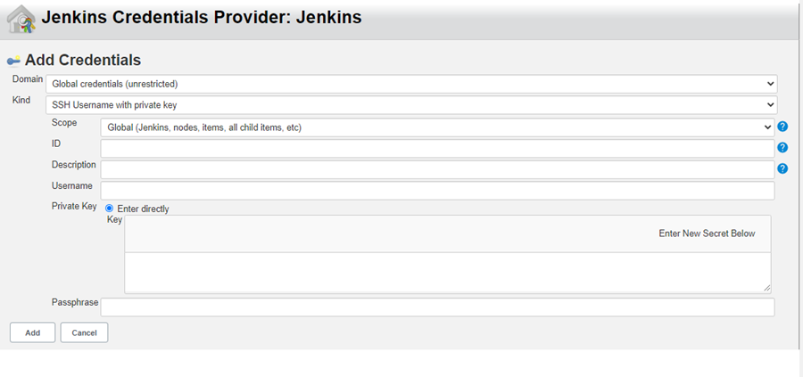
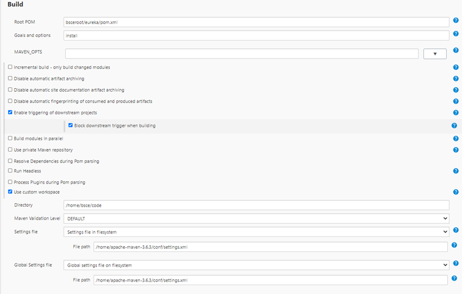
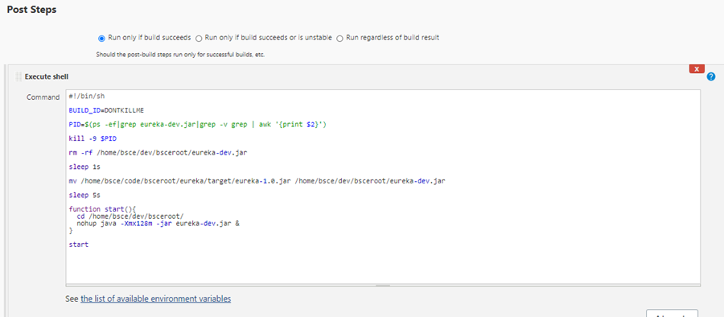

##  安装与部署

### 环境

docker 19.03.13

### 安装

下载docker镜像

```shell
$ docker pull jenkins/jenkins
```


建立挂载的文件

```shell
$ mkdir jenkins_mount
$ chmod 777 jenkins_mount/
```


设置镜像源

```shell
$ cd  jenkins_mount
$ vi   hudson.model.UpdateCenter.xml
# 将镜像改为 https://mirrors.tuna.tsinghua.edu.cn/jenkins/updates/update-center.json （清华大学官方镜像）
```


启动容器

```shell
$ docker run -d -p 8081:8080  -v /home/z0049huj-a01/jenkins_mount:/var/jenkins_home -v /etc/localtime:/etc/localtime --name jenkins jenkins/jenkins

```

初次登录jenkins

```shell
# 需要输入默认管理员密码，这个密码在这个文件夹
$ cat /jenkins_mount/secrets/initialAdminPassword
```

### 汉化

jenkins中文需要安装两个插件`Locale` 插件和 `Localization: Chinese (Simplified)` 插件

- 先进入插件管理页面	**首页 > Manage Jenkins > System Configuration（Manage Plugins）**



- 重启jenkins

- 配置中文显示

  - 进入**首页 > Manage Jenkins > System Configuration（Configure System） > Locale（Default Language）**  
  - 输入 zh_cn保存

  


## 配置git打包发布

### 生成git的ssh-eky

1. 进入服务器运行ssh-key的生成命令

   - ssh-keygen -t rsa -C "xinyuan.yang.ext@siemens.com"     （邮箱添你的git邮箱）

   - 弹出来的直接三次回车

2. 将生成的**id_rsa.pub**文件的东西，copy到github或者gitlab的ssh秘钥里面

3. 将**id_rsa**赋值到jks中（全部赋值）

### jenkins配置项目

先配置jenkins的全局，将maven  jdk  git配置上，（maven   jdk    git 安装到本机服务器）






然后配置打包项目



Sparse Checkout paths，指向git仓库的某个子目录。--->是指打包git里面的某个子目录


然后配置git的 ssh-key  

使用 SSH Username with private key



最后配置build

Root POM指向仓库根目录下的子目录。

Use custom workspace设置服务器上存放下载代码的根目录。下载的代码会放入访目录。



然后配置打包之后的脚本




脚本参考

```shell
#!/bin/sh

BUILD_ID=DONTKILLME

PID=$(ps -ef|grep eureka-dev.jar|grep -v grep | awk '{print $2}')

kill -9 $PID

rm -rf /home/bsce/dev/bsceroot/eureka-dev.jar

sleep 1s

mv /home/bsce/code/bsceroot/eureka/target/eureka-1.0.jar /home/bsce/dev/bsceroot/eureka-dev.jar

sleep 5s

function start(){
  cd /home/bsce/dev/bsceroot/
  nohup java -Xmx128m -jar eureka-dev.jar &
}

start

```

