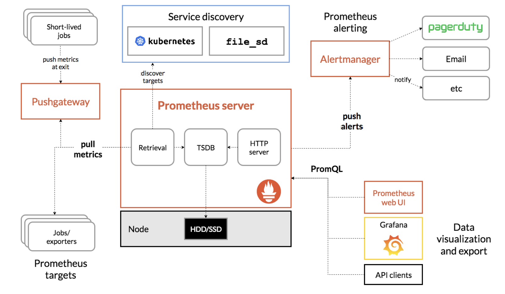
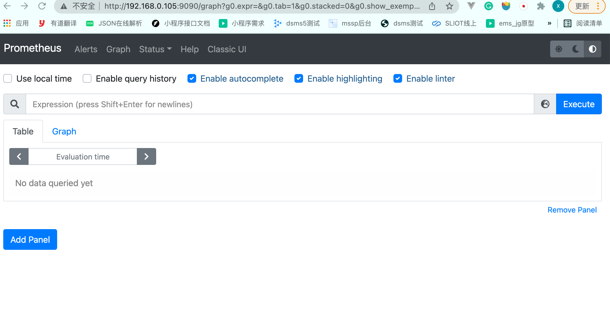
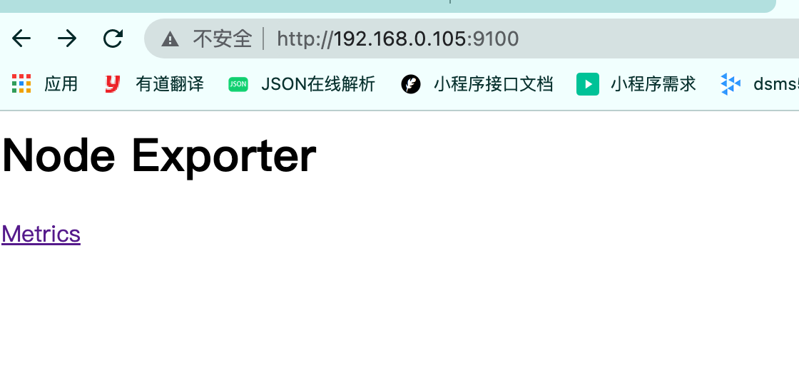
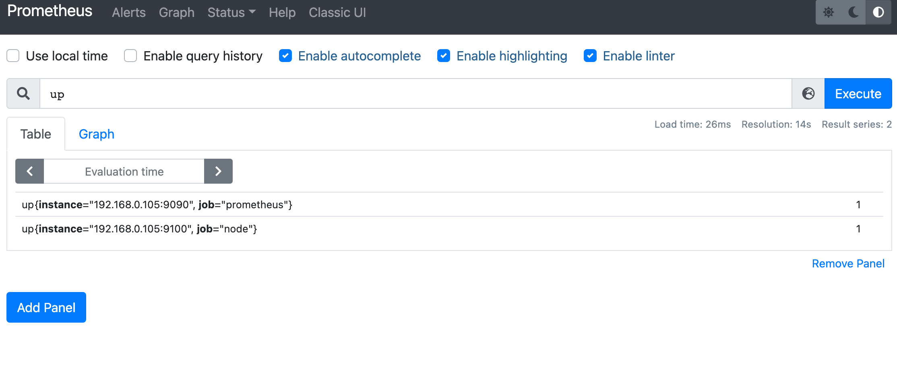
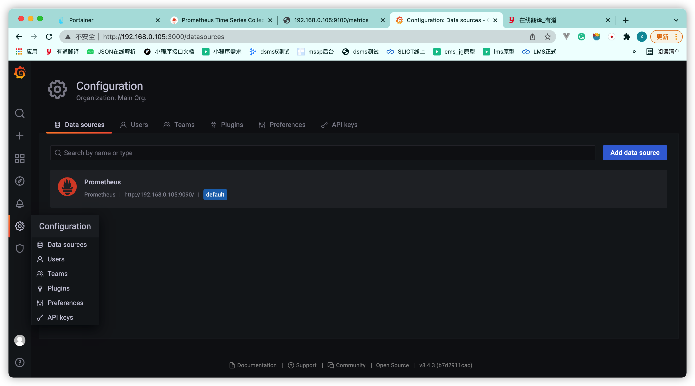
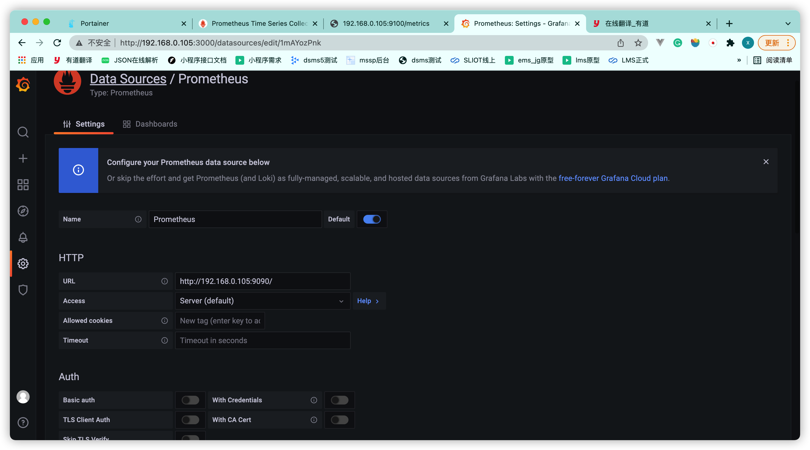
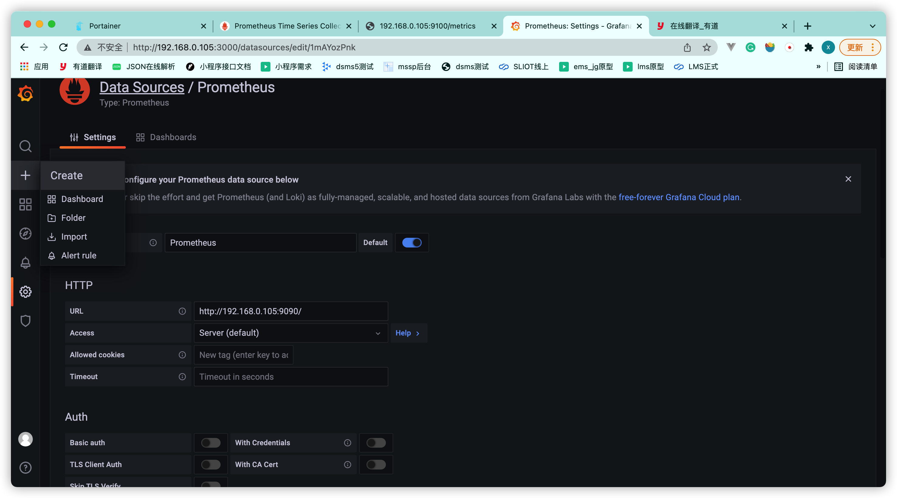
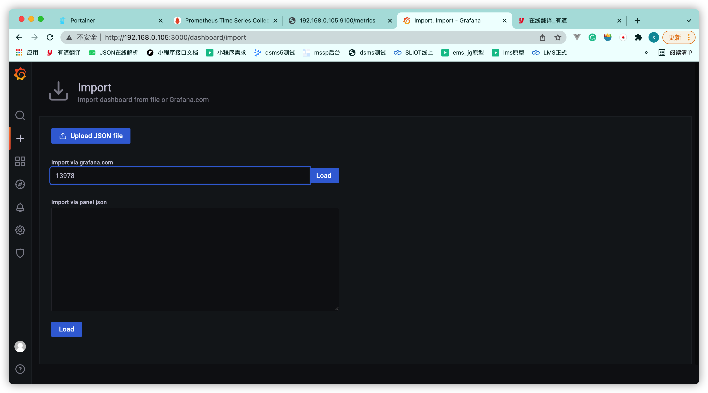
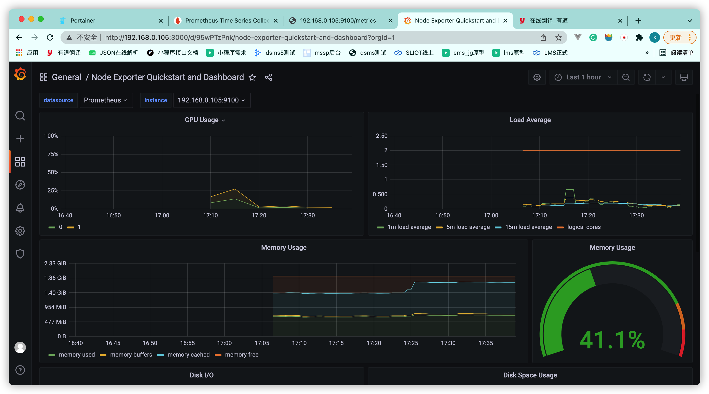
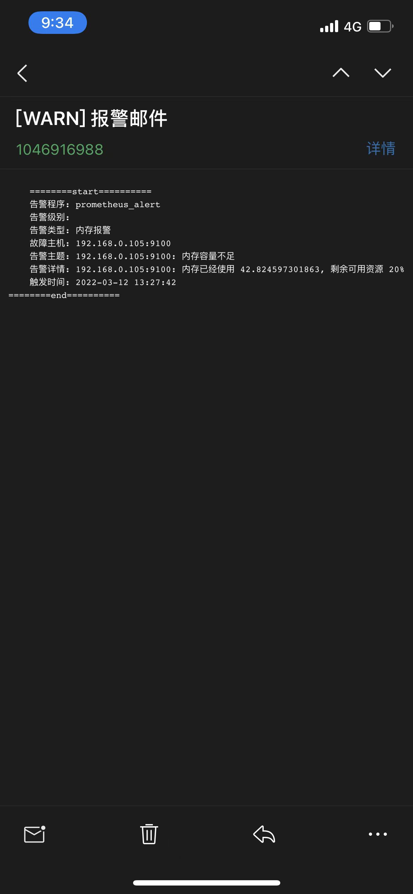

[TOC]

## 背景

我们需要一款可以监控服务器CPU，内存以及磁盘状态的软件，并且在服务器某个硬件超过负载的时候，需要对其服务器状态实行邮箱报警，以便于我们快速的去跟踪发现问题

### 解决方案

**Prometheus+ grafana**

prometheus 是一款可以监控服务器状态，并且还可以预警的一款软件，它支持监控服务器，DOCKER，k8s，等，功能强大。

grafana是一款数据可视化的软件，它与prometheus搭配，可以吧prometheus的监控数据可视化出来。

一句话，prometheus是生产数据，grafana是渲染数据


话不多说，让我们先了解下prometheus的具体框架




Node Exporter          负责采集主机的数据

Prometheus server 负责读取Node采集的数据，收集存储这些数据，并且向外提供数据查询，可以配置告警规则，还负责推送报警信息给AlertManager

AlertManager            负责将Prometheus server推送过来的报警信息，按照一定的配置，推送给钉钉/邮箱/或者其他

Grafana /Prometheus web UI/  API clients   可以通过Prometheus server独有的PromQL语句去server查询各种数据


Grafana                        可以与Prometheus  server完美配合，通过PromQL语句查询出的数据，完美渲染给网页

## 部署

环境：linux-ubuntu

我们部署这个架构，需要几个前置工作

1. 安装docker

2. 安装docker 可视化网页--》portainer

   

### 前置工作

#### 安装：docker

更新索引包

```shell
$ sudo apt-get update
```

安装 apt 依赖包，用于通过HTTPS来获取仓库:

```shell
$ sudo apt-get install \
    apt-transport-https \
    ca-certificates \
    curl \
    gnupg-agent \
    software-properties-common
```

添加 Docker 的官方 GPG 密钥：

```shell
$ curl -fsSL https://mirrors.ustc.edu.cn/docker-ce/linux/ubuntu/gpg | sudo apt-key add -
```

9DC8 5822 9FC7 DD38 854A E2D8 8D81 803C 0EBF CD88 通过搜索指纹的后8个字符，验证您现在是否拥有带有指纹的密钥。

```shell
$ sudo apt-key fingerprint 0EBFCD88

# 下面不是命令，而是打印的东西
pub   rsa4096 2017-02-22 [SCEA]
      9DC8 5822 9FC7 DD38 854A  E2D8 8D81 803C 0EBF CD88
uid           [ unknown] Docker Release (CE deb) <docker@docker.com>
sub   rsa4096 2017-02-22 [S]
```

设置docker稳定版仓库

```shell
$ sudo add-apt-repository \
   "deb [arch=amd64] https://mirrors.ustc.edu.cn/docker-ce/linux/ubuntu/ \
  $(lsb_release -cs) \
  stable"
```

安装最新版本的 Docker Engine-Community 和 containerd

```shell
$ sudo apt-get install docker-ce docker-ce-cli containerd.io	
```

测试docker是否安装，随便打条docker命令

```shell
$ docker ps -a 
```

#### 安装：portainer

使用一下命令安装，安装完成之后，使用9000端口访问即可

```shell
$ docker run -d -p 9000:9000 -v /var/run/docker.sock:/var/run/docker.sock  --restart=always portainer/portainer

```


### 安装/配置：Promethus

### 开放端口

- Port 9090: prometheus (Prometheus Server)
- Port 9100: node-exporter(物理服务器指标，如CPU、内存、网络等)
- Port 9091: pushgateway(接收第三方应用推送的指标数据)
- Port 9093: alertmanager(接收来自Prometheus Server的告警，处理后通知管理员)
- Port 8080: cadvisor(容器指标)
- Port 3000: grafana(使用Grafana显示对象指标数据)

### Docker安装命令合集

```shell
$ docker run -p 9090:9090 --restart=always -v /etc/prometheus:/etc/prometheus prom/prometheus

$ docker run --name node-exporter -d -p 9100:9100 --restart=always -v "/proc:/host/proc:ro" -v "/sys:/host/sys:ro" -v "/:/rootfs:ro" --net="host" prom/node-exporter
$ docker run -d -p 9093:9093 --restart=always -v=/etc/prometheus/alertmanager:/etc/alertmanager --name alertmanager  prom/alertmanager

$ docker run --name=cadvisor -p=8080:8080 --restart=always -v=/:/rootfs:ro  --privileged=true  -v=/var/run:/var/run:rw  -v=/sys:/sys:ro   -v=/var/lib/docker/:/var/lib/docker:ro     --detach=true   google/cadvisor:latest


$ docker run -d -p 3000:3000 --restart=always grafana/grafana


```

### 

#### 安装：Promethus server 

```shell
$ docker run -p 9090:9090 -v /etc/prometheus:/etc/prometheus prom/prometheus
```

安装完成可以通过ip:9090 去访问server提供的web页面了。



#### 安装：Node Exporter

```shell
# docker 安装方法
$ docker run --name node-exporter -d -p 9100:9100 -v "/proc:/host/proc:ro" -v "/sys:/host/sys:ro" -v "/:/rootfs:ro" --net="host" prom/node-exporter

# 非docker安装方法
$ curl -OL https://github.com/prometheus/node_exporter/releases/download/v1.3.1/node_exporter-1.3.1.linux-386.tar.gz
$ tar -xzf node_exporter-1.3.1.linux-386.tar.gz
```

安装完成之后，cd进这个目录  ，输入下面命令启动node Exporter

```shell
$ ./node_exporter
```

启动之后，可以通过 ip:9100 去访问node的web页面




#### 安装cadvisor

```shell
$ docker run --name=cadvisor -p=8080:8080 -v=/:/rootfs:ro  --privileged=true  -v=/var/run:/var/run:rw  -v=/sys:/sys:ro   -v=/var/lib/docker/:/var/lib/docker:ro     --detach=true   google/cadvisor:latest


```


#### 配置：Promethus server中配置Node Exporter与cadvisor

装好上面两个之后，需要在在Promethus server中配置下node，以便于能从node中获取到监控数据

这块需要修改Promethus server 中的prometheus.yml 文件

```yaml
scrape_configs:
  - job_name: 'prometheus'
    static_configs:
      - targets: ['192.168.0.105:9090']   
  # 采集node exporter监控数据
  - job_name: 'node'
    static_configs:
      - targets: ['192.168.0.105:9100']   # 这块通过ip配置的，如果在一台服务器装 可以直接localhost
  - job_name: 'aliyun-cadvisor'
    static_configs:
      - targets: ['192.168.0.105:8080']    
```


重启Promethus server

输入up，并且执行，弹出下面信息，就代表配置成功



#### 配置：Promethus server中配置报警规则

server与node关联之后，我们就可以在server这边配置一些报警规则

首先创建报警文件

/etc/prometheus/rules/hoststats-alert.rules

内容为

```yaml
groups:
- name: 主机
  rules:
  - alert: CPU报警         #报警规则的名称
    expr: 100 * (1 - avg(irate(node_cpu_seconds_total{mode="idle"}[2m])) by(instance)) > 10  #
    for: 5m
    labels:
      serverity: high
    annotations:
      summary: "{{$labels.instance}}: CPU负载过高"
      description: "{{$labels.instance}}: CPU已经使用 {{$value}}, 剩余可用资源 10%"

  - alert: 内存报警
    expr: (node_memory_MemTotal_bytes - node_memory_MemAvailable_bytes) / node_memory_MemTotal_bytes * 100 > 20
    for: 5m
    labels:
      serverity: middle
    annotations:
      summary: "{{$labels.instance}}: 内存容量不足"
      description: "{{$labels.instance}}: 内存已经使用 {{ $value }}, 剩余可用资源 20%"

  - alert: 磁盘报警
    expr: 100 * (node_filesystem_size_bytes{fstype=~"xfs|ext4"} - node_filesystem_avail_bytes) / node_filesystem_size_bytes > 30
    for: 5m
    labels:
      serverity: low
    annotations:
      summary: "{{$labels.instance}}: 磁盘容量不足"
      description: "{{$labels.instance}}, mountpoint {{$labels.mountpoint}}: 磁盘已经使用 {{ $value }}, 剩余 30%"
                                                                                                                    

```

里面的标签意义如下

- alert：告警规则的名称。

- expr：基于PromQL表达式告警触发条件，用于计算是否有时间序列满足该条件。

- for：评估等待时间，可选参数。用于表示只有当触发条件持续一段时间后才发送告警。在等待期间新产生告警的状态为pending。

- labels：自定义标签，允许用户指定要附加到告警上的一组附加标签。

- annotations：用于指定一组附加信息，比如用于描述告警详细信息的文字等，annotations的内容在告警产生时会一同作为参数发送到Alertmanager。

  

然后，将这些规则关联配置到Promethus server的配置文件prometheus.yml中

```yaml
rule_files:
  - /etc/prometheus/rules/*.rules
```

然后重启Promethus server


####  安装：AlertManager

通过配置server的报警规则之后，报警之后，如果我们想要将报警信息推送给我们的邮箱或者钉钉等，就需要安装AlertManager了。

通过下面的命令去下载

```shell
# docker方式安装
$ docker run -d -p 9093:9093 -v=/etc/prometheus/alertmanager:/etc/alertmanager --name alertmanager  prom/alertmanager
# 其他方式安装
$ curl -LO https://github.com/prometheus/alertmanager/releases/download/v0.23.0/alertmanager-0.23.0.linux-386.tar.gz
$ tar xvf alertmanager-0.23.0.linux-386.tar.gz
```

下载完之后配置下配置文件alertmanager.yml

```yaml
global:
  resolve_timeout: 1m
  smtp_smarthost: 'smtp.qq.com:465'
  smtp_from: '1046916988@qq.com'
  smtp_auth_username: '1046916988@qq.com'
  smtp_auth_password: 'ftbqpymtcrrzbajc'
  smtp_require_tls: false
route:  #用于设置告警的分发策略
  group_by: [cluster, alertname] # 采用哪个标签来作为分组依据，这块采用报警名与集群
  group_wait: 10s       # 组告警等待时间。也就是告警产生后等待10s，如果有同组告警一起发出
  group_interval: 10s   # 上下两组发送告警的间隔时间
  repeat_interval: 10m  # 重复发送告警的时间，减少相同邮件的发送频率，默认是1h
  receiver: 'default-receiver'
  routes:      # 多人接收的话，用子路由routes
    - match_re:
        serverity: high|middle   #  标签serverity值为这两种的其中一个就给xinyuan_qq_mail发
      receiver: 'xinyuan_qq_mail'
      
    - match_re:
        serverity: low           #  标签serverity值为low的时候，给zhaoli_qq_mail发
      receiver: 'zhaoli_qq_mail' 
      

receivers:   # 接收者
- name: 'default-receiver'
  email_configs:
      - to: '1298992129@qq.com'
        send_resolved: false #告警解除发送恢复通知
        html: '{{ template "default-monitor.html" . }}' #应用哪个模板
        headers: { Subject: "[WARN] 报警邮件" } #邮件主题信息 如果不写headers也可以在模板中定义
- name: 'xinyuan_qq_mail'
  email_configs:
      - to: '1046916988@qq.com,2975756589@qq.com'       # 多个邮箱拿逗号分开
        send_resolved: false #告警解除发送恢复通知
        html: '{{ template "default-monitor.html" . }}' #应用哪个模板
        headers: { Subject: "[WARN] 报警邮件" } #邮件主题信息 如果不写headers也可以在模板中定义
- name: 'zhaoli_qq_mail'
  email_configs:
      - to: '1298992129@qq.com'
        send_resolved: false #告警解除发送恢复通知
        html: '{{ template "default-monitor.html" . }}' #应用哪个模板
        headers: { Subject: "[WARN] 报警邮件" } #邮件主题信息 如果不写headers也可以在模板中定义
templates: #默认Alertmanager使用系统自带的默认通知模板 ，用户也可在此自定义模板
  - './template/*.tmpl'

```

> 配置好之后，可以在线测试匹配结果
>
> https://www.prometheus.io/webtools/alerting/routing-tree-editor/

然后配置自定义邮箱模板

```yaml
{{ define "default-monitor.html" }}
    {{ range .Alerts }}
<pre>
========start==========
    告警程序: prometheus_alert
    告警级别: {{ .Labels.severity }}
    告警类型: {{ .Labels.alertname }}
    故障主机: {{ .Labels.instance }}
    告警主题: {{ .Annotations.summary }}
    告警详情: {{ .Annotations.description }}
    触发时间: {{ .StartsAt.Format "2006-01-02 15:04:05" }}
========end==========
</pre>
    {{ end }}
{{- end }}
```


#### 配置：Promethus server中配置AlertManager

安装完AlertManager之后，我们需要在Promethus server中配置上

打开Promethus server的prometheus.yml

```yaml
alerting:
  alertmanagers:
    - static_configs:
        - targets: ['192.168.0.105:9093']
```

### 安装/配置granfana 

弄好上面的之后，我们需要一个数据可视化的工具，所以需要搭配granfana使用

安装granfana

```shell
$ docker run -d -p 3000:3000 grafana/grafana


```

安装完之后，使用ip:3000端口访问

进去之后，使用账号admin，密码admin登录。

登录之后，先设置一个数据源，点击设置中的Data sources，然后选中Promethus作为数据源



然后将URL设置为你的Promethus的url，然后保存即可



最后点击＋号，选择import，



输入模板编号 load，就可以看到模板的加载了（模板编号可以去granfana去找你喜欢的模板就可以）



最后的效果图就是这样的



### 测试

#### 模拟linux cpu超负荷运行

需要借助工具，首先安装工具

```shell
$ apt install sysbench sysstat
```

然后运行下列命令

```shell
# 以10个线程运行5分钟的基准测试，模拟多线程切换的问题
$ sysbench --threads=10 --max-time=300 threads run
```

#### 最终效果



## 其他问题

### docker 软件镜像安装失败

问题描述：

报以下错误

```shell
docker: Error response from daemon: Get https://registry-1.docker.io/v2/: net/http: request canceled
```

解决方案：

docker默认的源为国外官方源，下载速度较慢，可改为国内源

编辑或新建配置文件 /etc/docker/daemon.json

```
{
    "registry-mirrors": ["https://registry.docker-cn.com","http://hub-mirror.c.163.com"],
    "live-restore": true
}

```

重启docker服务

```shell
$ systemctl restart docker
```


> 国内镜像：
>
> Docker 官方中国区
>
> https://registry.docker-cn.com
>
> 网易
>
> http://hub-mirror.c.163.com
>
> 中国科技大学
>
> https://docker.mirrors.ustc.edu.cn
>
> 阿里云
>
> https://pee6w651.mirror.aliyuncs.com

### ssh 连接服务器失败

问题描述：

报以下错误

```shell
@@@@@@@@@@@@@@@@@@@@@@@@@@@@@@@@@@@@@@@@@@@@@@@@@@@@@@@@@@@
@    WARNING: REMOTE HOST IDENTIFICATION HAS CHANGED!     @
@@@@@@@@@@@@@@@@@@@@@@@@@@@@@@@@@@@@@@@@@@@@@@@@@@@@@@@@@@@
IT IS POSSIBLE THAT SOMEONE IS DOING SOMETHING NASTY!
Someone could be eavesdropping on you right now (man-in-the-middle attack)!
It is also possible that a host key has just been changed.
The fingerprint for the ECDSA key sent by the remote host is
SHA256:4iqFgd20D/Eek4rbgIzp8r03hquRT25HjpHJ8rRUKxM.
Please contact your system administrator.
Add correct host key in /Users/yangxinyuan/.ssh/known_hosts to get rid of this message.
Offending ECDSA key in /Users/yangxinyuan/.ssh/known_hosts:4
Host key for 192.168.0.105 has changed and you have requested strict checking.
Host key verification failed.
```

解决方案：

在你用户的ssh连接主机记录里面，即这个文件夹 `.ssh/known_hosts`

找到你要ssh的ip连接的相关信息，删除即可

### Promethus server  安装报错

问题描述：

报以下错误：

```shell
docker: Error response from daemon: failed to create shim: OCI runtime create failed: container_linux.go:380: starting container process caused: process_linux.go:545: container init caused: rootfs_linux.go:75: mounting "/etc/prometheus/prometheus.yml" to rootfs at "/etc/prometheus/prometheus.yml" caused: mount through procfd: not a directory: unknown: Are you trying to mount a directory onto a file (or vice-versa)? Check if the specified host path exists and is the expected type.
ERRO[0000] error waiting for container: context canceled
```

解决方案：

因为prometheus安装的时候，默认创建的prometheus.yml文件是一个目录，只要去/etc/prometheus/prometheus.yml将这个目录删除，然后新建一个prometheus.yml文件即可

### linux 网络模块故障

当linux的网络模块故障之后，可以使用一下命令去重启网络模块

```shell
$ systemctl start NetworkManager.service

```


> 参考文档：
>
> https://www.jianshu.com/p/654d59325550
>
> https://blog.csdn.net/qq_39595769/article/details/119325129
>
> https://www.cnblogs.com/kebibuluan/p/14928490.html
>
> https://www.cnblogs.com/sanduzxcvbnm/p/13606420.html
>
> http://t.zoukankan.com/hujinzhong-p-15001210.html
