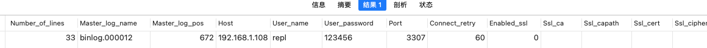
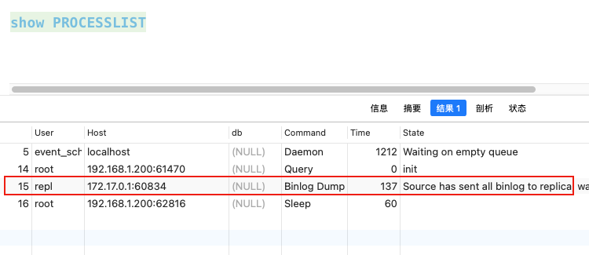
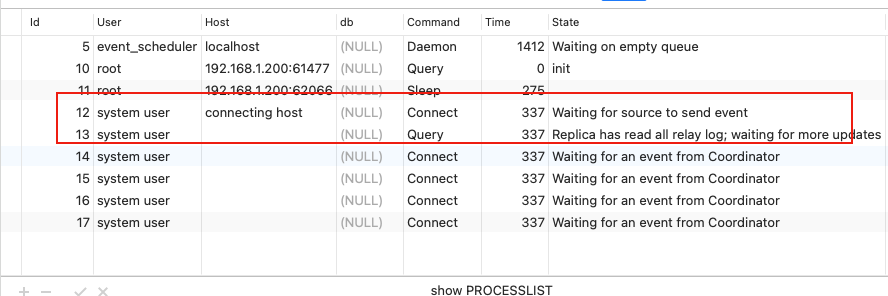
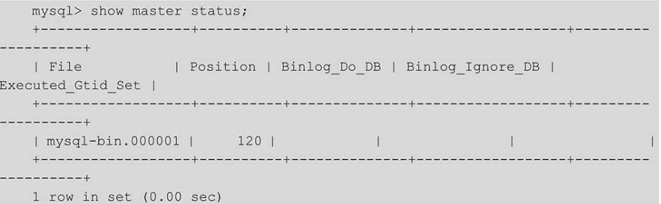

[TOC]


## 理论

#### 异步复制

#### 半同步复制

### 以配置主从理解mysql复制的原理

#### 1. 修改server_id

在/etc/my.cnf 文件中，配置所有mysql实例的server_id。 ==server_id必须不同==

主服务器

```
server_id=10000
```

从服务器

```
server_id=10001
```

#### 2. 在主库建立复制专属用户

在主库

```mysql
-- 查看从库二进制日志信息
show master STATUS;
-- 在主库上建立复制专属用户
CREATE user 'repl'@'%' IDENTIFIED WITH mysql_native_password by '123456';
GRANT replication client,replication slave on *.* to 'repl'@'%'
```

#### 3. 在从库建立主库信息

```mysql
change master to 
	master_host="192.168.1.108",     -- 主库的ip 
	master_port=3307,              -- 主库的端口
	master_user="repl",              -- 在主库中用哪个用户去复制
	master_password="123456",        -- 用户密码
	master_log_file="binlog.000012", -- 主库的binlog文件，根据show master STATUS; 查看
	master_log_pos=672;              -- 复制的起始位置
	
```

在从库执行完**change master to**命令之后，在**mysql.slave_master_info**表中会生成一条记录



从库会将复制相关的主库信息记录到这个表中，随着复制的进行，表中的数据会随之更新。

change master to  只是为I/O线程连接主库时，提供连接参数，这条语句本身不会连接主库。以后启动I/O线程时，I/O线程都会自动读取这条记录连接主库，不需要再执行change master to语句


mysql8会将中继日志重放信息存到 mysql.slave_relay_log_info表中，中继日志信息在首次启动复制时生成，并随着复制过程即时改变，这样SQL线程再次启动时，就能从中获取到从中继日志的何处继续读取和执行

#### 4. 在从库启动复制，并查看复制信息

```mysql
start slave;

show slave status;

```

执行完这两条数据之后，会启动I/O线程和SQL线程，并创建一个到主库的普通客户端连接，此连接会伴随着复制一直存在

在主库的processlist可以看到类似如下的线程



他是从库上的I/O线程所简历的。Binlog Dump表示由I/O线程在主库上启动了Binlog Dump线程，每个连接到主库的从库对应一个线程。


在从库的processlist也可以看到类似的线程



12和13分表对应的是I/O线程与SQL线程

在从库上执行 **show slave status** 可以查看复制的状态


至此，搭建一个简单的主从就完成了，可以通过主从架构来熟悉mysql默认异步赋值的各个线程的调用


## 背景

mysql+Keepalived 实现高可用架构

基本架构：mysql主主+Keepalived

同步方式：异步复制

Ip:  

- 139.24.236.90

- 139.24.236.89

后续架构升级

- mysql主主+Keepalived+每主两从

- mysql实例拆成多份，不同库在不同实例。每个实例用mysql主主+Keepalived+每主两从

## 基础搭建

编写mysql初始化配置

```mysql
# For advice on how to change settings please see
# http://dev.mysql.com/doc/refman/8.0/en/server-configuration-defaults.html

[mysqld]
#
# Remove leading # and set to the amount of RAM for the most important data
# cache in MySQL. Start at 70% of total RAM for dedicated server, else 10%.
# innodb_buffer_pool_size = 128M
#
# Remove leading # to turn on a very important data integrity option: logging
# changes to the binary log between backups.
# log_bin
#
# Remove leading # to set options mainly useful for reporting servers.
# The server defaults are faster for transactions and fast SELECTs.
# Adjust sizes as needed, experiment to find the optimal values.
# join_buffer_size = 128M
# sort_buffer_size = 2M
# read_rnd_buffer_size = 2M

# Remove leading # to revert to previous value for default_authentication_plugin,
# this will increase compatibility with older clients. For background, see:
# https://dev.mysql.com/doc/refman/8.0/en/server-system-variables.html#sysvar_default_authentication_plugin
# default-authentication-plugin=mysql_native_password
skip-host-cache
skip-name-resolve
datadir=/var/lib/mysql
socket=/var/run/mysqld/mysqld.sock
secure-file-priv=/var/lib/mysql-files
user=mysql

pid-file=/var/run/mysqld/mysqld.pid
[client]
socket=/var/run/mysqld/mysqld.sock

!includedir /etc/mysql/conf.d/
```


1. docker管理工具

```shell
docker run -d 　　　　　　　　# 后台运行容器
　　-p 9000:9000 　　　　　　# 默认9000端口，映射到宿主机，通过本地地址访问
　　--name prtainer-test 　　　# 指定容器名
　　--restart=always 　　　　  # 设置自动启动
    -v /opt/portainer:/data     # 保存portainer数据到宿主机
    -v /var/run/docker.sock:/var/run/docker.sock 　　# 单机方式必须指定
　　portainer/portainer　
　　
$ docker run -d   -p 9000:9000  --name prtainer  --restart=always  -v /opt/portainer:/data  -v /var/run/docker.sock:/var/run/docker.sock portainer/portainer
```

2. mysql 主备docker安装
   - 将本地/home/bsce/dbdata/*/ 中的数据页挂载到mysql镜像中，实现数据库数据在宿主机中管理，保证容器镜像删除，文件还在
   - 将本地/home/bsce/dbdata/config/my.cnf 配置文件挂载到mysql镜像中，实现配置文件在宿主机管理，因为mysql官方镜像没提供vi vim以及包管理工具yum  apt-get 所以这块需要放到宿主机管理

```shell
# 需要将配置文件的权限放开才能在容器中使用
# chmod 644  /home/bsce/dbdata/config/m_my.cnf
# 挂载的路径如下
# 数据地址/home/bsce/dbdata/data/mysqlm
# 配置文件/home/bsce/dbdata/config/m_my.cnf
# 其他文件/home/bsce/dbdata/mysql-files/ 
$  docker run -p 3310:3306 --restart=always --name mysql_m --privileged=true -v /home/bsce/dbdata/data/mysqlm:/var/lib/mysql -v /home/bsce/dbdata/config/m_my.cnf:/etc/mysql/my.cnf   -v /home/bsce/dbdata/mysql-files/mysqlm:/var/lib/mysql-files/  -e MYSQL_ROOT_PASSWORD=Bscedba2021 -d mysql:8.0.23    

```


> mysql要指定版本，最好是8.0.23  因为8.0.23 还是debian 系统，里面apt-get包管理有，还有mysqlbinlog命令比较全
>
> 而8.0.28 以上的版本系统镜像换成redhat了，导致里面没有任何包管理工具(yum  apt-get)，然后mysqlbinlog命令也没有，严重怀疑是mysql官方移植到redhat的一个尝试，导致镜像内容不全


## 搭建mysql主主架构

#### 1. 修改mysql配置文件

第一台mysql

```mysql
server_id=90                   # mysql唯一id，保证两台mysql配置不同值
log-bin=mysql-bin               # 启用二进制日志
auto_increment_increment=2      # 自增步长为2，双主架构设置为2
auto_increment_offset=1         # 自增初始值，双主架构为奇偶值
```

第二台mysql

```mysql
server_id=89                   # mysql唯一id，保证两台mysql配置不同值
log-bin=mysql-bin               # 启用二进制日志
auto_increment_increment=2      # 自增步长为2，双主架构设置为2
auto_increment_offset=2         # 自增初始值，双主架构为奇偶值
```

配置完成之后重启两个mysql实例

#### 2. 创建复制使用的mysql用户

在两个mysql实例中创建复制使用的用户

```mysql
CREATE user 'repl'@'%' IDENTIFIED WITH mysql_native_password by '123456';
GRANT replication client,replication slave on *.* to 'repl'@'%'
```

#### 3. 设置复制主库

分别在两个mysql实例查看二进制日志名和位置



用上面命令的输出指定主库信息：

```mysql
# 在第一台主库上执行
change master to 
	master_host="139.24.236.90",     -- 主库的ip 
	master_port=3310,              -- 主库的端口
	master_user="repl",              -- 在主库中用哪个用户去复制
	master_password="123456",        -- 用户密码
	master_log_file="mysql-bin.000004", -- 主库的binlog文件，根据show master STATUS; 查看
	master_log_pos=681;              -- 复制的起始位置
# 在第二台主库上执行	
change master to 
   master_host="139.24.236.89",     -- 主库的ip 
   master_port=3310,              -- 主库的端口
   master_user="repl",              -- 在主库中用哪个用户去复制
   master_password="123456",        -- 用户密码
   master_log_file="mysql-bin.000004", -- 主库的binlog文件，根据show master STATUS; 查看
   master_log_pos=681;              -- 复制的起始位置
```


#### 4. 启动复制

分别在两个mysql实例上启动复制

```shell
start slave;
```


### 搭建keepalived

#### 1. 安装keepalived

由于我们系统是suse的，所以通过suse的官方包管理工具zypper安装的，如果你是其他系统请通过 yum  或者apt-get安装

```shell
$ zypper in  keepalived
```

#### 2. 配置keepalived的日志

由于keepalived默认的日志是放在/var/log/message中，而message中有其他系统日志混杂一起，所以查看日志比较费劲

所以要将keepalived的日志配置一下，让其在单独的文件下存放

```shell
# 修改/etc/rsyslog.conf，添加下面的语句
local0.*                  /var/log/keepalived.log

```

然后配置keepalived参数 在/etc/sysconfig/keepalived 文件中

```shell
$ KEEPALIVED_OPTIONS="-D -d -S 0"
# -D 表示把启动信息打印到日志记录,即我们上面配置的/var/log/keepalived.log
# -d 详细日志
# -S 设置本地syslog设备，编号0-7 ，这里是0
# -f 指定加载的配置文件
```

配置完需要重启下 rsyslog与keepalived

```shell
$ systemctl restart rsyslog
$ systemctl restart keepalived
```


#### 3. 编写配置文件

##### 139.24.236.90的配置

在/etc/keepalived/keepalived.conf  编写keepalived的配置文件

```shell
global_defs {                 # 全局配置
    router_id 139.24.236.90   # 局域网唯一标识
    script_user root          # 执行脚本的用户
    enable_script_security    # 开启脚本安全
}
vrrp_script chk_mysql {       # 检测脚本
    script "/home/bsce/keepalived/check_mysql.sh"  # 脚本路径
    interval 2                                     # 检测间隔（多少秒内执行一次脚本）
    weight -40                                     # 设置优先级, 根据这块动态调整vrrp优先级。规则如下
                                                   # - 如果脚本执行结果为0，并且weight配置的值大于0，则优先级相应的增加
                                                   # - 如果脚本执行结果非0，并且weight配置的值小于0，则优先级相应的减少
                                                   # - 其他情况，维持原本配置的优先级，即配置文件中priority对应的值。
}
vrrp_instance VI_1 {          # vrrp实例定义
    state MASTER              # 状态          ==> 状态只有MASTER和BACKUP两种，并且要大写，MASTER为工作状态，BACKUP是备用状态。
    interface eth0            # 绑定网卡
    virtual_router_id 100     # 虚拟路由标识  ==>同一个vrrp_instance的MASTER和BACKUP的vitrual_router_id 是一致的。
    priority 100              # 优先级        ==> 同一个vrrp_instance的MASTER优先级必须比BACKUP高。
    advert_int 1              # 时间间隔      ==>MASTER 与BACKUP 负载均衡器之间同步检查的时间间隔，单位为秒。
    authentication {          # 校验配置      ==>需要MASTER和BACKUP一致才能通信
         auth_type PASS
         auth_pass 1111
    }

    track_script {            # 该vrrp绑定的脚本
        chk_mysql
    }
    virtual_ipaddress {       # 虚拟ip  ===>对外暴露的vip，MASTER与BACKUP配置的ip保持一致
        139.24.236.252
    }
}


```

在/home/bsce/keepalived/check_mysql.sh  编写mysql检查脚本

```shell
#!/bin/bash
mysql=mysql_m        # 脚本要检查的mysql实例
is_run=$(docker inspect -f '{{.State.Running}}' $mysql)
if [ $is_run = "true" ]; then
    echo "mysql容器运行正常"
    counter=$(docker exec -it mysql_m  netstat -na|grep "LISTEN"|grep "3306"|wc -l)
    echo $counter
    if [ "${counter}" -eq 0 ]; then
        echo "mysql运行正常"
        exit 0
    else
        echo "mysql运行异常"
        exit 1
    fi
else
   echo "mysql容器运行异常"
   exit 1
fi

```

编写完之后赋权限

```shell
# 必须赋这个权限，不能赋777，因为会检查文件权限，如果权限太大，则不会读取
$ chmod 744 check_mysql.sh
```

  然后启动

```shell
$ systemctl start keepalived
```


##### 139.24.236.89的配置

在/etc/keepalived/keepalived.conf  编写keepalived的配置文件

```shell


global_defs {                   # 全局配置
    router_id 139.24.236.89     # 局域网唯一标识
    script_user root            # 执行脚本的用户
    enable_script_security      # 开启脚本安全
}

vrrp_script chk_mysql {                               # 检测脚本
    script "/home/bsce/keepalived/check_mysql.sh"     # 脚本路径
    interval 2                                        # 检测间隔（多少秒内执行一次脚本）
    weight -20                                        # 设置优先级, 根据这块动态调整vrrp优先级。规则如下
                                                      # - 如果脚本执行结果为0，并且weight配置的值大于0，则优先级相应的增加
                                                      # - 如果脚本执行结果非0，并且weight配置的值小于0，则优先级相应的减少
                                                      # - 其他情况，维持原本配置的优先级，即配置文件中priority对应的值。
}
vrrp_instance VI_1 {            # vrrp实例定义
    state BACKUP                # 状态          ==> 状态只有MASTER和BACKUP两种，并且要大写，MASTER为工作状态，BACKUP是备用状态。
    interface eth0              # 绑定网卡
    virtual_router_id 100       # 虚拟路由标识  ==>同一个vrrp_instance的MASTER和BACKUP的vitrual_router_id 是一致的。
    priority 90                 # 优先级        ==> 同一个vrrp_instance的MASTER优先级必须比BACKUP高。
    advert_int 1                # 时间间隔      ==>MASTER 与BACKUP 负载均衡器之间同步检查的时间间隔，单位为秒。
    authentication {            # 校验配置      ==>需要MASTER和BACKUP一致才能通信
        auth_type PASS
        auth_pass 1111
    }
    track_script {              # 该vrrp绑定的脚本
        chk_mysql
    }
    virtual_ipaddress {         # 虚拟ip  ===>对外暴露的vip，MASTER与BACKUP配置的ip保持一致
        139.24.236.252
    }
}


```

在/home/bsce/keepalived/check_mysql.sh  编写mysql检查脚本

```shell
#!/bin/bash
slave_is=( $(docker exec -it mysql_m  mysql  -uroot -pBscedba2021  -e "show slave status\G"  | grep "Slave_.*_Running" | awk '{print $2}') )
io_status=`echo ${slave_is[0]} |tr -d '\n\r'`
sql_status=`echo ${slave_is[1]} |tr -d '\n\r'`

echo $io_status 
echo $sql_status 
if [ $io_status =  "Yes" -a $sql_status = "Yes" ]; then
    echo "主库连接正常"
    exit 1
else
    echo "主库连接异常，切换backup库"
    exit 0
fi

```

编写完之后赋权限

```shell
# 必须赋这个权限，不能赋777，因为会检查文件权限，如果权限太大，则不会读取
$ chmod 744 check_mysql.sh
```

然后启动

```shell
$ systemctl start keepalived
```


## 参考资料

>  https://cloud.tencent.com/developer/article/1952947   mysql主从复制问题总结及排查过程分享
>
> https://blog.csdn.net/eagle89/article/details/108282338  mysql同步报错解决
>
> https://www.jb51.net/article/206713.htm msql 双主架构配置方案
>
> https://blog.csdn.net/yanghaolong/article/details/123271619 mysql双主结构方案优缺点总结
>
> https://blog.csdn.net/weixin_42601547/article/details/113948855 mysql复制方式（半同步复制，并行复制，多源复制）
>
> https://blog.51cto.com/lovejxs/2514197 mysql双主的一致性问题
>
> https://blog.csdn.net/weixin_41605937/article/details/122391877 mysql 高可用架构 mysql+keepalived实战
>
> https://blog.csdn.net/qq_39581637/article/details/122257647 mysql+keepalived 实现双主热备
>
> http://www.manongjc.com/detail/28-fpcypsfpelrmrrb.html mysql复制如何查看是gtid复制还是pos复制
>
> 


当linux的网络模块故障之后，可以使用一下命令去重启网络模块

```shell
$ systemctl start NetworkManager.service

```

mysql镜像常用工具安装

```shell
apt-get update
apt-get -y install systemd     #systemctl 命令安装
apt-get -y  install procps     # ps 
apt-get -y install net-tools   #netstat
apt-get -y  install iputils-ping  #ping
apt-get -y  install vim 
```
