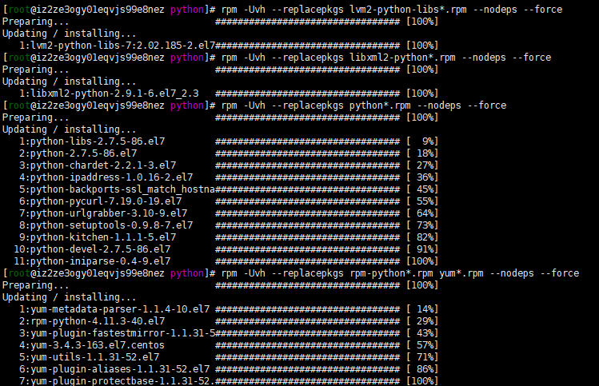
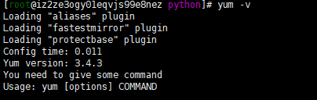

## 背景

由于docker mysql8的镜像是红帽系统，里面没有任何包管理系统，并且基本的编辑也没有，所以想着给镜像里面装个yum

或者是 之前系统有装yum，然后重新安装后，发生依赖问题

```
error: Failed dependencies:
    /usr/bin/python is needed by yum-3.4.3-163.el7.centos.noarch
    python >= 2.4 is needed by yum-3.4.3-163.el7.centos.noarch
    python(abi) = 2.7 is needed by yum-3.4.3-163.el7.centos.noarch
    python-iniparse is needed by yum-3.4.3-163.el7.centos.noarch
    python-sqlite is needed by yum-3.4.3-163.el7.centos.noarch
    python-urlgrabber >= 3.10-8 is needed by yum-3.4.3-163.el7.centos.noarch
    rpm-python is needed by yum-3.4.3-163.el7.centos.noarch
    libpython2.7.so.1.0()(64bit) is needed by yum-metadata-parser-1.1.4-10.el7.x86_64
    python(abi) = 2.7 is needed by yum-metadata-parser-1.1.4-10.el7.x86_64
```


### 步骤

1. **查看yum安装包**

```shell
# rpm -qa | grep yum
yum-plugin-fastestmirror-1.1.31-52.el7.noarch
yum-metadata-parser-1.1.4-10.el7.x86_64
yum-utils-1.1.31-52.el7.noarch   
```

2. **将其全部卸载**

```shell
#rpm -e yum-plugin-fastestmirror-1.1.31-52.el7.noarch --nodeps
#rpm -e yum-metadata-parser-1.1.4-10.el7.x86_64 --nodeps
#rpm -e yum-utils-1.1.31-52.el7.noarch --nodeps
```

3. **在**http://mirrors.163.com/centos/7/os/x86_64/Packages/**下载如下20个包**

```shell
libxml2-python-2.9.1-6.el7_2.3.x86_64.rpm                    
python-ipaddress-1.0.16-2.el7.noarch.rpm  
lvm2-python-libs-2.02.185-2.el7.x86_64.rpm
python-kitchen-1.1.1-5.el7.noarch.rpm     
yum-3.4.3-163.el7.centos.noarch.rpm
python-2.7.5-86.el7.x86_64.rpm                                
python-libs-2.7.5-86.el7.x86_64.rpm       
yum-metadata-parser-1.1.4-10.el7.x86_64.rpm
python-backports-ssl_match_hostname-3.5.0.1-1.el7.noarch.rpm  
python-pycurl-7.19.0-19.el7.x86_64.rpm    
yum-plugin-aliases-1.1.31-52.el7.noarch.rpm
python-chardet-2.2.1-3.el7.noarch.rpm                         
python-setuptools-0.9.8-7.el7.noarch.rpm  
yum-plugin-fastestmirror-1.1.31-52.el7.noarch.rpm
python-devel-2.7.5-86.el7.x86_64.rpm                          
python-urlgrabber-3.10-9.el7.noarch.rpm   
yum-plugin-protectbase-1.1.31-52.el7.noarch.rpm
python-iniparse-0.4-9.el7.noarch.rpm                          
rpm-python-4.11.3-40.el7.x86_64.rpm       
yum-utils-1.1.31-52.el7.noarch.rpm


rpm-libs-4.11.3-45.el7.x86_64.rpm
nss-3.44.0-7.el7_7.x86_64.rpm
```

4. 下载完成后执行

```shell
#rpm -Uvh --replacepkgs lvm2-python-libs*.rpm --nodeps --force
#rpm -Uvh --replacepkgs libxml2-python*.rpm --nodeps --force
#rpm -Uvh --replacepkgs python*.rpm --nodeps --force
#rpm -Uvh --replacepkgs rpm-python*.rpm yum*.rpm --nodeps --force
```



5. 成功安装



6. **如果将python换成python3的话，运行yum会报错**

```
[root@iz2ze3ogy01eqvjs99e8nez python]# yum
  File "/usr/bin/yum", line 30
    except KeyboardInterrupt, e:
                            ^
SyntaxError: invalid syntax
```

修改 vi /etc/usr/yum 第一行为

```shell
#!/usr/bin/python2
```

## 参考

> https://www.cnblogs.com/xdjun/p/11770418.html
>
> rpm包
>
> http://mirrors.163.com/centos/7/os/x86_64/Packages/
>
> https://centos.pkgs.org
>
> https://pkgs.org/
>
> http://rpm.pbone.net/


